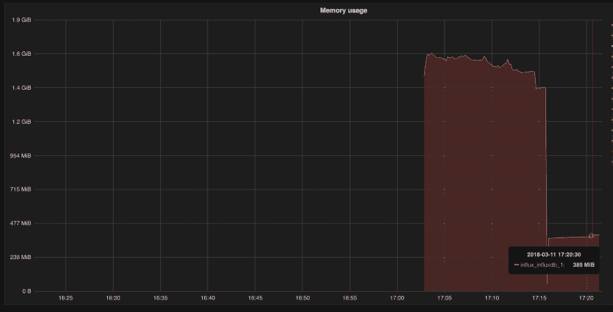

# Influxdb 中的高内存使用率

> 原文：<https://dev.to/joenas/high-memory-usage-in-influxdb-5bl5>

[T2】](https://res.cloudinary.com/practicaldev/image/fetch/s--wmZ08f0H--/c_limit%2Cf_auto%2Cfl_progressive%2Cq_auto%2Cw_880/https://jonnev.se/conteimg/2018/03/influxdb_memory-1.png)

我最近将我的各种服务从 Hetzner 的裸机服务器转移到他们新的[云](https://www.hetzner.com/cloud)和几个不同的 VPSes，这为我节省了不少美元(实际上是克朗，但是...)一个月。我的大部分服务都在 Docker 上运行，我已经让 [telegraf](https://www.influxdata.com/time-series-platform/telegraf/) 在所有服务器上运行来监控我的东西。主要是因为我喜欢看 T4 的仪表盘

在我迁移之后，其中一个服务器开始报告非常高的内存使用率，结果是 InfluxDB 容器几乎无限地增长。我以前没有这个问题，至少我没有意识到，但是我在旧服务器上有 32GB 的内存，并没有真正关注每个服务的资源消耗。

总之，经过一些研究，我发现这篇文章解释了这个问题。结论是**的涌入创建了一个包含所有标签的内存索引**，并且随着大量数据快速增长。

那么如何修复呢？在我的例子中，我只有两个我自己编写的服务向 Influx 发送数据，并且都没有过度使用标签，所以我开始检查我启用的 telegraf 插件。我不是 100%确定，但我很确定罪魁祸首是 [docker 插件](https://github.com/influxdata/telegraf/tree/master/plugins/inputs/docker)。该插件与我的主机配对，每次部署一个由大量数据组成的服务时，都会创建大量的新容器。幸运的是，插件有一个接受 globs 的设置`container_name_include = []`，所以限制容器报告的数量有很大的不同。尤其是因为 docker telegraf 的数据中有很多`tags`。

我还在我的数据库上设置了一个新的[保留策略](https://docs.influxdata.com/influxdb/v0.9/query_language/database_management/#create-retention-policies-with-create-retention-policy)，如下所示:

```
CREATE RETENTION POLICY one_month ON telegraf DURATION 4w REPLICATION 1 DEFAULT; 
```

Enter fullscreen mode Exit fullscreen mode

并且删除了很多旧数据，比如从 docker 插件中用一个简单的`DROP SERIES docker` (etc，大概有 4 个系列)。

结果呢？非常好。

[T2】](https://res.cloudinary.com/practicaldev/image/fetch/s--3xLQ_d_9--/c_limit%2Cf_auto%2Cfl_progressive%2Cq_auto%2Cw_880/https://jonnev.se/conteimg/2018/03/influxdb_memory.png)