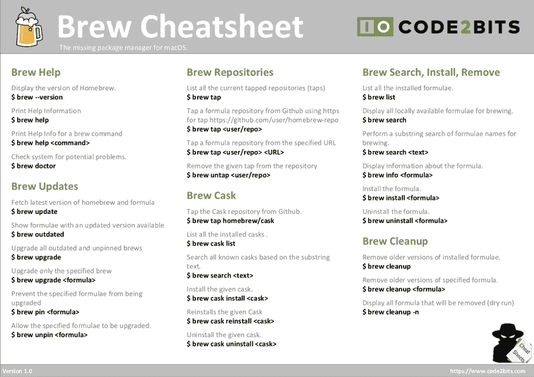

# 自制-基本命令和备忘单

> 原文：<https://dev.to/andremare/homebrew---basics--cheatsheet-3a3n>

[T2】](https://res.cloudinary.com/practicaldev/image/fetch/s--0HI0TVhO--/c_limit%2Cf_auto%2Cfl_progressive%2Cq_auto%2Cw_880/https://www.code2bits.com/wp-content/uploads/feature-image/feature-image-homebrew.png)

Homebrew 是一个免费开源的软件包管理系统，简化了苹果 macOS 操作系统上的软件安装。它被称为 macOS 的缺失包管理器。

Homebrew 是用 Ruby 编程语言编写的，目标是 macOS 操作系统中安装的 Ruby 版本。家酿安装软件包到他们自己的目录(地窖)，然后符号链接他们的文件到/usr/local。

## 安装自制软件基础知识

了解如何在 macOS 上安装家酿的最好方法是去家酿的主页。请点击下面的链接:

*   [安装自制软件](https://brew.sh/)

## 自制命令

### 沏助

在成功安装 brew 后，了解如何获得有关 brew 的帮助非常重要。以下命令旨在为如何在 macOS 上使用 brew 命令提供帮助。

```
# Display the version of Homebrew.
$ brew --version
# Print Help Information
$ brew help
# Print Help Info for a brew command
$ brew help <sub-command>
# Check system for potential problems.
$ brew doctor 
```

Enter fullscreen mode Exit fullscreen mode

### Brew 更新

自制软件的部分功能是让你可以很容易地更新你的应用程序，以及其他特定版本的应用程序。这组命令用于更新 Homebrew 本身，以及随它一起安装的应用程序。

```
# Fetch latest version of homebrew and formula
$ brew update
# Show formulae with an updated version available
$ brew outdated
# Upgrade all outdated and unpinned brews
$ brew upgrade
# Upgrade only the specified brew
$ brew upgrade <formula>
# Prevent the specified formulae from being upgraded
$ brew pin <formula>
# Allow the specified formulae to be upgraded.
$ brew unpin <formula> 
```

Enter fullscreen mode Exit fullscreen mode

### 酿造库

通过使用 *brew tap* 命令，可以向 homebrew 添加额外的存储库。这允许您安装不属于默认存储库的附加应用程序。

```
# List all the current tapped repositories (taps)
$ brew tap
# Tap a formula repository from Github using https for tap https://github.com/user/homebrew-repo
$ brew tap <user/repo>
# Tap a formula repository from the specified URL
$ brew tap <user/repo> <URL>
# Remove the given tap from the repository
$ brew untap <user/repo> 
```

Enter fullscreen mode Exit fullscreen mode

### 酿造桶

家酿木桶提供了一个友好的 CLI 工作流程，用于管理作为二进制文件分发的 macOS 应用程序。

```
# Tap the Cask repository from Github.
$ brew tap homebrew/cask
# List all the installed casks .
$ brew cask list
# Search all known casks based on the substring text.
$ brew search <text>
# Install the given cask.
$ brew cask install <cask>
# Reinstalls the given Cask
$ brew cask reinstall <cask>
# Uninstall the given cask.
$ brew cask uninstall <cask> 
```

Enter fullscreen mode Exit fullscreen mode

### Brew 搜索、安装、删除

以下命令用于搜索、列出和安装家酿库内可用的不同应用程序和工具。

```
# List all the installed formulae.
$ brew list
# Display all locally available formulae for brewing.
$ brew search
# Perform a substring search of formulae names for brewing.
$ brew search <text>
# Display information about the formula.
$ brew info <formula>
# Install the formula.
$ brew install <formula>
# Uninstall the formula.
$ brew uninstall <formula> 
```

Enter fullscreen mode Exit fullscreen mode

### 酿造清理

删除陈旧的锁定文件和过期的公式和木桶下载，并删除已安装公式的旧版本。

```
# Remove older versions of installed formulae.
$ brew cleanup
# Remove older versions of specified formula.
$ brew cleanup <formula>
# Display all formula that will be removed (dry run)
$ brew cleanup -n 
```

Enter fullscreen mode Exit fullscreen mode

## 温馨提示&备忘单

Brew Cheatsheet 命令可以从下面的链接下载。PDF 文档包含常用 brew 命令的列表。此备忘单文档并不是所有命令的完整文档列表，因此您应该访问 brew 官方文档页面。

在这里下载 PDF 版本:[自制备忘单](https://www.code2bits.com/wp-content/uploads/cheatsheet-pdf/cheatsheet-homebrew.pdf)

[T2】](https://res.cloudinary.com/practicaldev/image/fetch/s--s5G3V2SE--/c_limit%2Cf_auto%2Cfl_progressive%2Cq_auto%2Cw_880/https://www.code2bits.com/wp-content/uploads/cheatsheet-image/cheatsheet-homebrew.png)

## 安装篇

本节包含一系列文章，解释了如何利用 Homebrew 在 macOS 上安装应用程序和命令行工具。

### 命令行工具及应用

本节中的工具和应用程序列表使用了 *brew install* 命令。

*   [如何使用自制软件在 macOS 上安装 ACK](https://www.code2bits.com/how-to-install-ack-on-macos-using-homebrew)
*   [如何使用自制软件在 macOS 上安装 Apache Ant](https://www.code2bits.com/how-to-install-ant-on-macos-using-homebrew)
*   [如何使用自制软件在 macOS 上安装 AWS CLI](https://www.code2bits.com/how-to-install-awscli-on-macos-using-homebrew)
*   [如何使用自制软件在 macOS 上安装 cURL](https://www.code2bits.com/how-to-install-curl-on-macos-using-homebrew)
*   [如何使用自制软件在 macOS 上安装 Git](https://www.code2bits.com/how-to-install-git-on-macos-using-homebrew)
*   [如何使用自制软件在 macOS 上安装 Gradle](https://www.code2bits.com/how-to-install-gradle-on-macos-using-homebrew)
*   [如何使用自制软件在 macOS 上安装 Maven](https://www.code2bits.com/how-to-install-maven-on-macos-using-homebrew)
*   [如何使用家酿在 macOS 上安装 node . js](https://www.code2bits.com/how-to-install-node-on-macos-using-homebrew)
*   [如何使用自制软件在 macOS 上安装 vacant](https://www.code2bits.com/how-to-install-vagrant-on-macos-using-homebrew)
*   [如何使用自制软件在 macOS 上安装 Wget](https://www.code2bits.com/how-to-install-wget-on-macos-using-homebrew)

### 开发应用

本节中的应用列表使用了 *brew cask 安装*命令。

*   [如何使用自制软件在 macOS 上安装 app code](https://www.code2bits.com/how-to-install-appcode-on-macos-using-homebrew)
*   [如何使用自制软件在 macOS 上安装 Atom](https://www.code2bits.com/how-to-install-atom-on-macos-using-homebrew)
*   [如何使用家酿在 macOS 上安装 DBeaver(CE)](https://www.code2bits.com/how-to-install-dbeaver-community-on-macos-using-homebrew)
*   [如何使用家酿在 macOS 上安装 DBeaver(EE)](https://www.code2bits.com/how-to-install-dbeaver-enterprise-on-macos-using-homebrew)
*   [如何使用自制软件在 macOS 上安装 diff merge](https://www.code2bits.com/how-to-install-diffmerge-on-macos-using-homebrew)
*   [如何使用自制软件在 macOS 上安装 Docker](https://www.code2bits.com/how-to-install-docker-on-macos-using-homebrew)
*   [如何使用自制软件在 macOS 上安装 Eclipse](https://www.code2bits.com/how-to-install-eclipse-on-macos-using-homebrew)
*   [如何使用自制软件在 macOS 上安装 Firefox](https://www.code2bits.com/how-to-install-firefox-on-macos-using-homebrew)
*   [如何使用自制软件在 macOS 上安装谷歌 Chrome](https://www.code2bits.com/how-to-install-chrome-on-macos-using-homebrew)
*   [如何用自制软件在 macOS 上安装失眠症](https://www.code2bits.com/how-to-install-insomnia-on-macos-using-homebrew/)
*   [如何使用自制软件在 macOS 上安装 IntelliJ IDEA(CE)](https://www.code2bits.com/how-to-install-intellij-idea-community-edition-on-macos-using-homebrew/)
*   [如何使用自制软件在 macOS 上安装 IntelliJ IDEA(UE)](https://www.code2bits.com/how-to-install-intellij-idea-ultimate-edition-on-macos-using-homebrew/)
*   [如何使用自制软件在 macOS 上安装 ITER m2](https://www.code2bits.com/how-to-install-iterm2-on-macos-using-homebrew)
*   [如何使用自制软件在 macOS 上安装 Java](https://www.code2bits.com/how-to-install-java-on-macos-using-homebrew)
*   [如何使用自制软件在 macOS 上安装 Postman](https://www.code2bits.com/how-to-install-postman-on-macos-using-homebrew)
*   [如何使用自制软件在 macOS 上安装 Slack](https://www.code2bits.com/how-to-install-slack-on-macos-using-homebrew/)
*   [如何使用自制软件在 macOS 上安装 Spring Tool Suite(STS)](https://www.code2bits.com/how-to-install-sts-on-macos-using-homebrew)
*   [如何使用自制软件在 macOS 上安装 Sublime Text](https://www.code2bits.com/how-to-install-sublime-text-on-macos-using-homebrew)
*   [如何使用自制软件在 macOS 上安装 Tower](https://www.code2bits.com/how-to-install-tower-on-macos-using-homebrew)
*   [如何使用自制软件在 macOS 上安装 Virtualbox](https://www.code2bits.com/how-to-install-virtualbox-on-macos-using-homebrew)
*   [如何使用自制软件在 macOS 上安装 Visual Studio 代码](https://www.code2bits.com/how-to-install-visual-studio-code-on-macos-using-homebrew)
*   [如何使用自制软件在 macOS 上安装 WebStorm](https://www.code2bits.com/how-to-install-webstorm-on-macos-using-homebrew/)

## 结论

我希望这篇文章能帮助你利用自制软件在你的 Mac 上安装和管理应用程序。欢迎分享备忘单，并对您在使用命令时遇到的任何问题发表评论。