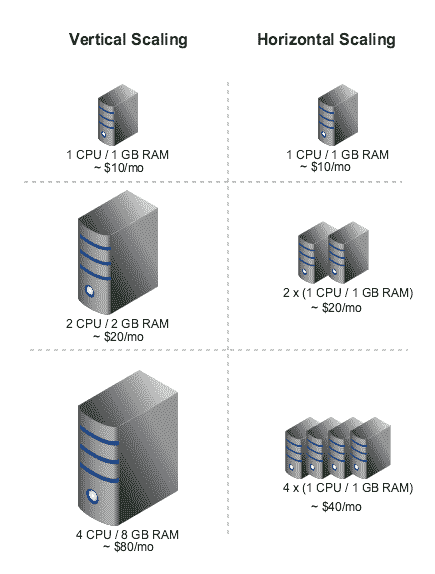

# 水平和垂直缩放

> 原文：<https://dev.to/wmahathre/horizontal-and-vertical-scaling-1lid>

可伸缩性是能够处理更多请求，垂直和水平伸缩以不同的方式处理这些请求。水平扩展有多个接收请求的服务器，但是垂直扩展只有一个大型服务器来处理它们。在本文中，我将与您分享这些扩展的优缺点。

[T2】](https://res.cloudinary.com/practicaldev/image/fetch/s--m79uDzn7--/c_limit%2Cf_auto%2Cfl_progressive%2Cq_auto%2Cw_880/https://thepracticaldev.s3.amazonaws.com/i/5hdx2b9l0b4kgzju54e5.png)

水平扩展具有所谓的负载平衡，因此如果其中一台服务器出现故障，负载平衡器会将请求重定向到其他服务器，如果添加了新服务器，负载平衡器会开始向其发送请求。这通过向工作的服务器发送请求来确保客户端请求是可靠的，它有效地与多个服务器一起工作，并且它通过增加或减少服务器的数量来提供灵活性。由于垂直扩展只是一个巨大的服务器，这是不可能的。

垂直扩展的缺点是它有硬件限制。是的，你可以给你的服务器增加更多的资源，比如 CPU/ram/磁盘容量，但是如果你有很多用户，这是不够的。这就是为什么横向扩展对大公司来说是理想的，因为如果需要，他们可以添加更多的服务器，并且随着用户的增加，它可以很好地扩展。

垂直扩展的好处是它具有数据一致性。这是因为只有一个系统存放所有数据。在横向扩展中，事务跨多个服务器发送数据会变得复杂，并且更难维护。这可能是不切实际的，特别是如果您有一个事务，其中的操作必须是原子的，导致它锁定所有服务器和数据。

在决定使用哪种缩放比例时，最好决定哪一种最适合您的需求。如果您正在运营一家小公司，并且不希望有很多用户/数据增长，那么垂直扩展可能是您的理想选择。如果您正在与一家用户不断增加的大公司合作，那么使用水平扩展是一条可行之路。