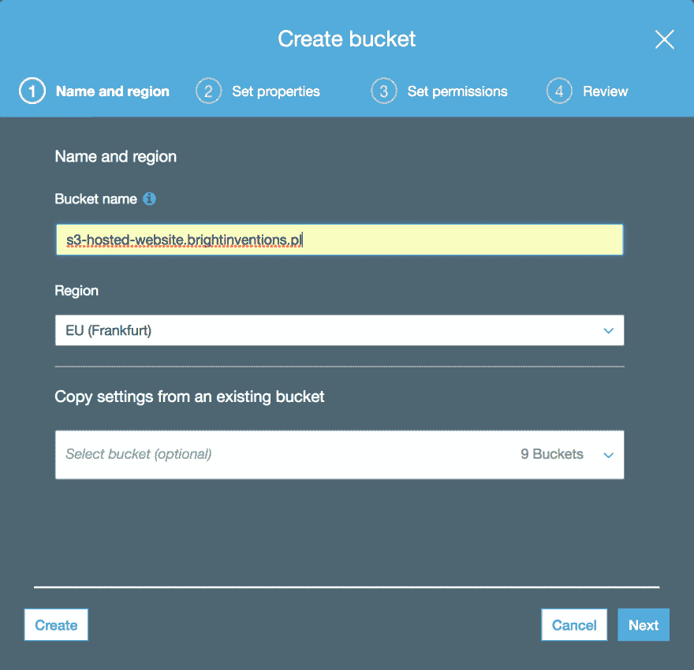
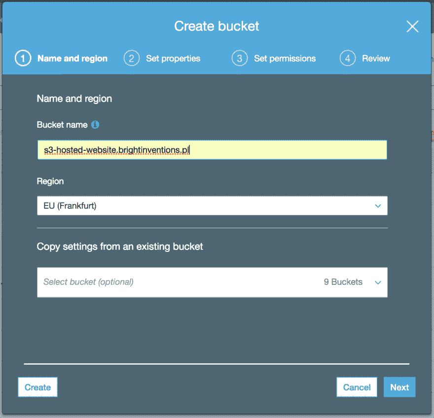
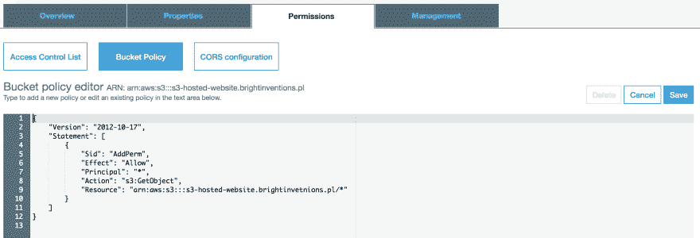
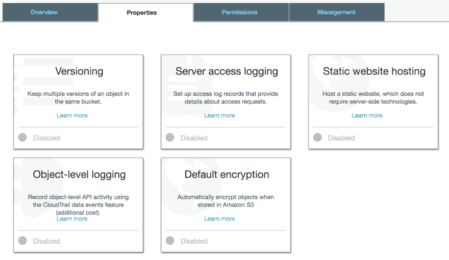
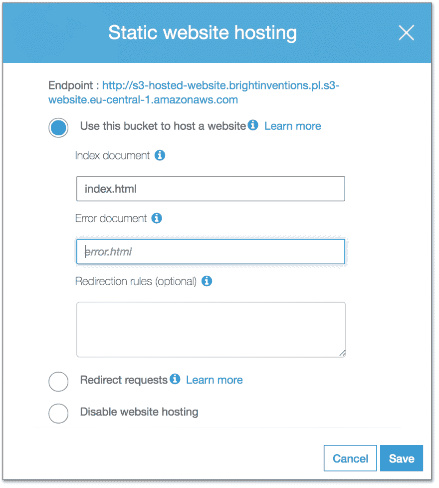
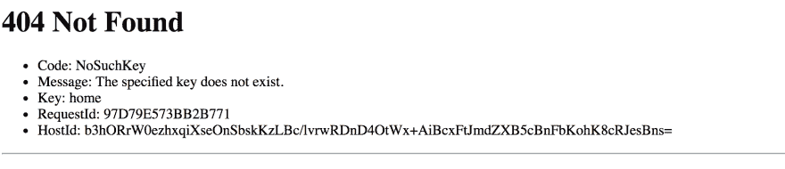
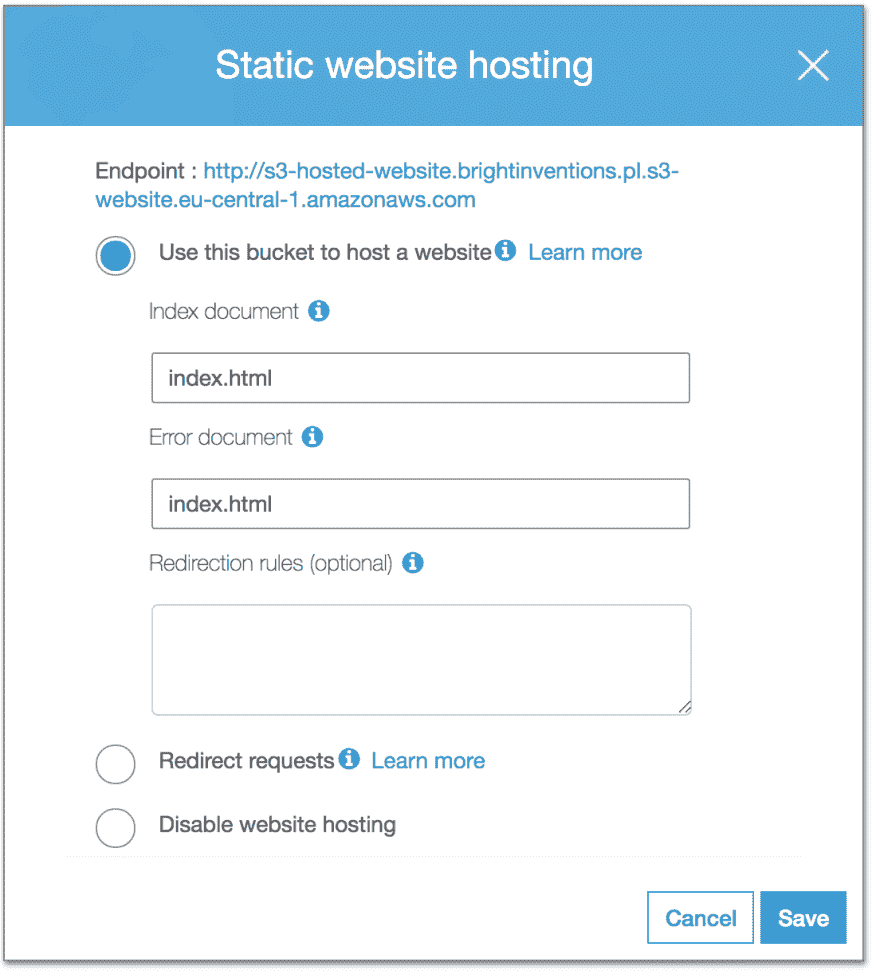

# 通过 AWS S3 托管您的 react-redux 网站

> 原文：<https://dev.to/brightdevs/host-your-react-redux-website-with-aws-s3-57fi>

用 AWS S3 托管一个静态网站是向世界展示你的 react-redux 应用的一个又好又快的方法。在这篇博文中，我将指导你完成这个简单的过程。

[T2】](https://res.cloudinary.com/practicaldev/image/fetch/s--pMqxGTAL--/c_limit%2Cf_auto%2Cfl_progressive%2Cq_auto%2Cw_880/https://thepracticaldev.s3.amazonaws.com/i/hk9j583dfp9ivs02xt9t.png)

如果你还没有 AWS 账户，你可以访问[亚马逊网络服务](https://portal.aws.amazon.com/billing/signup#/start)。如果你不熟悉 S3，你可以看看这里: [S3](https://aws.amazon.com/s3/) 。

登录 AWS 管理控制台时，从服务列表中选择 S3。

**1。创建一个桶**

首先，我们需要创建一个存储应用程序文件的桶。点击蓝色按钮`Create bucket`。

[T2】](https://res.cloudinary.com/practicaldev/image/fetch/s--ewP6t5Ph--/c_limit%2Cf_auto%2Cfl_progressive%2Cq_auto%2Cw_880/https://thepracticaldev.s3.amazonaws.com/i/2luon5qauz2635ksab35.png)

我们需要提供 bucket 名称和一个区域。网站 url 将由这两个值构成:

`bucket-name.s3-website.bucket-region.amazonaws.com`

存储段名称必须是唯一的，因此最好使用您的公司域。

[](https://res.cloudinary.com/practicaldev/image/fetch/s--TWfq9Mbc--/c_limit%2Cf_auto%2Cfl_progressive%2Cq_auto%2Cw_880/https://thepracticaldev.s3.amazonaws.com/i/r2sq0p8e7xu291nq7969.png) 
**2。设置桶的权限**

一旦我们创建了 bucket，我们需要将它公开，这样任何人都可以访问它。从列表中选择存储桶，然后选择`Permissions`选项卡并点击`Bucket Policy`。将下面的 JSON 粘贴到编辑字段中。记得调整`Resource`属性值以包含您的桶的 ARN(您可以在编辑字段上方找到 ARN)。但是，不要改变`Version`值。这是一个常量表达式，它指定您的策略语句使用的 IAM 策略语言的版本，而不是您的策略语句的修订日期。点击`Save`，现在任何人都可以访问桶中的数据。

```
{
    "Version": "2012-10-17",
    "Statement": [
        {
            "Sid": "AddPerm",
            "Effect": "Allow",
            "Principal": "*",
            "Action": "s3:GetObject",
            "Resource": "arn:aws:s3:::s3-hosted-website.brightinvetnions.pl/*"
        }
    ]
} 
```

Enter fullscreen mode Exit fullscreen mode

[T2】](https://res.cloudinary.com/practicaldev/image/fetch/s--k5gxyEHK--/c_limit%2Cf_auto%2Cfl_progressive%2Cq_auto%2Cw_880/https://thepracticaldev.s3.amazonaws.com/i/36v9xvryfysbhxb8p2tx.png)

**3。启用静态网站托管**

选择`Properties`标签和`Static website hosting`框。

[T2】](https://res.cloudinary.com/practicaldev/image/fetch/s--Td6hpwAY--/c_limit%2Cf_auto%2Cfl_progressive%2Cq_auto%2Cw_880/https://thepracticaldev.s3.amazonaws.com/i/xkw26kdie2x0xdkrdq0u.png)

选择`Use this bucket to host a website`复选框。提供文件的名称，这是你的应用程序的起点，通常是`index.html`。应用程序已经准备好了，你可以通过盒子顶部的链接来访问它。

[T2】](https://res.cloudinary.com/practicaldev/image/fetch/s--Bjefc0XN--/c_limit%2Cf_auto%2Cfl_progressive%2Cq_auto%2Cw_880/https://thepracticaldev.s3.amazonaws.com/i/no2zf74m9xtwy90uco8u.png)

还有一件事，这是具体的应用程序使用浏览器的历史 API(例如反应路由器应用程序)。如果您尝试直接访问某些资源，您将会得到如下所示的错误:

[T2】](https://res.cloudinary.com/practicaldev/image/fetch/s--SYaI3Vse--/c_limit%2Cf_auto%2Cfl_progressive%2Cq_auto%2Cw_880/https://thepracticaldev.s3.amazonaws.com/i/g2ph3tbkxzcc5vac41ue.png)

这是因为 app 不够静态:)说你要访问`http://s3-hosted-website.brightinventions.pl.s3-website.eu-central-1.amazonaws.com/users`。AWS 不会直接找到资源`users`(因为 bucket 中不存在静态资源),因此会显示一个错误。这就是为什么把`index.html`也设为`Error document`是个好主意。现在，AWS 将重定向到`index.html`，而不是显示错误页面，应用程序可以成功地将你引导到想要的页面。然而，这会将所有错误重定向到应用程序中，所以我们应该确保在应用程序内部处理它们。

[T2】](https://res.cloudinary.com/practicaldev/image/fetch/s--jM-stHhd--/c_limit%2Cf_auto%2Cfl_progressive%2Cq_auto%2Cw_880/https://thepracticaldev.s3.amazonaws.com/i/lu2i1apngvtstxyk4knk.png)

这就是了！您刚刚托管了您的第一个 AWS S3 网站:)

最初发布于 [brightinventions.pl](https://brightinventions.pl/blog/)

软件工程师@光明发明
[电子邮件](//agnieszka.olszewska@brightinventions.pl)