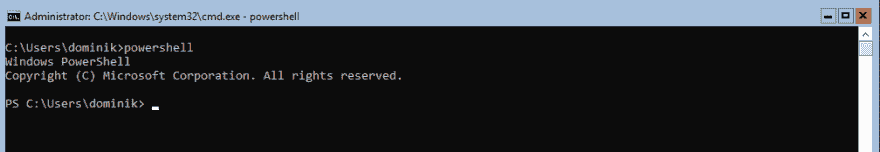
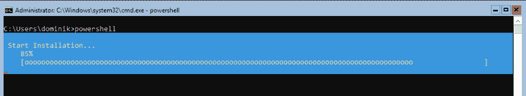
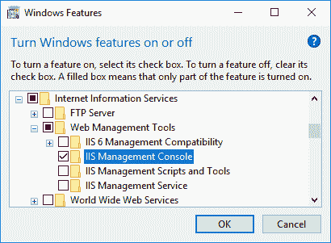
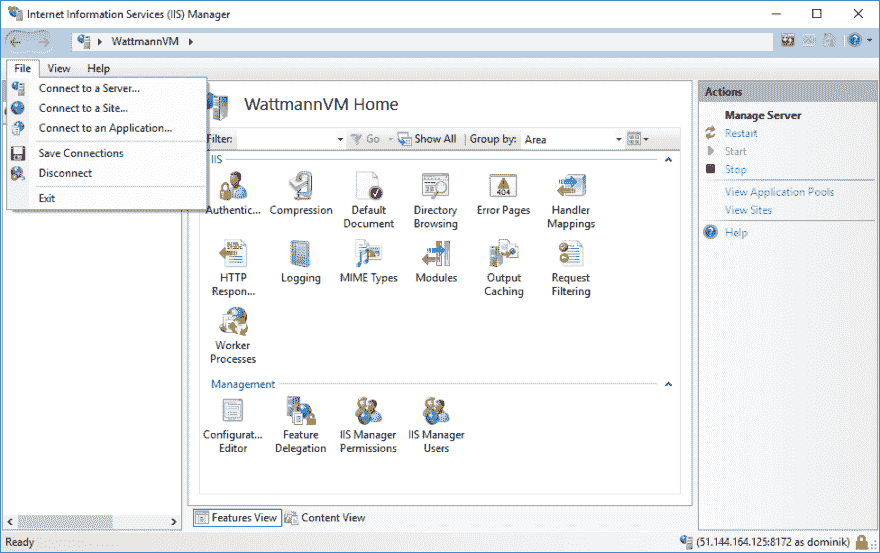
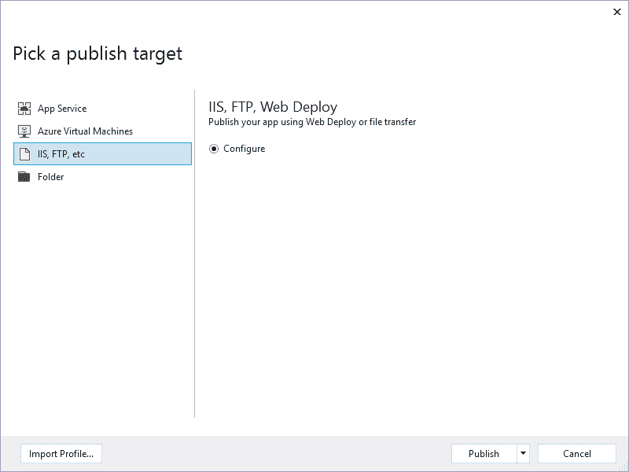
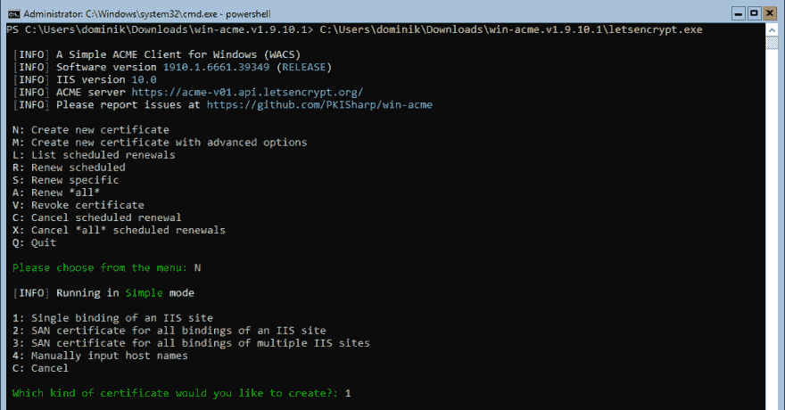

# 在 Windows Server Core 上托管 Asp.Net 核心应用

> 原文：<https://dev.to/domysee/hosting-aspnet-core-applications-on-windows-server-core-289g>

最近，我发现自己不得不在 Windows Server 上托管应用程序。以前从未管理过 Windows 服务器，我很难找到相关信息，特别是因为大多数信息是为安装了 UI 的 Windows 服务器编写的，Azure 上的默认映像是核心映像，没有 UI。这大部分是我自己的文档，但也许你也会觉得有帮助。

这是来自我的个人博客的交叉帖子。

## 简介

这是一个循序渐进的介绍如何在 Windows Server Core 上使用 IIS(互联网信息服务器)托管 Asp.Net 核心应用程序。

我们将介绍如何设置 IIS，如何配置它，如何在 Visual Studio 中使用 Web Deploy 部署它，以及如何使用 https 保护到该应用程序的连接。

我使用的是 Azure 的虚拟机，它为管理防火墙规则提供了一个很好的 UI。这对您来说可能非常不同，所以我只说哪些端口必须开放，而不包括如何做到这一点。

## 设置服务器

登录服务器后，会出现一个命令提示符。因为我们将使用的大多数命令都是 PowerShell 命令，所以我们必须启动它。

只需输入`powershell`并执行即可。之后，您应该会在提示符前面看到一个`PS`。

[T2】](https://res.cloudinary.com/practicaldev/image/fetch/s--O7Aiqdxv--/c_limit%2Cf_auto%2Cfl_progressive%2Cq_auto%2Cw_880/http://www.domysee.com/blogposts/19/1-powershell.png)

现在必须安装 IIS。这是通过这个命令完成的:

```
Install-WindowsFeature Web-Server 
```

安装时，PowerShell 会显示一个漂亮的小进度条:

[T2】](https://res.cloudinary.com/practicaldev/image/fetch/s--pO-34_Rr--/c_limit%2Cf_auto%2Cfl_progressive%2Cq_auto%2Cw_880/http://www.domysee.com/blogposts/19/2-install-progress.png)

## 启用远程管理

默认情况下，服务器不允许远程管理。必须通过安装 Web-Mgmt-Service 并将注册表条目`HKEY_LOCAL_MACHINE\SOFTWARE\Microsoft\WebManagement\Server\EnableRemoteManagement`设置为`1`来启用它。

请记住，注册表项仅在安装了 Web-Mgmt-Service 后才可用。

```
Install-WindowsFeature Web-Mgmt-Service 
```

```
Set-ItemProperty -Path Registry::HKEY_LOCAL_MACHINE\SOFTWARE\Microsoft\WebManagement\Server -Name EnableRemoteManagement -Value 1 
```

执行完这些命令后，重启 web 服务器，以使更改生效:

```
net stop was /y
net start w3svc 
```

还要启动 Web 管理服务，否则将无法连接到它。

```
net start wmsvc 
```

**注意:** IIS 管理器通过端口 8172 连接，所以请确保它在您的服务器上是打开的。

## 在 Windows 10 设备上启用管理

要远程管理 IIS 服务器，必须在您的设备上安装 IIS 管理器。这可以在`Control Panel -> Programs -> Programs and Features -> Turn Windows features on or off`中完成。激活`IIS Management Console`就足够了，不需要安装 IIS 本身。

[T2】](https://res.cloudinary.com/practicaldev/image/fetch/s--33z9B2jv--/c_limit%2Cf_auto%2Cfl_progressive%2Cq_auto%2Cw_880/http://www.domysee.com/blogposts/19/3-iis-activation.png)

现成的 IIS 管理器无法管理远程服务器。这些功能必须添加到用于远程管理的 IIS 管理器中。你可以在这里下载[。

安装后，IIS 管理器会启用菜单来连接远程 IIS。](https://www.microsoft.com/en-us/download/details.aspx?id=41177)

现在可以添加到远程 IIS 的连接了。只需进入`File -> Connect to a Server`并填写所需信息。

[T2】](https://res.cloudinary.com/practicaldev/image/fetch/s--xCXUwrBf--/c_limit%2Cf_auto%2Cfl_progressive%2Cq_auto%2Cw_880/http://www.domysee.com/blogposts/19/4-connect-iis.png)

**注意:**如果无法连接，很可能是端口 8172 没有打开，或者 Web 管理服务没有启动。用
做那个

```
net start wmsvc 
```

## 配置 IIS 以托管 Asp.Net 核心应用

默认情况下，IIS 不能承载 Asp.Net 核心应用程序。为此需要使用[Asp.Net 核心模块](https://docs.microsoft.com/en-us/aspnet/core/fundamentals/servers/aspnet-core-module)，该模块随一起安装。NET 核心 Windows 服务器托管捆绑包。

1)转到[。Net 所有下载页面](https://www.microsoft.com/net/download/all)
2)选择。Net Core 运行时你需要
3)下载服务器托管安装程序(这只是复制下载 url，我们需要它在服务器上，而不是本地)
4)复制下载 url
5)用命令
在服务器上下载安装程序

```
Invoke-WebRequest https://download.microsoft.com/download/8/D/A/8DA04DA7-565B-4372-BBCE-D44C7809A467/DotNetCore.2.0.6-1-WindowsHosting.exe -OutFile C:\Users\YourUsername\Downloads\DotNetCore.2.0.6-1-WindowsHosting.exe
#This is the download url for the latest non-preview runtime at the time of writing (2.0.6). 
```

6)执行安装程序

```
C:\Users\YourUsername\Downloads\DotNetCore.2.0.6-1-WindowsHosting.exe 
```

这才是真正让我惊讶的地方。安装程序使用 UI 执行，与任何窗口相同。在核心安装上，我以为绝对不会有 UI，但是我错了。这也打开了安装 Chrome 和下载所有必要文件的有趣选项。

重新启动 web 服务器以使更改生效:

```
net stop was /y
net start w3svc 
```

## 为 Web Deploy 准备 IIS

由于这是一个小项目，最方便的部署选项是直接在 Visual Studio 中进行 Web 部署。

和其他几乎所有的东西一样，它不支持开箱即用，但是可以添加。

Web Deploy 可以从[微软下载中心](https://www.microsoft.com/en-us/download/details.aspx?id=43717)下载。

使用与上述相同的程序，或者 Chrome，你自己选择:-)

```
Invoke-WebRequest https://download.microsoft.com/download/0/1/D/01DC28EA-638C-4A22-A57B-4CEF97755C6C/WebDeploy_amd64_en-US.msi -OutFile C:\Users\dominik\Downloads\WebDeploy_amd64_en-US.msi
#This is the download url for the latest Web Deploy at the time of writing (3.6). 
```

也执行安装程序

```
C:\Users\dominik\Downloads\WebDeploy_amd64_en-US.msi 
```

**注意:**我在某处读到过，所有的功能都必须安装，安装程序的*完成*选项实际上并不会安装所有的功能。因此，只需选择*自定义*，并确保所有功能均已启用。

## 部署 Asp.Net 核心应用

现在我们终于准备好发布应用程序了。嗯，差不多了。必须首先创建发布配置文件。

1)在解决方案浏览器中右键单击 Asp.Net 核心应用程序
2)选择*发布*
3)点击*创建新概要文件*
4)选择 *IIS、FPT 等。*
5)选择*创建配置文件*，默认进入*发布*

[T2】](https://res.cloudinary.com/practicaldev/image/fetch/s--ha84uVxI--/c_limit%2Cf_auto%2Cfl_progressive%2Cq_auto%2Cw_880/http://www.domysee.com/blogposts/19/5-publish-target.png)

6)输入所需信息
- *网站名称*或者是*默认网站*，或者，如果您在 IIS 中创建了一个不同的网站，则是该网站的名称。
7)点击*验证连接*检查是否输入正确
8)如果输入正确，点击*保存*
9)选择创建的配置文件
10)点击*发布*并观看神奇的事情发生:-)

## 配置 SSL

我们已经实现了我们想要的，托管应用程序。现在只剩下一步了:用 SSL 保护它。别担心，这不难，我保证。有一个很棒的项目，叫做 [Windows ACME Simple](https://github.com/PKISharp/win-acme) ，它让这个过程变得非常简单。

1)下载最新版本(可以从 Github 项目的发布页面获得下载链接)

```
Invoke-WebRequest https://github.com/PKISharp/win-acme/releases/download/v1.9.10.1/win-acme.v1.9.10.1.zip -OutFile C:\Users\dominik\Downloads\win-acme.v1.9.10.1.zip
#This is the download url for the latest version at the time of writing (1.9.10.1). 
```

2)如果失败并显示消息`The request was aborted: Could not create SSL/TLS secure channel.`，尝试预先执行`[Net.ServicePointManager]::SecurityProtocol = [Net.SecurityProtocolType]::Tls12`(从[堆栈溢出](https://stackoverflow.com/a/41618979/3107430))。

3)提取 zip 文件

```
Expand-Archive C:\Users\dominik\Downloads\win-acme.v1.9.10.1.zip -DestinationPath C:\Users\dominik\Downloads\win-acme.v1.9.10.1 
```

4)执行*letsencrypt.exe*T2】

```
C:\Users\dominik\Downloads\win-acme.v1.9.10.1\letsencrypt.exe 
```

[T2】](https://res.cloudinary.com/practicaldev/image/fetch/s--hPboTsoc--/c_limit%2Cf_auto%2Cfl_progressive%2Cq_auto%2Cw_880/http://www.domysee.com/blogposts/19/6-letsencrypt.png)

5)选择`N`在简单模式下创建一个新证书
6)选择`1`创建一个 IIS 站点的单个绑定
7)现在你应该看到你已经配置的站点的选择。选择您想要保护的站点
8)在您添加了电子邮件地址并同意了订阅协议后，它就发挥了它的魔力
9)如果一切顺利，您的站点现在已被加密，您可以退出 Windows ACME Simple ( `Q`

## 关闭

就是这样。应用程序现在已经完全设置好了。我希望这个演练对你有所帮助，就像它无疑会在我下次安装 Windows 服务器时对我有所帮助一样。

## 资源

*   [介绍 1709 版 Windows Server](https://docs.microsoft.com/en-us/windows-server/get-started/get-started-with-1709)
*   [管理服务器核心服务器](https://docs.microsoft.com/en-us/windows-server/administration/server-core/server-core-manage)
*   [配置 IIS 服务器核心服务器进行远程管理](https://blogs.msdn.microsoft.com/benjaminperkins/2015/11/02/configure-an-iis-server-core-server-for-remote-management/)
*   [使用 IIS 在 Windows 上托管 ASP.NET 核心](https://docs.microsoft.com/en-us/aspnet/core/host-and-deploy/iis/?tabs=aspnetcore2x)

* * *

在 Twitter 上关注我，了解更多我的想法、文章、项目和工作。