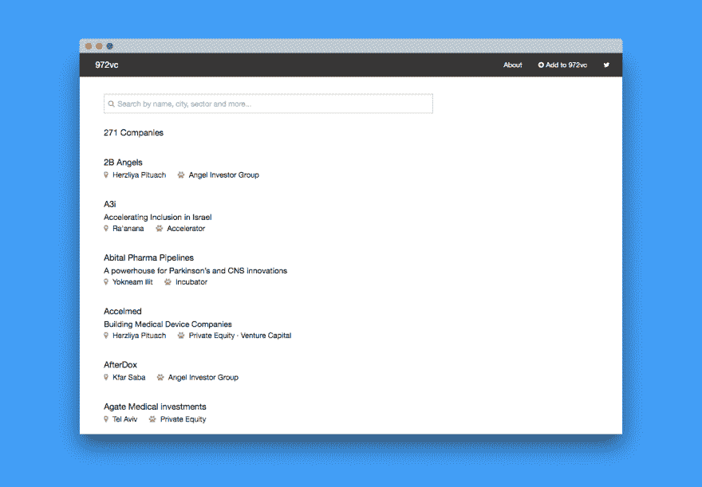

# 一个非技术人员如何从零开始学习编码

> 原文：<https://dev.to/3reps/how-a-non-techie-learned-to-code-from-scratch-28fd>

我的背景是商业，除了求知欲和对技术感兴趣之外，我没有任何编程、数据库或设计经验。像大多数非技术人员一样，我有很多想法(质量各不相同)，但缺乏技术知识，无法在不外包技术的情况下创建最低可行产品(MVP)。

作为一个非技术人员，你可以很容易地说服自己，你的想法是核心产品，技术只是一个工具，因此可以外包。不幸的是，这种推理往往会产生一种不希望的结果——几个月的面试软件开发公司，大量的文书工作，高成本，不可分散的风险，不可预见的延迟和质量控制问题，以及一种工作关系，在这种关系中，你依赖于开发人员的可用性和善意，直到你找到其他人来接管。最后，你可能会一无所获，或者得到一个不是你所设想的产品，如果你失败了，那是因为你依赖他人，而不是你自己，这使情况变得更糟。

2014 年 9 月，我决定自学 Ruby on Rails，并创建一个 web 应用程序。我有一个简单的想法，规划出整个以色列融资生态系统，帮助初创企业寻找潜在的资金，并促进初创国家的发展。我关注三件事:

1.  以色列投资者和在以色列有代表的投资者；
2.  数据的完整性；和
3.  搜索粒度允许初创公司找到与其位置、行业、市场和/或投资阶段相匹配的投资者。例如，[在特拉维夫寻找投资早期网络安全初创公司的风险投资公司](https://972vc.com/#q=idt_venture_capital+isr_tel_aviv+ivs_early_stage+mkt_cyber_security)。

我创建了一个电子表格并设计了模式:列标题(如名称、位置、投资阶段)和属性(如种子、早期阶段)。然后，我开始整理数据并填充电子表格，不断完善模式以保持简单和相关。到 9 月底，我已经为 250 多家公司整理了数据。我故意从数据开始，而不是学习如何编码，主要是因为这样一来，如果我无法开发应用程序，我至少可以开源电子表格，为创业社区做出有意义的贡献。现在，是时候学习如何编码了。

* * *

### 第一步:HTML 和 CSS

我花了一个周末浏览 Codecademy 关于 HTML 和 CSS 的教程。这些练习可以让你有一个基本的了解，并快速学习如何创建网页文档的布局和样式。目标是理解你能用 HTML 和 CSS 做什么，并对语法有个感觉。不要在这些教程上花太多时间。

### 第二步:命令行界面

我开始熟悉自己电脑上的[命令行界面](https://en.wikipedia.org/wiki/Command-line_interface)(Mac 上的终端)。我学会了几个基本的命令:如何创建目录；移动、删除和重命名文件；从一个目录导航到另一个目录。这里的目标是揭开命令行界面的神秘面纱，并在日常生活中使用它，这样一旦您开始编码，您就可以轻松地使用这个工具。

### 第三步:学习一门编程语言

有几篇文章和深入的论坛帖子讨论了您应该学习哪种编程语言以及为什么要学习。很遗憾，我不能告诉你该学哪种语言，除了可能没关系。如果你选择学习 PHP 或 Ruby，那没问题，或者你想学习 Swift 或 Objective-C 来创建 iPhone 应用，那也没问题。不要像大多数语言一样，花时间为你的项目寻找最佳语言。相反，专注于你想要构建的东西，以便缩小你的选择范围，复习语法，阅读一些材料，并开始学习与你最有共鸣的语言。我唯一的建议是，你选择一门有相当大的在线社区和强大学习材料的语言。如果你有一个开发者朋友，寻求他们的建议并听取他们的意见。

我选择了 Ruby，花了几天时间学习 Codecademy。这些[教程](https://www.codecademy.com/en/tracks/ruby)很好也很容易，并且提供了一个很好的语言介绍。你甚至会注意到，在没有任何先验知识的情况下，你将能够理解一些语言。你的目标应该是应用和理解，而不是记忆语法。例如，您将学习创建循环的不同方法，但是首先要关注为什么您可能想要创建循环。你在 972VC 主页上看到的公司列表通过一个循环。再次，考虑应用。

### 第四步:设置你的编码环境

我发现这是最难的一步；花了一个周末的时间做了几次尝试才把它做好。我建议您备份硬盘，因为在安装项目所需的技术时，您可能会无意中删除系统文件或弄乱某些东西。这可能是你最需要帮助的地方，所以如果你有一个开发者朋友或者参加一个聚会，一定要伸出援手。

您还需要下载一个代码编辑器。选择您朋友使用的工具或您喜欢的编辑器。

### 第五步:学习 Rails

在我建立了我的编码环境之后，我花了几天时间学习 Jumpstart Lab 的 [Blogger](http://tutorials.jumpstartlab.com/projects/blogger.html) 教程，该教程教授四个基本功能——创建、读取、更新和销毁(CRUD)——你需要在 Rails 上构建一个简单的 Ruby 应用程序。

这里的目标与其他教程相似——关注应用和理解，而不是记忆语法。考虑一下您是否在教程中创建了可以用于项目的功能。同样重要的是，你要接受在你理解这些教程中你在做什么之前需要时间这一事实。顺其自然，拥抱不确定性。不要气馁，不要放弃。

### 第六步:开始构建你的应用程序

至此，你已经学会了基础知识:HTML、CSS 和你选择的语言。您还将熟悉命令行界面，并设置您的编码环境。10 月，在我完成上述教程后，我开始在 972VC 上工作，到 11 月底，web 应用程序已经[上线](https://972vc.com/)。

* * *

## 吸取教训

### 学习如何搜索

在开发的最初几天，我甚至无法完成最基本的任务；事实上，在整个项目中，我花在谷歌上的时间比写代码还多。同样的事情也会发生在你身上，这就是为什么你不应该花时间去记忆语法。学习如何有效地搜索和足智多谋，因为这将是你最重要的技能。

### 一种“脏手”的学习方法

不要花几周或几个月的时间去钻研书籍、教程和视频，除非你喜欢更理论化的学习方法。相反，用“脏手”的方法学习代码和新技术。

> ...我们称之为“脏手”学习法，就像你小时候拆开自行车、你父亲的割草机或收音机一样。作为一名工程师，或者任何事情，最好的学习方法之一就是把它拆开，研究它，问问题。
> 
> *——美国宇航局马歇尔航天飞行中心推进系统部主任汤姆·威廉姆斯[讲述美国宇航局如何让庞大的 F-1“月球火箭”发动机起死回生](https://arstechnica.com/science/2013/04/how-nasa-brought-the-monstrous-f-1-moon-rocket-back-to-life/)T3】*

那么这一切意味着什么呢？假设您刚刚将一些代码复制粘贴到您的项目中，它做了它应该做的事情，但是您不知道它是如何工作的。使用“脏手”学习方法，一行一行地拆开代码，删除一些东西，看看会发生什么，添加一些东西，看看会发生什么，然后重复。花时间去了解事物如何运作是值得的。

当你需要学习如何做特定的事情时，使用教程、博客和其他资源。一定要检查并从开源项目中学习。

### 开源

对于非技术人员来说，开源可能是最美妙的发现，因为你寻找的功能可能已经开源了，所以你不需要重新发明轮子。例如，如果你想延迟加载图像或删除未使用的 CSS，你可以找到免费的健壮的开源项目。

### 没有付出，就没有收获

不要依赖别人为你开发你的应用。

你需要坚持不懈，坚韧不拔。如果你是一个新手，学习编码需要不同于你习惯的思维方式，所以当然会很难。但是通过几个小时对一个问题的修补，你会逐渐开始理解它是如何工作的。随着您学习的进展，您将不再满足于您找到的第一个解决方案——您将开始寻找更好的方法来解决您的编码问题。

### 技术

做好学习多种技术的准备，因为仅仅学习一种编程语言来构建你的应用是不够的。你最终可能会使用其他语言和技术，比如 Git、JavaScript 和 PostgreSQL。

### 庆祝小胜利

学习如何编码是很难的，如果你自己做就更难了。因此，你需要把向前的每一步，不管有多小，都看作是合理的成功。

### 社群

[Stack Overflow](https://stackoverflow.com/) 是一个面向开发者的在线社区。当你陷入困境时，这是一个学习和提问的好地方。不幸的是，它并不总是这样一个新手友好的地方，但有许多站起来的社区成员会走出他们的方式来帮助你。

提出问题，但不要指望别人解决你的问题。即使你已经在 Stack Overflow 上发布了这些问题，也要继续解决你遇到的问题。你甚至可能最终会回答自己的一些问题，并为社区做出贡献。

你应该知道的另一个很棒的资源是 [CodePen](https://codepen.io/) ，这是一个面向前端设计师和开发人员的社交开发环境。我使用 CodePen 来获得设计灵感和查看代码片段。例如，如果你想将 Algolia 整合到你的项目中，你可以在 CodePen 上搜索 *Algolia* ，你会找到其他人如何实现搜索的[例子](https://codepen.io/search/pens?q=algolia&page=1&order=popularity&depth=everything&show_forks=false)。

你也可以加入 Slack 频道和其他在线社区来进一步学习。

### 精益启动原则

与有经验的开发人员相比，你有明显的优势。由于你没有编码知识或经验，你将需要把你的应用程序想法剥离到它的必需品。专注于产品的核心，尽可能简化。

### 编码就像拼图游戏

在基本层面上，您可以将编码视为一个交互式拼图游戏。将你的想法分解成可管理的小任务，这些小任务将组成你的应用程序。一个任务可以小到添加标题标签或获得一个工作的超链接。

当你完成这些任务时，你会看到真正的进步。这将有助于减少你的压力和失去兴趣的风险。不要失去兴趣。

### 每日编码，频繁部署

尝试每天使用你的应用程序，即使只有几分钟，尤其是在项目的开始阶段，因为熟悉你的编码环境很重要。不要担心最佳实践和惯例。开始时那只是噪音，但是随着你的进步，你会想要学习那些原则。

我还建议你经常在 AWS 或其他托管服务上部署你的应用程序，因为这可以在你最终准备启动时节省你的时间。

### “我没有任何可以帮忙的朋友，一大网络推广我的 app，太辛苦了……”

通常，当你刚开始时，学习编码可能会感到徒劳。为了一个你可能永远也不会开发出来的应用程序而让自己经历这么多麻烦有意义吗？但是如果你真的想学习代码和构建，那就没有借口了。这适用于生活中的大多数事情。有时候你只需要**接受失败**，深入挖掘，坚持到底，让事情发生。972VC 是一个很好的例子，你可以建立一个应用程序，包括代码，设计，内容和中间的一切，你自己没有外界的帮助，并达到全球观众。

充分利用令人惊叹的在线(免费)资源。也有[工程师和设计师](http://stephaniehurlburt.com/blog/2016/11/14/list-of-engineers-willing-to-mentor-you)愿意帮助和指导你。

### 快速启动，保持简单，逐步增加功能

我发现快速启动和响应用户反馈是最好的方法。用完美的像素设计和漂亮的代码创建一个功能丰富的应用程序是很棒的，但是我永远不会有任何东西可以部署。相反，我倾向于在核心功能运行时启动，之后我会对设计和代码进行改进。然而，一个教训是，设计很重要，有时甚至比内容更重要。举个例子，这是我第一次推出 972VC 时的样子。

[T2】](https://res.cloudinary.com/practicaldev/image/fetch/s--DXwWZuBC--/c_limit%2Cf_auto%2Cfl_progressive%2Cq_auto%2Cw_880/https://thepracticaldev.s3.amazonaws.com/i/7fuqao2ia4zhp1b73t0m.png)

也许这为时过早，因为该网站被忽视了，即使内容和功能与当前版本相似。自发布以来，我已经将该应用程序转换为一个由 Hugo 支持的静态网站，但用户并没有注意到这一点。然而，新的设计受到了赞赏。换句话说，最初你可以侥幸逃脱糟糕的代码，但不能逃脱糟糕的设计。

最后，保持事情简单。弄清楚你现在是否真的需要自动化所有的事情，或者你是否可以摆脱手动做事情来节省时间并专注于更重要的任务。

* * *

## 即使不想做开发者也要学编码吗？

通过遵循上面的步骤并根据您的需要进行调整，您可能会在几周或几个月内构建一个简单的应用程序。但是，更重要的是，你会增强自己的能力，学会一项新技能。也许你会成为工作场所中更有价值的一员，因为你现在已经基本理解了代码，并且可以更好地与开发人员和设计人员交流。你也将有能力执行自己的想法，而不需要花费大量的外包费用。在 972VC 的情况下，构建和启动应用程序的总成本是 **$9** (一个 [RailsCasts](http://railscasts.com/) pro 订阅)加上域名。如果你选择外包开发，你将在谈判中处于更有利的地位。

现在，如果你不想经历这个学习过程，但仍然想实现你的想法，有不需要一行代码的替代方法。你可以集成 [Carrd](https://carrd.co/) 、 [Typeform](https://www.typeform.com/) 、 [Stripe](https://stripe.com/) 、 [Zapier](https://zapier.com/) 、 [Airtable](https://airtable.com/) 等多个工具来创建一个 app。

* * *

## 今日:972VC

自从我启动了 [972VC](https://972vc.com/) 以来，它已经成为以色列初创公司寻求与[私募股权](https://972vc.com/private-equity)和[风险投资](https://972vc.com/venture-capital)以及[加速器](https://972vc.com/accelerators)和[孵化器](https://972vc.com/incubators)项目相关资金的最全面资源之一。此外，它还提供天使投资者团体、众筹平台、共同工作空间和拥抱“科技为善”的非营利组织的信息。

如果你是创业国家融资生态系统的一员，并且不在 972VC 上，[加入这个社区](https://972vc.com/)！

* * *

## 回首往事

自从我学习编码以来，几年已经过去了。

我的目标从来不是成为一名开发人员，而是获得一套技能，使我能够理解代码并实现我的想法。这也是一个揭开技术神秘面纱的过程——“它是如何工作的？建造这样的东西很难吗？我需要什么技术来做到这一点？” —作为学习如何学习。

学习编码的过程很有挑战性，有时会弄巧成拙，但它从来都不是负担，也不像是一件苦差事。相反，我喜欢其中的逻辑和解决问题的方法。我认为这是关键，需要有一些关于学习过程和主题的东西引起你的兴趣，以克服你将遇到的不可避免的挑战。特别是，当你从在线教程过渡到面对一个空白屏幕，开始构思时，没有“获得提示”按钮来指导你时，在线教程是对代码的极好介绍，在每个步骤都对你有帮助。

但是如果你坚持不懈会怎么样呢？事情会变得更好。开发应用变得更加有趣，事情也开始变得更有意义。文档变得更容易获取，你开始了解自己的局限性，这样你就可以设定更现实的目标。你对如何解决问题有了更敏锐的感觉，不再(至少在大多数时候)使用蛮力，只是随机改变代码中的内容或复制粘贴代码，希望某些东西能够工作。相反，你依靠你解决问题的技巧来弄清楚发生了什么。但最棒的是，你意识到你现在可以实现你的想法，开发一个应用程序，覆盖全球受众。

## 现在

我现在正在建立[加密货币岗位](https://cryptocurrencyjobs.co/)和[节点任务](https://nodesk.co/)。我仍然积极维护 [972VC](https://972vc.com/) 。

* * *

## 资源

我整理了一个资源列表，以进一步帮助你学习如何编写和构建你的应用程序。这些是我在构建应用程序时使用或遇到的资源，最终使 972VC 成为可能。我希望它们对你同样有益。

*   命令行界面:[Mac 终端 Cheatsheet】](https://github.com/0nn0/terminal-mac-cheatsheet)
*   安装指南: [GoRails](https://gorails.com/setup/osx/10.13-high-sierra) ， [thoughtbot](https://github.com/thoughtbot/laptop/blob/master/mac)
*   OS X 软件包经理:[自制软件](https://brew.sh/)
*   代码编辑器: [Atom](https://atom.io/) ，[崇高文字](https://www.sublimetext.com/)， [Vim](https://www.vim.org/) ， [Visual Studio 代码](https://code.visualstudio.com/)
*   教程: [CSS-Tricks](https://css-tricks.com/) ， [Codecademy](https://www.codecademy.com/) ， [Jumpstart Lab](http://tutorials.jumpstartlab.com/) ， [RailsCasts](http://railscasts.com/) ， [RubyMonk](https://rubymonk.com/) ，[Ruby on Rails 教程](https://www.railstutorial.org/)， [Tuts+](https://tutsplus.com/)
*   Ruby on Rails 开源项目:[开源 Rails](http://www.opensourcerails.com/)
*   认证:[设计](https://github.com/plataformatec/devise)
*   自动完成: [Algolia](https://www.algolia.com/doc/tutorials/search-ui/autocomplete/auto-complete/) ， [jQuery UI](https://jqueryui.com/autocomplete/) ， [Select2](https://select2.org/) ，[select](https://selectize.github.io/selectize.js/)， [typeahead.js](https://twitter.github.io/typeahead.js/)
*   CMS: [活动管理员](https://activeadmin.info/)， [RailsAdmin](https://github.com/sferik/rails_admin)
*   前端框架: [Bootstrap](https://getbootstrap.com/) ， [Foundation](https://foundation.zurb.com/) ， [Tachyons](http://tachyons.io/) ， [Tailwind CSS](https://tailwindcss.com/)
*   全文搜索: [Algolia](https://www.algolia.com/) ， [Elasticsearch](https://www.elastic.co/) ， [PgSearch](https://github.com/Casecommons/pg_search) ， [Solr](https://lucene.apache.org/solr/) ，[思维狮身人面像](https://freelancing-gods.com/thinking-sphinx/v4/)
*   图标:[字体牛逼](https://fontawesome.com/)
*   分页:[上成](https://github.com/kaminari/kaminari)，[将 _ 分页](https://github.com/mislav/will_paginate)
*   漂亮的网址: [FriendlyId](https://github.com/norman/friendly_id)
*   数据库: [MongoDB](https://www.mongodb.com/) ， [MySQL](https://www.mysql.com/) ， [PostgreSQL](https://www.postgresql.org/)
*   论坛:[站点点](https://www.sitepoint.com/community/)，[堆栈溢出](https://stackoverflow.com/)
*   浏览器中的代码编辑器: [CodePen](https://codepen.io/) ， [JSFiddle](https://jsfiddle.net/)
*   JavaScript 转 CoffeeScript 编译器: [Js2coffee](http://js2.coffee/)
*   基于网络的办公套件:[谷歌文档](https://www.google.com/docs/about/)
*   Ruby 风格指南:[社区驱动的 Ruby 编码风格指南](https://github.com/rubocop-hq/ruby-style-guide)
*   版本控制: [Git](https://git-scm.com/)
*   仓库托管服务: [GitHub](https://github.com/) ， [GitLab](https://about.gitlab.com/)
*   虚拟主机服务: [AWS](https://aws.amazon.com/) ， [Engine Yard](https://www.engineyard.com/) ， [Heroku](https://www.heroku.com/) ( [寝住](http://nezumiapp.com/)用于移动，而[管理](https://www.adminium.io/)用于数据库后端)
*   DNS 和域管理: [DNSimple](https://dnsimple.com/)
*   浏览器测试:[浏览器堆栈](https://www.browserstack.com/)
*   网站安全扫描器:[检测](https://detectify.com/)
*   负载测试: [Loader.io](https://loader.io/)
*   分析:[谷歌分析](https://www.google.com/analytics/)，[细分](https://segment.com/)
*   时事通讯: [MailChimp](https://mailchimp.com/) ， [Revue](https://www.getrevue.co/)
*   隐私策略生成器: [iubenda](https://www.iubenda.com/)
*   UI/UX 工具:[草图](https://www.sketchapp.com/)
*   域名生成器:[域名](https://domainr.com/)，[域名](https://www.namemesh.com/)，[域名机器人](https://www.namerobot.com/)， [Panabee](http://www.panabee.com/)

这是我最初在[媒体](https://medium.com/@3reps)上发表的一篇文章的修订版。