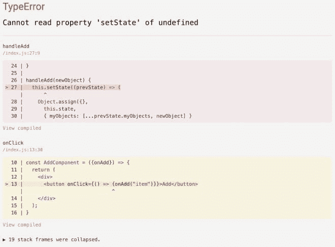

# 如何以及为什么在 React 组件中绑定回调函数

> 原文：<https://dev.to/a_reiterer/how-and-why-to-bind-a-callback-function-in-react-components-45m8>

这听起来可能对你来说很熟悉:在你做了一些改变来测试你的新功能之后，你运行你的 React 应用程序，得到一个类似这样的错误消息:“**this . setstate’不是一个函数**”。很可能是因为你忘了在传递给道具之前绑定一个回调函数。今天，您将了解为什么需要绑定，以及如何在 React 中绑定回调函数。

对许多开发人员来说，处理`this`关键字是一件非常头疼的事情。这是因为在 JavaScript 中并不总是清楚`this`实际指的是什么。尤其是当你使用回调函数的时候。

如果你问自己，为什么你甚至必须绑定回调函数，当你实际上必须这样做时，这篇文章是给你的:今天我们将学习如何在 React 组件中绑定`this`关键字。

**TL；博士:** *绑定回调是 JavaScript 的事情。这是必要的，因为你必须告诉你的回调函数它的上下文是什么。在 React 中，或者在构造函数中，或者通过使用公共类字段语法来绑定回调。*

## 为什么我们需要绑定:基础知识`this`

首先，它不是一个你必须绑定的东西。事实上，这与 JavaScript 的工作方式有关。`this`是每个函数中引用当前上下文的特殊关键字。你可能已经在其他编程语言中看到过`this`。

然而，在 JavaScript 中，`this`的值取决于*如何调用*函数，而不是定义它的时间和地点。此外，它不像变量那样受范围的影响。这意味着，当你将一个函数传递给另一个函数时，`this`不会引用相同的值。

```
function myFunction() {
 console.log(this);
}

// Calling the function normally
myFunction(); // 'this' will refer to 'window'

// pass the function to an object and call it as an object method
var myObj = { doSomething: myFunction};
myObj.doSomething; // 'this' will refer to 'myObj' 
```

如果你想了解更多关于`this`的信息，我推荐你看一下 [MDN 文档](https://developer.mozilla.org/en-US/docs/Web/JavaScript/Reference/Operators/this)。

但是你会问，所有这些和绑定这个有什么关系呢？嗯——告诉一个函数它的`this`应该引用什么是可能的——这就是你用绑定`this`所做的。让我们看看那个。

## 如何绑定`this`

如果你绑定了一个函数，你可以稍后设置`this`的值，所以在哪里调用回调函数不再重要。您可以通过调用函数`bind(this)`来实现这一点:

```
function myFunction() { 
  console.log(this); 
}

// bind(this) creates a new function where the value of 'this' is fixed
var boundFunction = myFunction.bind(this);

// It's also possible to replace the function by it's bound version
myFunction = myFunction.bind(this); 
```

在函数上调用`bind(this)`会返回一个新的(绑定的)函数，该函数已经定义了`this`的值。这样，如果你将它传递给另一个对象，或者向下传递 React 组件中的一个道具，这个组件中的`this`的值将不再改变。

现在让我们看看如何在 React 组件中绑定`this`。

## 绑定`this`在一个 React 组件中

展示不同方法的最佳方式是一个例子。看看下面代码示例中的组件:

```
const AddComponent = ({onAdd}) => {
 return (
   <div>
     <button onClick={() => {onAdd("item")}}>Add</button>
   </div>
 );
}

class MyListComponent extends Component {
 constructor(props) {
   super(props);
   this.state = {
     myObjects: []
   }
 }

 handleAdd(newObject) {
   this.setState((prevState) => (
     Object.assign(
       {}, 
       this.state, 
       { myObjects: [...prevState.myObjects, newObject] }
     )
   ));
 }

 render() {
   return (
     <div>
       <AddComponent onAdd={this.handleAdd} />
       {this.state.myObjects}
     </div>
   )
 }
} 
```

这里我们有一个简单的组件来保存一个条目列表。在通过 props 传递的回调的帮助下，子组件将项目添加到这个列表中。到目前为止一切顺利。如果你执行上面的例子，你会得到一个错误，因为`this`是未定义的。

[](https://res.cloudinary.com/practicaldev/image/fetch/s--vyZwjTFF--/c_limit%2Cf_auto%2Cfl_progressive%2Cq_auto%2Cw_880/https://i1.wp.com/www.andreasreiterer.at/wp-content/uploads/2018/02/cannot-read-property-setState-of-undefined.jpg%3Fresize%3D660%252C487%26ssl%3D1) 

<figcaption>当你调用一个没有绑定‘this’的回调函数时得到的错误</figcaption>

在下面的章节中，我将解释[推荐的方法](https://reactjs.org/docs/handling-events.html)来绑定`this`以避免这样的错误。

### 使用*公共类字段语法*

值得注意的是，类字段的语法还没有标准化。但是它们已经被如此广泛地使用，以至于如果有语法上的变化，可能用不了多久就会出现一个合适的无摩擦迁移策略。

当使用类字段语法时，您将把回调转换为类的公共字段。这样做会将回调的`this`自动绑定到定义它的类。这允许您将回调传递给子组件，而不必在构造函数中单独绑定它。

```
handleAdd = (newObject) => {
   this.setState((prevState) => (
     Object.assign(
       {}, 
       this.state, 
       { myObjects: [...prevState.myObjects, newObject] }
     )
   ));
 } 
```

### 绑定`this`构造函数内部

绑定`this`最简单的方法之一是在父组件的构造函数中通过调用回调函数的`.bind(this)`来实现:

```
constructor(props) {
  super(props);
  this.state = {
    myObjects: []
  }

  this.handleAdd = this.handleAdd.bind(this);
} 
```

就是这样！基本上，你只需要在构造函数中绑定每个回调函数，你就可以安全地运行了。

如果你有很多回调函数，你可以想象你的构造函数会有多大。如果将这与使用 public class fields 语法进行比较，您会注意到这种方法意味着您需要更多的输入和潜在的更大的构造函数。

## 替代品及其说明

在前面的章节中，我解释了绑定`this`的推荐方式。然而，如果你不喜欢上面提到的方法，这里还有一些——如果你同意它们的警告的话。

### 直接装订在道具内

除了在构造函数中绑定回调函数，您还可以在通过属性传递回调函数时这样做:

```
<div>
   <AddComponent onAdd={this.handleAdd.bind(this)} />
   {this.state.myObjects}
 </div> 
```

**注意:**每当你的组件被重新渲染时，`bind(this)`返回一个新的函数，并把它传递给你的组件树。这可能会导致不必要地重新呈现子组件。最终，这可能会对您的应用程序性能产生巨大影响。

### 传递箭头功能给道具

不使用类字段语法，您可以直接将箭头函数传递到您的 props:

```
<div>
  <AddComponent onAdd={(obj) => this.handleAdd(obj)} />
  {this.state.myObjects}
</div> 
```

**注意:**和前面的例子一样，每次你的组件被重新渲染时，这会创建一个新的回调，并且可能会导致组件树不必要的重新渲染。这又是一个您可能不想忍受的性能影响。

## 把东西包起来

我们不会回避绑定回调函数，因为这是 JavaScript 的工作方式。但是现在你知道了为什么我们必须绑定`this`——以及如何在 React 组件中这样做，我希望能让你的生活变得简单一点。

一如既往，有不同的方法来解决这个问题。但是从提到的四种方法中，我建议坚持推荐的选项:

*   使用类字段语法
*   在构造函数中绑定`this`

这样做可能会避免意外的性能问题。当你习惯使用一种方法后，你甚至不会再去想它。

## 动作步骤

仍然不确定什么是最适合你的方法？花些时间，两者都试试吧！在你花了一些时间尝试和实践之后，你可能会注意到你更喜欢其中一种方法——如果不去尝试，你永远也不会知道。

现在把你的手弄脏，找到你最喜欢的方法！

## 保持更新

你想提升你的反应技能吗？通过[订阅我的简讯](https://www.andreasreiterer.at/dev-newsletter/)了解新文章