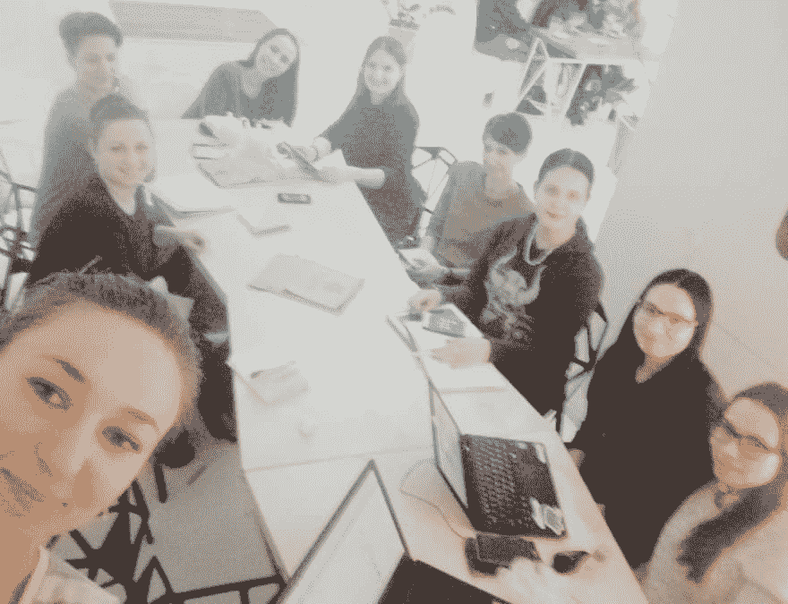
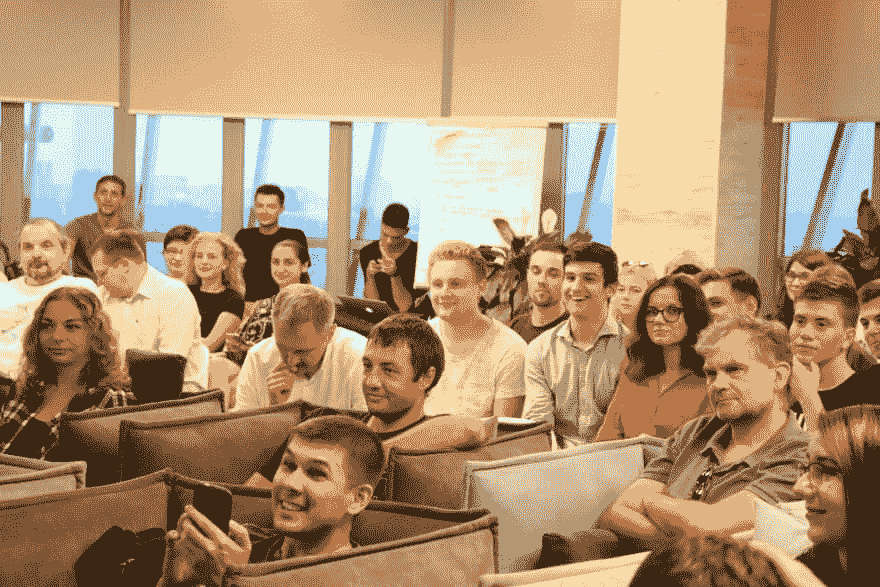
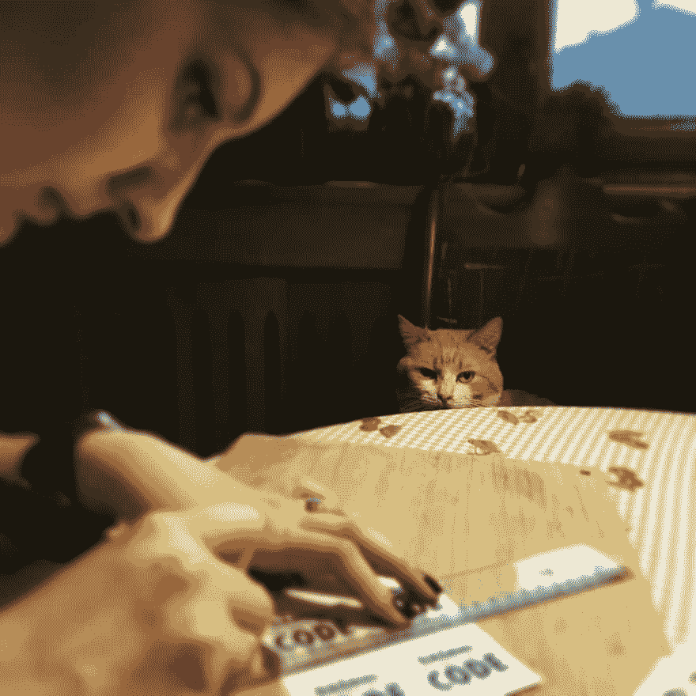
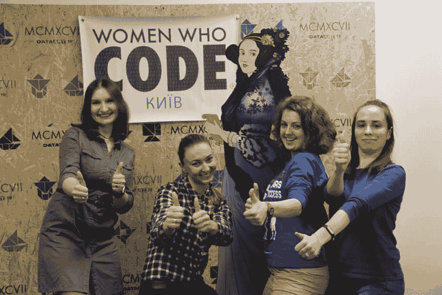
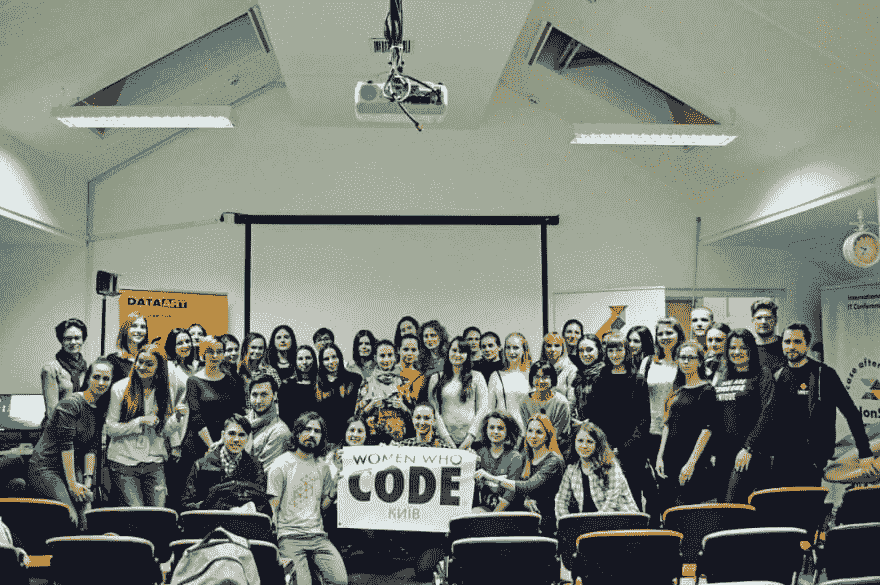
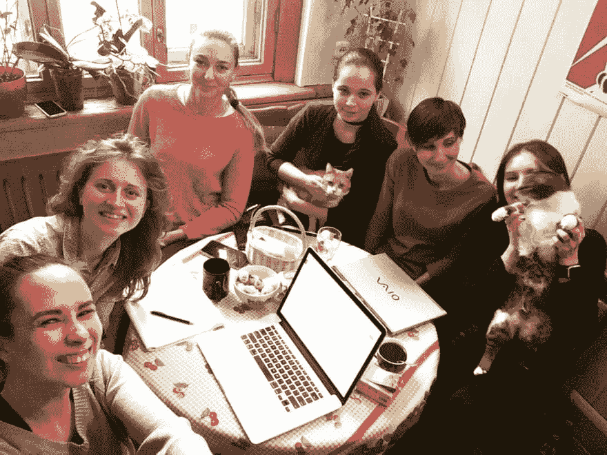
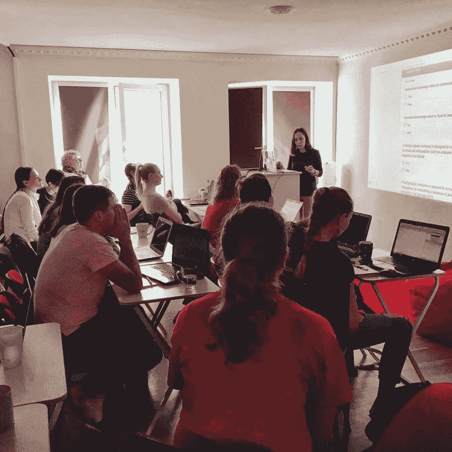
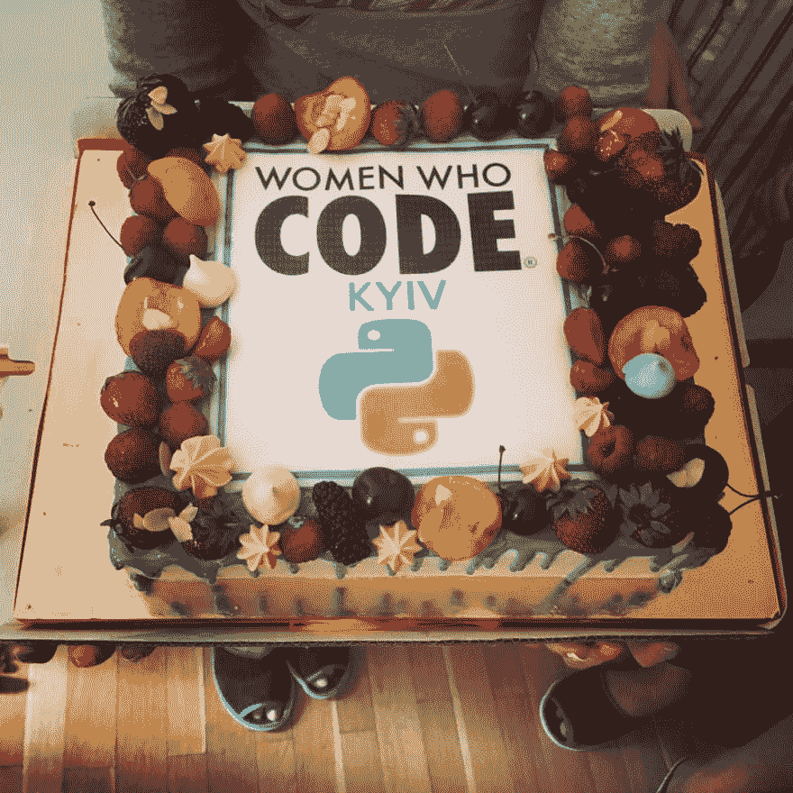

# 如何建立一个女性编码的章节让我成为一个更好的工程师

> 原文：<https://dev.to/advance_lunge/how-building-a-women-who-code-chapter-made-me-a-betterengineer-2eo3>

# 和一个道行比较好的人。

2017 年 1 月，当我住在乌克兰时，我注意到当地一个 IT 专业人士论坛上的一则广告，内容是关于新成立的[Women Code](https://www.womenwhocode.com)Kyiv branch 的第一次会议，组织者承诺将更多地介绍这个全球组织以及它如何支持女性。

我必须承认，我是在一个艰苦贫穷的环境中长大的，我学校的女孩让我真的讨厌女人。我觉得自己是性别上的一个例外:我喜欢学习，我真的很喜欢 STEM，甚至比我周围的所有男孩都做得好，我不想对某人的外表或个人问题说三道四。事实上，我的样本太小、太单一，无法得出任何结论，但它还是影响了我一段时间的人生观。我很后悔，但至少我有一个合法的借口:-p

所以我对整个女性社区的事情非常怀疑。作为一个“合适的”系统程序员，拥有硕士学位和几年的经验，我确信我的专业领域是一个非常复杂的领域，只有被选中的人才能掌握内存管理的神圣知识，而其他更面向用户的自动垃圾收集领域是容易的。我从来没有遇到过喜欢摆弄操作系统的女人，所以我确信我是世界上唯一一个有这种热情的人。现在我知道我只是没有努力寻找。

那天晚上有四个演讲者:一个人工 QA，一个项目经理，一个设计师和一个学生。于是我给老公发短信:“能看女人，不能看代码。”我还很傲慢地在脸书上发表了评论，其中一位新任命的分支主管邀请我帮忙介绍“代码”部分。好消息——我立刻为自己的话感到羞愧，并决心从程序员的角度提供帮助。现在我知道我以前的行为是因为我的性别而受到社会压力的影响，但那时我并没有责怪整个社会，我没有责怪那些认为女人没有头脑的男人，我甚至没有注意到这些男人所做的每一个歧视行为。我指责女性不够聪明，因此损害了我性别的声誉。

总之，我加入了军队。和其他十几个新成员一起。我们宣布了组织会议的开始，以概述这样的社区的短期和长期目标。前 N 次会议，我们会从简单的自我介绍开始，以及为什么我们最终会坐在那张桌子旁，关心里面的女性。因此，我在 IT 的不同专业领域遇到了如此多的杰出女性。我听的每一个故事都像是“你这辈子到底去了哪里？”

*One of the first organisational meetings*

与此同时，我发现许多女性被迫放弃梦想，听从父母、丈夫或其他威胁她们做出更多“女性”选择的人的话。我发现我并不孤单。当我 14 岁的时候，我告诉我妈妈我将学习计算机工程，她不支持我的选择，并试图用我必须结婚生子而不是学习一辈子的论点来让我改变主意，但对我来说，这听起来很虚伪，因为我妈妈有应用数学硕士学位，她一生的大部分时间都在用穿孔卡片工作，后来用 Fortran 编程，在我清醒的几年里，她在大学教数学。她是我唯一的女性榜样，然而她却不鼓励我追随自己的内心(或者在那种情况下是大脑:-D)。现在我知道她可能不想让我经历性别歧视，但当时这似乎很奇怪。尽管如此，我没有改变我的想法，我赢得了这场战斗，但许多女性在这种情况下确实放弃了。

我们决定先建立社区的规则:

1.  对任何人开放。每个人都可以参加我们的组织会议，可以稍后阅读会议笔记，可以参与在线讨论，可以投票。顺便说一句，我们在脸书的每一篇文章在发表之前都要经过我们 Slack 频道至少 4 个成员的批准。我们通过记录我们的质量标准，将责任区域分成小块，并积极鼓励和公开表扬我们的合作者，广泛使用了不稳定的志愿者。
2.  行为准则。违规者将首次受到警告，如果继续不当行为，将被逐出社区。在我们 19 个月的工作中，只有两个人被排除在外。结果，我们帮助了这么多的女性成为第一次发言的人并获得了自信，问问题并获得了自信，或者仅仅是获得了自信，因为我们保证了一个友好的环境，在那里没有人会被评判，或者更糟的是，没有人会被骚扰。
3.  对男人开放。诸如此类，女人应该团结在一起，但事实是，在男性盟友的帮助下，反对性别偏见的斗争将会取得更大的进展:如果没有男性倡导者，女性很容易在商界被击败。因此，对于每一项活动，组织者都表示，我们不会将活动局限于任何性别。我们限制的是演讲者的配额:到目前为止，我们只有一名男性演讲者(他也很乐意在积极的环境中练习他的演讲技巧)和几十名女性演讲者，但是我们准备让 25%的男性演讲者。

*Deep Learning meetup. Yup, sometimes there are more men than women sitting and enjoying talks of our fellow female engineers.*

好了，我们设定了一个课程来进行[第一次技术会议](https://www.meetup.com/Women-Who-Code-Kyiv/events/237823597/)(还记得吗，我答应过“代码”部分？).我在多元化倡议中的观点不是让边缘化群体听“你很强大，你可以做到”的咒语，而是提供一个安全的教育空间，在这里每个人都可以安全地评估自己的技术技能。我们找到了扬声器，我发现了自己的设计技能，并编制了一个令人难忘的徽标印在贴纸和杯子上，我们与一家伟大的公司 [DataArt](http://dataart.com.ua/) 成为了朋友，他们立即同意为我们提供空间和小吃，最终我们准备好启动我们的技术计划了！

*The printing house messed up with stickers, so we had to cut them manually on the last evening before the first event*

我们有一个很棒的活动，我们有很多很棒的问题，人们整个晚上都在微笑。我从没见过这么多人在科技盛会上如此开心！不值钱的说，那么多幸福的女工程师！

*Hey, ladies, what do you think of our first technical event? Lady Ada approves too.*

根据我们在每次活动后收集的反馈，这是一次成功。征求反馈是许多集体想法中的一个。我们作为一个团队工作顺利，甚至没有试图支配任何决定，也没有用权威来证明它们。

*Every single event we do a family photo*

在第一次活动中，我们宣布了一个基于麻省理工学院 6.0001“计算机科学和使用 Python 编程导论”的介绍性课程。这个课程和我们的其他活动一样，是免费的，申请人必须解决几个难题并写一封激励信才能申请。这些激励信既温暖人心，又令人心碎。我最喜欢的一个学生是物理专业的，她想在欧洲粒子物理研究所工作，她觉得扎实的编程技能会帮助她成为一名更好的科学家。

*Going through the applications for the course*

我们挑选了 28 名女性和 2 名男性和我们一起开始研究。我们有 4 个导师(其中 3 个是第一次导师)，学生们会阅读课程材料，解决一周的作业，在线提问，然后我们会在每个周日在另一家公司提供的空间见面，该公司立即同意帮助我们， [Beetroot](https://beetroot.se/) ，花 3 个小时离线学习，然后筋疲力尽但高兴地回家。

*What women do on Sundays at 10am? Study Computer Science, what else would you think?*

28 个人到达了终点线。我可以说，其中 12 人很好地理解了课程，但我们无论如何没有一个目标来教每个人如何成为一名程序员:有人想尝试一下，看看它是否有效，有人在他们目前的职位上需要基本的编程技能，有人确实改变了他们的职业生涯，并在 it 领域找到了一份新工作。

*A celebratory cake*

对我们这些导师来说，最重要的成果之一就是我们所有人都成为了更好的教练。一个好的领导者必须是一个教练，所以这对我们现有的 IT 职业生涯很有帮助。

我不会说在乌克兰找到赞助商是一件容易的事情:自愿参与还没有成为一种趋势，所以除非高层管理人员深切而真诚地关心——没有人愿意盲目地花钱宣传他们的多元化努力。我们不得不一次又一次地解释，为什么公司会从托管我们中受益，但最终我们赢了，现在我们不再有这个问题:许多企业热衷于托管我们的社区，实际上是在竞争谁将是下一个托管我们的人。为什么？因为我们的团队是多元化的，我们有记者在我们中间进行良好的宣传，SMM 的专业人士帮助社交媒体，摄影师记录每一个事件，以及演讲者和与会者中令人惊叹的工程师，他们证明了所有比赛都是我们赞助商的潜在候选人。

所有这些是如何帮助我成为一名更好的工程师的？

1.  我成长为一个更有同情心的人(读作:关注文档、监控和工具)，关心他人的意见和感受(读作:成为一个更好的代码审查者)。
2.  我学会了授权和放弃我的乐高积木(阅读:我将永远不会囤积知识，并以此损害业务)。
3.  我建立了大量有用的联系(阅读:人们带着强烈的愿望给我他们的专业建议)。
4.  我练习了谈判技巧(比如:我很可能会得到我想要的，而且我总是带着我的宝贝在身边:])。
5.  我设定了对抗冒名顶替综合症的路线，因为当我工作出色时，人们会公开告诉我他们的赞赏(读:当我认为我的解决方案在可维护性和可用性方面更好时，我已经准备好战斗)。最终，我学会了公开支持我同意的人，这有助于在团队中建立纽带。
6.  作为一名经理，我变得成熟了，因为管理一个当时有 800 名成员的社区(现在有 1600 多名)不是一件轻而易举的事情。我们中没有一个人能独自做到。你可能已经注意到，我在面试中经常使用“我们”而不是“我”。那是因为比起我个人的贡献，我更看重团队合作。我提出了许多倡议和解决方案，但如果没有我所希望的最好的团队的润色，它们都不会这么好。我被邀请成为该分会的董事之一，这将为我的简历增添光彩，但我已经知道我很快就会搬到伦敦，所以这是不公平的。

我们举行了许多聚会、研讨会和网络聚会，我们在网上分享知识。我很高兴我们中没有人成为一个筒仓:社区可以很容易地继续运作，而不用担心公共汽车因素。我的社区同事们，我的朋友们，继续举办强大的技术活动，吸引越来越多的人认为女性是真正的技术专业人士。

帮助培养编写基辅代码的女性是我职业和个人发展的最佳时间投资之一。我在各方面都有进步，交了很好的朋友，我非常想念他们。

附注:你可以通过#wwcodekyiv 标签关注我们社区的更多故事。