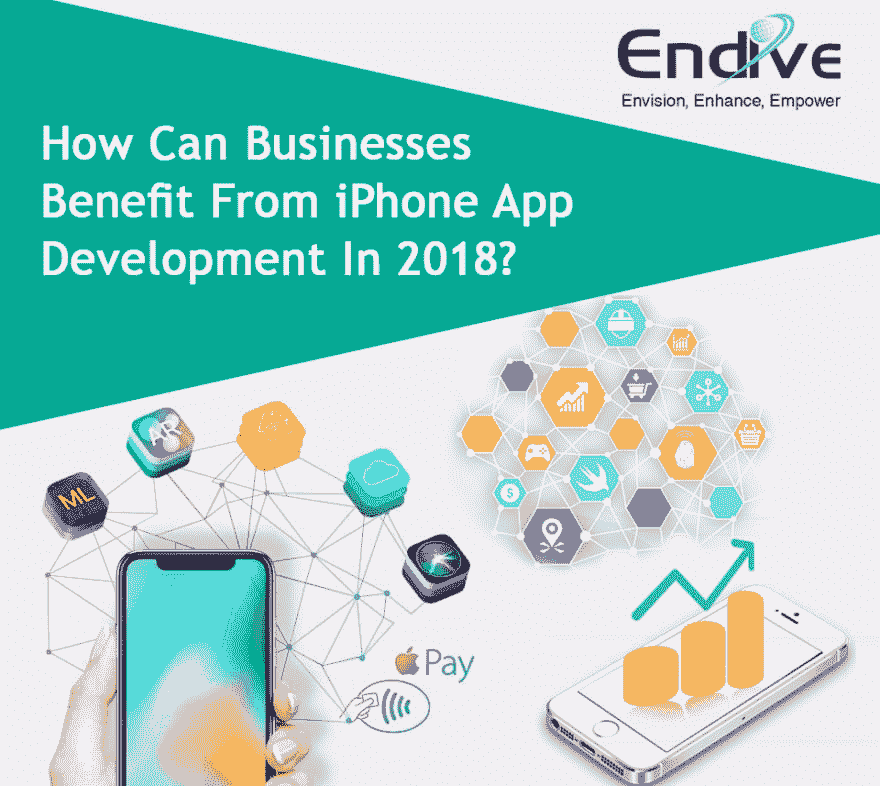

# 2018 年，商家如何从 iPhone 应用开发中获益？

> 原文：<https://dev.to/endivesoftware/how-can-businesses-benefit-from-iphone-app-development-in-2018-dl4>

如果你想让你的业务现代化，那么走 app 开发这条路是你最好的选择。这背后的原因是他们的名气，他们无处不在，他们让每个人的生活都很轻松。

[T2】](https://res.cloudinary.com/practicaldev/image/fetch/s--16RLRMgR--/c_limit%2Cf_auto%2Cfl_progressive%2Cq_auto%2Cw_880/https://thepracticaldev.s3.amazonaws.com/i/hiy6f0mebb4b5dixwyci.png)

这是时势所需，但是选择平台的两难选择太高了。Android 和 IOS 都是很棒的平台，但有某些原因使得 **[iPhone 应用程序开发](https://www.endivesoftware.com/iphone-application-development)** 成为更安全的赌注。

**以下是雇佣 IPhone 应用开发者/IPhone 应用开发公司的理由/好处:**

**苹果用户付费更多**

**雇佣 iPhone 应用开发者**的最大原因是你可以从中赚取收入。拥有苹果设备的消费者可能比拥有安卓设备的用户少(苹果占据 75%的市场)，但在付费客户端方面，苹果肯定领先于安卓设备。

根据调查，苹果用户比安卓用户更愿意从苹果商店购买应用程序。

这背后的原因是 Android 具有开源遗产，该应用的平均成本为 3-79 美元。而对于苹果应用程序，平均成本为 2.01 美元，这使得它在企业中很受欢迎。

**交易安全**

所有的平台都在网上交易中提供安全保障，以确保用户的个人信息不被泄露。一家名为 **[的 iPhone 应用开发公司](https://www.endivesoftware.com/blog/what-are-the-advantages-of-choosing-iphone-application-development)** 对此更加重视。

这是通过加密在线交易来实现的，这样消费者就不会受到网络钓鱼、黑客攻击和垃圾邮件等威胁。

**顶级用户体验**

一个伟大的应用程序的质量是它的硬件，客户支持和软件。苹果总是在这些品质之上。所有的 IOS 应用程序都可以在任何苹果设备上完美运行，这让客户体验非常棒，用户也很开心。

**接触到更多精通技术的受众**

对于一个精通技术的用户来说，苹果成为了第一个也是唯一的选择。因此，对于任何以增加销售额和接触更多消费者为目标的企业来说，都必须开发 iPhone 应用程序。一个伟大的 IOS 应用程序肯定会吸引更多的用户，进而增加你的客户群。

**市场形象**

大家都知道，app store 里只允许可信、安全、经过全面测试的应用。因此，如果一个企业雇佣一个 iPhone 应用程序开发公司来开发一个应用程序，他们可以确信用户会在上面投入他们的金钱和时间。

**IOS 应用的投资回报率更高**

投资 iPhone 应用程序开发服务对一个公司来说是非常好的，因为它通过增加收入和投资回报率来加强企业的财务。iOS 应用很容易吸引值得投资的客户。

**快速创建和测试**

苹果只有 20 多种设备，版本也比安卓少，这使得创建和测试 IOS 应用程序很快。它鼓励公司 **[雇佣 iPhone 应用开发者](https://www.endivesoftware.com/hire-iphone-app-developer)** 来获得 iPhone 应用的好处。

**高安全性**

对于任何企业来说，数据泄露都是最大的威胁。但是如果你从事 iPhone 应用程序开发，你就不用那么担心了。原因是苹果公司强烈保护用户免受病毒和恶意软件的侵害。此外，没有可疑的外部链接可以在 IOS 设备上打开，这使它成为一个完美的商业应用程序。

以上好处足以成为投资 **[iPhone 应用程序开发](https://www.endivesoftware.com/blog/why-professional-iphone-app-development-company-is-a-prudent-choice)** 实现业务现代化的理由。此外，雇佣该领域最优秀的 iPhone 开发人员，让他们马上就能开发出专业的应用程序。