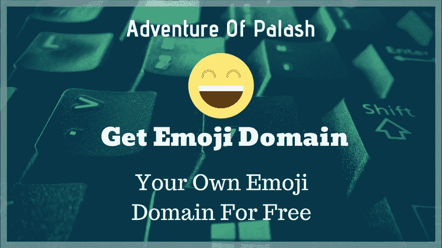
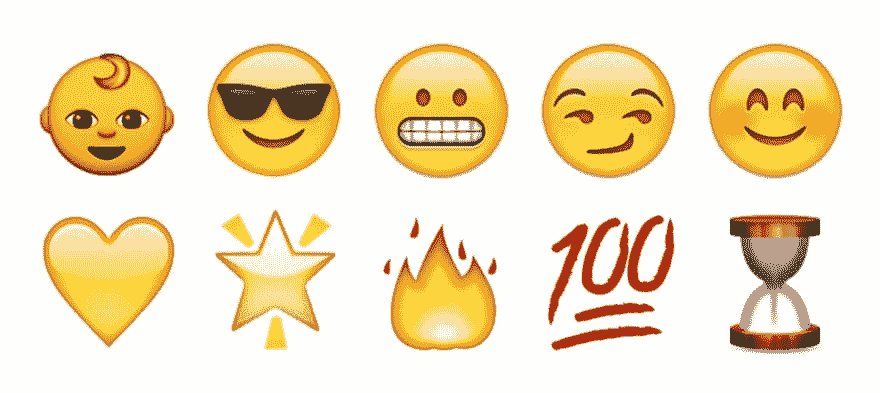
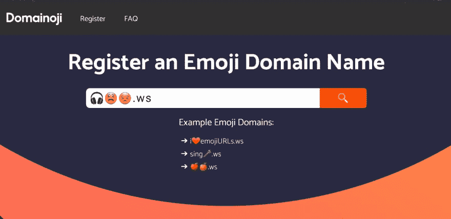

# 如何免费获得自己的表情符号域名

> 原文：<https://dev.to/bauripalash/how-can-you-get-your-own-emoji-domain-for-free-5e9c>

[T2】](https://res.cloudinary.com/practicaldev/image/fetch/s--FXCe9Vj0--/c_limit%2Cf_auto%2Cfl_progressive%2Cq_auto%2Cw_880/https://palash.tk/asseimg/getemojidomain.jpg)

表情符号域名将在短时间内成为趋势，你可能已经看到像 i❤.这样的网址 ws，i❤tacos.ws，📙。ws 等等。根据 Gizmodo 的说法，它们可能是互联网的未来。

> 第一批表情符号域名——♨️.com、♨️.net、☮️.com、♂️.在 2001 年 4 月 19 日注册，这在当时可能类似于概念艺术。

今天几个小时前，我刚刚买了域名🌐。cf 重定向到 Palash 的[冒险的主页，但令人惊奇的是我免费买了那个域名，所以我要分享你如何也能得到一个免费的表情域..](https://palash.tk)

[T2】](https://res.cloudinary.com/practicaldev/image/fetch/s--cTLVLfC9--/c_limit%2Cf_auto%2Cfl_progressive%2Cq_auto%2Cw_880/http://emojipedia-us.s3.amazonaws.com/content/2016/04/10/snapchat-emojis-2016.jpg)

### 第一步:选择表情符号

选择你最喜欢的表情符号，你想在你的域名，如🌐, ❤, 🌳、☕等。

如果你在没有表情键盘的桌面或手机上，不要担心，我有一个解决方案给你。使用[https://emojipedia.org](https://emojipedia.org)，他们列出了所有的表情符号，只需在搜索框中搜索你想要的表情符号。

如果您已经选择了域名，请继续下一步。

### 第二步:转换成 Punycode

域名注册商不支持表情符号输入，所以你必须转换你选择的表情符号 [Punycode](https://en.m.wikipedia.org/wiki/Punycode) ，这是他们的拉丁语表达。

你可以使用[http://punycoder.com/](http://punycoder.com/)将表情符号转换成 Punycode。

从[表情百科](https://emojipedia.org)中复制表情符号，或者直接从键盘输入，然后点击**转换为 Punycode > >** 按钮，复制下框的输出。

#### 【另类方式】

你也可以使用 Chrome 或其他网络浏览器来获取 Punycode，只需这样做即可。

在网络浏览器的地址栏中，输入您的表情符号，然后输入**。abc** ，不带任何空格

> **。abc** 不是强制性的，我只是举个例子，你可以使用任何其他顶级域名，如**。com** ，**。xyz** 等。

然后你的浏览器会自动将表情符号转换成 Punycode，

如果你输入类似于，🌐。abc 它将被转换成 **xn - wg8h.abc** ，所以复制你的 Punycode 在这里 **xn - wg8h**

### 第三步:注册域名

因为我们想要免费的域名，所以我们将使用[https://freenom.com](https://freenom.com)，在那里注册，在搜索域名框中粘贴我们的 Punycode 并点击回车，如果你的域名可用，它将在下面列出，如果不可用，你必须选择另一个表情域，并使用前面的步骤将其转换为 Punycode。

如果可以的话，免费注册你的域名，不需要信用卡。然后使用域面板，你可以将该域转发到你现有的网站，或者用你全新的表情域建立一个全新的网站。

> 重要提示:由于 Freenom 是一个免费的域名注册商，不要期望太高。如果你想要一个专业的表情域，就去找**。ws** 域名，大部分拥有表情域的人使用这个 TLD。

## ·简单易行——domainoji.com

> 虽然你不能用 domainoji.com 获得免费域名，但它提供了一个点击解决方案，将你的域名转换为 punycode 并注册。

我强烈推荐 domainoji.com，因为现在脸书和其他一些社交媒体网站已经屏蔽了免费域名。

[T2】](https://res.cloudinary.com/practicaldev/image/fetch/s--tkpeXz85--/c_limit%2Cf_auto%2Cfl_progressive%2Cq_auto%2Cw_880/https://thepracticaldev.s3.amazonaws.com/i/e36g6znv4rfy9sk63lh3.jpg)

#### 【第一步:

参观[https://domainoji.com/](https://domainoji.com/)

#### 【第二步:

在输入框中输入你想注册的表情符号。

#### 【第三步:

单击搜索图标。

#### 【第四步:

选择您的域名挑衅者。并按照域注册者屏幕上的步骤操作。

**享受你全新的表情域😉👍**

[T2】](https://res.cloudinary.com/practicaldev/image/fetch/s--hk3E5ES6--/c_limit%2Cf_auto%2Cfl_progressive%2Cq_66%2Cw_880/https://media1.tenor.cimg/4ded3e63cdeb091e55a9e91b1ceb2340/tenor.gif%3Fitemid%3D5002827)

所以朋友们，就这样吧，下次见。有疑问、建议吗？让我知道下面的评论👇

* * *

如果你喜欢我的作品(我的文章、故事、软件、研究等等),考虑给我买一杯☕咖啡🤗