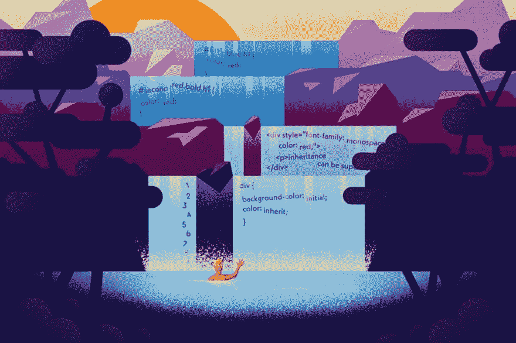

# CSS 如何工作:理解级联

> 原文：<https://dev.to/bnevilleoneill/how-css-works-understanding-the-cascade-3bag>

[T2】](https://res.cloudinary.com/practicaldev/image/fetch/s--mPOz7byZ--/c_limit%2Cf_auto%2Cfl_progressive%2Cq_auto%2Cw_880/https://cdn-images-1.medium.com/max/1024/1%2AdiR0Ma4Z8nsdH1Kvn53qbA.jpeg)

几周前，我开始了一个关于 CSS 基础的简短系列。如果你在前端 web 开发领域，CSS 是需要了解的基本知识之一。无论你是喜欢 CSS-in-JS 还是喜欢普通的 CSS，了解 CSS 如何工作对于编写高效、可伸缩的 CSS 是至关重要的。

本系列的第一篇文章深入探讨了浏览器如何将 CSS 渲染成像素。在这第二篇文章中，我们将深入探讨 CSS 语言的一个经常被误解的特性——层叠。

层叠是使用 CSS 所固有的——毕竟，它赋予了“层叠样式表”层叠的本质。cascade 可能是一个强大的工具，但是错误地使用它会导致脆弱的样式表，这在前端开发人员必须做出更改的任何时候都会给他们带来噩梦。在我们深入研究级联时，我们还将研究一些防止级联失控的方法。

### 定义级联

因为我们将讨论 CSS 级联如何工作的细节，所以我们保持一致会很有帮助。

下面是来自 [CSS 级联 4 级规范](https://www.w3.org/TR/css-cascade-4/#cascading)的定义。

> cascade 接受给定元素的给定属性的声明值的无序列表，按照声明的优先级对它们进行排序，并输出单个级联值。

CSS Cascade 是一种算法，浏览器通过它来决定将哪些 CSS 样式应用于某个元素——许多人喜欢将此视为“获胜”的样式。

为了更好地理解 CSS 级联，将 CSS 声明视为具有“属性”是有帮助的。这些属性可以是声明的不同部分，如选择器或 CSS 属性，也可以与 CSS 声明所在的*相关(如它的来源或在源代码中的位置)。*

CSS 级联获取这些属性中的一些，并给它们分配一个权重。如果一个 CSS 规则在更高的优先级胜出，那么这个规则将胜出。

但是，如果在给定的权重下有两个规则仍然冲突，算法将继续“向下级联”并检查较低优先级的属性，直到找到获胜的规则。

下面是 CSS 级联算法检查的属性，按照从*最高权重*到*最低权重*的顺序排列。

1.  起源和重要性
2.  选择器特异性
3.  出场顺序
4.  初始和继承属性(默认值)

不要担心，我们将深入研究每一个问题。

[T2】](https://logrocket.com/?cid=banner_b)

#### 来历&重要性

级联检查的最高加权属性是给定规则的*重要性*和*来源*的组合。

就 CSS 规则的起源而言，规则可以来自三个地方。

1.  *:这些是浏览器为元素提供的默认样式。这就是为什么输入在不同的浏览器上看起来会略有不同，这也是人们喜欢使用 CSS 重置来确保用户代理样式被覆盖的原因之一。*
**   ***用户*** :这些由浏览器的用户定义和控制。不是每个人都会有一个，但是当人们添加一个时，通常是为了覆盖样式&增加网站的可访问性。*   ***作者*** :这是 HTML 文档声明*的 CSS。当我们作为前端开发人员写东西时，这是我们能控制的唯一来源。**

 *CSS 声明的*重要性*由恰当命名的！重要的语法。添加中！重要的 CSS 规则自动跳转到级联算法的前面，这就是为什么它经常被劝阻。重写使用的样式！重要的只能用其他的规则来完成！重要的是，随着时间的推移，这可能会使您的 CSS 变得更加脆弱。很多人(包括我自己)都推荐你只用！重要的是当所有其他方法都失败时(例如使用第三方样式时)作为逃生出口。

级联算法在计算哪个声明胜出时，会考虑这两个属性的组合。每个组合都有一个权重(类似于 CSS 声明中各部分的权重)，权重最高的声明获胜。以下是浏览器考虑的原产地&重要性的各种组合，按从*最高权重*到*最低权重*的顺序排列。

1.  用户代理&！重要的
2.  用户&！重要的
3.  作者&！重要的
4.  CSS 动画、@关键帧(这是唯一的例外，它仍然来自于*作者、*，但是由于动画是临时的/短暂的，浏览器对它们的加权比普通作者规则稍高)
5.  作者，正常体重
6.  用户，正常体重
7.  用户代理，正常体重

当浏览器遇到两个(或更多)冲突的 CSS 声明，并且其中一个在起源和重要性级别上胜出时，CSS 级联会解决该规则。不问任何问题。游戏结束。

然而，如果冲突的声明具有相同的重要性/来源级别，级联将继续考虑*选择器的特异性。*

#### 选择器特异性

CSS 级联中的第二个权重是*选择器特异性。*在这一层，浏览器查看 CSS 声明中使用的*选择器*。

作为一名前端开发人员，您只能控制网站上的“作者”来源样式表——您无法改变规则的*来源*。然而，如果你远离使用！重要的是，在您的代码中，您会发现您在特殊性层对级联有很多控制。

类似于 origin 和 importance 的组合都有自己的权重，不同类型的 CSS 选择器被分配优先级。在评估特异性时，需要考虑选择器的数量及其优先级。CSS 选择器可以属于以下加权层之一。

1.  内嵌样式(样式标签内的任何内容)
2.  ID 选择器
3.  类/伪选择器
4.  类型选择器(例如 h1) &伪元素(::before)

如果有两个 CSS 声明具有相同数量的高优先级选择器，解析算法将考虑下一个特定级别的选择器数量。例如，如果这两个 CSS 规则都针对同一个元素，则颜色将是红色。这是因为它们都有一个 id 选择器，但是第二个规则有两个类选择器。

```
#first .blue h1 {
  color: red;
}

#second .red.bold h1 {
  color: red;
} 
```

许多人喜欢通过简单地*不依赖它*来管理特殊性。保持选择器特异性较低可以确保 CSS 规则保持灵活性。

根据我的经验，如果你默认只对你的定制样式使用类选择器，对你的默认样式使用元素选择器，当你真正需要的时候，用*方式*更容易覆盖样式。如果您的 CSS 声明具有非常高的选择器特异性，您会发现自己求助于！更重要的是，这可能会很快变得丑陋。

#### 来源顺序

CSS 级联算法的最后一个主要层是通过*源顺序*进行解析。当两个选择器具有相同的特异性时，源代码中最后出现的声明获胜。

因为 CSS 考虑级联中的源代码顺序，所以加载样式表的顺序实际上很重要。如果在 HTML 文档的头部链接了两个样式表，第二个样式表将覆盖第一个样式表中的规则。这也是为什么如果你使用 CSS 重置或者 CSS 框架，你会想在你的自定义样式之前加载那个*。*

#### 初始&继承的属性

虽然初始值和继承值并不是 CSS 级联的真正组成部分，但它们确实决定了如果没有针对元素的 CSS 声明会发生什么。通过这种方式，它们决定了元素的默认值。

继承的属性将从父元素向下渗透到子元素。例如，字体系列和颜色属性是继承的。CSS 级联的这一部分是大多数人看到“级联”这个词时想到的，因为样式会渗透到他们的孩子。

在下面的示例中

标签将用等宽字体&红色文本呈现，因为它的父节点包含这些样式。

```
<div style="font-family: monospace; color: red;">
  <p>inheritance can be super useful!</p>
</div> 
```

对于非继承属性，每个元素都有一组初始值，这些值是在 CSS 规范中为任何给定的规则定义的。例如，背景色属性的初始值是透明的。如果没有 CSS 声明为元素设置背景色的值，它将默认为透明。

此外，通过在 CSS 规则中使用 inherit 或 initial 关键字，可以明确选择在 CSS 声明中使用继承值或初始值。

```
div {
  background-color: initial;
  color: inherit;
} 
```

### 了解级联如何帮助我写出更好的 CSS？

由于 CSS 级联是 CSS 中最容易被误解的部分之一(通常是许多错误的来源)，了解它的工作原理将会给你保持样式表可维护性带来巨大的优势。

知道如何利用 CSS 选择器的特殊性是一项巨大的技能——我见过太多直接指向。重要的逃生出口，当一个更高的特异性选择器已经做到了这一点。如果您主要使用类选择器，那么当*需要*覆盖时，您可以通过嵌套选择器或添加另一个类来轻松做到这一点。

然而，随着对 CSS 级联的了解越来越多，责任也越来越大。级联的更具体的部分(比如！重要的是，内联样式、id 选择器)往往会导致将来很难更新或覆盖样式表。如果您使用的是使用内联样式的组件库或您无法控制的 CSS 库，那么它们确实很方便。

### Plug: [LogRocket](http://logrocket.com) ，一款适用于网络应用的 DVR

[T2】](http://logrocket.com)

LogRocket 是一个前端日志工具，可以让你回放问题，就像它们发生在你自己的浏览器中一样。LogRocket 不需要猜测错误发生的原因，也不需要向用户询问截图和日志转储，而是让您重放会话以快速了解哪里出错了。它可以与任何应用程序完美配合，不管是什么框架，并且有插件可以记录来自 Redux、Vuex 和@ngrx/store 的额外上下文。

除了记录 Redux 操作和状态，LogRocket 还记录控制台日志、JavaScript 错误、堆栈跟踪、带有头+正文的网络请求/响应、浏览器元数据和自定义日志。它还使用 DOM 来记录页面上的 HTML 和 CSS，甚至为最复杂的单页面应用程序重新创建像素级完美视频。

免费试用。

* * **