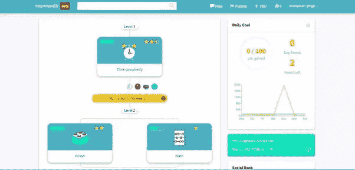
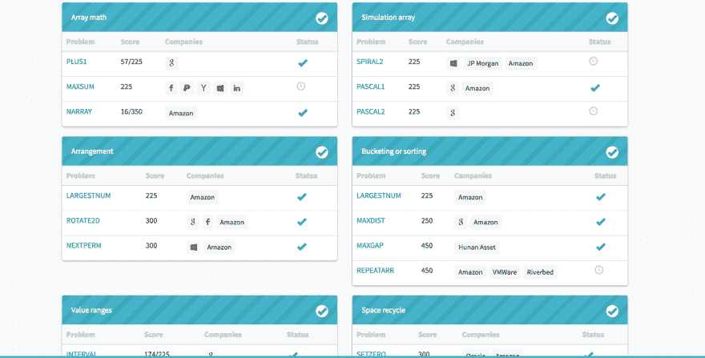
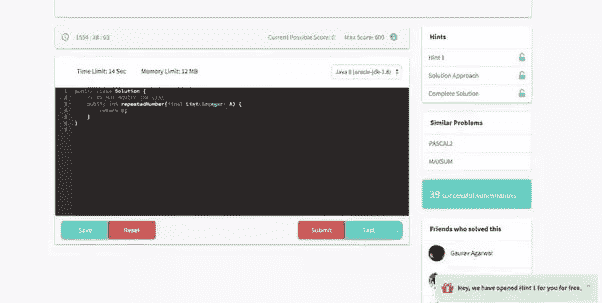

# 我如何在 6 个月内找到脸书或谷歌的工作？

> 原文：<https://dev.to/_anshuman26/how-do-i-get-a-job-at-facebook-or-google-in-6-months-3ifm>

*最初发表在 [Quora](https://www.quora.com/How-can-I-get-a-job-at-Facebook-or-Google-in-6-months-I-need-a-concise-work-plan-to-build-a-good-enough-skill-set-Should-I-join-some-other-start-up-or-build-my-own-projects-start-up-Should-I-just-focus-on-practicing-data-structures-and-algorithms/answer/Anshuman-Singh) 上，并在 [Forbes](https://www.forbes.com/sites/quora/2015/06/19/how-do-i-get-a-job-at-facebook-or-google-in-6-months/2/#4eb98ac23e8b) 上做了专题报道。*

## 典型的面试流程

1) **2 - 3 次电话面试**:电话面试的目的是在你飞往现场面试之前对你进行筛选。通常，面试集中在简单的算法问题上，要求你在 collabedit 这样的共享代码编辑器上写代码。面试还试图评估你是否有适应公司文化的危险信号。

2) **现场面试**:假设你在电话面试中表现出色，你将被飞机送到脸书(/谷歌)的校园进行现场面试。通常有 4 次面试:

面试 1 -2(编码):至少有几次面试关注你的算法技能(没什么太高级的)和你的编码准确性。

**面试 3(编码或系统设计)**:这个面试要看你的工作经验年限，以及你被考虑的职位。高级工程师(通常有 2 年以上的经验)将测试他们对大规模系统运行和架构设计的理解。

**面试 4(行为)**:这个面试试图评估你是否会成为一个适合公司文化的人。面试官试图得到以下问题的答案:

1.  你对公司正在做的事情有热情吗？
2.  你能和团队一起朝着一个目标努力吗？
3.  你以前的工作经验(主要是在你以前的工作中积极主动地做决定和提供反馈)

### 现在，来回答你关于如何准备以上面试流程的问题。

### 准备:

当谈到准备技术面试时，有很多内容分散的博客和网站，但我未能找到一个免费的网站来提供内容的结构。

考虑到这一点，我们致力于构建 [InterviewBit](https://www.interviewbit.com) ，我们相信它可以解决这个问题。**这是免费的**，它为你的面试准备提供了一种结构化的、引人入胜的方法，就像私人教练一样。

这里有谷歌面试问题和 T2 脸书面试问题的链接。

**逐个主题的方法:**

[T2】](https://res.cloudinary.com/practicaldev/image/fetch/s--dxRA1662--/c_limit%2Cf_auto%2Cfl_progressive%2Cq_auto%2Cw_880/https://thepracticaldev.s3.amazonaws.com/i/vyieqimmngyj6bml8xwr.jpg)

除非你理解了数组和列表是如何工作的，否则没有必要讨论散列和树相关的问题。

**分解成微观概念的主题:**

[T2】](https://res.cloudinary.com/practicaldev/image/fetch/s--V5_461Ke--/c_limit%2Cf_auto%2Cfl_progressive%2Cq_auto%2Cw_880/https://thepracticaldev.s3.amazonaws.com/i/st67kcts1qe3fikz7fda.png)

**模拟解决问题时的面试体验:**

[T2】](https://res.cloudinary.com/practicaldev/image/fetch/s--Ir8Vwjwi--/c_limit%2Cf_auto%2Cfl_progressive%2Cq_auto%2Cw_880/https://thepracticaldev.s3.amazonaws.com/i/xu8fyjxdtm0artl9b23i.jpg)

解决问题是由以下因素驱动的:

1.  *解决之前面试中提出的问题*
2.  *遇到困难时提供提示，如果仍然困难，还会有专家现场帮助*
3.  *计时器推动你在 40 分钟内解决问题(典型的面试时间)*
4.  *对失败案例的即时反馈*
5.  *测量时间复杂度，以便在您的解决方案不是最优的情况下建议您做得更好。*
6.  *编辑解决方法以防你被卡住。*

我们对内容进行了组织，因此如果您每天投入 1-2 个小时，您可以在 3 个月内完成课程。如果你有更高的承诺，你可以在一个月内完成课程。

声明:这些是我的个人观点，不代表脸书的任何观点。