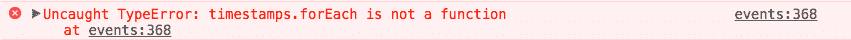

# 我如何使用？DOM 元素上的 forEach？

> 原文：<https://dev.to/jess/how-do-i-use-foreach-on-dom-elements-3m9h>

这个帖子的标题是我最初谷歌的。这是让我到达那里的原因:

我正在为 dev.to/events 的活动列表显示当地时间(还没有做公关)。为此，我为所有带有时间戳的元素添加了一个类，如下所示:

`<span class="utc-time"><%= event.starts_at %></span>`

我想获取页面上的所有时间戳，遍历它们，并更新它们的`innerHTML`以反映当地时间。当我需要循环东西时，我通常使用`for`语句，但是我决定尝试一下`.forEach`函数。

```
var timestamps = document.getElementsByClassName("utc-time");

timestamps.forEach(function(timestamp) {
      localTime = updateLocalTime(timestamps[i].innerHTML);
      timestamps[i].innerHTML = localTime;
    }); 
```

Enter fullscreen mode Exit fullscreen mode

我得到了这个错误:

[T2】](https://res.cloudinary.com/practicaldev/image/fetch/s--LuMAGF5T--/c_limit%2Cf_auto%2Cfl_progressive%2Cq_auto%2Cw_880/https://cl.ly/400n160P2g1M/download/Image%25202018-06-08%2520at%25203.17.28%2520PM.png)

最终，我意识到`timestamps`不是一个数组，它是一个*节点列表*，在 [mdn 文档](https://developer.mozilla.org/en-US/docs/Web/API/NodeList)的顶部，它清楚地声明:

> 虽然 NodeList 不是一个数组，但是可以使用`forEach()`对其进行迭代。也可以用`Array.from()`转换成数组。
> 
> 然而，一些老的浏览器还没有实现`NodeList.forEach()`和`Array.from()`。但是这些限制可以通过使用`Array.prototype.forEach()`来规避。

我可能应该在谷歌上搜索“如何遍历节点列表”来寻找细节。总之，我写了这个:

```
 Array.prototype.forEach.call(timestamps, function (timestamp) {
      localTime = updateLocalTime(timestamp.innerHTML);
      timestamp.innerHTML = localTime;
    }); 
```

Enter fullscreen mode Exit fullscreen mode

而且成功了！但是当我把它给 [@maestromac](https://dev.to/maestromac) 看的时候，他告诉我一个简单的`for`声明就可以了。可能会更安全一点。于是我又回到了我最熟悉的:

```
 for (var i = 0; i < timestamps.length; i++) {
      localTime = updateLocalTime(timestamps[i].innerHTML);
      timestamps[i].innerHTML = localTime
    } 
```

Enter fullscreen mode Exit fullscreen mode

至少我今天学到了一些关于节点列表的东西，_(ツ)_/