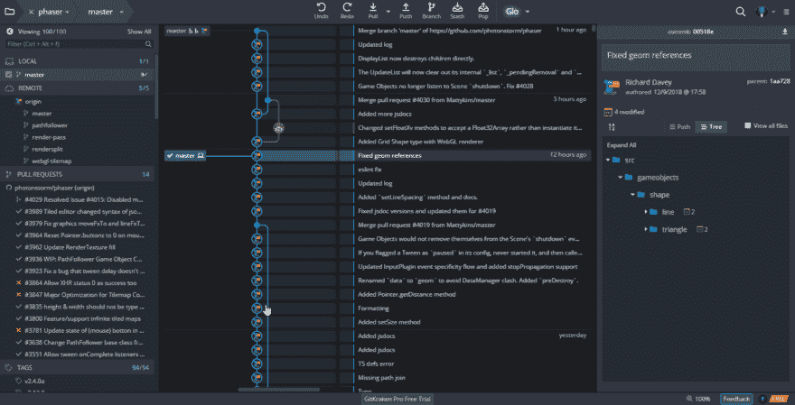

# 你如何为 GitHub 上的开源做出贡献？

> 原文：<https://dev.to/nazimboudeffa/how-do-you-contribute-to-opensource-on-github-25ae>

这是我的第三篇帖子，我想感谢大家在 dev.to 进行的激励性讨论

“[如何提交](https://dev.to/nazimboudeffa/how-do-you-commit-in-github--4h92)”对马来说是一个很棒的帖子，让我知道了 GitHub 中每个人是如何使用 git 的，所以现在是时候继续了

事实上，我喜欢讨论一些项目中的懈怠和不和谐，如 [phaserjs](http://phaser.io) 或 [atom](http://atom.io) ，正如我所发现的 [gitkraken](https://www.gitkraken.com/) 这是一个观察开发的机会，直到我找到一种方法来写一篇关于通用方法的文章，为 GitHub 上的开源做贡献

目前我能说的是，在 gitkraken 上观看提交真的很酷，因为我们对每次提交时发生的事情有一个总体的了解

## 就要分叉了，PR 不仅仅是克隆

在下图中，我刚刚从原点克隆到第二个驱动器中的一个文件夹，我刚刚调用了 GitHub，我没有接触代码，只是看着提交

为了做出贡献，我必须先派生和克隆 PR，在此之前，我必须玩一会儿代码，那么，你如何为 GitHub 上的开源做出贡献呢？

[T2】](https://res.cloudinary.com/practicaldev/image/fetch/s--2E4z0U7G--/c_limit%2Cf_auto%2Cfl_progressive%2Cq_66%2Cw_880/https://thepracticaldev.s3.amazonaws.com/i/prgmf35ydmy7lupmgd2r.gif)