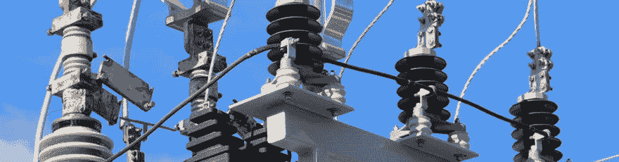

# 你如何说服客户去一个静态网站？

> 原文：<https://dev.to/starbist/how-do-you-convince-a-client-to-a-static-website-mbn>

[T2】](https://res.cloudinary.com/practicaldev/image/fetch/s--SKyQKdTD--/c_limit%2Cf_auto%2Cfl_progressive%2Cq_auto%2Cw_880/https://thepracticaldev.s3.amazonaws.com/i/vxnla37a3fcagam7q20i.jpg)

[JAMstack 很酷](https://jamstack.org/)。如果你还没有听说过[静态页面生成器](https://www.staticgen.com/)和[无头 CMS](https://headlesscms.org/) ，现在是时候了。

然而，如果你熟悉它，并且你知道如何使用它们，那么我需要你的意见和帮助。

你如何说服客户去一个静态网站？你最喜欢的球员有哪些？
你有什么诀窍或小技巧想分享吗？