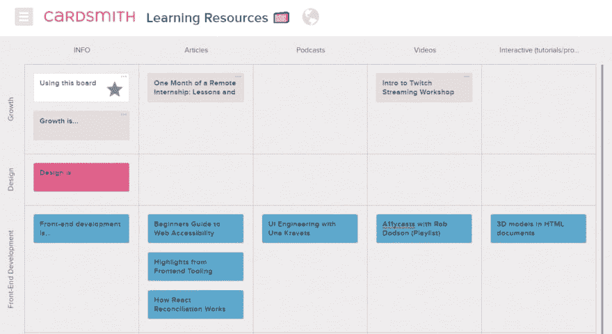

# 你是如何跟踪你找到的所有好资源的？

> 原文：<https://dev.to/superissarah/how-do-you-keep-track-of-all-the-great-resources-you-find-11oa>

## 我在尝试什么

今天早些时候，我打开了太多我想看的有趣东西的标签。这种事情发生得比我愿意承认的还要频繁。通常情况下，我会将所有这些伟大的资源加入书签，或者将它们的网址复制粘贴到某个我认为很快会再次浏览的地方，然后就把它们忘掉。但是今天我决定尝试一些不同的东西——我做了一个 Cardsmith 板来记录我想读/看/听的东西。(完全披露:我曾经在 Cardsmith 工作过。)

我的希望是，对所有事物有一个更直观和更有条理的视图，这将帮助我 1)不会被所有打开的标签和看似无尽的互联网所淹没，2)在消耗资源时更有意识，记录外卖或在有用的地方分享它们。

下面是我现在板的部分截图(也可以点击上面的链接查看):

## 你是干什么的？

所以，我很好奇！你如何存储和管理你遇到的所有链接和资源？链接到你以后想看的视频，或者你想看完的长文章...最终。

你使用书签管理器吗？GitHub 回购？特雷罗董事会？还有别的吗？如果你能分享它的链接或者截图，我会很高兴的！