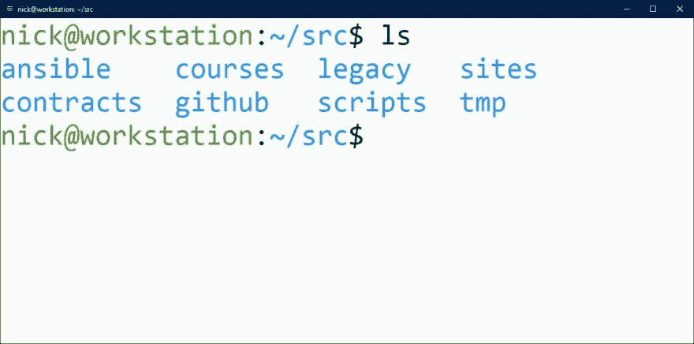

# 你如何在电脑上组织源代码？

> 原文：<https://dev.to/nickjj/how-do-you-organize-source-code-on-your-computer-i49>

我很好奇每个人是如何组织他们的源代码的。

让我们看看你设置的一些截图或终端转储。

以下是我在过去五六年里一直在做的事情:

[T2】](https://res.cloudinary.com/practicaldev/image/fetch/s--RAAWmsVk--/c_limit%2Cf_auto%2Cfl_progressive%2Cq_auto%2Cw_880/https://thepracticaldev.s3.amazonaws.com/i/tgirvfbdav5pbu13wlzt.jpg)

我喜欢按照用途而不是语言来组织我的代码。

我已经做了 20 年的自由开发人员，这些文件夹里有数百个项目，从 20 世纪 90 年代中期的 Visual Basic 6 到最近用 Flask、Rails 和 Phoenix 编写的项目。