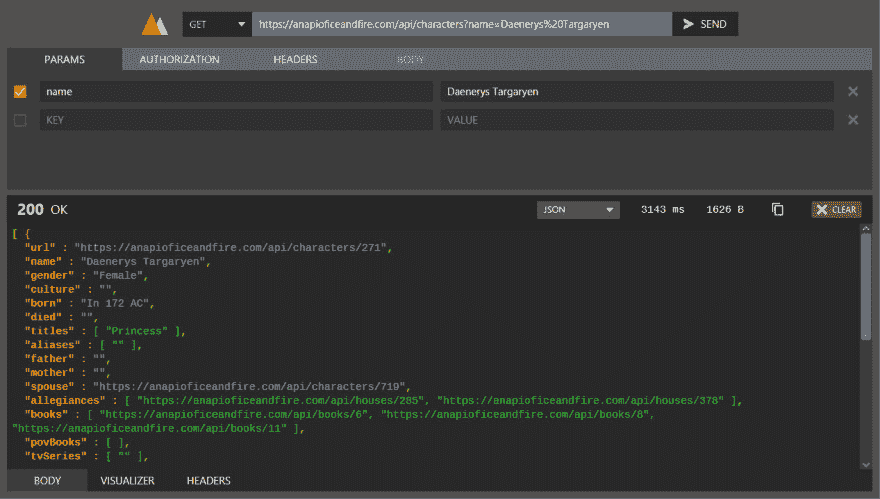
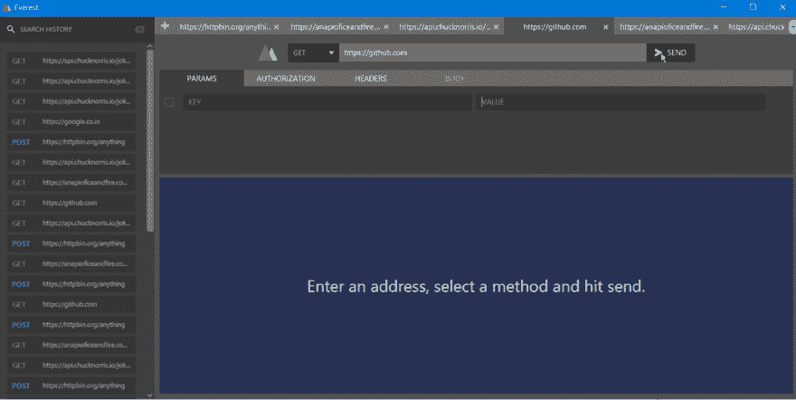
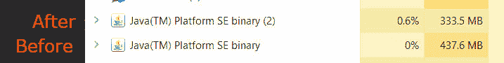
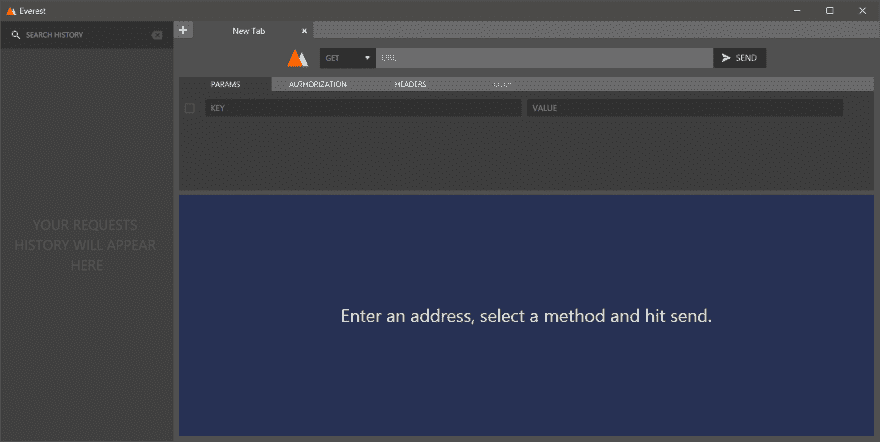

# 珠穆朗玛如何编排伪标签切换

> 原文：<https://dev.to/rohit/how-everest-orchestrates-pseudo-tab-switching-49gp>

Everest 是我今年一直在做的 REST API 测试客户端。它是用 JavaFX 编写的，目标是成为一个更轻便、开源的替代物，取代基于电子的选择，比如 T2 邮递员 T3。今年 5 月，当我发布第一个 alpha 版本时，它占据了 GitHub Java Trending 的第二名位置长达一周。今天，我将讨论一种内存优化技术，这是我在最新的 alpha 版本中实现的。

我称之为*伪标签切换*。为什么？因为我是一名工程师，我们喜欢给简单的东西起个好听的名字。

这篇文章技术性很强，有些东西是以某种方式完成的，因为 JavaFX 要求这样做。然而，这个概念本身是与框架/语言无关的，您可以将它与任何其他技术栈一起使用，并更好地利用您的资源。

开始前声明:我是一名学生。我还在上大学，没有专业经验。我确实凭空想出了这些想法，并付诸实施，因为它们听起来很有希望。如果您是一名经验丰富的开发人员，您可能会发现这相当简单和明显。尽管如此，这无疑是我在珠穆朗玛峰实现的最复杂的事情，我很高兴与你分享。欢迎任何反馈！

# 问题

[T2】](https://res.cloudinary.com/practicaldev/image/fetch/s--yesml63y--/c_limit%2Cf_auto%2Cfl_progressive%2Cq_auto%2Cw_880/https://thepracticaldev.s3.amazonaws.com/i/h856ldo18013tjzyaeap.jpg)

这是珠穆朗玛峰的仪表板。您可以撰写和发送请求，还可以在其中查看他们的响应。您可以在不同的标签中打开多个文件。

在伪标签切换之前*(让我们称之为 PTS，好吗？)*，你在珠峰打开的每一个新标签，都会创建一个新的仪表盘。这包括视图和控制器。仅仅几个标签就能让内存使用量超过 400MB。
这对我来说真是令人沮丧和泄气。有一次，我甚至想把标签都去掉，但这意味着我要向笔记本电脑里的几个电子妥协，这样你就不会读到这篇文章了。

# 突然灵机一动

大约两个月前，在一次大学演讲中，当我在我大脑的一个独立线程上做梦时，我有了一个想法:

> 如果我只加载*一个*仪表板，并在用户每次切换到不同的选项卡时更改其中的内容，会怎么样？

有道理对吗？所有选项卡都显示相同的属性(API 端点、HTTP 方法、状态代码等等)，只是值不同。

这给人一种在选项卡之间切换的错觉，但实际上你只是在仪表板的*状态*之间切换。这不仅需要更少的内存，而且有助于更好地重用已分配的内存。这就是这个名字的由来！

听起来很简单，是吧？

> “你为什么要写一篇关于这个的文章，Rohit？我的猫在睡觉时也能这样做。”你会说。

[T2】](https://i.giphy.com/media/o0vwzuFwCGAFO/giphy.gif)

你有一只聪明的猫。玩笑归玩笑，实现这个逻辑并不是一帆风顺的，我遇到了一些我没有预料到的设计问题，但最终得到了一些我非常满意和自豪的解决方案。

# 挑战

因此，我几乎无法抑制自己的兴奋，我放弃了当天剩下的课程，回到家，启动 IntelliJ IDEA 来实现我的想法。(一语双关)

我写了一个新的`DashboardState`类，它包含所有 UI 元素的值，比如 URL、参数、HTTP 方法等等。Everest 已经有了一个处理跳转逻辑的`HomeWindowController`类。在 PTS 之前，每当打开一个新标签时，HWC 只需创建一个新的仪表板，并将其设置为新标签的内容。

但是因为我们已经决定使用一个单一的仪表板并在它的状态之间切换，我在`DashboardController`中写了一个新方法叫做`setState(DashboardState state)`。现在，每次打开一个新选项卡时，我都会创建一个新的空白 DashboardState 对象，并使用此方法将其设置为仪表板的状态。HWC 还拥有一个`HashMap`来记录哪个州属于哪个标签。

我还在`DashboardController`中写了一个漂亮的小`reset()`方法，它清除了前一个标签状态的仪表板。

现在，我们可以在仪表板中正确显示状态了。但是当你从标签 A 切换到标签 B，再回到 A，我们怎么再显示 A 呢？这是我很晚才意识到的事情。在从 A 切换到 B 之前，我们需要在前面提到的映射中存储 A 的状态。

所以我在`DashboardController`中写了另一个 getState()方法，它返回仪表板的当前状态，然后可以保存。简单地说，当用户切换回选项卡 A 时，HWC 从地图中找到它所在的州，然后使用`setState()`将其应用到仪表板，从而完成切换。

到目前为止一切顺利。但是当 Rohit 在他的伪标签交换荣耀中欢欣鼓舞的时候，一个大怪物潜伏在旁边..

# 怪物

在讨论大问题之前，我们需要了解 Everest 是如何处理 HTTP 请求的。这些请求显然需要在后台线程上发出。但珠穆朗玛峰还需要显示一个很好的加载动画，而请求正在进行。为了实现这一点，我使用了 JavaFX 优秀的`Service` API。它不仅允许我在后台线程上发出 HTTP 请求，还为我提供了并发更新 UI 的方法。这些包括`setOnRunning()`、`setOnSucceeded()`和`setOnFailed()`，它们接受更新用户界面的**和**。

Everest 使用`setOnRunning()`来触发仪表板的加载动画，`setOnSucceeded()`来显示响应(状态代码、主体、经过的时间等等)，使用`setOnFailed()`来显示错误消息。我在这里想要确定的是这些 lambdas 作用于仪表板。

但是，如果用户在选项卡 A 中发起请求并切换到选项卡 B **，而**请求仍在仪表板上运行，`setOnSucceeded()`将在选项卡 B 被选中时显示选项卡 A 的结果。

兰姆达斯，不知何故，需要删除标签开关。但是，我们还需要保持请求的运行，因为如果它被终止甚至中止，多跳转的效用就不复存在了。

这是我想到的一个优雅的解决方案，我对此非常自豪。

# 击败怪物

还记得`DashboardController`中 getState()方法吗？我在其中添加了一个简单的检查来查看仪表板当前在做什么。如果一个请求正在运行，它将获取那个服务对象，并把它交给`DashboardState`。

现在聪明的一点来了:DS 淘汰了修改仪表板的 lambdas，并添加了自己的 lambdas 来修改自己的成员！

例如，如果`DashboardController`的用于`setOnSucceeded()`的 lambda 通过修改屏幕上标签的文本值来显示响应的状态代码，那么相应的由`DashboardState`设置的 lambda 将修改其自身的`statusCode`属性。

[T2】](https://res.cloudinary.com/practicaldev/image/fetch/s--0l3WF3Mq--/c_limit%2Cf_auto%2Cfl_progressive%2Cq_66%2Cw_880/https://thepracticaldev.s3.amazonaws.com/i/89d3h2mhggdqvq96xdsu.gif)

现在，当用户切换回选项卡 A 时，A 的状态将被应用到仪表板，仪表板又将被 DashboardState 设置的 lambdas 更新！

TLDR？PTS 允许您在选项卡之间切换，即使您有请求在一个或多个选项卡中运行。

# 收获💪

 
这个比较是在 Alpha 1.2 *(不带 PTS)* 和即将发布的 Alpha 1.4 *(带 PTS)* 之间进行的，每个实例都有 7 个标签。随着选项卡的增多，差异会变得更大，因为 v1.4 只需创建另一个`DashboardState`实例，而不是像 v1.2 那样创建一个完整的仪表板。

这里和那里仍有微小改进的余地，一旦我们达到一个功能锁定，这将在今年年底或明年年初发生。

# 总结一下

归结起来就是这个简单的算法:

*   保存仪表板的状态
*   重置仪表板
*   如果正在打开一个新选项卡，请创建一个空白的新 DashboardState，然后将其应用到仪表板
*   如果切换回现有选项卡，从地图中获取其状态，并将其应用到仪表板

下面是伪制表符切换的正式定义:

> 如果您有多个包含一个公共 UI 元素的 UI 元素，那么不要创建后者的多个实例，只创建一个并通过在状态之间切换在前者的多个实例之间共享它。

# “好了，现在闭嘴罗希特！”

是的，我听到了！这是一篇很长的帖子，有一大堆术语。我本来要宣布一些事情，并问几个问题，但还是留到下次吧。

在 GitHub 上查看珠穆朗玛峰，试用 Alpha 1.3。让你的开发者朋友了解一下。请继续关注未来的更新，因为我们将在明年年初发布一个稳定的版本。

##  [ RohitAwate ](https://github.com/RohitAwate) / [珠穆朗玛峰](https://github.com/RohitAwate/Everest)

### 一个漂亮的跨平台 REST 客户端。

<article class="markdown-body entry-content p-5" itemprop="text">

[T2】](https://user-images.githubusercontent.com/23148259/39124644-c886b47a-4719-11e8-953c-f079b3edb664.png)

Everest *(原餐厅)*是一个即将推出的 REST API 测试客户端，用 JavaFX 编写。

 *珠穆朗玛运行在 Windows 10 上。*

# 为什么是珠峰？

*   珠穆朗玛峰是用 Java 写的。因此，它比像“T2 邮递员”这样的基于电子的替代品更节省资源，反应更灵敏。它的目标是在一个更轻、更自然但同样简洁的包中提供相同水平的功能。

*   审美很重要。凭借华丽、扁平的设计，珠穆朗玛峰是一种观赏和工作的乐趣。这也完全是主题- *能干*。

    > 我要你想用它！

*   作为一个 Java 应用，Everest 天生就是**跨平台**。它可以在任何有 JVM 的地方运行。

*   珠穆朗玛峰将为您的项目提供云同步，由 [Summit](https://github.com/RohitAwate/Summit) 提供支持。它将在明年年初作为云服务推出，或者你也可以选择自己托管它。

# 实况特写<g-emoji class="g-emoji" alias="fire" fallback-src="https://github.githubassets.cimg/icons/emoji/unicode/1f525.png">🔥</g-emoji>

#### 所有最常见的

…</article>

[View on GitHub](https://github.com/RohitAwate/Everest)

我希望你能在这里找到有价值的东西。即使你在做前端 web 开发或原生移动应用程序开发，PTS 也会很有用。

感谢您阅读本文！如果你有建议、问题或其他什么想说的，请留下评论。

现在，您可以按 Alt + Tab 键返回到文本编辑器。
*再见！*:)