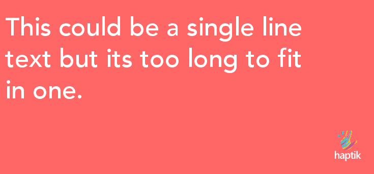
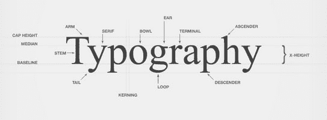
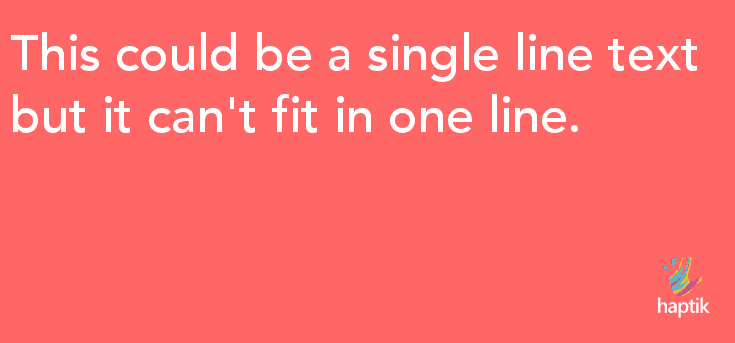

# Haptik 如何使用 Python 动态生成图像——第 2 部分

> 原文：<https://dev.to/vinayjn/how-haptik-generates-images-on-the-fly-with-python---part-2-2fo9>

在本系列的第一篇文章中，我通过在图像上添加问候文本向您介绍了 Python 中文本绘制的基础知识。我还强调了我如何进一步扩展这一功能以在工作中创建一些复杂图像的例子。如果你还没有读过本系列的第一部分(Haptik 如何使用 Python 动态生成图像)，我建议你先看一下，以便更好地理解这篇文章。

现在，我们知道了如何绘制文本、改变字体以及在图像上放置文本。在这篇文章中，我们将发现如何绘制多行文本，并讨论这样做的挑战。

## Multiline Text

通常，在生成图像时，我们会遇到文本不适合单行的情况。Python Pillow 在这里没有帮助，因为它不会自动绘制文本并将其推到新的一行。为了手动完成这项工作，我们需要计算文本的宽度和高度。

通过文本宽度，我们可以确定何时需要移动到下一行，通过文本高度，我们可以计算出两行之间应该留出多少空间:

[T2】](https://res.cloudinary.com/practicaldev/image/fetch/s--UtvXwZI0--/c_limit%2Cf_auto%2Cfl_progressive%2Cq_auto%2Cw_880/https://thepracticaldev.s3.amazonaws.com/i/gwm1pjbds9gmu6bvv7vp.png)

这个想法是将长句分成多个短句，并在正确的位置上一个接一个地画出每一个短句，从而使它看起来像一个多行文本。为了拆分一个较长的行，我们将使用 Pillow 函数来计算传递给它的文本的大小，作为参数之一。

### 计算文字宽度

为了方便起见，我创建了一个方法`text_wrap()`来解释行分割逻辑:

```
from PIL import Image
from PIL import ImageFont
from PIL import ImageDraw

def text_wrap(text, font, max_width):
    lines = []
    # If the width of the text is smaller than image width
    # we don't need to split it, just add it to the lines array
    # and return
    if font.getsize(text)[0] <= max_width:
        lines.append(text) 
    else:
        # split the line by spaces to get words
        words = text.split(' ')  
        i = 0
        # append every word to a line while its width is shorter than image width
        while i < len(words):
            line = ''         
            while i < len(words) and font.getsize(line + words[i])[0] <= max_width:                
                line = line + words[i] + " "
                i += 1
            if not line:
                line = words[i]
                i += 1
            # when the line gets longer than the max width do not append the word, 
            # add the line to the lines array
            lines.append(line)    
    return lines

def draw_text(text):    
    # open the background file
    img = Image.open('background.png')

    # size() returns a tuple of (width, height) 
    image_size = img.size 

    # create the ImageFont instance
    font_file_path = 'fonts/Avenir-Medium.ttf'
    font = ImageFont.truetype(font_file_path, size=50, encoding="unic")

    # get shorter lines
    lines = text_wrap(text, font, image_size[0])
    print lines # ['This could be a single line text ', 'but its too long to fit in one. '] 

if __name__ == __main__:
    draw_text("This could be a single line text but its too long to fit in one.") 
```

Enter fullscreen mode Exit fullscreen mode

该函数需要三个参数——要绘制的**文本**、一个 [ImageFont](http://pillow.readthedocs.io/en/3.1.x/reference/ImageFont.html#PIL.ImageFont.truetype) 类实例和要绘制文本的背景图像的**宽度**。

逻辑非常简单:

*   检查，如果句子可以放在一行中，则不要拆分，直接返回，否则:
*   用空格分割句子以提取其中的单词
*   当宽度小于图像宽度时，通过添加文字来创建较短的行

当我们运行这个脚本时，它会返回一个数组，其中包含适合背景图像宽度的两条较短的线。

为了在图像上画出这些线，我们必须计算每条线的正确垂直位置。

### 计算文字高度

每当我们写文字时，两行之间有相等的间距。例如在这篇文章中，每行之间都有固定的间距。在构建这个库的时候，我遇到了大部分输入文本的空间变化的问题:

```
text = "This could be a single line text but it can't fit in one line."
lines = text_wrap(lines, font)

for line in lines:
    print font.getsize(line)[1]

# Output
# 62
# 51 
```

Enter fullscreen mode Exit fullscreen mode

为绘制在**基线**下方的 **g、j、p、q、y** 和绘制在**中线**上方的 **b、d、f、h、k、l** 等字符找到正确的高度有点繁琐，因为高度不一。

[T2】](https://res.cloudinary.com/practicaldev/image/fetch/s--f41CDiLW--/c_limit%2Cf_auto%2Cfl_progressive%2Cq_auto%2Cw_880/https://thepracticaldev.s3.amazonaws.com/i/mnxe4qlkig4fom2m76mq.png)

获得文本正确高度的最佳方法是简单地计算出**“Hg”的总高度。**这一招很管用，因为 **h** 和 **g** 覆盖了所有英文字符的高度范围。

对于英语以外的语言，您可能需要使用不同的字符来代替 **h** & **g** 。

```
 text = "This could be a single line text but it can't fit in one line."
lines = text_wrap(lines, font)

line_height = font.get_size('hg')[1]
print line_height

# Output
# 62 
```

Enter fullscreen mode Exit fullscreen mode

因为我们有了换行/短线和文本高度，所以我们可以在图像上绘制它们。我们可以通过保持对先前绘制的线的垂直位置的参考，然后加上线的高度来计算新线的垂直位置:

```
 text = "This could be a single line text but its too long to fit in one."
lines = text_wrap(text, font, image_size[0])
line_height = font.getsize('hg')[1]

x = 10
y = 20
for line in lines:
    # draw the line on the image
    draw.text((x, y), line, fill=color, font=font)

    # update the y position so that we can use it for next line
    y = y + line_height
# save the image img.save('word2.png', optimize=True) 
```

Enter fullscreen mode Exit fullscreen mode

这将输出如下图像:

[T2】](https://res.cloudinary.com/practicaldev/image/fetch/s--U3qUo7eN--/c_limit%2Cf_auto%2Cfl_progressive%2Cq_auto%2Cw_880/https://thepracticaldev.s3.amazonaws.com/i/8w788euxu3pcw8arsfxq.png)

后一种图像中的文本看起来更好，可读性更强。在 [Haptik](https://haptik.ai) ，我们相信实验和找出解决问题的最佳方法。上面就是这样一个例子。在我的下一篇博文中，我将会写关于如何使用 Python 来居中**水平和垂直**对齐图像中的文本。

觉得我做得不错吗？请在下面的评论中告诉我。

这篇文章最初写在 Haptik 科技博客上。