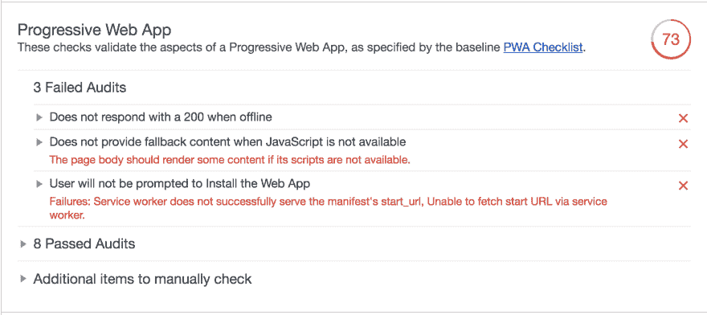

# 部署渐进式网络应用程序时，隐藏文件会如何影响你

> 原文：<https://dev.to/adrienshen/how-hidden-files-can-screw-you-over-when-deploying-progressive-web-apps-oc>

macOS 上的 **DS_Store** 之类的隐藏文件，如果不注意的话，真的会让你的生活苦不堪言，在部署过程中产生奇怪的异常。请继续阅读，了解我是如何浪费 1 个小时试图找出为什么我的 progressive web 应用程序上的服务人员不能正常工作的。

## 背景

我最近一直在频繁地开发渐进式网络应用程序，我通常会用生成器启动一个快速 PWA，比如 **create-react-app** ，或者在这种情况下使用 **preact-cli** 。这些生成器有一个优势，即所有的硬服务工作人员配置已经为我完成，我只需要专注于构建应用程序逻辑，而起点已经为浏览器性能进行了高度优化。如果我们不小心的话，我们会明白为什么这并不总是积极的。

## 什么是隐藏文件

这些是**之类的文件。macOS 上的 DS_Store** 或者 Windows 上的 **Thumbs.db** 。**。DS_Store** 存储了目录属性，比如图标的位置或者文件夹的背景图像，对于大多数开发人员来说，这是一个非常无用的文件，甚至会引起注意，当它在部署过程中给我们带来问题时，它会变得更加危险。

## 服务工作者缓存

在 **preact-cli** 启动的 PWA 中，服务人员将使用浏览器缓存 API 积极缓存所有资产和资源，以加快加载速度。这是自动化构建过程的一部分。Preact 正在使用这里的 **sw-precache** 库来为我们完成大部分繁重的工作。自动生成的文件数组如下:

```
var precacheConfig = [
        ["/app/index.html", "fa243faa5a7ba7dd91c2241a62010a67"],
        ["/app/not-exist/index.html", "14e3d8a57e9e195437405c1631413240"],
        ["/app/pnr/index.html", "741939de6641dfeb520d8f3bf8288192"],
        ["/app/schedule/index.html", "330df6ceb7147e93a2e3e6daec6acb72"],
        ["/app/static/about/index.html", "4accf5ab4d635725099660c1ec9b09fd"],
        ["/app/static/contact/index.html", "a4a1b570fdb015996fa4d9d52bf38733"],
        ["/app/status/index.html", "9a8ed5b95b2d6dbf4a637e084dedc99c"],
        // more files... 
```

`.html`是 preact-cli 生成的预渲染文件，它将自动缓存，以便我们尽可能快地进行首次加载。

## 缓存出错时

因此，在这个特定的渐进式 web 应用程序中，我们一直在部署和注册服务人员，直到我在凌晨 4 点收到我的客户发来的几封电子邮件，称某些功能(如“添加到主屏幕”)被破坏，所有页面都很慢。

我做的第一件事是打开 web 应用程序，使用 Chrome Lighthouse 审计工具快速找出性能和服务人员的潜在问题。这是我看到的。

[T2】](https://res.cloudinary.com/practicaldev/image/fetch/s--GTMDGg37--/c_limit%2Cf_auto%2Cfl_progressive%2Cq_auto%2Cw_880/https://thepracticaldev.s3.amazonaws.com/i/gr49z0q3ers2yt5ywl2i.png)

哎哟，64 分的 PWA，这可不好，因为我记得我答应过客户至少 85 分。所以上一次部署明显有问题。让我们再向下滚动一点，看看:

[T2】](https://res.cloudinary.com/practicaldev/image/fetch/s--2ovntsGX--/c_limit%2Cf_auto%2Cfl_progressive%2Cq_auto%2Cw_880/https://thepracticaldev.s3.amazonaws.com/i/j94l7ybtcqyvnzc1wclx.png)

这就是问题所在。服务工作器安装不正确，因此它的所有优点都不会在应用程序中发挥作用。服务人员一定是在安装过程中遇到了某种错误。下一步是查看应用程序选项卡，了解服务人员的情况。看起来我们这里也有一个错误日志。

看起来有一个错误，没有找到 DS_Store 隐藏文件。让我们看看完整的 **sw.js** 文件，美化一下 javascript，看看发生了什么。

[T2】](https://res.cloudinary.com/practicaldev/image/fetch/s--jvv0mUD4--/c_limit%2Cf_auto%2Cfl_progressive%2Cq_auto%2Cw_880/https://thepracticaldev.s3.amazonaws.com/i/5keii8dvgvv7b10zhxkt.png)

似乎构建过程错误地认为该文件应该被缓存，因此包含在浏览器要缓存的文件列表中。那么，问题是什么呢？嗯，在部署过程中，我们理所当然地忽略了所有隐藏的文件，比如这个 **firebase.json** 在这里指出的:

```
 "hosting": {
    "public": "build",
    "ignore": [
      "firebase.json",
      "**/.*",
      "**/node_modules/**"
    ], 
```

所以**。将找不到 DS_Store** 文件，因此将导致服务人员无法正确安装，并使我们所有的性能优化变得无用。

这个问题的解决方案是删除隐藏文件，重新构建并重新部署应用程序。现在服务人员安装得很好。我可能会创建一个 shell 脚本，在运行构建之前检查令人讨厌的隐藏文件的存在，作为进一步确定我是否真的想确保这种情况不会再次发生的步骤。

## 结论

这让我措手不及，因为我已经部署这个应用程序几次了，没有任何问题。一个解决方案是[禁用 macOS 上 **DS_Store** 文件的自动创建](https://www.techrepublic.com/article/how-to-disable-the-creation-of-dsstore-files-for-mac-users-folders/)。

我希望阅读这篇文章能减轻你们中一些人潜在的挫折感，或者至少节省一些发现问题的时间。如果你想出了什么好的解决方案或者在工作中遇到了类似的问题，请告诉我。