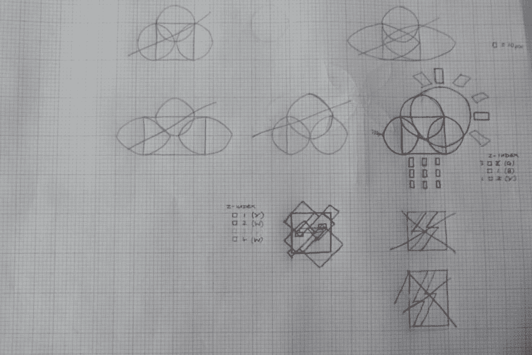

# 我如何着手一个创造性的编码项目

> 原文：<https://dev.to/dominicduffin1/how-i-approach-a-creative-coding-project-1hbj>

在这篇文章中，我的目的是展示我是如何进行创造性编码项目的，以我对本月创造性编码俱乐部主题(Spring into Action)的贡献为例。

在编写任何代码之前，我发现在一张绘图纸上勾画出我想要做的事情很有帮助。把草图放在我面前，可以让我更容易决定写什么样的代码。我使用正方形、长方形、圆形和椭圆形绘制草图，根据需要调整角度，这是我将编码的形状(我可以使用其他形状，但我喜欢保持简单，我还没有发现这四种不够)。我通过各种方式组合形状来创造更复杂的形状。我通常用铅笔画出形状，然后用彩色笔突出显示每一层，每种颜色对应一个 z 索引和背景色。哦，我经常划掉一些东西，然后重新开始，因为它不会以我想要的方式结束，正如你从下面的图片中看到的:

[T2】](https://res.cloudinary.com/practicaldev/image/fetch/s--0GzzaUhl--/c_limit%2Cf_auto%2Cfl_progressive%2Cq_auto%2Cw_880/https://thepracticaldev.s3.amazonaws.com/i/c8fu30j9mhpmew284f6a.JPG)

现在我有了满意的云、太阳、雨和闪电的草图，我准备写一些代码了。从草图中我可以看到我需要写的大部分内容。图纸上的每个方块等于屏幕上的一组像素，这次我选择了 10 个像素，但我会根据项目的不同而有所不同。颜色编码突出显示告诉我每个元素应该有什么 z 索引。我使用 CSS 边界半径创建弯曲的元素，使用 CSS 变换创建有角度的元素。一旦编码后看起来不合适，我不怕偏离草图，这次我在编码时改编了闪电草图。

HTML 代码只是一长串 div(语义元素在这类项目中用处不大)。

```
<div class="cloudRectangle"></div>
<div class="cloudCircle" id="leftCloudCircle"></div>
<div class="cloudCircle" id="topCloudCircle"></div>
<div class="cloudCircle" id="rightCloudCircle"></div>
<div class="sunCentre"></div>
<div class="sunRay" id="sunRayNorthNorthWest"></div>
<div class="sunRay" id="sunRayNorth"></div>
<div class="sunRay" id="sunRayNorthNorthEast"></div>
<div class="sunRay" id="sunRayEastNorthEast"></div>
<div class="sunRay" id="sunRayEast"></div>
<div class="sunRay" id="sunRayEastSouthEast"></div>
<div class="rain" id="rainTopLeft"></div>
<div class="rain" id="rainTopCentre"></div>
<div class="rain" id="rainTopRight"></div>
<div class="rain" id="rainMiddleLeft"></div>
<div class="rain" id="rainMiddleCentre"></div>
<div class="rain" id="rainMiddleRight"></div>
<div class="rain" id="rainBottomLeft"></div>
<div class="rain" id="rainBottomCentre"></div>
<div class="rain" id="rainBottomRight"></div>
<div class="lightningYellow" id="lightningYellowMain"></div>
<div class="lightningBodyColour" id="lightningBodyColourNorthWest"></div>
<div class="lightningBodyColour" id="lightningBodyColourNorthEast"></div>
<div class="lightningBodyColour" id="lightningBodyColourSouthWest"></div>
<div class="lightningBodyColour" id="lightningBodyColourSouthEast"></div>
<div class="lightningYellow" id="lightningYellowTopStrip"></div>
<div class="lightningYellow" id="lightningYellowMiddleStrip"></div>
<div class="lightningYellow" id="lightningYellowBottomStrip"></div>
<div class="lightningBodyColour" id="lightningBodyColourLeftMiniRectangle"></div>
<div class="lightningBodyColour" id="lightningBodyColourRightMiniRectangle"></div>
<div class="lightningBodyColour" id="lightningBodyColourLeftMiniSquare"></div>
<div class="lightningBodyColour" id="lightningBodyColourRightMiniSquare"></div>

<div class="ground"></div>

<div class="flowerStem" id="flower1Stem"></div>
<div class="flowerPetalNorthWest" id="flower1PetalNorthWest"></div>
<div class="flowerPetalNorthEast" id="flower1PetalNorthEast"></div>
<div class="flowerPetalSouthWest" id="flower1PetalSouthWest"></div>
<div class="flowerPetalSouthEast" id="flower1PetalSouthEast"></div>
<div class="flowerYellowCentre" id="flower1YellowCentre"></div>
<div class="flowerOrangeCentre" id="flower1OrangeCentre"></div>

<div class="flowerStem" id="flower2Stem"></div>
<div class="flowerPetalNorthWest" id="flower2PetalNorthWest"></div>
<div class="flowerPetalNorthEast" id="flower2PetalNorthEast"></div>
<div class="flowerPetalSouthWest" id="flower2PetalSouthWest"></div>
<div class="flowerPetalSouthEast" id="flower2PetalSouthEast"></div>
<div class="flowerYellowCentre" id="flower2YellowCentre"></div>
<div class="flowerOrangeCentre" id="flower2OrangeCentre"></div> 
```

Enter fullscreen mode Exit fullscreen mode

我使用描述性的 id 和类名，这样我可以很容易地看到代码的每一部分是干什么的。我经常需要决定如何分配 id 和类。例如，我可以选择对云的所有部分使用一个类，或者对较大的圆和较小的圆使用不同的类。

CSS 比 HTML 有更多的行。首先，我只是为基本的视觉效果写 CSS。稍后我会为动画添加更多的代码。我不会在这里展示整个 CSS，但是这里有一个关于云的例子:

```
.cloudRectangle {
  position: absolute;
  background-color: #cccccc;
  width: 120px;
  height: 100px;
  left: 750px;
  top: 150px;
  z-index: 3;
}

.cloudCircle {
  position: absolute;
  background-color: #cccccc;
  border-radius: 50%;
  z-index: 3;
}

#leftCloudCircle {
  width: 100px;
  height: 100px;
  left: 700px;
  top: 150px;
}

#topCloudCircle {
  width: 120px;
  height: 120px;
  left: 750px;
  top: 90px;
}

#rightCloudCircle {
  width: 100px;
  height: 100px;
  left: 820px;
  top: 150px;
} 
```

Enter fullscreen mode Exit fullscreen mode

现在我已经得到了基本的视觉效果，是时候开始编码动画了。在这个项目中，我使用 CSS 关键帧动画，所以我将动画属性添加到我想要动画的元素的 CSS 中，并使用 keyframes @ rule 指定动画。和以前一样，我只给你看一点动画代码，这次是天空:

```
@keyframes skyAnimation {
  25% {
    background-color: #aaccff;
  }
  50% {
    background-color: #ffffff;
  }
  75% {
    background-color: #dddddd;
  }
} 
```

Enter fullscreen mode Exit fullscreen mode

天空实际上是页面背景，所以动画属性需要添加到 body:

```
body {
  background-color: #ffffff;
  animation: skyAnimation 60s infinite;
} 
```

Enter fullscreen mode Exit fullscreen mode

现在，我已经得到了令人满意的动画工作，该项目是完整的！

您可以在 CodePen 上查看完整的代码和完成的项目:

[https://codepen.io/dominicduffin1/embed/NzGxoW?height=600&default-tab=result&embed-version=2](https://codepen.io/dominicduffin1/embed/NzGxoW?height=600&default-tab=result&embed-version=2)