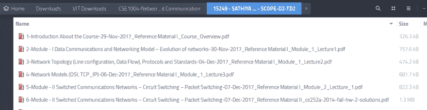

# 我如何用 Python 自动化枯燥的大学课程

> 原文：<https://dev.to/presto412/how-i-automated-the-boring-university-stuff-with-python-5gib>

你好，
我是来自印度的计算机系二年级本科生。我喜欢 Python。这是我在 dev.to 社区的第一篇文章。所以让我们开始吧！

我的大学有一个通用的学生登录界面，学生可以在这里查看他们的个人资料、上传作业、获取截止日期、下载课程材料等等。
[](https://res.cloudinary.com/practicaldev/image/fetch/s--rG8xx9Rd--/c_limit%2Cf_auto%2Cfl_progressive%2Cq_auto%2Cw_880/https://thepracticaldev.s3.amazonaws.com/i/ukbcjpamlvf2yisehe8h.png) 
但是浏览这个网站有点乏味，因此我决定用 python 来自动化这些无聊的东西。其中之一是作业提醒服务。

对于本文，您需要了解一些 web 请求-响应模型的工作原理和简单的 python 知识。它将被分成两部分。我们走吧！

## 提醒服务

在我的第一年，由于我的懒惰，我倾向于错过某些数字作业上传。为了解决这个问题，我学习了使用 Python 进行网络抓取。

这是一个我觉得有用的资源:
[https://www.dataquest.io/blog/web-scraping-tutorial-python/](https://www.dataquest.io/blog/web-scraping-tutorial-python/)

一旦我学会了如何使用 BeautifulSoup 和 Requests 库，很明显，如果我们顺序地模仿浏览器的行为，我们就可以处理得到的 HTML/JSON 响应。

我也想让你知道，作为我第一年的一个项目，我为学生登录中的验证码开发了一个破解程序。验证码长这样:
[](https://res.cloudinary.com/practicaldev/image/fetch/s---HFwCXVJ--/c_limit%2Cf_auto%2Cfl_progressive%2Cq_auto%2Cw_880/https://thepracticaldev.s3.amazonaws.com/i/nnoq4ilzkdmephnbz22v.png)

我已经写了一篇简单的文章解释我是如何做到的[这里](https://dev.to/presto412/how-i-cracked-the-captcha-on-my-universitys-website-237j)在 Dev.to.
你可以在我的 GitHub 个人资料上找到这个库。这里是[环节](https://github.com/Presto412/VtopBetaCaptchaParser)。

chrome 开发者工具非常方便，我在其中使用了网络监视器。我使用的逻辑是这样的:

*   打开网站，并在开发者工具中打开网络监视器选项卡。
*   观察发送的请求及其详细信息(标题、表单数据、URL、方法)
*   例如，如果请求如下所示:

```
 method = POST, 
        form-data = {'uname': "username", 'passwd' "password"},
        url = "https://example.com/login", 
        headers = {"User-Agent":"blah blah"} 
```

*   我用 python 模拟了这个请求。因此，python 语法中的请求应该是:

```
 import requests
    from bs4 import BeautifulSoup
    response = requests.post(
        "https://example.com/login", # URL
        {'username': "username", 'password' "password"}, # form-data
        headers = {"User-Agent":"blah blah"}, # headers
        verify=False   # this simply disables SSL security check
    )
    root = BeautifulSoup(response.text, "html.parser")
    print(root.prettify()) # pretty prints the response HTML 
```

作业页面看起来是这样的:
[](https://res.cloudinary.com/practicaldev/image/fetch/s--Gt86TuT6--/c_limit%2Cf_auto%2Cfl_progressive%2Cq_auto%2Cw_880/https://thepracticaldev.s3.amazonaws.com/i/dckgzhe0bl2smkuk7hav.png)

*   通过这种方式，我能够获得 HTML 内容，然后写几行就可以导航到作业页面。完成之后，我使用了 [BeautifulSoup](https://www.crummy.com/software/BeautifulSoup/bs4/doc/) ，这是 python 中的一个解析库。
*   BeautifulSoup 所做的是，将 HTML 响应解析为一个树状结构，如果我想导航到一个更低的分支，我可以简单地转到下一个子节点，以此类推。上面提到了文档链接。
*   在解析每个链接后，以字典列表格式返回所有待定赋值的列表。
*   接下来要做的是将它与谷歌日历 API 同步。该文档非常准确，非常容易理解和实现。[快速入门指南](https://developers.google.com/calendar/quickstart/python)足以让你快速入门。
*   我写了几行代码来进行健全性检查，最后，通过创建一个事件来请求 google calendar API，代码如下所示。

```
# Refer to the Python quickstart on how to setup the environment:
# https://developers.google.com/calendar/quickstart/python
# Change the scope to 'https://www.googleapis.com/auth/calendar' and delete any
# stored credentials. 
event = {
  'summary': 'Data Structures Assignment - 1',
  'description': 'Theory Assessment',
  'start': {
    'dateTime': '2018-03-28T09:17:30+05:30', 
    'timeZone': 'Asia/Kolkata', # my timezone
  },
  'end': {
    'dateTime': '2018-03-28T17:18:30+05:30', # 12 midnight is the deadline
    'timeZone': 'Asia/Kolkata',
  },
  'recurrence': [
    'RRULE:FREQ=DAILY;COUNT=1'
  ],
  'reminders': {
    'useDefault': False,
    'overrides': [
      {'method': 'email', 'minutes': 24 * 60}, # a day before start
      {'method': 'popup', 'minutes': 100}, # 100 minutes before start
    ],
  },
}

event = service.events().insert(calendarId='primary', body=event).execute()
print 'Event created: %s' % (event.get('htmlLink')) 
```

*   我将这个片段包装到一个函数中，并为每个待定的赋值调用将事件添加到我的日历中的函数。
*   瞧啊。我所有的作业到期日都显示在我的日历上，我可以在手机上使用它们。这是我的主屏幕部件的样子:
*   除此之外，我开发了一个 chrome 扩展，可以自动破解验证码并填充文本框。它还管理来自大学网站的下载，根据课程代码和教师姓名对它们进行分类，并组织到各自的文件夹中。
    课程资源页面外观:
    [](https://res.cloudinary.com/practicaldev/image/fetch/s--ttEeh1yZ--/c_limit%2Cf_auto%2Cfl_progressive%2Cq_auto%2Cw_880/https://thepracticaldev.s3.amazonaws.com/i/5hmvsd5tsyqoh5f36j6t.png) 
    无扩展名下载如何保存:
    [](https://res.cloudinary.com/practicaldev/image/fetch/s--JHUQPeb3--/c_limit%2Cf_auto%2Cfl_progressive%2Cq_auto%2Cw_880/https://thepracticaldev.s3.amazonaws.com/i/3grru0jyyvkyubodiw4x.png) 
    通过扩展名下载时如何保存:
    [](https://res.cloudinary.com/practicaldev/image/fetch/s--qswQ03S9--/c_limit%2Cf_auto%2Cfl_progressive%2Cq_auto%2Cw_880/https://thepracticaldev.s3.amazonaws.com/i/dis6nx4m6pza08t73pc8.png)

*   你可以查看[扩展页面](https://chrome.google.com/webstore/detail/enhancer-for-vit-vellore/hafeeaangmkbibcaahfjdmmmeappjbbp)，它有超过 1500 个用户，他们是我学院的学生。学习使用 JavaScript 构建非常有趣！

## 奖金！

这是部分自动化，但你仍然可以有一个阅读！实用性很强。

为了更有效率，我计划使用 [Google Sheets 的](http://sheets.google.com)每日日程模板。这基本上是一个为期一周的活动图表，其中以天为列，以时间为行。
我当前的一周看起来是这样的:
[](https://res.cloudinary.com/practicaldev/image/fetch/s--JURq9Gcy--/c_limit%2Cf_auto%2Cfl_progressive%2Cq_auto%2Cw_880/https://thepracticaldev.s3.amazonaws.com/i/op0x3xzdai8pw5rqlui9.png) 
红色区域暗示我在那个时间没空。

这件事的美妙之处在于，因为我的时间表在整个学期中总是保持不变，所以我所要做的就是在每个周日晚上坐 15 分钟，然后计划整个星期。现在我想要的是，将它同步到谷歌日历，这样我就可以在手机上看到我计划了什么。我使用的方法如下:

*   填写时间表。当你这样做的时候，相应地调整时间。在顶栏上，导航到工具->脚本编辑器。
*   脚本编辑器用于 Google 脚本，允许您创建 JavaScript 函数，以便在使用 Google apps APIs 时执行。这里有一个您可以使用的示例代码片段。请注意，我们将对同一个模板使用索引

```
 var cal = CalendarApp.getDefaultCalendar();
  var dayOffset = 0; // replace this with the loop index
  var currSheet = SpreadsheetApp.getActiveSheet(); // gets the currently active sheet
  var startTimeString = currSheet.getRange(row, column).getValue() // replace row and column with desired values
  var startTime = new Date(startTimeString);
  startTime.setDate(startTime.getDate() + dayOffset);
  var endTime = new Date(startTimeString);
  endTime.setDate(startTime.getHour() + 1);
  var title = currSheet.getRange(row, column).getValue(); // specify the row and column of the cell
  cal.createEvent(title, startTime, endTime); // creates the event in calendar and syncs it
  } 
```

*   这只是一个样本片段，但是您应该有一个想法。根据你的意愿调整它，在循环中使用它来同步所有时间。我把它硬编码了，因为我懒得去看一些 API。
*   下面是我的代码，只做了一点小小的修改，就可以用于模板了——时间行不在宏中，而是字符串，所以我使用下面的简单公式将它们转换为宏:

```
=C2 + 0.0416666 * <hour_number> 
```

这里，C2 是当前周单元格。要调整单元格的属性，请单击单元格，然后转到索引单元格正上方的宏部分。
[](https://res.cloudinary.com/practicaldev/image/fetch/s--g3C3W4XO--/c_limit%2Cf_auto%2Cfl_progressive%2Cq_auto%2Cw_880/https://thepracticaldev.s3.amazonaws.com/i/bumcsgsnljjwgf2zuwvb.png) 
小时数如果是 8，则等于 8:00 AM。我把其他时间都换成了这个，因为我想分开一个小时。这是我现在使用的脚本。“0.041666”基本上就是一天的 1/24 =一个小时。

```
function myFunction() {
  var cal = CalendarApp.getDefaultCalendar();
  var currSheet = SpreadsheetApp.getActiveSheet();
  var times = currSheet.getRange("B6:B20").getValues()
  var weekDate = currSheet.getRange("C2").getValue()
  var columns = ["C","D","E","F","G","H","I"]
  var offSet = 6;
  var totalDays = 7;
  var totalRows = 15;
  for(var i = 0; i < totalDays ; i++) {
    var column_no = columns[i] + "5:" + columns[i] + "20";
    var schedule = currSheet.getRange(column_no).getValues();
    for(var j = 0; j < totalRows; j++) {      
      var startTime = new Date(times[j]);
      startTime.setDate(startTime.getDate() + i);
      var title = currSheet.getRange(columns[i] +  (offSet + j).toString()).getValue();
      if(title === ""){
        continue;
      }
      var startTZoffSet = 240; // adjust hour in timezone
      var endTZoffSet = 180; // adjust hour in timezone
      var correctedStart = new Date(startTime.getTime() + (60000*(startTime.getTimezoneOffset() - startTZoffSet)));
      var correctedEnd = new Date(startTime.getTime() + (60000*(startTime.getTimezoneOffset() - endTZoffSet)));
      cal.createEvent(title, correctedStart, correctedEnd);
    }
  }
} 
```

我运行了这个脚本，所有的事件都同步到了我的谷歌日历上。

这就是我在大学里自动化一些东西的方法。如果有什么我能帮到你的，或者你有什么建议，请在评论里告诉我！

[Priyansh Jain](priyansh.jain0246@gmail.com)