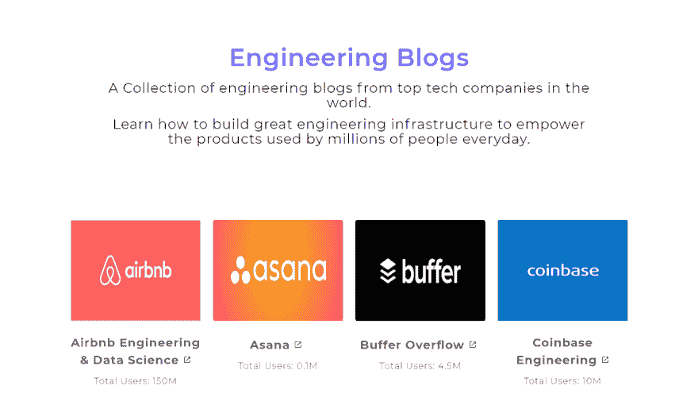

# 我如何在两天内建立并发布“工程博客”

> 原文：<https://dev.to/keyul/how-i-built--launched-engineering-blogs-in-2-days-4paj>

[T2】](https://res.cloudinary.com/practicaldev/image/fetch/s--zdJTCwIb--/c_limit%2Cf_auto%2Cfl_progressive%2Cq_auto%2Cw_880/https://thepracticaldev.s3.amazonaws.com/i/natgriokr2ljl5oye3g0.png)

*周一*，我在推特上展示了文章“*减少 Slack 的内存占用*”。这是由 Slack 工程团队编写的，旨在解释他们如何解决 Slack 桌面应用程序的高内存消耗问题。

它对如何解决问题、思考更好的解决方案和构建桌面应用程序做了很好的解释。我浏览了 Slack 工程博客，里面有很多 Slack 工程团队分享的智慧。

作为一名软件工程师，我总是很想了解伟大的科技产品背后的开发策略。

*周二*，我开始寻找更多来自不同创业公司和科技公司的工程博客。几个小时后，我发现许多科技公司都有一个与工程和开发相关的特殊板块或博客。在这些博客上，他们发布许多新的东西，包括他们解决问题的方法，他们使用不同工具和技术的经验，他们的工程师的故事等等。

最后，我决定建立一个任何人都可以找到所有工程博客的地方。我周二开始研究这个想法。

到周三结束的时候，我已经完成了第一个原型。

[“工程博客”——世界顶尖科技公司的工程博客集合。](http://quickcode.co/engineer-blogs)

*周四*，我增加了新功能，包括“提交新公司博客”和“总用户数”，这些技术公司都试图让人们更好地了解如何建设和扩展处理数百万人(有些是数十亿人)流量的基础设施。)

我在几个社区上发了帖子，反响非常惊人。三天之内，3000 人访问了这个网站。他们中的许多人留下了非常好的反馈。今天我与开发者社区分享它。

请分享您的想法、反馈和建议，让它变得更好。