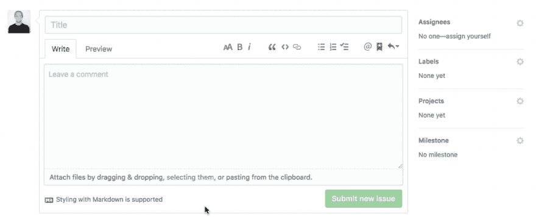

# 我是如何建立缺陷 AI 的机器学习服务来预测 GitHub 标签的。

> 原文：<https://dev.to/heyersascha/how-i-built-defects-ai-a-machine-learning-service-to-predict-github-labels-4p53>

缺陷人工智能是一种全自动的服务，使用专门针对该用例训练的机器学习模型来预测 GitHub 问题的标签。不要把时间浪费在标签问题上，而是用你的 it 来解决它们。

[T2】](https://res.cloudinary.com/practicaldev/image/fetch/s--8rrQW_c9--/c_limit%2Cf_auto%2Cfl_progressive%2Cq_66%2Cw_880/https://thepracticaldev.s3.amazonaws.com/i/59ngwrpa1i7pmq1110m1.gif)

## 一切是如何开始的？

缺陷人工智能最初是一个基于统计的工具的附带项目，它提供了关于产品质量的见解。当深入挖掘基于不同 GitHub 库的不同数据集时，我注意到许多问题没有被标记。

经过几天的讨论，我意识到为什么:对于许多项目来说，在可接受的时间内分析问题是很困难的。

这是一个转折点，我暂停了统计工具的工作，开始为 GitHub 制作自动问题标签。从核心功能入手，机器学习模型预测 GitHub 问题类型。

一些首次成功的测试和机器学习模型的进一步改进给了我继续这个想法的信心。

## 它是如何工作的？

设置很简单，在缺陷 AI 上注册，安装 GitHub 缺陷 AI 应用程序，并选择您想要为自动问题标记启用的存储库。

每次创建新问题时，GitHub 都会向我们的服务器发送一个请求，作为响应，我们会将预测的问题发送回您的资源库。然后，预测标签会自动设置在问题上。

## 我是如何在全职工作的同时设法构建缺陷人工智能的？

*   将功能减少到最低限度
*   为我的家人和放松保留周末
*   我通常每周在缺陷 AI 上工作 5 天，每天至少在我每天工作开始前 1 小时。(你仍有责任向你的雇主提供出色的业绩，这两者都由你来管理。如果你不能两者兼得，请不要拿你的工作冒险)

我花了 3 个多月(95 天)来构建缺陷人工智能的初始版本。确切地说，我是从 2018 年 6 月 15 日开始的。这是存储库中的第一个提交:

## 下一步是什么？

在收集用户反馈的同时，我继续研究[见解](https://www.defects.ai/feature/insights)并进一步改进模型。欢迎在[推特](https://twitter.com/HeyerSascha)上关注我。

目前支持的标签有:Bug、Feature、Documentation 和 Question。

## 关于钱的几句话

像其他任何东西一样，SaaS 也是要花钱的，最大的支出是模型、主机和协作工具的培训费用。我每次训练花费大约 12 美元，你可以想象在开始的时候我训练了很多。

我计划每月公布我的财务报告。

## 好奇？

缺陷人工智能还提供了一种简单易行的方法来进行预测实验。只需点击链接，开始预测问题的标签:[尝试一下](https://defects.ai/feature/automatic-issue-labeling)

❤，谢谢你邀请我。如果你对建设 SaaS 有任何疑问，请随时发表评论，或者在 Twitter 上关注我。
我感谢你的反馈，它帮助我获得了下一篇文章的灵感。

萨莎干杯