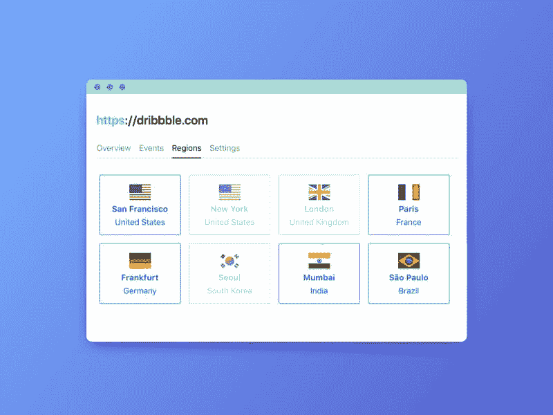
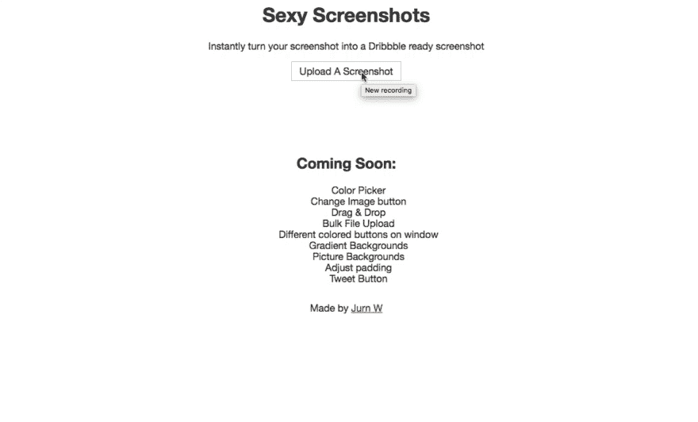
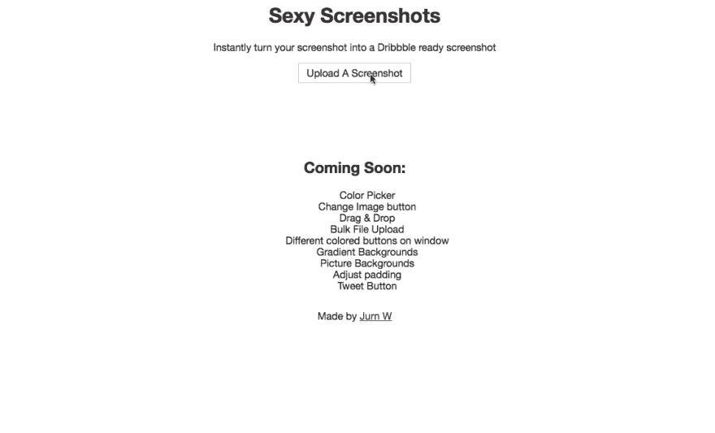
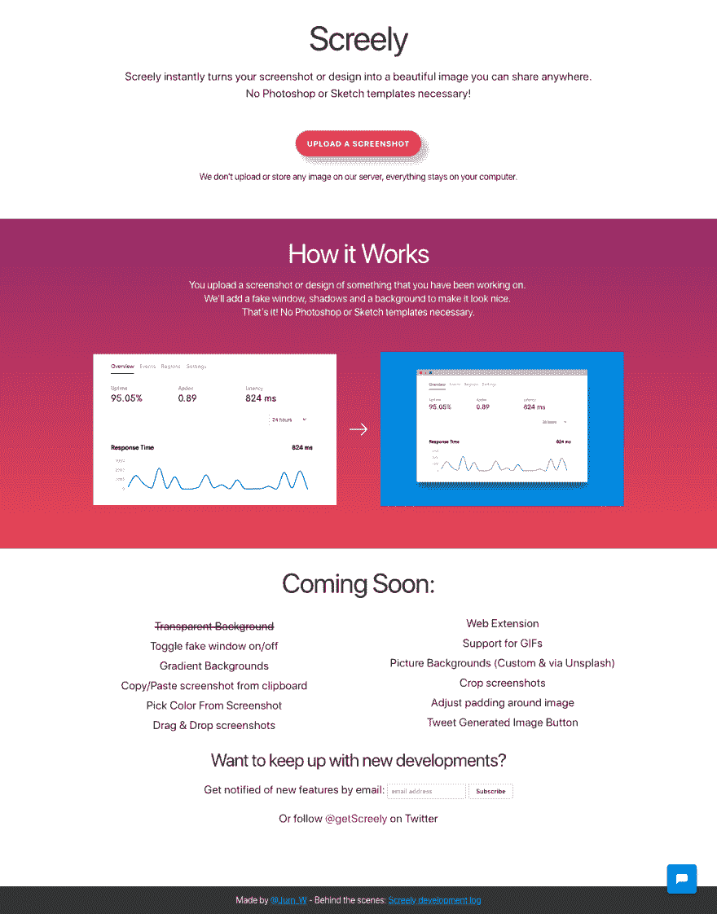
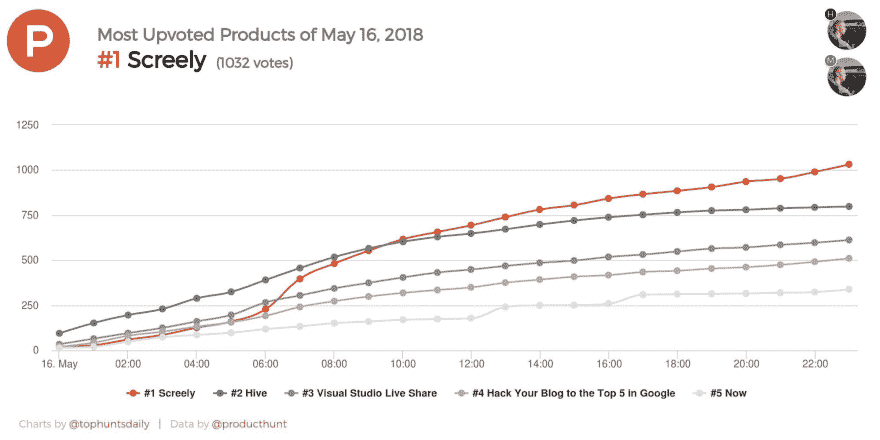
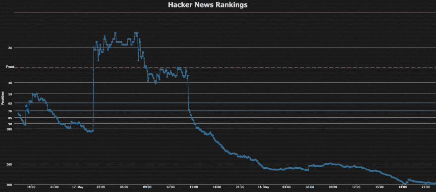
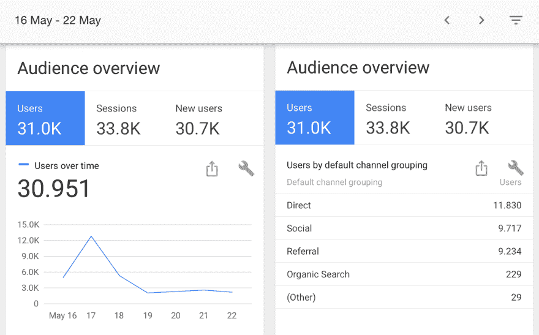
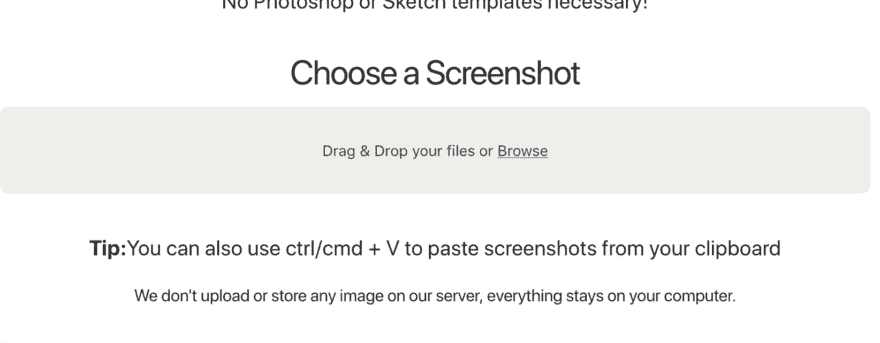

# 我是如何建立我的兼职项目并在第一周获得 31，000 名用户的

> 原文：<https://dev.to/jurn_w/how-i-built-my-side-project-and-got-31000-users-the-firstweek-5ea0>

我喜欢做兼职项目。看到你自己的想法变成现实是令人惊奇的。

兼职项目提供了一个创造性的出口，是学习和尝试新事物的好方法。

如果你的副业起飞，它甚至可能变成一个创业。许多知名公司都是以副业起家的:Twitter、Slack、GitHub 和 Instagram 等等。

最近，我推出了一个新的副业项目，并在推出后的前 7 天内获得了 31，000 名用户。

我建的网站叫 [Screely](https://www.screely.com/) 。它可以让你立即把截图变成一个美丽的设计模型，没有使用 Photoshop 或草图模板的麻烦。

在这篇文章中，我将告诉你我是如何得到这个想法的，我是如何建立它的，以及我是如何在头 7 天内获得 31，000 名用户的。

## 寻找一个想法

Screely 的想法来自设计师和开发人员分享和讨论他们的项目的群聊。他们经常分享截图，以寻求反馈或展示已完成的工作。

但是有一个人的截图很突出。他分享了美丽的图片，而不是像其他人一样简单的截图。

它们看起来更像你在 Dribbble 或 Behance 上看到的设计。

[T2】](https://res.cloudinary.com/practicaldev/image/fetch/s--RuR3T3pw--/c_limit%2Cf_auto%2Cfl_progressive%2Cq_auto%2Cw_880/https://thepracticaldev.s3.amazonaws.com/i/6r1y8zvf2kbant1uwntj.jpeg)

原来他用 Sketch 做了一个自定义模板来添加这些效果。

我想让我的截图看起来相似。但是我不想设计我自己的模板，并且必须将每个新的截图加载到 Sketch 中。

我知道 [Carbon](https://carbon.now.sh/?bg=rgba(171,%20184,%20195,%201)&t=seti&wt=none&l=auto&ds=true&dsyoff=20px&dsblur=68px&wc=true&wa=true&pv=48px&ph=32px&ln=false&fm=Hack&fs=14px&lh=133%25&si=false&es=2x&wm=false) ，这是一个可以立即生成你的**代码**的漂亮图像的工具，但是我想为我的**截图**做一些类似的事情。

找不到做这个的网站，决定自己建。

## 定义你的最小可行产品(MVP)

当我开始开发一个新产品时，我做的第一件事就是定义一个 MVP。

MVP 有几种不同的定义。通常，它被描述为具有最少功能但仍能解决问题的产品。

限制自己只构建一个 MVP 是非常重要的，原因有二。

首先，你防止自己在没有验证想法和不知道其他人是否想使用的情况下花费大量时间来构建产品。

第二，你防止自己无休止地添加更多的功能和调整你的产品。

当然，这些都不是坏事。但是这是一个危险的陷阱，可能会导致你在发布产品之前花上几个月或几年的时间。

> “在产品开发中，最小可行产品(MVP)是一种功能刚刚够满足早期客户，并为未来开发提供反馈的产品”——维基百科

你发布 MVP 的速度越快，你就能越快地验证你的想法，并根据用户的反馈改进你的 MVP。

对于 Screely，我将 MVP 定义为:

*   用户应该能够选择一个本地图像文件(jpg，png)
*   该系统应该生成一个具有模型窗口，框阴影和背景颜色的图像
*   用户应该能够改变背景颜色
*   用户应该能够下载生成的图像

当然，还有很多我想添加的其他功能:拖放图像、渐变背景或能够在推特上发布生成的图像。

但是这些都不是核心功能的一部分。正如我之前说过的，限制你自己获得 MVP 是很重要的，否则你会陷入无止境的功能蔓延。

## 准备

在启动我的文本编辑器之前，我探索了潜在的技术解决方案及其优缺点。

在做了一些研究后，我考虑了三种不同的选择:

1.  使用 HTML 画布元素和 JavaScript
2.  使用常规的 DOM 元素，使用纯 HTML 和 CSS
3.  生成图像服务器端并返回最终结果

每种选择都有利弊。

例如，在服务器端呈现图像可以避免跨浏览器的兼容性问题。但作为一个用户，我不希望我的截图被发送到服务器，因为我不知道它们是否被保存或以任何方式使用。

这还需要运行一个服务器，而我可以在 [Netlify](https://www.netlify.com/) 上免费托管一个纯前端解决方案。所以第三种选择不存在。

剩下前两个选项。我最终决定使用 HTML `<canvas>`元素和**用普通的 JavaScript 在画布上绘制**。此外，因为我以前没有使用过 HTML canvas 元素，而辅助项目是学习新事物的好方法，所以我倾向于走这条路。😉

## 让我们开始建造吧

任何项目中最激动人心的部分。

我立即从基本功能开始。我没有在名称/域名、设计、标志或建立社交媒体上花费任何时间。你可以以后再做这些。

项目开始 1 小时后，我已经做好了最基本的工作。

*   占位符名称——性感截图(我们在群聊中是这么称呼这些图片的)
*   文件输入
*   一个生成的`<canvas>`元素，包含我选择的带有彩色背景和添加的假窗口的图像

[T2】](https://res.cloudinary.com/practicaldev/image/fetch/s--IgpPr1k---/c_limit%2Cf_auto%2Cfl_progressive%2Cq_66%2Cw_880/https://thepracticaldev.s3.amazonaws.com/i/tp6pt3nyondwr1ynztbg.gif)

我把所有东西都硬编码了，它只对一个(特定的)截图有效。您不能更改背景颜色，或使用不同尺寸的屏幕截图。

我从那里改进了产品，从处理不同大小截图的能力开始。

我还开始添加我为 MVP 定义的其他特性，比如添加一个颜色选择器来改变背景颜色，以及为生成的图像添加一个下载按钮。

[T2】](https://res.cloudinary.com/practicaldev/image/fetch/s--2DClgmgJ--/c_limit%2Cf_auto%2Cfl_progressive%2Cq_66%2Cw_880/https://thepracticaldev.s3.amazonaws.com/i/obwbbpgfsq06le3i9p2k.gif)

既然我在一开始设定的所有 MVP 要求都满足了，是时候启动了(是的，已经启动了)！

## 准备发射

在这一点上，我的 MVP 只不过是一个占位符标题、一个 HTML 按钮和一个我想在启动 MVP 后添加的东西的小列表。

[T2】](https://res.cloudinary.com/practicaldev/image/fetch/s--Rj82uPSL--/c_limit%2Cf_auto%2Cfl_progressive%2Cq_auto%2Cw_880/https://thepracticaldev.s3.amazonaws.com/i/syd5a8apj28qcmb90k1e.png)

在挑选了一个名字后，购买。然后制作一个登陆页面，结果是这样的:

[T2】](https://res.cloudinary.com/practicaldev/image/fetch/s--T-db0lB0--/c_limit%2Cf_auto%2Cfl_progressive%2Cq_auto%2Cw_880/https://thepracticaldev.s3.amazonaws.com/i/z6lcn0f198gvridfwdhu.png)

我还添加了一个电子邮件选择加入和一个 Twitter 账户的链接，以确保我能在发布后与用户保持联系。

我添加的另一个东西是右下角的聊天按钮，这样用户可以很容易地和我聊天。我在那里收到了关于产品、错误报告和特性建议的宝贵反馈。

有很多选项可以用来在你的产品上嵌入聊天。我用的是 Drift，但是你也可以用 Intercom 或者 Olark 之类的替代品。

### 建在空旷的地方

关于启动你的项目，一个快速的旁注:**启动不应该是一天的事件，在那里你分享你的项目，并希望一切顺利。**

你的“启动”从你开始构思的那一天开始。你应该从第一天开始推广你的项目。

当我开始在 Screely 上工作时，我在开始一小时后就在推特上发布了我的进展。在我打造 MVP 的时候，我也在推特上定期更新。

> 做一个小的网络应用程序，把你的截图变成那些花哨的可移动的照片(有背景，假窗口，阴影，等等)。)
> 
> 在 Twitter/Slack/Telegram/吉拉/随便什么上快速分享你正在做的新设计或新功能，让它看起来很棒！🤩pic.twitter.com/nE3xSHXjju
> 
> — Jurn @ 🇳🇱 ([@jurn_w](https://dev.to/jurn_w) ) [31 maart 2018](https://twitter.com/jurn_w/status/980027925092360193?ref_src=twsrc%5Etfw)

这有助于传播你的新产品的意识，让人们好奇，并帮助你获得反馈。

不要因为展示一个未完成的产品而感到尴尬。人们喜欢看别人做很酷的东西，也明白做很酷的项目需要时间。

## 发射

我在 Product Hunt、Hacker News、Reddit、Designer News 和其他一些网站上发布了 Screely。

我不会深入讨论在哪里发布你的产品和每个平台的最佳实践，因为那是一篇独立的博客文章。

最重要的是你接触到了你的目标受众。对于 Screely 来说，主要是设计师、开发人员和技术作家。

### 产品搜索

产品搜索发布会进行得非常顺利，超出了我的所有预期。Screely 最终以 1032 张赞成票成为当天的 [#1 产品。](https://www.producthunt.com/posts/screely)

[T2】](https://res.cloudinary.com/practicaldev/image/fetch/s--p1GacyHz--/c_limit%2Cf_auto%2Cfl_progressive%2Cq_auto%2Cw_880/https://thepracticaldev.s3.amazonaws.com/i/5bl5d7kkgkyldt7r7cw0.jpeg)

Screely 是当日最佳产品、本周最佳产品和当月最佳产品。这意味着它也将出现在产品搜索的每日和每周简讯。

总的来说，产品搜索在第一周就吸引了近 11，000 名访客！

### 黑客新闻

Screely 开始很慢，但几个小时后，它突然跃上了黑客新闻的头版。尽管 Screely 的最高排名仅为第 15 位，但它仍然带来了大量的流量。

[T2】](https://res.cloudinary.com/practicaldev/image/fetch/s--X1m4ejUG--/c_limit%2Cf_auto%2Cfl_progressive%2Cq_auto%2Cw_880/https://thepracticaldev.s3.amazonaws.com/i/1qrlstflu9grxk0ymluv.png)

我估计有 5 -10k 用户来自黑客新闻。

目前还不清楚到底有多少用户来自 HN，因为它没有给 URL 添加一个`?ref=`参数。在本文的后面，我会更详细地介绍流量来源。

### 设计师新闻

第三个最成功的平台(就流量而言)是 designernews.com。

Screely 在首页排名第二，这导致了近 3000 名新用户。

### 疯传

我曾在许多其他地方发布过 Screely，比如 Reddit 和 Indie Hackers，但前三个是迄今为止最成功的。

在 Hacker News 和 Product Hunt 等网站上表现出色的一个很酷的副作用是，你的产品会出现在许多其他网站上。推文、时事通讯、小型博客、聚合器等等。

例如，Screely 被 CSS tricks 提到他们的 36 万追随者。

> 厌倦了你的截图只是截图，而不是放在有阴影的假浏览器窗口中？[https://t.co/k6PwIzPX7x](https://t.co/k6PwIzPX7x)pic.twitter.com/qDgJBC3OdqT2
> 
> — CSS-Tricks (@Real_CSS_Tricks) [17 mei 2018](https://twitter.com/Real_CSS_Tricks/status/997250414826274816?ref_src=twsrc%5Etfw)

Screely 还被收录在一份在设计师中很受欢迎的时事通讯 [Codrops Collective #416](https://tympanus.net/codrops/collective/collective-416/) 中。

总的来说，Screely 在第一周就有将近 31，000 名用户。

[T2】](https://res.cloudinary.com/practicaldev/image/fetch/s--GtkLdkw3--/c_limit%2Cf_auto%2Cfl_progressive%2Cq_auto%2Cw_880/https://thepracticaldev.s3.amazonaws.com/i/z6jvxilneesrytmyypfs.png)

## 根据用户反馈进行改进

鉴于发射的成功，我可以自信地说，这个想法已经得到验证。现在我知道在这个项目上投入更多的时间是值得的。

还记得我为了准备 Screely 的发布而实现的聊天功能吗？它充满了 Screely 用户的功能请求和反馈。

既然你已经确切地知道了你的用户想要什么，那么就很容易知道应该开发什么特性，应该优先考虑什么。

例如，许多用户希望能够将他们的图像拖放到 Screely 中，所以我首先添加了这个特性。

[T2】](https://res.cloudinary.com/practicaldev/image/fetch/s--A6KrmWyt--/c_limit%2Cf_auto%2Cfl_progressive%2Cq_66%2Cw_880/https://thepracticaldev.s3.amazonaws.com/i/859kx2rovlc36o1dht08.gif)

另一个经常被要求的特性是自动匹配图像的背景颜色。所以你马上就有了适合你截图的背景。

我添加了一个脚本来分析图像，生成调色板，并为背景选择最主要的颜色。

> 🚨新功能
> 
> Screely 现在可以找到你的截图的主色，并将其设置为背景色。【pic.twitter.com/JIfFBsJg2O T2】号
> 
> — Screely (@getScreely) [28 juni 2018](https://twitter.com/getScreely/status/1012367983111491584?ref_src=twsrc%5Etfw)

除了添加新功能和修复漏洞，我还花时间润色设计。

> 正在对主页进行一些重大改进，下面先睹为快👀[pic.twitter.com/ObTcAvkJgh](https://t.co/ObTcAvkJgh)
> 
> — Screely (@getScreely) [23 juli 2018](https://twitter.com/getScreely/status/1021366841644584962?ref_src=twsrc%5Etfw)

如果你想在 Screely 上获得更新。在 Twitter 上关注 [@getScreely](https://twitter.com/@getscreely) ，或者在[screely.com](https://www.screely.com/)上通过电子邮件注册每月产品更新。

## 装运辅助项目的建议(更快)

*   **保持简单:**尽可能保持你的 MVP 有限。使用你熟悉的编程语言，而不是任何流行的框架。你的项目越复杂，交付和获得第一批用户的时间就越长。
*   **每天出货:**保持你的副业发展势头非常重要。试着每天都做你的项目。重构单个函数或修复一个微小的 CSS 问题。不管你完成的任务有多小，继续出货！如果你错过了一天(这种情况时有发生)，那就把第二天完成某件事作为头等大事，不管这件事有多小。
*   **走捷径:**只要有可能，试着寻找快捷方式来更快地运送你的产品。如果你能为一个问题找到一个好的开源解决方案，使用它而不是从头开始写你自己的。使用 Netlify 之类的工具来托管和部署，而不是设置自己的服务器。
*   **在你认为自己准备好之前推出:**不要沉迷于完善你的产品。你能逃脱的比你想象的要多得多。
*   编程是将你的想法融入世界的工具:不要过度设计你的副业。你的用户不关心你的技术，他们关心的是他们从使用你的产品中得到的好处。他们不在乎你用的是 Docker 还是 React，他们关注的是你的产品能为他们解决什么问题。
*   你知道的够多了:许多学习编码的人推迟了他们自己项目的工作。他们常常认为自己需要跟着更多的教程，买更多的课程，读更多的书。不要永远保持学习，开始建设吧！即使是经验丰富的开发人员也仍然在寻找“简单”的东西，比如如何从数组中移除元素。

祝你好运，玩得开心！

*这篇文章最初发表在 [freeCodeCamp 的媒体出版物](https://medium.freecodecamp.org/how-i-built-my-side-project-and-got-31-000-users-the-first-week-d9053bae5302)上，由他们的一名志愿者编辑。*