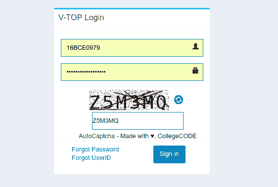
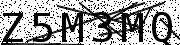
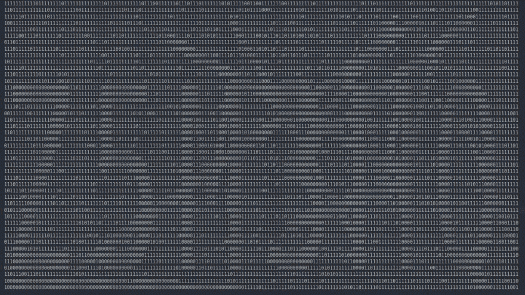
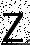
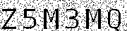
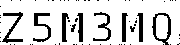
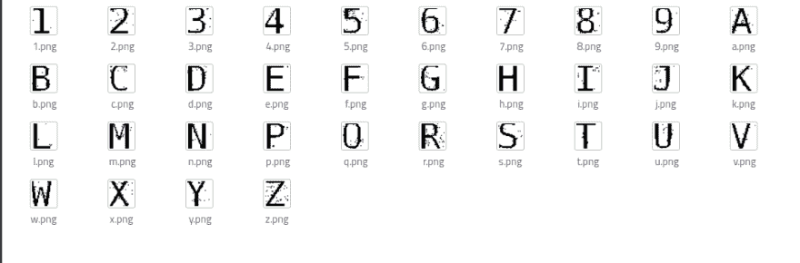
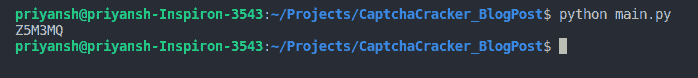

# 我如何为我的大学网站开发一个验证码破解程序

> 原文：<https://dev.to/presto412/how-i-cracked-the-captcha-on-my-universitys-website-237j>

又见面了！

就当这是我最初的[文章](https://dev.to/presto412/how-i-automated-the-boring-university-stuff-with-python-5gib)的副产品吧。读者要求我解释我是如何开发解析器的，因此我决定分享我的第一个(重要的？)和你们一起投射。
[储存库链接](https://github.com/Presto412/VtopBetaCaptchaParser/tree/master/Blog%20Post)

开始吧！

当我开发这些脚本时，我对图像处理或其中使用的算法一无所知。我是在大一的时候开始研究这个的。

当我开始时，我脑海中的基本想法是:

*   图像基本上是一个矩阵，像素是独立的单元。
*   彩色图像的每个像素都有一组(红、绿、蓝)值，而灰度图像只有一个值，在普通图像中每个像素值的范围是(0，255)

所以我学院的学生登录入口是这样的:
[](https://res.cloudinary.com/practicaldev/image/fetch/s--vRGbkrHa--/c_limit%2Cf_auto%2Cfl_progressive%2Cq_auto%2Cw_880/https://thepracticaldev.s3.amazonaws.com/i/rmofwzej21jh71xsfqc4.png)

首先，我对这幅图像做了一些非常有用的观察。
[T3】](https://res.cloudinary.com/practicaldev/image/fetch/s--kFUJr3GW--/c_limit%2Cf_auto%2Cfl_progressive%2Cq_auto%2Cw_880/https://thepracticaldev.s3.amazonaws.com/i/0bkp32nghrtt702e7ow9.png)

*   验证码中的字符数始终为 6，并且是灰度图像。
*   字符之间的间距看起来非常稳定
*   每个角色都有完整的定义。
*   该图像有许多分散的暗像素和穿过图像的线条。

所以我最终下载了一张这样的图片，并使用这个[工具](https://www.dcode.fr/binary-image)将图片二进制化(0 代表黑色像素，1 代表白色像素)。
T3T5】

我的观察是正确的——图像尺寸为 45x180，每个字符被分配了 30 个像素的空间，从而使它们均匀分布。就这样，我迈出了第一步，那就是

*   将你得到的任何图像裁剪成 6 个不同的部分，每个部分的宽度为 30 像素。

我选择 Python 作为我的原型语言，因为它的库最容易使用和实现。
在一些简单的搜索上，找到了 [PIL](https://pillow.readthedocs.io/en/5.1.x/) 图书馆。我决定使用[图像](https://pillow.readthedocs.io/en/5.1.x/reference/Image.html)模块，因为我的操作仅限于以矩阵形式裁剪和加载图像。
因此，根据文档，裁剪图像的语法是

```
from PIL import Image
image = Image.open("filename.xyz")
cropped_image = image.crop((left, upper, right, lower)) 
```

在我的例子中，如果你想只裁剪第一个字符，

```
from PIL import Image
image = Image.open("captcha.png").convert("L") # Grayscale conversion cropped_image = image.crop((0, 0, 30, 45))
cropped_image.save("cropped_image.png") 
```

保存的图像:
[](https://res.cloudinary.com/practicaldev/image/fetch/s--HuuC_L0G--/c_limit%2Cf_auto%2Cfl_progressive%2Cq_auto%2Cw_880/https://thepracticaldev.s3.amazonaws.com/i/swnchtyrjurey6eq0n5o.png)

我将它包装在一个循环中，编写了一个简单的脚本，从网站上获取 500 张验证码图片，并将所有被裁剪的字符保存到一个文件夹中。

到第三个观察点——每个角色都定义得很好。为了从图像中“清除”一个被裁剪的字符(去掉不必要的线和点)，我使用了下面的方法。

*   字符中的所有像素都是纯黑色(0)。我用了一个简单的逻辑——不是全黑就是白。因此，对于每个值大于 0 的像素，将其重新分配为 255。使用 load()函数将图像转换为 45x180 的矩阵，然后对其进行处理。

```
pixel_matrix = cropped_image.load()
for col in range(0, cropped_image.height):
    for row in range(0, cropped_image.width):
        if pixel_matrix[row, col] != 0:
            pixel_matrix[row, col] = 255
image.save("thresholded_image.png") 
```

为了清楚起见，我将代码应用于原始图像。
原:
[](https://res.cloudinary.com/practicaldev/image/fetch/s--kFUJr3GW--/c_limit%2Cf_auto%2Cfl_progressive%2Cq_auto%2Cw_880/https://thepracticaldev.s3.amazonaws.com/i/0bkp32nghrtt702e7ow9.png) 
修改:
[](https://res.cloudinary.com/practicaldev/image/fetch/s--AgeBVUJZ--/c_limit%2Cf_auto%2Cfl_progressive%2Cq_auto%2Cw_880/https://thepracticaldev.s3.amazonaws.com/i/kevfn6x9jnk6xjzbv2cd.png) 
所以你可以看到，所有没有完全变暗的像素都被去掉了。这包括穿过图像的线。
直到项目完成后，我才知道上面的方法在图像处理中被称为阈值法。

继续第四项观察——图像中有许多杂散像素。
遍历图像矩阵，如果一个相邻像素是白色的，与相邻像素相对的像素也是白色的，而中心像素是黑色的，则使中心像素为白色。

```
for column in range(1, image.height - 1):
    for row in range(1, image.width - 1):
        if pixel_matrix[row, column] == 0 \
            and pixel_matrix[row, column - 1] == 255 and pixel_matrix[row, column + 1] == 255 :
            pixel_matrix[row, column] = 255
        if pixel_matrix[row, column] == 0 \
            and pixel_matrix[row - 1, column] == 255 and pixel_matrix[row + 1, column] == 255:
            pixel_matrix[row, column] = 255 
```

输出:
[](https://res.cloudinary.com/practicaldev/image/fetch/s--b23gk26o--/c_limit%2Cf_auto%2Cfl_progressive%2Cq_auto%2Cw_880/https://thepracticaldev.s3.amazonaws.com/i/89wib4l8i8d0jvtfqfnt.png)

所以你看，形象已经被还原为单个人物本身了！尽管看起来有些角色已经丢失了基本像素，但是它们可以作为很好的骨架供其他图像进行比较。毕竟，我们做这么多改变的主要原因是为了给每个可能的角色生成一个合适的图像。

我将上述算法应用于所有被裁剪的字符，并将它们存储在一个新文件夹中。接下来的任务是为属于“abcdefghijklmnopqrstuvwxyz 0123456789”的每个字符命名至少一个样本。这一步就像“训练”步骤，我为每个人手动选择了一个角色图像，并给它们重新命名。

完成这一步后，我有了每个角色的骨架图像！
[T3】](https://res.cloudinary.com/practicaldev/image/fetch/s--n-TNtKQA--/c_limit%2Cf_auto%2Cfl_progressive%2Cq_auto%2Cw_880/https://thepracticaldev.s3.amazonaws.com/i/opo3w6q7i3xvmk6sk5ns.png)

我运行了几个其他脚本来获得一个角色的所有图像中的最佳图像——例如，如果有 20 个“A”字符图像，具有最少暗像素的图像显然是具有最少噪声的图像，因此最适合骨架图像。所以有两个剧本:

*   一种是按字符对相似图像进行分组(约束条件:暗像素数量，相似度> = 90 - 95 %)
*   一个是从每个分组的角色中得到最好的图像

至此，库映像已经生成。将它们转换成像素矩阵，并将“位图”存储为 JSON 文件。

最后，这是解决任何新的验证码图片的算法

*   使用相同的算法减少新图像中不必要的噪声
*   对于新验证码图片中的每一个字符，通过我生成的 JSON 位图进行暴力破解。基于相应的暗像素匹配来计算相似性。
    *   这意味着，如果一个像素是暗的，并且位于图像中要破解验证码的位置(4，8)，并且如果该像素在我们的骨架图像/位图中的相同位置是暗的，则计数增加 1。
    *   当与骨架图像中暗像素的数量比较时，该计数用于计算匹配百分比。百分比和计算百分比的字符被推送到字典中。
*   选择具有最高匹配百分比的字符。

```
 import json
    characters = "123456789abcdefghijklmnpqrstuvwxyz"
    captcha = ""
    with open("bitmaps.json", "r") as f:
        bitmap = json.load(f)

    for j in range(image.width/6, image.width + 1, image.width/6):
        character_image = image.crop((j - 30, 12, j, 44))
        character_matrix = character_image.load()
        matches = {}
        for char in characters:
            match = 0
            black = 0
            bitmap_matrix = bitmap[char]
            for y in range(0, 32):
                for x in range(0, 30):
                    if character_matrix[x, y] == bitmap_matrix[y][x] and bitmap_matrix[y][x] == 0:
                        match += 1
                    if bitmap_matrix[y][x] == 0:
                        black += 1
            perc = float(match) / float(black)
            matches.update({perc: char[0].upper()})
        try:
            captcha += matches[max(matches.keys())]
        except ValueError:
            print("failed captcha")
            captcha += "0"
    print captcha 
```

而我们得到的最终结果是:
[](https://res.cloudinary.com/practicaldev/image/fetch/s--OzF62MaO--/c_limit%2Cf_auto%2Cfl_progressive%2Cq_auto%2Cw_880/https://thepracticaldev.s3.amazonaws.com/i/d2qh7yna5z0p0z9bdvbo.png)

也就是 z5m 3 MQ——验证码已经解决成功了！

我就是这么做的。这是一次很棒的学习经历，我开发了一个使用该算法的 [chrome 扩展](https://chrome.google.com/webstore/detail/enhancer-for-vit-vellore/hafeeaangmkbibcaahfjdmmmeappjbbp)，它拥有 1800+用户！

希望看到您的意见和建议！
上面的代码托管在[这里](https://github.com/Presto412/VtopBetaCaptchaParser/tree/master/Blog%20Post)