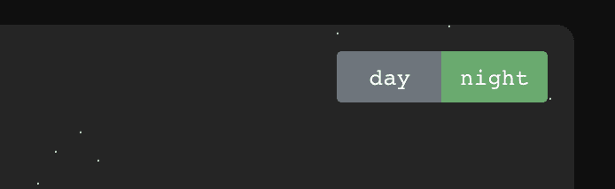
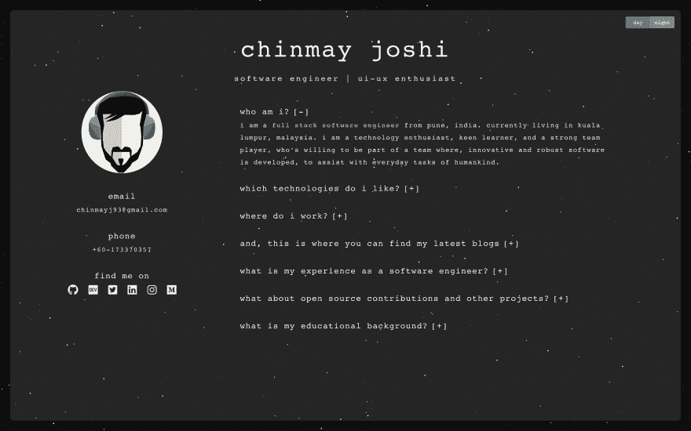
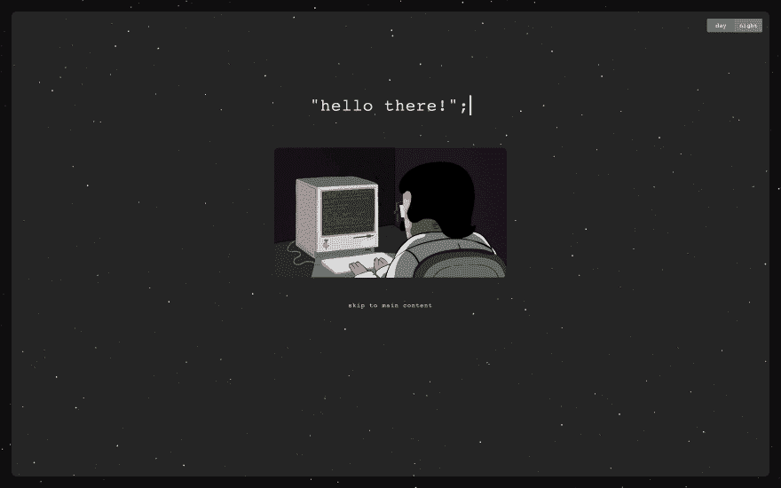
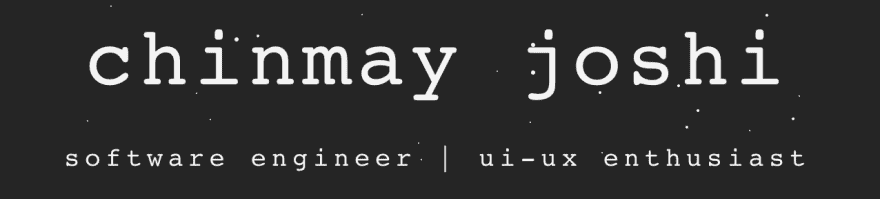
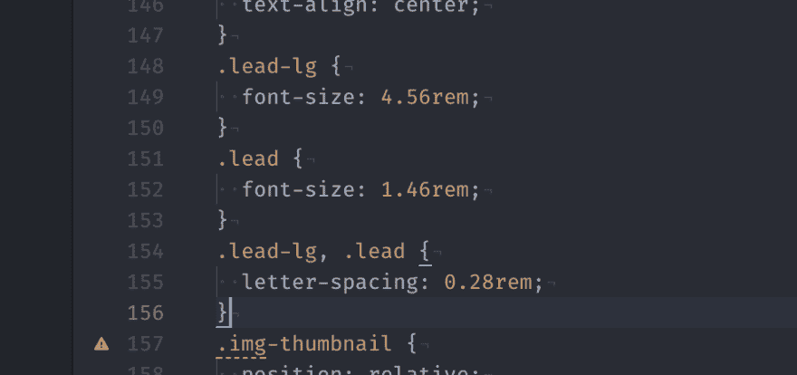
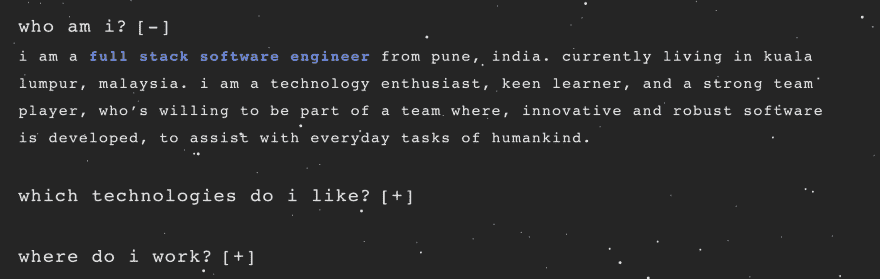
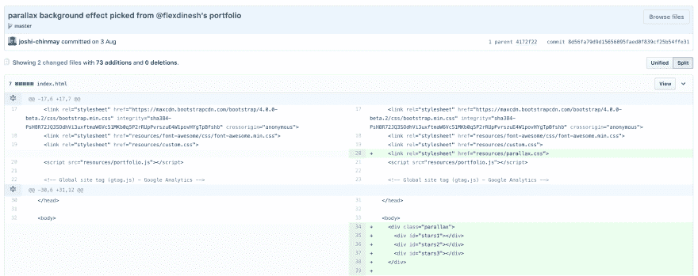
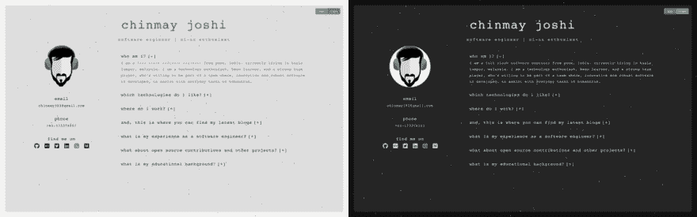

# 我是如何创建我的第一个个人网站的？

> 原文：<https://dev.to/joshichinmay/how-i-created-my-first-website-27b5>

凭借一点点聪明的工作，无数的设计迭代，屈指可数的资源，令人敬畏的灵感，55 git commits，页面美化插图和微妙的动画。最后，我的网站是像样的。好吧，这只是开始。未来的目标是整体设计和用户体验达到近乎完美。

欢迎并感谢建设性的反馈。这里是查看我的网站的链接-[chinmay-joshi.com](http://chinmay-joshi.com)

从一开始，我就用 GitHub 来托管我的代码库和网站。你可以点击查看[代码。根据 Git 历史记录，第一次提交是在 2017 年 9 月 6 日。这意味着我花了 430 多天才把它出版。](https://github.com/joshi-chinmay/joshi-chinmay.github.io)

[T2】](https://res.cloudinary.com/practicaldev/image/fetch/s--1NIvC9aC--/c_limit%2Cf_auto%2Cfl_progressive%2Cq_66%2Cw_880/https://thepracticaldev.s3.amazonaws.com/i/n2e2daxkjvme6mi72zjh.gif)

### 我写博客有三个主要原因-

1.  炫耀我所做的。
2.  从像您这样优秀的开发人员那里获得反馈。
3.  接触和联系志同道合的开发人员。

* * *

# 我喜欢这个网站的什么？

#### 1。日夜模式-

背景颜色会根据您访问网站的时间而变化。如果晚上 7 点以后访问，可以看到夜间模式，一直活跃到早上 7 点。有一个按钮可以在白天和夜晚模式之间切换。

[T2】](https://res.cloudinary.com/practicaldev/image/fetch/s--3ivi4YMo--/c_limit%2Cf_auto%2Cfl_progressive%2Cq_auto%2Cw_880/https://thepracticaldev.s3.amazonaws.com/i/1135wvlgxj5yxckedw8s.png)

#### 2。圆形透明玻璃效果-

我创建了一个半透明的玻璃外观元素层，带有隐藏的滚动条。可见的滚动条可能破坏了整体的流动性和 UX。

[T2】](https://res.cloudinary.com/practicaldev/image/fetch/s--MQiAZQTN--/c_limit%2Cf_auto%2Cfl_progressive%2Cq_auto%2Cw_880/https://thepracticaldev.s3.amazonaws.com/i/mv9o8r4dc4wy95kszsv8.png)

#### 3。自动关闭登录页面-

当任何人打开网站时，首先看到的是一个垂直浮动的动画 gif，上面有一条欢迎消息。还有一个跳转到主网站的功能。你可以在这里找到打字机风格的效果。

[T2】](https://res.cloudinary.com/practicaldev/image/fetch/s--pZ613os---/c_limit%2Cf_auto%2Cfl_progressive%2Cq_auto%2Cw_880/https://thepracticaldev.s3.amazonaws.com/i/a95xw68fpmg9akctzg58.png)

#### 4。到处都是小写字母-

我不知道我为什么会做那个决定。我只是想在排版方面变得古怪。我决定不使用任何外部字体，因为 monospace 看起来真的很好。当我开始设计时，我用的是 [Nunito](https://fonts.google.com/specimen/Nunito) 。

[T2】](https://res.cloudinary.com/practicaldev/image/fetch/s--Era-gInx--/c_limit%2Cf_auto%2Cfl_progressive%2Cq_auto%2Cw_880/https://thepracticaldev.s3.amazonaws.com/i/v1vqdp3zdbf44u6z31xd.png)

#### 5。大字体大小-

之前我使用了相对较小的字体，这降低了可读性。所以我决定一切都用粗体和大字体。因此，文本保留了更多的空间。在整个页面中，我添加了额外的行高和字母间距，以使外观更加整洁。

[T2】](https://res.cloudinary.com/practicaldev/image/fetch/s--vhfd7wRF--/c_limit%2Cf_auto%2Cfl_progressive%2Cq_auto%2Cw_880/https://thepracticaldev.s3.amazonaws.com/i/609izzsbglv30d5fwuz9.png)

#### 6。点击查看更多信息-

在主页上，您可以看到一个图标`[+]`，它将帮助您展开相关部分。当你切换`[+]`图标时，它变成了`[-]`，反之亦然。展开另一个选项卡后，之前打开的选项卡将自动关闭。这种想法背后的原因是为了节省一些空间和避免过多的页面滚动。

[T2】](https://res.cloudinary.com/practicaldev/image/fetch/s--9J8ZePvE--/c_limit%2Cf_auto%2Cfl_progressive%2Cq_auto%2Cw_880/https://thepracticaldev.s3.amazonaws.com/i/wksso5z52aaouau22zmx.png)

#### 7。令人满意的灯塔评分-

在性能方面还有很多需要改进的地方。
[T3】](https://res.cloudinary.com/practicaldev/image/fetch/s--pQMiw7gE--/c_limit%2Cf_auto%2Cfl_progressive%2Cq_auto%2Cw_880/https://thepracticaldev.s3.amazonaws.com/i/pdlvzdpx5pm2ohfgqvr8.png)

* * *

# 技术和其他资源-

1.  HTML5
2.  CSS3
3.  JQuery
4.  FontAwesome -所有图标都是 SVG 图像。
5.  登陆页面图片来自谷歌图片。
6.  个人资料图片说明-由一个朋友。

* * *

# 那么接下来呢？

1.  改进页面动画。有时页面在从登录页面过渡到主页面时会变慢。
2.  删除 JQuery。JQuery 是一个很棒的库，但是我不需要它来运行这样一个小网站。
3.  白天和夜晚模式之间的转换不是流畅的。添加一个小动画，应该消除僵化的影响。
4.  把登陆页的 gif 换成更好的图形(要和个人资料头像匹配)。此外，添加一个更好的图标。
5.  借助服务人员 API 添加离线页面。
6.  HTTPS？可能...
7.  自定义电子邮件地址？可能...
8.  博客页面，如果我需要的话。
9.  其他人建议的错误修复和增强。
10.  以及更多的东西...

* * *

# 灵感、功劳和特别感谢-

#### 1。社区-

这个美妙的开发者社区激励我创建了自己的网站。

 [## 构建一流的投资组合

### 阿里·斯皮特尔 8 月 2 日 186 分钟阅读

#portfolio #webdev #career #beginners](/aspittel/building-a-kickass-portfolio-28ph)
 [## 我用 React 和一些魔法创建了我的作品集🎉

### dinesh pandi Yan 4 月 1 日 185 分钟阅读

#css #react #javascript #webdev](/flexdinesh/i-re-wrote-my-portfolio-and-added-some-magic-22n7)
 [## 我新的 Kickass 投资组合网站

### 迈克尔霍夫曼 9 月 2 日 181 分钟阅读

#showdev #portfolio #webdev #career](/mokkapps/my-new-kickass-portfolio-website-2ife)
Also, many more searches like [this](https://dev.to/search?q=portfolio) and [this](https://dev.to/search?q=websites).

#### 2。dinesh pandi Yan-[@ flexdinesh](https://dev.to/flexdinesh)，[网站](https://flexdinesh.github.io/) -

我看了他的网站，实际上是剽窃了他关于下雨背景效果的想法。它是如此微妙和美丽。谢谢你，迪内什。
[T3】](https://res.cloudinary.com/practicaldev/image/fetch/s--Zt6xw3cg--/c_limit%2Cf_auto%2Cfl_progressive%2Cq_auto%2Cw_880/https://thepracticaldev.s3.amazonaws.com/i/x0nfwyreqklezwfkqyfu.png)

#### 3。阿里·斯皮特尔-[@阿斯皮特尔](https://dev.to/aspittel) -

在设计网站的时候，我多次问了她很多问题。她的指导和意见是有益的。非常感谢你，阿里。

#### 4。karishma Joshi-[@ karishmajoshi 4](https://dev.to/karishmajoshi4)-

她是你在我网站上看到的美丽插图背后的天才。

没有你的支持，我的网站不可能成功。太棒了。

* * *

#### 你最喜欢哪种模式...白天还是晚上？

[T2】](https://res.cloudinary.com/practicaldev/image/fetch/s--E6WP9UrR--/c_limit%2Cf_auto%2Cfl_progressive%2Cq_auto%2Cw_880/https://thepracticaldev.s3.amazonaws.com/i/da9lmjk3cvl5sxysjcht.jpg)

* * *