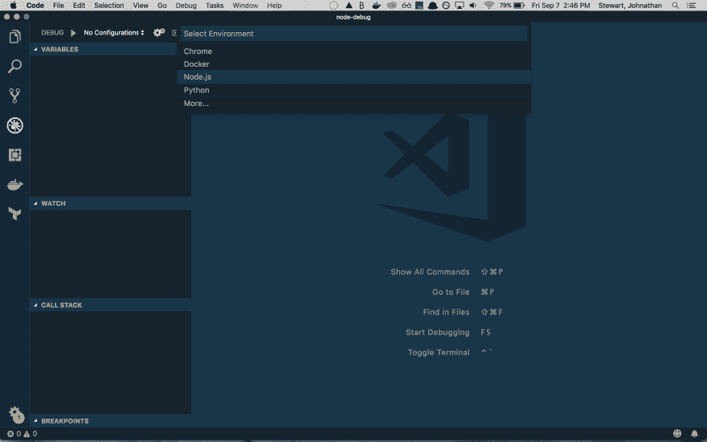
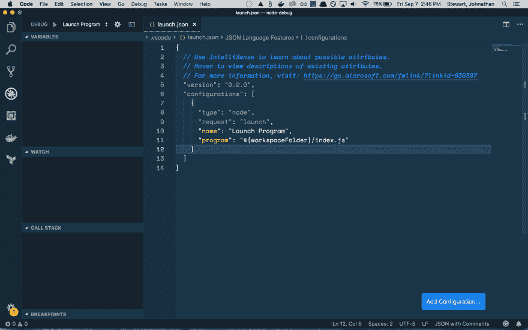
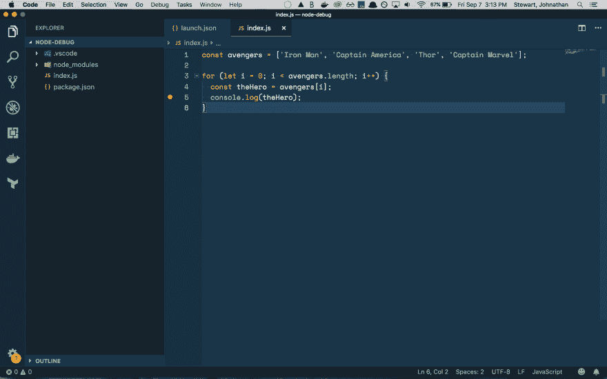
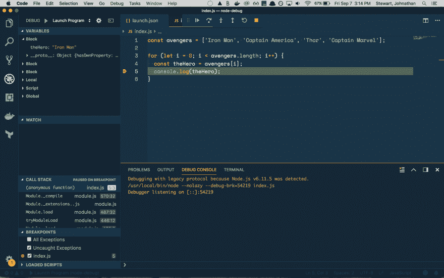
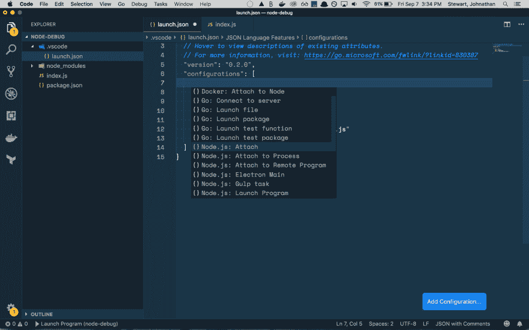
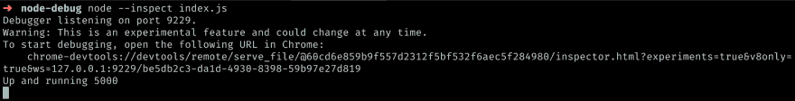
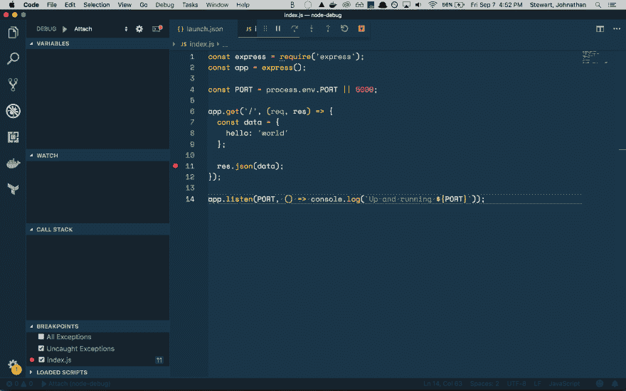
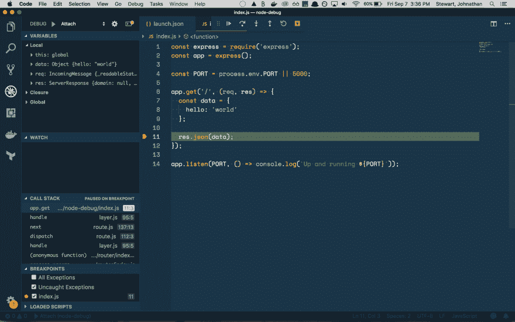

# 我如何调试节点

> 原文：<https://dev.to/thejohnstew/how-i-debug-node-end>

是时候讨论一下调试了。这篇文章会很快，主要集中在我如何在 Visual Studio 代码中调试节点应用程序。

## Visual Studio 代码启动配置

VS 代码在左栏有一个很好的调试器。点击调试器，然后你会看到一个选项，你可以点击它询问你想要什么样的配置。

[T2】](https://res.cloudinary.com/practicaldev/image/fetch/s--JWzhgJBZ--/c_limit%2Cf_auto%2Cfl_progressive%2Cq_auto%2Cw_880/https://thepracticaldev.s3.amazonaws.com/i/by28skh1h638gug88qq9.png)

一旦选择 Node.js，它将显示一个具有几个属性的配置。

[T2】](https://res.cloudinary.com/practicaldev/image/fetch/s--TNbg1c3U--/c_limit%2Cf_auto%2Cfl_progressive%2Cq_auto%2Cw_880/https://thepracticaldev.s3.amazonaws.com/i/0ayx6adc5zlv6lyb3jox.png)

我们直接关心的最后一个属性，`program`。在这里，它声明将在我们当前的工作空间中启动一个名为`index.js`的程序。让我们写一个节点，看看它能做什么。

```
const avengers = ['Iron Man', 'Captain America', 'Thor', 'Captain Marvel'];

for (let i = 0; i < avengers.length; i++) {
  const theHero = avengers[i];
  console.log(theHero);
} 
```

下面是一些我们可以用作`index.js`基础的代码。在您将代码保存到工作区的`index.js`文件中之后。您可以通过单击行号左侧的横栏，在第 5 行放置一个断点。

[T2】](https://res.cloudinary.com/practicaldev/image/fetch/s--fnqf-cFi--/c_limit%2Cf_auto%2Cfl_progressive%2Cq_auto%2Cw_880/https://thepracticaldev.s3.amazonaws.com/i/k67j11vh0me47c17jhiq.png)

然后，如果你回到调试器，点击播放按钮，它将运行程序，并在那一行暂停程序执行。

[T2】](https://res.cloudinary.com/practicaldev/image/fetch/s--szQ736A6--/c_limit%2Cf_auto%2Cfl_progressive%2Cq_auto%2Cw_880/https://thepracticaldev.s3.amazonaws.com/i/1bs82zu8aieu6d3edv2c.png)

在左侧，您可以看到变量及其在当前范围内的值，`theHero: "Iron Man"`。还有许多其他的作用域，您可以深入研究并检查变量和特定的执行时间。

这是一个基本的例子，但是显示了一个好的调试器是多么好和有价值。您可以在 VS 代码中探索各种内置的有用选项。查看 VS 代码文档上的 [Node.js 调试配置常见场景](https://code.visualstudio.com/docs/nodejs/nodejs-debugging#_launch-configurations-for-common-scenarios)部分，了解更多信息。

## Visual Studio 代码附加配置

我使用 VS 代码调试器最常见的方式是将调试器附加到当前运行的节点进程，并在该进程中设置断点。我经常在调试一些 Node Express 应用时使用这个。

下面是一个基本的 express 应用程序，我将用它作为这里例子的基础。替换`index.js`文件中的代码，不要忘记通过`npm`安装`express`。

```
const express = require('express');
const app = express();

const PORT = process.env.PORT || 5000;

app.get('/', (req, res) => {
  const data = {
    hello: 'world'
  };

  res.json(data);
});

app.listen(PORT, () => console.log(`Up and running ${PORT}`)); 
```

接下来，打开`.vscode/launch.json`。然后你会看到蓝色的`Add Configuration`按钮。单击后，系统会提示您选择一系列配置。在这种情况下，我们选择第一个 Node.js 附加选项。

[T2】](https://res.cloudinary.com/practicaldev/image/fetch/s--9qNvCHbe--/c_limit%2Cf_auto%2Cfl_progressive%2Cq_auto%2Cw_880/https://thepracticaldev.s3.amazonaws.com/i/e3eos9niuo8vblzycobx.png)

然后，该配置将被添加到您的配置数组中，供您在调试器中使用。

接下来，运行带有`--inspect`标志的节点。

[T2】](https://res.cloudinary.com/practicaldev/image/fetch/s--9wcAq0fA--/c_limit%2Cf_auto%2Cfl_progressive%2Cq_auto%2Cw_880/https://thepracticaldev.s3.amazonaws.com/i/ztrkvy28unymtn3ferpb.png)

然后你会看到 Node 启动脚本，告诉你 Node 调试器正在监听端口`9229`和一个 Chrome dev tools URL，然后你的应用输出。该端口与您的连接配置正在寻找的端口相同。

接下来，转到您的`index.js`脚本，在发送响应之前，在`app.get`调用中放置一个断点。

[T2】](https://res.cloudinary.com/practicaldev/image/fetch/s--aGo5akAc--/c_limit%2Cf_auto%2Cfl_progressive%2Cq_auto%2Cw_880/https://thepracticaldev.s3.amazonaws.com/i/24k98ihy4hdwrw1w68e8.png)

打开你的 VS 代码调试器，按 play，你应该会看到一些控件出现在 VS 代码的顶部。现在我们需要导航到这条路线来触发代码和调试器，打开 Chrome 并点击`localhost:5000`。这应该会让您回到 VS 代码调试器，在这里您可以查看请求范围内的变量和信息。

[T2】](https://res.cloudinary.com/practicaldev/image/fetch/s--SmHAkJTV--/c_limit%2Cf_auto%2Cfl_progressive%2Cq_auto%2Cw_880/https://thepracticaldev.s3.amazonaws.com/i/k6gy8z3qf42bfa4bujwq.png)

就是这样！

## 摘要

`console.log`这是可靠的，但我认为花一个小时或更多的时间去理解 VS 代码调试器或其他调试工具会让解决问题变得更容易一些。所以我推荐你看看下面的一些信息！

*   [VS 代码调试器](https://code.visualstudio.com/docs/editor/debugging)
*   [VS 代码节点调试](https://code.visualstudio.com/docs/nodejs/nodejs-debugging)

如果你喜欢这篇文章，那么请展示一些❤️.如果你没有，那我们就来谈谈😃。

最初发布在我的博客上，地址为 [johnstewart.io](https://goo.gl/CQ4dS7) 。