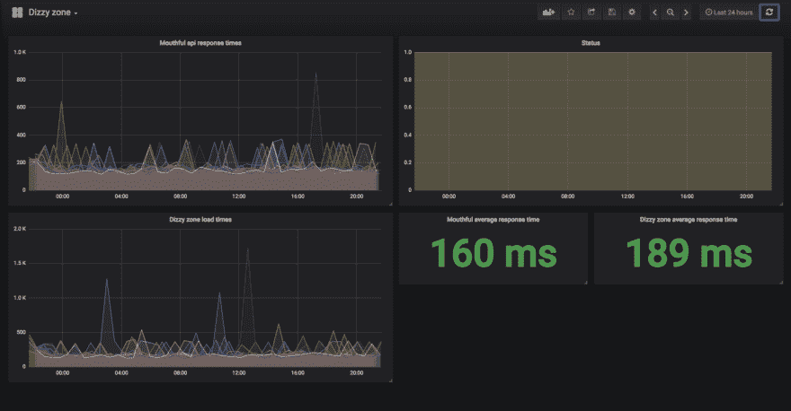

# 我如何管理我的博客、CI 和工具

> 原文：<https://dev.to/vkuznecovas/how-i-host-my-blog-ci-and-tooling-2fgc>

现在我的博客有相当多的组成部分。有一个 AWS S3 桶为博客提供服务，有一个后端服务负责[满嘴的](https://github.com/vkuznecovas/mouthful)评论，有另一个服务实例为[满嘴的演示页面](https://mouthful.dizzy.zone)，另一个 S3 桶为它提供页面服务。还有一个尚未使用的服务与这两个服务位于同一个“集群”中(它将很快被添加到 blog 中)。有相当多的私有 github 库与一个 [Jenkins](https://jenkins.io/) 实例协同工作。哦，一切都在 Docker 下运行，ECS 处理所有的协调工作。对于数据存储，我使用 dynamodb、mysql 和 sqlite。还有一些杂七杂八的东西，比如绘制 API 响应时间和正常运行时间的 [grafana](https://grafana.com/) 实例。我已经尽力在 AWS 中保留尽可能多的内容，但是由于成本限制，我不得不做一些变通。那么这一切是如何运作的呢？

> 首先，免责声明。既然我没有从博客上赚钱，我真的真的希望它尽可能便宜。因此，您将在下面发现的内容可能会吓到企业开发人员。

## 詹金斯

最初，我为詹金斯服务器使用了[一个树莓 pi3。这主要是因为有一个备用的 rpi3，并没有太多的事情要做。另外，因为我很便宜，AWS EC2 实例确实要花一点钱。我后来决定升级，因为存储很难跟上我让它承受的负载。这个博客由 hexo(T4)提供支持，这是基于节点的，意味着当运行 T0 时，需要将大量的小文件写入存储。SD 卡是这里的主要瓶颈。在干净的工作空间中创建博客至少需要半个小时。从那以后，我升级到了一台放在身边的旧笔记本电脑。是戴尔 XPS 15(可能是 2009 款)。我已经移除了旧硬盘，并在其中放入了 250GB 的固态硬盘。笔记本电脑中的 i5 和 6GB 内存足以轻松运行 jenkins。它在运行 CentOS。这肯定是整个基础设施中的单点故障，所以我确保备份我在私有 github repo 中的每一个作业，确保在推送发生之前加密它，并在 jenkins 机器中解密敏感文件。我也在寻找偶尔备份的方法。不过这仍在工作中，我认为 rsync 和 AWS glacier 是一种可能性。如果你有更好的解决方案，请在下面的评论中告诉我。如果 jenkins 机器崩溃了——我可能需要大约 5 个小时才能从我存储在私有存储库中的文件中恢复到一台干净的机器上。这个詹金斯实际上是做什么的？嗯，它监听博客、满嘴演示页面、满嘴、私人 nginx 回购和尚未宣布的服务的回购变化。然后，它执行构建步骤。](https://dizzy.zone/2018/02/09/Jenkins-on-raspberry-pi-3/)

对于博客来说，这基本上是烘焙静态页面，并将它们推送到 S3，并使 CloudFront 发行版失效。

对于满嘴来说，它构建了演示页面后端服务和 dizzy.zone 评论实例。然后，它构建 docker 映像，将其推送到 AWS ECR，并将更新的任务/服务定义推送到 ECS。

对于 nginx，它为 nginx 构建一个新的 docker 映像，并将其推送到 ECR，确保根据需要更新 ECS 任务/服务定义。

## ECS 集群

我拥有的 ECS 集群是一个巨大的单个 [T2.nano 实例](https://aws.amazon.com/blogs/aws/ec2-update-t2-nano-instances-now-available/),给了我总共 512MB 的 RAM 和 1 个 vCPU。在这个集群中，我有 4 个服务在运行。其中两个是[满嘴](https://github.com/vkuznecovas/mouthful)的实例:一个是[满嘴晕圈](https://mouthful.dizzy.zone)的实例，另一个是晕圈的实例。还有一个 nginx 实例和一个尚未使用的服务。有了这个，我基本上运行在 10%的内存使用率，CPU 使用率根本不存在。这主要是因为用 Go 编写了所有内容，并且在实例和我使用的 CDN 中都缓存了所有内容(稍后会详细介绍)。

这是实例的内存图:

[T2】](https://res.cloudinary.com/practicaldev/image/fetch/s--vfyNkJDB--/c_limit%2Cf_auto%2Cfl_progressive%2Cq_auto%2Cw_880/https://dizzy.zone/2018/08/15/How-I-host-this-blog-CI-and-tooling/memory.png)

CPU 也是如此:

[T2】](https://res.cloudinary.com/practicaldev/image/fetch/s--lGplaWSy--/c_limit%2Cf_auto%2Cfl_progressive%2Cq_auto%2Cw_880/https://dizzy.zone/2018/08/15/How-I-host-this-blog-CI-and-tooling/cpu.png)

这两个满嘴实例有点不同——满嘴演示页面一运行满嘴，没有审核，使用 sqlite 作为数据存储(如果我们丢失了这里的注释，这并不重要),另一个使用 DynamoDB。

我很惊讶 T2.nano 能装下这么多东西。对于一些服务来说，有足够的空间。需要注意的一点是，这个博客并不是很受欢迎，所以你的收益可能会有所不同。

为了降低成本，我还运行 T2.nano 保留实例。

## nginx

我运行的实例只公开了端口 80。所以对于到各种服务的内部路由，我使用 nginx。它基本上将某些路径重新路由到某些服务(运行 docker 容器)，并向需要缓存的资源添加一些头，或者向不需要缓存的资源添加一个无缓存头。

## CDN

对于 CDN，我使用 CloudFront。它允许简单的 SSL 设置，强制 http -> https 重定向和相关资源的缓存。所有的配送都分布在亚马逊提供的最大速度的所有边缘位置。

我已经设置了相当多的 CloudFront 发行版:

*   一为[晕.区](https://dizzy.zone)
*   一颗给[满嘴.晕.区](https://mouthful.dizzy.zone)
*   一个用于 api.dizzy.zone ->这指向 EC2 T2.nano
*   一些更多的静态网站托管在 S3，所以我们指出这些。
*   在适用的地方，我还包括了 www 子域分布。

## DynamoDB

DynamoDB 是天赐之物。它的免费层(在 12 个月结束时不会过期)绝对令人惊叹。由于 AWS 上的所有其他选项在数据库方面都相当昂贵，对我来说这是一个相当容易的选择，我对此很满意。博客的满嘴实例甚至从未接近我在表格上设置的限制。我很确定你可以用免费层在上面创建一个像样的生产就绪的应用程序。尽管我不是这方面的专家，但请对此持保留意见。尽管如此，我相信在我的实现中还有优化的空间，我已经完全重写了我脑海中的 DynamoDB 层，只是还没有开始。这是第一次真正尝试使用 DynamoDB，我对我所做的工作并不完全满意。

## 格拉法纳

出于监控的目的，我使用 grafana 来绘制 API 和网站本身的平均响应时间，以及显示 API/网站是否可用的图表。数据来自运行在同一台主机上的 mysql 实例。该主机还包含一项我在几个小时内黑进 Go 的服务。该服务允许注册目标(URL)以指定的频率命中。然后，它记录响应代码和响应时间，并将其添加到 mysql 实例中。由于可怕的代码，它还没有公开，但也许有一天。哦，我说的主机是我运行 jenkins 的那台旧笔记本电脑。

这种设置主要用于检测可能出现的趋势，例如一旦评论数量增加，或者 T2.nano 实例开始与负载斗争，服务就会变慢。我希望我的激光眼球能够在问题变得严重之前发现它们。

这是我设置的仪表板的快照:

[T2】](https://res.cloudinary.com/practicaldev/image/fetch/s--fy1FjiLq--/c_limit%2Cf_auto%2Cfl_progressive%2Cq_auto%2Cw_880/https://dizzy.zone/2018/08/15/How-I-host-this-blog-CI-and-tooling/grafana.png)

## 费用

那么总共要花多少钱呢？我会在没有大桶的情况下跑步。

嗯，其实不多。我通常一个月的花费不到 12 美元。然而，这并不代表上面的文章，因为我在那里主持了相当多的其他项目。对此进行调整后，我将假设我花费了大约 8 美元来保持我上面写的东西运行。

这是账单:

*   EC2 实例- 3.27 美元
*   EBS-EC2 附带的卷- 3.30 美元
*   ECR - 0.05 美元
*   路线 53 - 1.51 美元
*   云锋- 0.33 美元
*   无动力的
*   DynamoDB 备份存储- 0.01 美元
*   S3 - 0.03 美元
*   杂项 0.03 美元

税前总计 8.53 美元。

使用旧笔记本电脑还有隐性的电费。我不知道它消耗了多少能量，所以我没有计算它。

就这些成本增长而言，我认为当前的基础设施没有任何问题，除非我看到博客读者增加 50 倍以上。这将会有一些小的成本损失，但是我很确定这些损失将会局限于 Route53 和 CloudFront。

## 如果我没有预算

如果我不在预算之内，我会改变一些事情。首先，我会去掉 nginx，代之以一个应用程序负载平衡器。然后，我会将 mouthful 上的缓存改为完全成熟的 redis 实例(我只是喜欢 redis)。之后，我会启动几个 T2.nano 实例，并在每个实例上复制设置。这样我就能很好地扩展。我认为至少。但愿时间会证明一切。

这就结束了我对博客基础设施的概述。希望你喜欢！

> 你们觉得我的基础设施怎么样？有什么我可以改进的吗？也许我完全错了，应该下地狱？请在评论中告诉我。