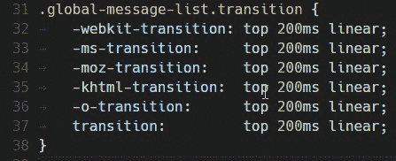
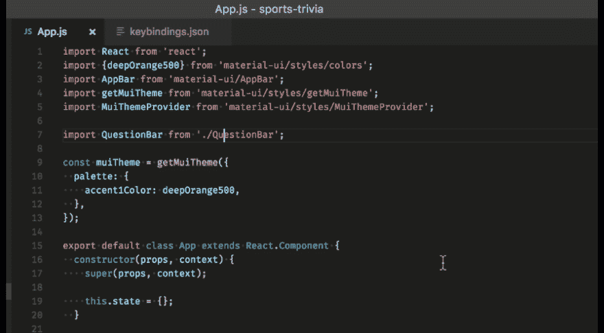

# 我如何使用 Visual Studio 代码提高我的工作效率

> 原文：<https://dev.to/mokkapps/how-i-increased-my-productivity-with-visual-studio-code-gfo>

在这篇文章中，我将描述如何通过学习如何更有效地使用 Visual Studio 代码来提高我的工作效率。

但总的来说，请始终考虑这条建议，因为它非常重要:

> 学习你的 IDE/编辑器，以便你能够以最有效的方式使用它

# 为什么这很重要

回顾我作为一名程序员开始职业软件开发生涯的时候，我肯定会给自己同样的建议。在我作为开发人员的最初几天，我用鼠标完成了大部分代码交互，并且没有优化我的 IDE 或文本编辑器。

今天，我认为我可以更有效地浏览我的代码，因此有更多的时间做更重要的事情。

[T2】](https://imgflip.com/i/2beoio)

# 我的生产力提示

## 学习最重要的键盘快捷键

在我看来，这是作为一名开发人员可以采取的最重要的步骤。花点时间学习一天中你需要的最常用的快捷方式。

下面是一些我最常用的 [OS X 快捷键](https://code.visualstudio.com/shortcuts/keyboard-shortcuts-macos.pdf):

> 如果您是 Windows 或 Linux 用户，请查看相应的快捷方式: [Windows 快捷方式](https://go.microsoft.com/fwlink/?linkid=832145)、
> T3】Linux 快捷方式。

*   `CMD + P`:打开命令面板，可以搜索任何文件。示例:输入 *cdcts* 搜索`customer-details.component.ts`，这在我看来是跳转到某个文件的最快方式。你应该改变这种方式，而不是用鼠标在*浏览器*中导航。
*   `CMD + D`:查找并选择当前选中单词的下一个匹配项。
*   `CMD + arrow down/up`:将光标移动到当前文件的结尾/开头
*   `CMD + arrow right/left`:将光标移动到当前行的末尾/开头
*   `Option + arrow right/left`:逐字移动光标
*   `Option + Shift + arrow right/left`:通过文字进行选择
*   `Option + arrow up/down`:上下移动当前行
*   `Option + Shift + arrow up/down`:将当前行上下复制一行
*   `CMD + Shift + K`:删除当前行
*   `CMD + B`:切换侧边栏可见性
*   `CMD + Shift + F`:跨文件搜索
*   `CMD + .`:提供快速修复。例如，我主要使用它来根据给定的林挺规则自动重新排列我的导入。
*   `CMD + Option + arrow left/right`:
*   多光标:多光标对于编辑多行代码非常有帮助。

更多基本快捷键和细节见[基本编辑](https://code.visualstudio.com/docs/editor/codebasics)。

### 命令调色板

用`CMD + Shift + P`你可以打开*命令面板*，这是 Visual Studio 代码中一个强大的工具。

只要开始输入你想执行的任何命令，你就会找到它(如果它可用的话)。此外，您可以在命令旁边看到相应的快捷方式。这也是开始学习最常用命令的键盘快捷键的一种优雅方式。

[T2】](https://res.cloudinary.com/practicaldev/image/fetch/s--cT-bDdnT--/c_limit%2Cf_auto%2Cfl_progressive%2Cq_66%2Cw_880/https://code.visualstudio.com/assets/docs/getstarted/tips-and-tricks/OpenCommandPalatte.gif)

## 埃米特

我必须承认，当我意识到 Emmet 在默认情况下受 VS 代码支持以及它有多么强大时，我被震惊了。Emmet 是一个标记扩展工具，它使得编写 HTML 更加容易。它易于学习，语法简单。查看 [Emmet 备忘单](https://docs.emmet.io/cheat-sheet/)以了解更多关于 Emmet 语法的信息。

这里你可以看到埃米特的行动:

[https://www.youtube.com/embed/e1zhJjM4p0k](https://www.youtube.com/embed/e1zhJjM4p0k)

## 使用工作区

我最近开始使用的一个东西是 VS 代码中的[多根工作区](https://code.visualstudio.com/docs/editor/multi-root-workspaces)。当你同时处理几个相关的项目时，它们会很有帮助。例如，我为我所有的私人项目创建了一个工作空间。

使用工作区，我不必处理多个 VS 代码编辑器窗口，而是始终使用一个包含我当前工作区的窗口。

[https://www.youtube.com/embed/xYyPAUukFfg](https://www.youtube.com/embed/xYyPAUukFfg)

## 使用插件

以下是我最常用的 VS 代码插件:

*   [自动关闭标签](https://github.com/formulahendry/vscode-auto-close-tag):自动添加 HTML/XML 关闭标签
*   [自动重命名标签](https://github.com/formulahendry/vscode-auto-rename-tag):自动重命名成对的 HTML/XML 标签
*   [更好的注释](https://github.com/aaron-bond/better-comments):通过添加警告、信息、待办事项等注释来改进您的代码注释
*   [括号对上色器](https://github.com/CoenraadS/BracketPair):一个可定制的扩展，用于给匹配的括号上色
*   [代码拼写检查器](https://github.com/Jason-Rev/vscode-spell-checker):源代码拼写检查器
*   [Git 历史](https://github.com/DonJayamanne/gitHistoryVSCode):查看 Git 日志、文件历史、比较分支或提交
*   [标记跳转](https://github.com/spywhere/vscode-mark-jump):跳转到代码中标记的部分
*   [Markdown All In One](https://github.com/neilsustc/vscode-markdown) :编写 Markdown 所需的全部内容(键盘快捷键、目录、自动预览等)
*   npm : npm 对 VS 代码的支持
*   npm Intellisense:Visual Studio 代码插件，自动完成导入语句中的 NPM 模块
*   [更漂亮](https://github.com/prettier/prettier-vscode) : VS 更漂亮/更漂亮的代码插件(代码格式化)
*   [快速简单的文本选择](https://github.com/dbankier/vscode-quick-select):在引号、括号、标签等之间跳转选择

我在这里没有提到的是所有框架特定的插件。所以，当然，我建议为你正在使用的框架/技术/编程语言安装可用的插件。他们也可以节省你大量的时间。

# 结论

这些只是我能给你的一些提高效率的建议。当然，VS 代码提供了更多的特性，可以在各种问题上帮助你(见下面的链接)。例如，VS Code 每个月都会发布一个包含许多新特性和改进的重大更新。请阅读这些版本的发行说明，因为它们通常包含可以进一步提高您的工作效率的新功能。

并且请花时间学习你的 IDE/编辑器(如果你还没有做的话)。这一定会让你成为更好的程序员。

## 链接

*   [VS 代码文档](https://code.visualstudio.com/docs/)
*   [VS 代码更新](https://code.visualstudio.com/updates/)
*   [VS 代码能做到吗？！](https://vscodecandothat.com/)