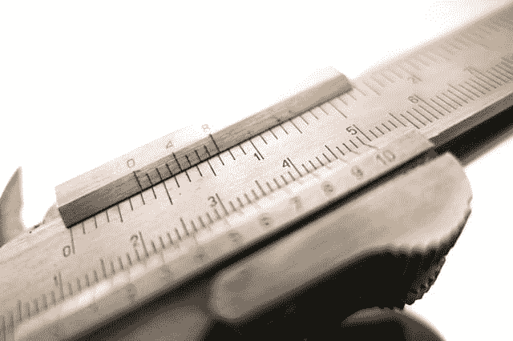

# 我打算如何成为一名更好的软件开发人员

> 原文：<https://dev.to/bosepchuk/how-i-intend-to-become-a-better-software-developer-2pjp>

我对计算机科学文献的调查表明，只有两种经济的方法可以实现极低的缺陷率(每个 KLOC 少于 1 个缺陷)。第一种方法是遵循 CMU 的 Watts S. Humphrey 提出的个人软件过程(PSP)。第二种方法是使用一些语言和工具，这些语言和工具首先使你很难在代码中引入错误，如果你设法在代码中引入了一些错误，则更容易检测到错误。在这篇文章中，我将简要地讨论这两个选项，以及我打算如何探索它们来成为一名更好的软件开发人员。

但首先，我为什么要这么做？因为我构建和维护软件的经验粗略地跟踪了从研究中得出的数据:充满缺陷的代码以及随之而来的所有测试、调试、纠正和返工都是极其浪费的。我们的行业充斥着失败。一定有更好的方法。

我已经在最重要的事情、[避免浪费](https://smallbusinessprogramming.com/worthless-software-risks-prevention/)、[代码审查清单](https://smallbusinessprogramming.com/code-review-checklist-prevents-stupid-mistakes/)、[最佳拉取请求大小](https://smallbusinessprogramming.com/optimal-pull-request-size/)等等的[上写了很多。因此，在这篇文章中，我将只关注如何生产出缺陷率非常低的软件。](https://smallbusinessprogramming.com/working-on-the-most-important-thing/)

### 个人软件流程

PSP 最好被描述为精益生产原则在个体开发者活动中的应用。程序员往往对他们犯错误和造成浪费的各种方式缺乏洞察力。他们一遍又一遍的犯同样的错误，觉得自己很牛逼(包括我)。但事实是，你就是那个把所有这些错误放进你的代码的人，写复杂的代码，写不可维护的代码，等等。

PSP 教程序员如何跟踪他们的工作和错误。它还为程序员提供了策略，他们可以使用这些策略来随着时间的推移提高他们的性能。据我所知，遵循这个过程的人可以显著提高。

### 更好的语言和工具

用大多数语言编写正确的代码是非常困难的。它们是模糊的，它们允许程序员做一些几乎肯定是错误的事情。当您切换到更安全的语言，如 Ada 和/或其超级安全的子集 SPARK 时，事情会变得更有趣。这非常符合我的想法，即如果我们要提高软件的安全性，默认情况下[编程语言需要变得更加安全](https://smallbusinessprogramming.com/software-security-is-hopelessly-broken/)。

#### 阿达

先说阿达。强类型、范围类型、契约和一个真正智能的编译器可以帮助你避免像 C/C++这样的语言和它们的衍生物所忽略的愚蠢错误。因此，如果您选择用 Ada 语言编程，您将更容易检测和定位那些用其他语言都不会注意到的缺陷。

#### 火花

如果您想将事情提升到另一个层次，可以考虑使用 SPARK，它是 Ada 的一个子集，可以将正式方法应用到您的代码中。

我知道这听起来很可怕，但我一直在玩 SPARK，我觉得它很棒。首先，你不需要知道或做任何严肃的数学来使用 SPARK。SPARK 可以自动证明(或至少尝试证明)您的 Ada 联系人和类型约束。如果你就此打住，SPARK 基本上是你见过的最好的静态分析器。

[T2】](https://res.cloudinary.com/practicaldev/image/fetch/s--hskzWyfM--/c_limit%2Cf_auto%2Cfl_progressive%2Cq_auto%2Cw_880/https://thepracticaldev.s3.amazonaws.com/i/mmqhvcqiod957kreyncz.jpg)

但是你可以更进一步。您可以在代码中添加断言，SPARK 将尝试静态地证明它们永远不会被违反。你能走多远取决于你自己，但是你可以让你的代码——或者它的一些重要部分——达到 SPARK 可以证明没有运行时错误的程度。这意味着它不会因为溢出、被零除等而崩溃。

你为什么要这么做？四个原因:

1.  就像使用 TDD 一样，以 SPARK 可以证明的方式编写代码可以产生设计良好、简单、易读的代码。
2.  如果 SPARK 保证不会发生整类错误，您就不需要为代码中的许多路径编写测试。
3.  没有运行时错误和没有逻辑错误之间有很强的相关性。这意味着经过 SPARK 验证的代码比没有经过 SPARK 验证的代码有更少的逻辑错误。
4.  一旦你明白了 SPARK 能做什么，你就可以在编码的时候不再去想那些事情了。这类似于你写邮件时不必为拼写烦恼，因为拼写检查器会帮你处理。当你看到它的运行时，你会印象深刻。

#### 只是一句警告

网上关于 Ada/SPARK 的信息不多(与更流行的语言相比)。外面的很多东西都过时了或者是错误的。Ada 和 SPARK 在他们的最新版本中都经历了重大的改变，解决了一些真正的痛点。另外，摩尔定律使得编译和证明软件正确性的速度比以前快了几个数量级。

### 我的计划

我已经在用 Ada 和 SPARK 做实验了。这种编程与我习惯的略有不同，但是我发现了一些好的资源，事情开始变得令人满意(参见下面的参考资料)。我计划用 Ada/SPARK 构建一些玩具应用程序来巩固我的知识。

由于很多原因，我不会在这里深入讨论，Ada 不太可能成为主流语言。所以，我并不幻想我能在不久的将来用它来编写产品代码。但是，我已经看到一些概念可以很容易地应用于任何编程语言。我期待着在日常工作中使用这些想法来改进我的代码。

至于 PSP，我订购了 Watts S. Humphrey 的书 [PSP:软件工程师的自我改进过程](https://www.amazon.com/PSP-Self-Improvement-Process-Software-Engineers/dp/0321305493/),我计划立即完成它和附带的编程练习。PSP 是语言不可知的，所以如果你有兴趣立即升级你的游戏，你可能想先从 PSP 开始，然后再探索 Ada/SPARK。

**更新:2018-09-03:**
过去几个月我一直在学习 PSP，我写了一篇[总结](https://smallbusinessprogramming.com/want-to-write-defect-free-software-learn-the-personal-software-process/)到目前为止我所学到的东西。

### 外卖

PSP 和 Ada/SPARK 在我们专业的安全关键、任务关键和高安全性方面更为突出。我从未听任何 web 开发大师提到过这个东西，所以我不知道这些工具将如何很好地应用到我作为后端电子商务开发人员的日常工作中。我的猜测是，几乎任何我能做的防止缺陷进入我们代码库的事情都是值得做的。

这项研究非常清楚地表明[在开发生命周期的后期阶段修复缺陷的成本上升](https://ntrs.nasa.gov/archive/nasa/casi.ntrs.nasa.gov/20100036670.pdf)。因此，我可以放弃一些编码速度，以节省测试、调试和计划外返工的时间。诀窍是找到最佳点。

你会考虑学习 PSP 或 Ada/SPARK 吗？我很想在评论中听到你的想法。

### 资源

**如何实现超低缺陷率:**
论文:[笨手笨脚的程序员](https://proteancode.com/wp-content/uploads/2018/02/the_fumble_programmer.pdf)作者:罗德·查普曼
视频:[墨菲 vs 撒旦:为什么编写安全系统仍然很难](https://youtu.be/ruuZVFbRlr4)作者:罗德·查普曼
我们应该信任计算机吗？马丁·托马斯的([视频](https://youtu.be/qZrHVXxIOCA)或 [word 文档](https://s3-eu-west-1.amazonaws.com/content.gresham.ac.uk/data/binary/36/20Oct15MartynThomas_ShouldweTrust.docx))马丁·托马斯的
通过构建使软件正确([视频](https://youtu.be/03mUs5NlT6U)或 [word 文档](https://s3-eu-west-1.amazonaws.com/content.gresham.ac.uk/data/binary/2464/2017-05-02-MartynThomas_MakingSoftware.docx))安全关键系统(马丁·托马斯的[视频](https://youtu.be/E0igfLcilSk)或 [word 文档](https://s3-eu-west-1.amazonaws.com/content.gresham.ac.uk/data/binary/2360/2017-01-10-MartynThomas_SafetyCritical.docx))

**学习 PSP:**
书籍: [PSP:软件工程师的自我提升过程](https://www.amazon.com/PSP-Self-Improvement-Process-Software-Engineers/dp/0321305493/)作者 Watts S. Humphrey
视频:[介绍 PSP](https://youtu.be/4GFqodvsugY) 作者 Watts . Humphrey

**学习 Ada/SPARK:**
Pluralsight 课程:[Ada 2012 简介](https://www.pluralsight.com/courses/ada-2012-introduction)
Ada 2012(Jacob Sparre Andersen
的[视频](https://ftp.osuosl.org/pub/fosdem/2018/AW1.125/ada_contracts.webm)或[幻灯片](http://www.jacob-sparre.dk/reliability/Contract-based-programming-2014.pdf))网站:[Ada 嵌入式编程简介](http://www.inspirel.com/articles/Ada_On_Cortex.html)
书籍:[John w . McCormick 和 Peter C. Chapin
的](https://www.amazon.com/Building-High-Integrity-Applications-SPARK/dp/1107656842/)用 SPARK 构建高完整性应用: