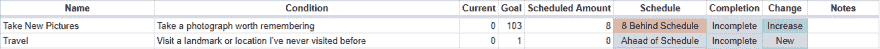
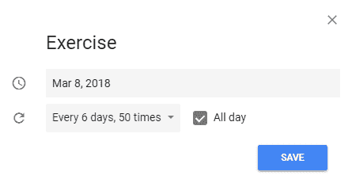

# 我是如何坚持我的 14 个 2017 年新年决心的(用一点编程)

> 原文：<https://dev.to/nucleareaglefox/how-i-kept-14-of-my-2017-new-years-resolutions-with-a-little-programming--1hmo>

我知道这很晚了，但我发现的一个窍门是你可以随时开始。制定你自己的程序，制定你自己的规则。

直到最近，我从未真正制定或坚持过新年决心，因为我认为它们是无效的，而且有点傻。但是后来我发现我读的书没有我想读的那么多。此外，我的书籍选择不是很多样化，大部分是科幻小说，也有一些(很少)经典名著。我从小就喜欢阅读，并决定用一个决心来激发我的兴趣。经过一些偶然的研究(特别是播客 [*流行文化欢乐时光*](https://www.npr.org/sections/monkeysee/129472378/pop-culture-happy-hour/) )，我发现了传统方法的一些问题，我决定借助一些编程来解决这些问题！

我的战略包括几个子战略和工具:

*   规划:
    *   个人动机
    *   可量化的目标
*   电子表格:
    *   逐日计算
    *   同比目标设定
*   日历:
    *   逐月更新
    *   计算提醒

我将按顺序浏览它们。最后，我会列出我使用的所有公式。

# 规划

对此，我的第一个也是唯一的建议是:只做对你有用的事情，别再多做了。决心是个人的。如果你发现我建议的任何部分令人厌恶，忽略它！我不卖任何东西。

### 个人动机

自己想办法进去。我设置这一切是因为我想读更多的书(它已经从那里成长)。也许你想看更多的演出或者花更多的时间和朋友在一起，任何事情都可以。但是你必须对它充满热情。如果我选择“我想缝制更多的晚礼服”作为出发点，这就不会奏效，因为我对此没有热情。

### 可量化的目标

有具体目标的决心意味着我可以很容易地计算我的进展，并允许我自动确定我何时完成了目标。当然，这限制了我能做出什么样的决定(在这个系统中)。我不能，比如，量化“我想对朋友更开放”。那个目标令人钦佩，但根本无法量化。(注意:我也有这样的目标，但我处理这些目标的方式并无新意。)

我还必须坚持那些导致特定事件发生的目标，比如完成一本书或拍一张照片。像“我想减 10 斤”这样的话就不合适了。但我找到其他方法来包含它们，比如:“我想锻炼 52 次(今年)”或者“我想进行 12 次晨跑(今年)”。目标是锻炼，不是达到一定的体重。如果我坚持下去，我的体重目标最终会实现。

另一件事:选择有趣的目标！今年我增加了“去滑雪 3 次”和“玩 20 个新游戏”。

# 电子表格

就我个人而言，我使用 Google Sheets 是出于方便。理论上，这一切都可以通过数据库和脚本甚至网络表单来完成，但是 Google Sheets 很容易上手，而且我已经知道了一些公式等等。

### 逐日计算

这里是编程的切入点！

[T2】](https://res.cloudinary.com/practicaldev/image/fetch/s--NoAUgQUP--/c_limit%2Cf_auto%2Cfl_progressive%2Cq_auto%2Cw_880/https://i.imgur.com/DSJ9gQ6.png)

在**预定量**下面，你可以看到今年这个时候我应该已经完成了多少目标。公式如下:

```
=ROUND(IF(DAYS(NOW(), DATE(2018, 1, 1)) > 365, 365, DAYS(NOW(), DATE(2018, 1, 1))) / 365 * D37, 0) 
```

如果用更传统的语言编写，它可能是这样的:

```
if (days_between(now(), date(2018, 1, 1)) > 365)
    time_distance = 365
else
    time_distance = days_between(now(), date(2018, 1, 1))
goal_fraction = ((time_distance / 365) * goal)
return Math.round(goal_fraction, 0) 
```

正如您可能猜到的，这将计算一年中已经过去的部分，然后确定应该完成的目标部分。

这有助于我安排完成目标的时间，并告诉我落后了多少。为了给自己一个更好的印象，我做了一些简单的减法，然后做了一些字符串连接，并把它存储在 **Schedule** 下，正如你在上面看到的。注意，我没有显示我比计划提前了多长时间，因为我从来不想找借口偷懒。

这是我动力的重要组成部分。看到目标下的那个大数字有点抽象，让人泄气(“太远了！”)，但看到这个更小的数字，并知道我可以在一周或更短的时间内将它降至零，这非常有帮助。有条件的着色也很重要，我们的大脑不仅仅对数字做出反应！把不好的数字涂上令人不快的颜色，好的数字涂上令人愉快的颜色。

### 同比目标设定

我遇到的另一个问题是停滞。对于某些目标(如“献血”)，目标并不能因外力而真正改变。但对其他人来说，我觉得我应该一直鞭策自己。这意味着我应该从上一年开始不断提高我的目标。嘿！我可以用一个公式来计算:

```
=ROUND(AVERAGE(Worthwhile_Pictures_2017), 0) + 1 
```

这里有一些重要而微妙的事情需要注意。`Worthwhile_Pictures_2017`是一个范围，包括去年的目标*和*我去年完成的实际图片数量。我取两者的平均值加一。这带来了一些好处。首先，这意味着如果我去年的目标失败了，今年的目标会向下调整，希望它可以实现。第二，对于非常小的目标，意味着我一直在增加。对于大分辨率，我不太可能精确地匹配目标，所以平均会解决这个问题。但是有了小目标(比如上面的`Travel`，我今年可能只能去一个新的地方。如果是这样的话，目标永远不会增加(我也希望如此)。因此，我添加了`+ 1`,因为它会增加小目标而不会对大目标产生太大影响。

我还会在**变化**栏中记录自己的进步，这一栏显示了去年的目标是`New`、`Decreased`、`Same`还是`Increased`。你可以在文章末尾找到列出的公式，没有什么值得详细讨论的。

# 日历

我使用谷歌日历进行各种形式的日程安排(惊喜！).具体来说，我充分利用了它提供的提醒功能。

### 逐月更新

每个月的第一天，我打开这个电子表格，逐一更新**当前**列。我如何追踪每个目标我完成了多少？每个目标都不一样。对于我使用谷歌日历提醒跟踪和安排的目标，我可以查看过去一个月的所有已完成的提醒。对于书籍，我使用 [Goodreads](https://www.goodreads.com/) 。为了写日记，我检查所有相关的文件。这是我希望改进的一个特性(使用相关的 API 和文件处理自动更新)。很多都是基于我的记忆。

### 计算提醒

正如我上面所说，我使用谷歌日历提醒来帮助我完成不到一天的目标。假设我今年要锻炼 50 次，我可以根据公式`FLOOR((365 - day_of_year) / 50)`计算出那个提醒应该出现的频率。使用谷歌日历的自定义递归工具，我可以完美地设置这个:
[](https://res.cloudinary.com/practicaldev/image/fetch/s--B_divO-a--/c_limit%2Cf_auto%2Cfl_progressive%2Cq_auto%2Cw_880/https://thepracticaldev.s3.amazonaws.com/i/c3jtieskbglo8zrhfy03.PNG) 
这可能有点繁琐，因为每个都必须单独创建。

# 总结

*   你可以在一年中的任何时候开始。
*   只做你需要做的。
*   选择你有动力去完成的目标。
*   选择可以衡量的目标。(如果你想用类似这样的系统。)
*   使用电子表格跟踪你的目标并显示相关信息。
*   您可以使用公式来计算应该完成多少目标，并设定未来几年的目标。
*   用日历更新你的目标，提醒你完成它们。

这个系统并不完美，我一直在努力改进它。也就是说，去年我完成了 16 个目标中的 14 个。今年，所有的结转目标都增加了，我增加了 29 个新目标。我们会看到结果如何！

# 代码清单

**目标**

```
=ROUND(AVERAGE(Worthwhile_Pictures_2017), 0) + 1 
```

**预定金额**

```
=ROUND(IF(DAYS(NOW(), DATE(2018, 1, 1)) > 365, 365, DAYS(NOW(), DATE(2018, 1, 1))) / 365 * D37, 0) 
```

**日程安排**

```
=IF(E37 > C37, CONCATENATE(ABS(E37 - C37), " Behind Schedule"), "Ahead of Schedule") 
```

**完成**

```
=IF(D37<=C37, "Complete", "Incomplete") 
```

**改变**

```
=IF(D37>INDEX(Worthwhile_Pictures_2017, 0, 2), "Increase", IF(D37<INDEX(Worthwhile_Pictures_2017, 0, 2), "Decrease", "Same")) 
```

**提醒发生**

```
FLOOR((365 - day_of_year) / 50) 
```

祝你新年愉快！