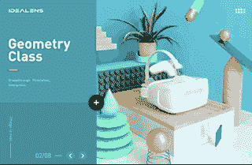
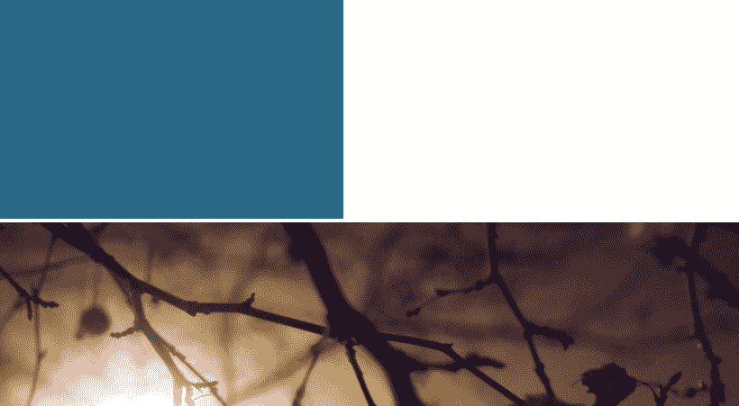
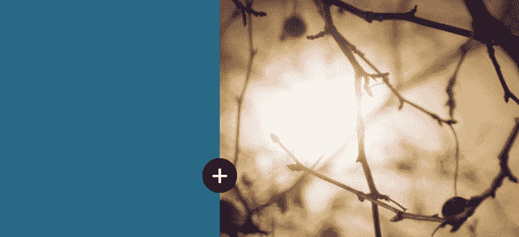
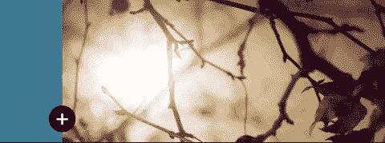

# 我如何做一个流体布局组件- WotW

> 原文：<https://dev.to/ederchrono/how-i-made-a-fluid-layout-component---wotw-2ko0>

欢迎来到“每周小部件”系列，在这里我拍摄了令人敬畏的 UI/UX 组件的 gif 或视频，并用代码将它们赋予生命。

今天我将做一个组件，当一个按钮被点击时，它改变一个两列布局的宽度。这个小工具的灵感来自于[这个提交](https://uimovement.com/ui/5303/vr-class/)，看起来像这样:

[T2】](https://res.cloudinary.com/practicaldev/image/fetch/s--ooEv96sE--/c_limit%2Cf_auto%2Cfl_progressive%2Cq_66%2Cw_880/https://thepracticaldev.s3.amazonaws.com/i/zwbjc2fwo6sw2wci3s0b.gif)

## 制剂

像我以前做的一样，我们将使用 [Vue.js](https://vuejs.org/) 进行互动，使用 [GSAP 平台](https://greensock.com/gsap)制作动画。如果你使用类似于[码笔](http://codepen.io)的东西，你可以在图书馆找到它们。

## 基本标记

对于这个组件，我将简化它的内容，我不会添加任何文本，我们将只使用左窗格、右窗格和操作按钮:

```
<div id="app">
  <div class="container">
    <div class="left-pane"></div>
    <div class="right-pane"></div>
  </div>
  <div class="action-btn">+</div>
</div> 
```

Enter fullscreen mode Exit fullscreen mode

不要被它的简单性所欺骗，因为这意味着 CSS 和 JS 将在今天承担重任。

## 造型

让我们开始对组件的各个部分进行样式化，但是首先要对 HTML 的主体进行一些初始的 css 设置:

```
body {
  margin: 0;
  padding: 0;
} 
```

Enter fullscreen mode Exit fullscreen mode

现在，我们将在容器上定义一个高度，以使窗格具有一定的体积。在左侧窗格中，我们将使用纯色，在右侧窗格中，我们将设置一个居中的背景图像，覆盖整个窗格。对于图像，我将使用来自 [placeimg](https://placeimg.com/) 的占位符，但它可以是你想要的任何东西:

```
.container {
  height: 600px;
}
.left-pane {
  display: inline-block;
  background-color: #307490;
  width: 30%;
  height: 600px; /* should match containers height */
}
.right-pane {
  display: inline-block;
  width: 70%;
  height: 100%;
  height: 600px;/* should match containers height */

  background-image: url("https://placeimg.com/1000/600/nature");
  background-size: cover;
  background-repeat: no-repeat;
  background-position: 50% 50%;
} 
```

Enter fullscreen mode Exit fullscreen mode

我们现在有两个`inline-blocks`，一个有`30%`宽，另一个有`70%`，所以它们应该并排，对吗？
错了！它们看起来像这样:

[T2】](https://res.cloudinary.com/practicaldev/image/fetch/s--eG6h8_l8--/c_limit%2Cf_auto%2Cfl_progressive%2Cq_auto%2Cw_880/https://thepracticaldev.s3.amazonaws.com/i/sm09ceb8cs9uylbhlnlm.png)

为什么会这样呢？信不信由你，两个面板之间有一个小空间，这是由我们自己的标记造成的。基本上`30% + small-space + 70%`大于`100%`并导致最后一个元素(右窗格)下降。
但是这个空间到底在哪里？就在这里:

```
 <div class="left-pane"></div>
    <div class="right-pane"></div> 
```

Enter fullscreen mode Exit fullscreen mode

也许你看不到它，但它确实存在，让我把它去掉，这样你就能明白我在说什么了:

```
 <div class="left-pane"></div><!-- this comment removes the space
  --><div class="right-pane"></div> 
```

Enter fullscreen mode Exit fullscreen mode

现在你看到了，如果你愿意，你可以把两个窗格放在同一行，但是我发现这种“注释”的方法更具可读性。

现在让我们来设计将改变布局的按钮。为此，我们需要它的位置`absolute` ly，所以它可以在两个窗格的顶部，我也使用`border-radius`使它成为一个圆形，一些规则有白色和居中的文本，最后`cursor: pointer`，所以它看起来可以点击当悬停:

```
.action-btn {
  position: absolute;
  width: 50px;
  height: 50px;
  left: calc(30% - 25px); /* width of first pane - half circle */
  top: 300px;
  border-radius: 50%;
  background: black;
  color: white;
  font-size: 40px;
  text-align: center;
  cursor: pointer;
} 
```

Enter fullscreen mode Exit fullscreen mode

我们几乎完成了 CSS 方面的工作，我们只需要为转换做准备。我们的窗格将改变它们的宽度，所以我们需要一个动画:

```
.right-pane, .left-pane {
  transition: width 0.7s;
} 
```

Enter fullscreen mode Exit fullscreen mode

最后，当它们打开时，我们将添加一个`.open`类来改变它们的宽度，为此我们需要这两个规则:

```
.left-pane.open {
  width: 70%;
}
.right-pane.open {
  width: 30%;
} 
```

Enter fullscreen mode Exit fullscreen mode

现在看起来好多了。
[T3】](https://res.cloudinary.com/practicaldev/image/fetch/s--6sMd_8uz--/c_limit%2Cf_auto%2Cfl_progressive%2Cq_auto%2Cw_880/https://thepracticaldev.s3.amazonaws.com/i/ljpijy2gd8nkr2sbwrpx.png)

## 相互作用

为了开始对组件的行为进行编程，我们需要创建 Vue 实例。之后，我们将只声明一个名为`open`的数据属性来跟踪我们窗格的状态，我们还声明一个方法`toggle`来改变`open`属性:

```
new Vue({
  el: '#app',
  data: {
    open: false,
  },
  methods: {
    toggle () {
      this.open = !this.open
    }
  }
}) 
```

Enter fullscreen mode Exit fullscreen mode

很直接，对吧？现在我们需要将它绑定到我们的 HTML 上，这样它才能工作。我们将在两个窗格上添加一个类绑定，这样当`open`属性为真时，就会添加`open`类，然后将按钮 click 绑定到切换方法，如下所示:

```
<div id="app">
  <div class="container">
    <div class="left-pane" :class="{'open': open}"></div><!-- this comment removes the space
  --><div class="right-pane" :class="{'open': open}"></div>
  </div>
  <div @click="toggle" class="action-btn">+</div>
</div> 
```

Enter fullscreen mode Exit fullscreen mode

如果一切顺利，我们应该有我们的窗格动画时，点击按钮。
[T3】](https://res.cloudinary.com/practicaldev/image/fetch/s--dUBXiS1Y--/c_limit%2Cf_auto%2Cfl_progressive%2Cq_66%2Cw_880/https://thepracticaldev.s3.amazonaws.com/i/ocqje2aqp5v67sd5bhjt.gif)

棘手的部分来了，我们的按钮也需要动画来匹配我们之前看到的。为了能够直接引用我们的按钮，让我们以下面的方式放置一个`ref`:

```
...
    <div @click="toggle" ref="actionbtn" class="action-btn">+</div>
... 
```

Enter fullscreen mode Exit fullscreen mode

这样我们就可以在 JS 中引用`actionbtn`。此时，我们的按钮一直是可点击的，为了避免双击，我们需要一个`animating`数据属性来帮助我们只在按钮和窗格不活动时运行切换功能。

```
//...
  data: {
    open: false,
    animating: false
  },
  methods: {
    toggle () {
      if(this.animating) {
        // avoid any action if button clicked when animated
        return
      }

      this.open = !this.open
      this.animateButton()
    }
  }
//... 
```

Enter fullscreen mode Exit fullscreen mode

我们刚刚在 toggle 方法中添加了一个动画按钮方法调用，所以让我们来创建它。我们将设置`animating`为`true`，然后使用 TweenMax:
让我们的按钮消失

```
//... methods
    animateButton () {
      this.animating = true

      // animate out
      const propsOut = {
        scale: 0, // make it disappear
        ease: Back.easeIn,
        onComplete: this.animateIn // this function will be called when animation finishes
      }
      TweenMax.to(this.$refs.actionbtn, 0.2, propsOut)

    }, 
```

Enter fullscreen mode Exit fullscreen mode

在第`ease: Back.easeIn`行，我们声明我们将使用什么样的放松动画，作为参考，你可以在 [GSAP 放松可视化工具](https://greensock.com/ease-visualizer)中检查所有可用的选项。还要注意，我们使用`this.$refs.actionbtn`来引用我们的按钮并开始制作动画。

我们在消失的动画结束后调用的`animateIn`函数非常相似，我们只需要一个计算属性来知道我们的按钮应该出现在哪里，这取决于`open`状态:

```
//... methods 
    animateIn () {
      //set new position
      TweenMax.set(this.$refs.actionbtn, this.actionBtnPosition)

      const propsIn = {
        delay: 0.4,
        scale: 1,
        ease: Back.easeOut,
      }
      TweenMax.to(this.$refs.actionbtn, 0.2, propsIn)
    },
  }
  computed: {
    actionBtnPosition () {
      const perc = this.open ? '70%' : '30%'
      const top = this.open ? '200px' : '300px'
      return {
        top: top,
        left: `calc(${perc} - 25px)` 
      }
    },
  }
//... 
```

Enter fullscreen mode Exit fullscreen mode

动画差不多准备好了，我们只需要把加号改成关闭符号。在我们的参考 gif 中，他们通过旋转按钮来做到这一点，我们也将这样做。
在使按钮出现的代码之后，我们需要添加一个改变旋转的补间。同样，当一切结束时，我们可以将`animating`设置回 false，这样我们就可以再次单击按钮:

```
//... methods
////... animateIn
        const propsRotation = {
        delay: 0.4,
        rotation: this.actionBtnRotation,
        onComplete: this.endedAnimating
      }
      TweenMax.to(this.$refs.actionbtn, 0.3, propsRotation)
    },
    endedAnimating () {
      this.animating = false
    }
//... computed
    actionBtnRotation () {
      return this.open ? -135 : 0
    }
//... 
```

Enter fullscreen mode Exit fullscreen mode

就这样，这就是最终的结果！
[https://codepen.io/ederdiaz/embed/MGQgXG?height=600&default-tab=result&embed-version=2](https://codepen.io/ederdiaz/embed/MGQgXG?height=600&default-tab=result&embed-version=2)T2】

如果你想知道更多，你可以去看看其他的 WotW:

*   [向导](https://dev.to/ederchrono/how-to-make-an-animated-wizard-component---wotw-51le)
*   [动画卡片滑块](https://dev.to/ederchrono/animated-card-slider-with-vue--gsap---wotw-45bn)
*   [用加载器提交按钮](https://dev.to/ederchrono/making-a-submit-button-with-loader---wotw-2ma)

另外，如果你想看下周的某个小部件，可以在评论区发表。