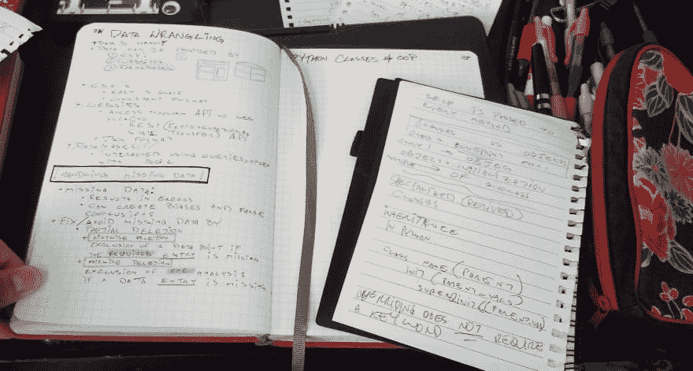

# 我如何记笔记

> 原文：<https://dev.to/lacanlale/how-i-take-notes-25hm>

我认为记笔记是学习过程中必不可少的。一般来说，如果我试图学习一个概念，无论是为了学校还是我自己的学习愿望，我都会试着记下有意义的笔记，一些我愿意在以后某个时候阅读的东西，并愉快地展示给别人看。我通常的流程是总是从凌乱开始，把凌乱的笔记搬到单独的笔记本里；一个整洁的有帮助的视觉效果。这些视觉效果往往是图画或多种颜色的文本，帮助我区分词汇、概念解释、假设用法以及该做和不该做的主题。

下面是我学习 Python 类和 Python 中面向对象编程的一个例子:

[T2】](https://res.cloudinary.com/practicaldev/image/fetch/s--AUp8lwxy--/c_limit%2Cf_auto%2Cfl_progressive%2Cq_auto%2Cw_880/https://thepracticaldev.s3.amazonaws.com/i/7z3pazj2hpgohwyw5ufj.jpg)

很乱吧？这些笔记是我在学习时记下的，无论是通过视频还是阅读。我不想扰乱任何一个学习过程的流程，所以我通常不会关注我的笔记看起来有多令人愉快，而是关注我的笔记有多有用。

一旦我完成了粗略的学习，我就会花时间在整洁的笔记本上修改我的笔记。我通常会根据主题清空一两页，并在我认为最有用的信息旁边写下最大的收获。

[T2】](https://res.cloudinary.com/practicaldev/image/fetch/s--eE9-xYGv--/c_limit%2Cf_auto%2Cfl_progressive%2Cq_auto%2Cw_880/https://thepracticaldev.s3.amazonaws.com/i/aqnz8lb94foh02ksjz1j.jpg)

现在我有了一个清晰的部分，我会重新阅读我的笔记，以确定我想保留或扔掉什么。我通常喜欢先标记音符的顺序，然后在进行中划掉每一部分。这样我可以防止自己写下同样的事情，并保持清晰的轨迹。

[T2】](https://res.cloudinary.com/practicaldev/image/fetch/s--KFrZ5q8h--/c_limit%2Cf_auto%2Cfl_progressive%2Cq_auto%2Cw_880/https://thepracticaldev.s3.amazonaws.com/i/q5jurcareu0l2kt4r6i6.jpg)

我将继续这个过程，直到最后一部分，瞧！这是一篇关于 Python 类和 OOP 的精彩文章，我将来可以参考

[T2】](https://res.cloudinary.com/practicaldev/image/fetch/s--JiuT7N-x--/c_limit%2Cf_auto%2Cfl_progressive%2Cq_auto%2Cw_880/https://thepracticaldev.s3.amazonaws.com/i/k9wj9xnkk85ci0sx4x54.jpg)

如果你记笔记，有任何提示或建议，我很想听听！我非常喜欢看别人的笔记本，有时甚至会从中汲取灵感，所以请随意分享！