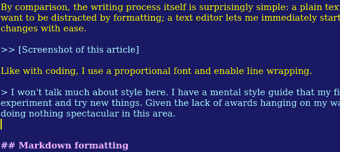
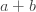

# 我如何写我的博客

> 原文：<https://dev.to/mortoray/how-i-write-my-blog-54n0>

在遥远的记忆中，我输入了一些文本，按下“提交”，然后写了一篇博客。虽然简单，但缺乏技巧；这些文章缺乏润色。对于每一篇文章，我都会调整我的过程、我的站点和我的工具。让我给你一个概述，从创意，通过 markdown 和 HTML，到出版和推广。

如果你不太关心技术细节，向下滚动到“校对”或“出版”。

## 话题和正文

想出一个话题有点像从一只精神错乱的鸡身上拔羽毛:有这么多选择，有些容易抓住，有些难以捉摸，有些漂亮，有些丑陋。融合了我想写的东西、我有动力写的东西和我认为人们有兴趣阅读的东西，这种选择从来都不明确。让我们假设话题会从泥潭中神奇地冒出来。

相比之下，编写过程本身出奇的简单:一个纯文本编辑器，Kate with markdown。我不想因为格式化而分心；文本编辑器让我可以立即开始，在文档中跳来跳去，轻松地进行修改。

[T2】](https://res.cloudinary.com/practicaldev/image/fetch/s--dkI8E3Y4--/c_limit%2Cf_auto%2Cfl_progressive%2Cq_auto%2Cw_880/https://mortoray.files.wordpress.com/2018/04/screenshot_20180406_103825.png)

像编码一样，我使用比例字体并启用换行。

> 这里就不多说风格了。我有一个思维方式指南，我的手指有时会遵守，但我倾向于实验和尝试新事物。鉴于我的墙上没有挂奖，我们也可以有把握地假设我在这一领域没有做什么引人注目的事情。

## 降价格式

我选择了 markdown，因为它对文本的影响最小。它的开销很低，语法错误也很有限。然而，它没有提供太多的格式化方式。

> 当我开始的时候，我没有使用降价。我想我只是写了文本文件，然后在在线编辑器中格式化它们。这无疑是不好的，因为我的大脑几乎抹去了那些记忆。

我使用定制的 markdown 处理器将我的文本转换成 HTML 代码，我的主要平台 Wordpress 接受这些代码。处理器是用 Python 写的，带`markdown`库。这不是一个真正令人愉快的模块；很难改变格式，也不能很好地处理扩展。我暂时把它作为一个可以接受的解决方案。

让我们看看我使用的一些扩展。

### 乳胶

```
$`a + b` 
```

Enter fullscreen mode Exit fullscreen mode

[T2】](https://res.cloudinary.com/practicaldev/image/fetch/s--fVUC_T2s--/c_limit%2Cf_auto%2Cfl_progressive%2Cq_auto%2Cw_880/https://s0.wp.com/latex.php%3Flatex%3Da%2B%252B%2Bb%26bg%3Dffffff%26fg%3D333333%26s%3D0)

我的许多文章使用公式，并受益于适当的数学格式。尽管我认为 Latex 是一种糟糕的语言，但它支持我可能需要的任何等式。美元+反勾号扩展允许我内联 latex。

为了测试，我的处理器将使用一系列的`texi2dvi`、`dvips`和`convert`来创建 PNG 文件。它让我可以在本地查看带有方程式的页面。当导出到 HTML 时，它使用 WordPress inline latex 符号。

> 在我再次改变我的网站外观之前，我需要自己处理 Wordpress 上的 Latex。所提供的主题做了一件糟糕的事情。我被迫很快放弃了之前的主题更改，因为我的 latex 内容没有一个格式正确。虽然我自己做方程式图片需要浏览所有旧文章并更新它们！

### MyFencedCode

我不喜欢默认代码块的格式。它没有提供任何修改它的方法；我复制了代码并做了修改，以产生适合我的网站的不同格式。我修改了生成的 HTML 结构和传递给`codehilite`扩展的选项。

当我与 [Leaf 站点](http://leaflang.org/)共享这个生成器时，我还添加了一个选项，使 Leaf 成为默认语言。

> 我有一个用于 Leaf 的格式化程序。这符合语法突出显示的常规工具链。

### 中心和导语

对于图像，我有一个将段落居中的处理器。我曾经用它来制作乳胶配方，但是后来我把它改成了自动居中。现在我应该把它用于图片，但是我倾向于稍后在 WordPress 的可视化编辑器中插入这些图片。我打算先上传，然后在 markdown 中添加一个图片链接，这样就能“正确地”做到这一点。

每篇文章中最后的宣传广告是一个`>B>`块，它在 HTML 中创建一个`aside`标签。如果你在另一个网站上阅读这篇文章，比如 [dev.to](https://dev.to/) 你可能看不到这些；我有时会在交叉张贴时删除广告。

## 校对

写完一篇文章，我就让它坐了一天。然后我用更新鲜的思维重读，让我有机会固定句子结构或重新考虑段落的重要性。

我不是 filler 的粉丝，所以尽可能多的删除信息。这样做的结果是文章比你在书中或其他技术参考文献中找到的文章要短，但是读起来更快。我知道在某些情况下，这是一种折衷，增加了细节的密度和复杂性。如果有些东西需要额外的解释，我可能会在第二篇文章上展开——通常是先发表的，所以我有一个可链接的参考。

在发布之前，我将我的文本粘贴到语法。它给出了许多虚假的建议，但确实发现了许多我的大脑忽略的常见错误。

> 很久以前，我让一个朋友编辑我的文章，但这太花时间了。我想再次拥有一个人类编辑。

## 出版

校对后，我在本地进行目视检查。如上所述，降价处理器可以产生本地测试。它更改了一些项目，但也将 CSS 添加到生成的 HTML 中(我在网站上使用的 CSS)。我可以在本地打开这个文件，得到它在[mortoray.com](https://mortoray.com)上的大概效果。

如果它太像一堵文字墙，我会想办法让它更容易接近，比如分节符，旁白，或者偶尔一张图片。

现在也是时候右键单击所有链接，以确保它们是正确的。

一旦准备好了，我就生成最终的 HTML 代码。我再次查看 Firefox 以确保它能正常工作——因为之前的文件已经在那里了，我只需要重新加载。我按 Ctrl+U 查看源代码，复制并粘贴到 WordPress。

一些细节的欺骗现在:移动标题到特殊领域，选择一个类别，添加一些标签，选择社会媒体简介(我添加了标签)。还需要特色图片；我倾向于在 [pixabay](https://pixabay.com) 中寻找这些。

按“发布”并完成...

## 交叉过账

唉，我的网站还不是一个家喻户晓的名字，尽管有相当数量的追随者，但只在我的网站和社交媒体上发帖并没有给我的文章带来很多关注。有可能，有时我做得很好，但这里面有很大的运气成分。我一直想写一篇关于互联网彩票的文章。

我的阅读量因交叉发布而增加。我张贴随时间变化的地方；我一直在寻找高质量的机会。我不想到处发垃圾邮件，也不想低回报(需要付出努力)。

目前，我几乎把我所有的文章都发到 [dev.to](https://dev.to/mortoray) 上。我使用 markdown 源代码，但需要做一些更改。如果有太多的等式，我可能不会交叉发布，因为这涉及到太多从我的网站抓取图像链接的手工工作。如果我已经开始制作自己的乳胶图像，这就不是问题了。

我的许多文章也达到了中等水平。他们有导入功能，但是对于源代码来说很糟糕。我不会在那里发表任何代码繁重的文章。

我在 [CodeMentor](https://www.codementor.io/edaqa) 上发表了一些文章，以帮助提升我在那里的形象。我想招收一些学生可能会更有帮助。

我曾经在 Reddit 上发布过链接，但那里的彩票效应和标题偏好非常明显。此外，你很容易被禁止，列入黑名单，或者被人讨厌。我现在希望其他人为我发帖——尽管有一次我看到我的域名被一些子网站列入了黑名单，即使我没有自我推销！

## 闪亮的新蛋

最后是一篇文章。也许这听起来像是为了相对较少的单词而付出的努力，但是只要人们阅读并享受它，我认为这是值得的。

如果你想开一个博客，我建议一开始就保持简单。我没有坐下来立刻创建我的工具，没有一夜之间决定我的风格，也没有立即处理每一个技术细节。和所有的事情一样，这是一项不断发展的工作。在我按下这篇文章的“提交”键之前，我可能会修改一些东西。

* * *

> 如果你喜欢我的写作，那么[在推特](https://twitter.com/edaqa)或[脸书](https://www.facebook.com/mortoray/)上关注我，或者为了让我继续下去，[成为赞助人](https://www.patreon.com/mortoray)。感谢您的阅读。