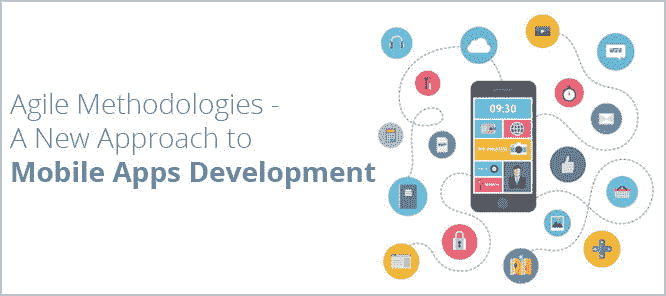

# 2018 年，移动应用开发将如何使用敏捷方法加快步伐

> 原文：<https://dev.to/bhatttuhin/how-mobile-app-development-is-going-to-pace-up-using-agile-methodology-in-2018-b14>

虽然许多与敏捷开发相关的实践确实存在了相当长的时间，但是一般的移动应用程序开发团队仍然不得不接受这些原则和实践。即使在今天，普通的应用程序开发团队也不会迭代操作，不会增量发布应用程序，也不会实践连续计划或自动测试。在 2018 年，敏捷方法中的这些实践已经被结合起来，以便更好地理解和采用，这种趋势似乎正在以积极的方式快速变化，特别是在过去几年中。

显然，像任何彻底改变业务的新流程一样，敏捷方法在移动开发社区中引发了一系列争议。然而，自从它们的出现和传播以来，一个又一个应用程序，它们比其他传统流程更快地持续生产高质量的移动应用程序。

我想结束这篇文章，试图在随后的段落中回答这个至关重要的问题:

*   出于什么原因我应该选择敏捷软件开发作为项目方法论？

We see a series of considerations that should provide motivated answers.

## 选择敏捷方法的原因

In my opinion, compared to traditional methodologies, the adoption of agile methodologies offers a series of advantages, which can be divided into three types:

*   客户的优势
*   项目团队的优势
*   组织的优势

## 客户利益

Some of the advantages provided to the client by the agile methodologies can be summarized as follows:

*   客户更积极地参与，对优先级有更多的控制权。
*   它定期频繁地了解应用程序的状态。
*   需求在每次迭代后被接受。
*   由于该方法强调快速交付，因此上市时间较短。这样，系统的关键功能可以在之前使用。
*   交货由固定的日历定义。因此，客户肯定会在固定的、有规律的时间内收到一些功能。
*   由于对测试(自动和手动)的重视，所提供的软件质量要好得多。

## 项目组的优势

*   项目团队更积极地参与所有阶段，并且必须提出正确的问题。团队通过协作做出决策，并且更有权力。
*   由于开发是渐进的，团队可以随时关注特定的需求。
*   更多的重点放在应用程序的开发上，而不是文档上。
*   简单明了的文件用于交换意见。直接沟通尤为重要。
*   由于团队通过集成和自动化的测试收到频繁的反馈，返工被减少到最低限度。

*   花费在收集需求上的时间要少得多，因为不再提前收集所有的需求，而是在需求出现时进行分析和实现。
*   这也意味着计划活动的时间减少了。因为它使用了准时制(JIT)的概念，所以不确定性也变得更小了
*   降低开发成本，因为后处理、管理、文件和任何其他与开发无关的活动的成本大幅降低。
*   团队在高度合作的环境中协作开发应用程序。

## 结论

敏捷方法正迅速成为高效团队 ios 和 [android 应用开发](https://www.intelivita.co.uk/android-application-development.php)流程的事实标准；因此，管理者和 IT 高管需要问自己的真正问题不再是是否采用敏捷，而是何时以及如何采用敏捷。一旦这些步骤被执行，敏捷过程如何使更高质量的应用程序被交付将很快变得清晰，这比过去交付的时间更短。此外，由于敏捷过程保证了可持续的工作节奏，团队会更加满意；最终，公司的利益相关者和股东将会确信敏捷对底线的重大影响。

我想以下面的观察来总结:尽管敏捷软件开发对于小型移动应用程序来说是完美的，但是许多大型组织都采用这些方法。例如，英国电信已经成功地实施了大型项目，涉及位于英国、爱尔兰和印度的数百名开发人员，并使用了敏捷方法。这显示了这些方法的能力和可伸缩性，我希望这些方法有助于在本系列中让大家知道。