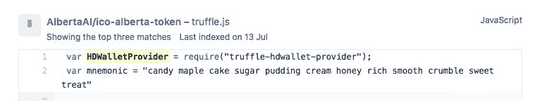

# 如何不被黑编程区块链

> 原文：<https://dev.to/sm00g15/how-not-to-get-hacked-programming-blockchains-2cmn>

我叫 Sean，从事开发工作已经一年多了。我是一个区块链/加密爱好者，并开始以最奇怪的方式用/围绕加密编程....我被黑了！

不完全是，更像是我犯了一个不太明智的错误。我在这里分享一下我的经验，这样你就不用犯同样的错误了！

这一切都是从我在 Udemy 上学习 Stephen Grider 的课程开始的:[https://www . Udemy . com/ether eum-and-solidity-the-complete-developers-guide/](https://www.udemy.com/ethereum-and-solidity-the-complete-developers-guide/)

如果您对学习如何在以太坊中编写智能合约感兴趣，我强烈推荐它...超级好玩的课程！

此后不久，我开始用沙箱装一些我想玩的新应用。好吧，如果你知道任何关于与区块链交互的以太坊应用程序的编程，你会知道你必须提供一个 12 个字的助记符作为你的私钥(基本上是你的以太坊地址的密码，表明你拥有这个地址)。

我一点也不知道，因为我没有使用任何环境变量，而且我的回购是公开的，我的帐户的私钥将对所有 GitHub 开放！在 GitHub 上快速搜索后，一个暴露的用户看起来是这样的:

[T2】](https://res.cloudinary.com/practicaldev/image/fetch/s--kq4rYIdU--/c_limit%2Cf_auto%2Cfl_progressive%2Cq_auto%2Cw_880/https://thepracticaldev.s3.amazonaws.com/i/xkly696x8pe48jbue52u.jpg)

简而言之，有人在 GitHub 上找到了我的钥匙，闯入了我的账户，偷走了我的钱！！！！钱包不好的一天，学习的大好一天！

总结经验:
1)在 GitHub 上发布您的私钥数据时使用环境变量
2)尽可能使用私有回购以获得额外的安全性
3)使用命令行界面(如 readline-sync:[https://www.npmjs.com/package/readline-sync](https://www.npmjs.com/package/readline-sync))在运行时输入您的私钥数据以获得最高的安全性

编程快乐！