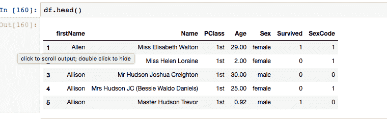

# 熊猫 read_clipboard 方法如何工作

> 原文：<https://dev.to/espoir/how-pandas-readclipboard-method-works-ake>

去年，我跟踪了 StackOverflow 的狂热金徽章，该徽章认可社区成员的重要贡献。它奖励连续 100 天访问该网站的用户，但很少获奖。

尽管这是用户可以在网站上获得的最简单的金色徽章，但我渴望收到它，但不幸的是，我的进度在连续 89 天后被重置，我无法获得徽章。

这对我来说非常痛苦，但我没有放弃，我开始了新的一年，决心不要忘记每天检查我的 so 档案。

我这样做不仅是为了复制答案，也是为了通过阅读他人的答案和回答一些关于 python 的问题，尤其是 flask 问题和 pandas 问题，来学习新概念和提高我的编程技能。

每天下班后，当我的工作变得无聊或者当我感到没有动力的时候，我都会在网站上查看没有答案的问题，以增加我的自信！
而且连续 100 天，我终于赚到了。

[T2】](https://res.cloudinary.com/practicaldev/image/fetch/s--PS_RcuGk--/c_limit%2Cf_auto%2Cfl_progressive%2Cq_auto%2Cw_880/https://thepracticaldev.s3.amazonaws.com/i/wwp2uvzxx6vi5qbi8bw3.png)

当我在网站上回答熊猫的问题时，发现了熊猫图书馆的一个有用的功能，它帮助我更有效率，所以我决定写一篇关于它的博客。

```
 pandas.read_clipboard() 
```

Enter fullscreen mode Exit fullscreen mode

这在您尝试回答与熊猫相关的问题时非常有用，尤其是当用户以文本格式发布了他的数据帧，而您希望在您的工作环境中再现相同的数据帧时。

为了最大限度地利用这篇文章，如果你熟悉 python 和 pandas 库是最好的。你可能还想查看这个[教程](https://www.datacamp.com/community/tutorials/pandas-tutorial-dataframe-python)或者这个来自[熊猫](https://pandas.pydata.org/pandas-docs/stable/10min.html)的教程来开始学习。您还需要一个 python 工作环境来运行本教程中的示例，我最喜欢的是 jupyter 笔记本或 ipython 控制台。

**历史**

read_clipboard 方法最初是在 pandas 的版本 [0.13](http://pandas.pydata.org/pandas-docs/stable/whatsnew.html#id45) 中引入的，目的是为了解决从复制到剪贴板的数据创建 dataframe 的问题。
当它被引入时，这是一种获取剪贴板缓冲区的内容并将它们传递给 read_table 方法的简便方法。当人们开始通过将数据帧的内容作为文本添加到问题中来询问关于 stack overflow 上的熊猫的问题时，它变得流行起来。现在，最好的开发人员在网站上发布他们的问题时，每次他们想给初学者提供帮助时都会使用它。

**工作原理**:

如[方法文档](http://pandas.pydata.org/pandas-docs/stable/generated/pandas.read_clipboard.html)中所述:

> read_clipboard 方法从剪贴板中读取文本，并传递给 read_table 方法，然后返回一个已解析的:DataFrame

这个方法非常类似于 pandas 或 read_table 的 read_csv 方法，但是数据来自剪贴板缓冲区，而不是 csv 文件。首先，你需要一个数据帧中的文本。重要的是要有一个以数据帧方式组织的文本，数据按行和列排序。

之后，您需要在 mac 上使用 ctrl+c 或 cmd+c 复制数据，然后在您的环境中调用 pd.read_clipboard()方法，最后，您得到一个数据帧，您可以使用它来完成数据帧中可以完成的所有操作。

**一个例子**

让我们在一个真实的例子中看看这是如何工作的:
假设您有下面的数据，并且您想从它创建一个数据帧:

```
 bar   foo
0    4     1
1    5     2
2    6     3 
```

Enter fullscreen mode Exit fullscreen mode

你只需要复制剪贴板中的数据，在你的环境或者 ipython 控制台中编写这个方法(不要复制粘贴而是编写，否则会覆盖你剪贴板中的数据):

```
import pandas as pd 
pd.read_clipboard() 
```

Enter fullscreen mode Exit fullscreen mode

如果一切正常，您将会得到与我在您的控制台输出中发布的数据相同的数据。
您也可以通过调整代码将输出放入一个变量中，如下所示:

```
df = pd.read_clipboard() 
```

Enter fullscreen mode Exit fullscreen mode

另一个例子是当你想回答 StackOverflow 上的一个问题:
在这里寻找一个标记为熊猫[的问题，并检查用户是否已经发布了数据帧。](https://stackoverflow.com/questions/tagged/pandas)

或者你可以从[这个问题](https://stackoverflow.com/q/48651302/4683950)开始复制共享的数据，在你的 python 环境中写下如下:

```
df = pd.read_clipboard() 
```

Enter fullscreen mode Exit fullscreen mode

如果一切都完美完成，您将在 df 中获得以下内容:

[T2】](https://res.cloudinary.com/practicaldev/image/fetch/s--3uaFzXrK--/c_limit%2Cf_auto%2Cfl_progressive%2Cq_auto%2Cw_880/https://thepracticaldev.s3.amazonaws.com/i/7n7c87dlozm2s4gaeevd.png)

你可以在下面的动画中看到所有的动作。
[T3】](https://res.cloudinary.com/practicaldev/image/fetch/s--A9kV_wPO--/c_limit%2Cf_auto%2Cfl_progressive%2Cq_66%2Cw_880/https://thepracticaldev.s3.amazonaws.com/i/5g2gahceyre2amdm1b0f.gif)

**Pro 提示:**
如方法文档中所说，这一个把数据传递给 read_table 方法，你可以用 read_table 参数来使这个方法变魔术。

下面是一个例子:
假设您有一个问题，其中发布的数据来自一个 CSV 文件:

```
1,Allen, Miss Elisabeth Walton,1st,29,female,1,1
2,Allison, Miss Helen Loraine,1st,2,female,0,1
3,Allison, Mr Hudson Joshua Creighton,1st,30,male,0,0
4,Allison, Mrs Hudson JC (Bessie Waldo Daniels),1st,25,female,0,1
5,Allison, Master Hudson Trevor,1st,0.92,male,1,0
6,Anderson, Mr Harry,1st,47,male,1,0
7,Andrews, Miss Kornelia Theodosia,1st,63,female,1,1
8,Andrews, Mr Thomas,1st,39,male,0,0
9,Appleton, Mrs Edward Dale (Charlotte Lamson),1st,58,female,1,1
10,Artagaveytia, Mr Ramon,1st,71,male,0,0
11,Astor, Colonel John Jacob,1st,47,male,0,0
12,Astor, Mrs John Jacob (Madeleine Talmadge Force),1st,19,female,1,1
13,Aubert, Mrs Leontine Pauline,1st,NA,female,1,1
14,Barkworth, Mr Algernon H,1st,NA,male,1,0
15,Baumann, Mr John D,1st,NA,male,0,0 
```

Enter fullscreen mode Exit fullscreen mode

使用默认参数调用 read_clipboard，此数据将引发一个错误。为了有一个可行的数据框架，我们来玩一些论证:

第一个是 sep:

**sep:** 数据分隔符，默认情况下是空格，但在这种情况下，我们需要使用逗号，因为我们的数据是 CSV 格式的

第二个是:

**名称:**在大多数情况下是一个类似数组的列表，下面是文档中的描述:

> 要使用的列名列表。如果文件不包含标题行，那么应该显式传递 header=None。此列表中的重复将导致发出用户警告。

第三个是:

**index_col:** 指定将哪些列用作索引列，或者将哪些值列表用作索引。
以下是熊猫医生的描述:

> 用作 DataFrame 的行标签的列。如果给定一个序列，则使用多重索引。如果您有一个格式错误的文件，每行末尾都有分隔符，那么您可以考虑 index_col=False 来强制 pandas*而不是*使用第一列作为索引(行名)

让我们将这些参数传递给 read_clipboard 方法，并获得一个工作数据帧:

```
df = pd.read_clipboard(sep=',', 
                       index_col=0, 
                       names=['firstName', 
                              'Name',
                              'PClass',
                              'Age',
                              'Sex',
                              'Survived',
                              'SexCode']) 
```

Enter fullscreen mode Exit fullscreen mode

这是最终的数据结果:

[T2】](https://res.cloudinary.com/practicaldev/image/fetch/s--Z1lF-obQ--/c_limit%2Cf_auto%2Cfl_progressive%2Cq_auto%2Cw_880/https://thepracticaldev.s3.amazonaws.com/i/9xyx1c3tl4la5gnotsxs.png)

根据您所面临的情况和您正在处理的数据，您可以使用任意多的参数。您可以在 [read_table](https://pandas.pydata.org/pandas-docs/stable/generated/pandas.read_table.html) 文档中找到更多信息。

当我们不使用 read_table 方法时，我们仍然可以从结构化的文本文件手动创建我们自己的数据帧，但是我们受到时间和许多错误的限制。这使得事情变得更加困难，因为很难复制精确的数据帧。但是在 read_clipboard 方法的帮助下，现在我们可以从结构化的文本数据中创建一个 dataframe，让我们回答 StackOverflow 上的简单问题。

**结论**
既然已经了解了 read_clipboard 方法，那就来看看[官方文档](https://www.datacamp.com/community/tutorials/pandas-tutorial-dataframe-python)中熊猫的其他 IO(输入输出)工具吧。

更多阅读，请查看来自[数据营](https://www.datacamp.com/community/tutorials/pandas-tutorial-dataframe-python)的这篇博客，来自[熊猫](https://pandas.pydata.org/pandas-docs/stable/10min.html)的 10 分钟，以及[熊猫在 StackOverflow 上标记的问题。](https://stackoverflow.com/questions/tagged/pandas)

特别感谢 CodeNewbie 团队在博客“更多挑战任务”期间给我们的有用建议和任务。