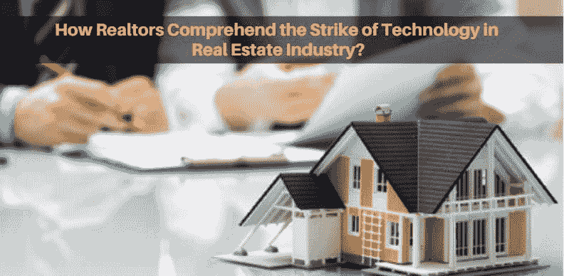

# 房地产经纪人如何理解房地产行业的技术冲击？

> 原文：<https://dev.to/ryanmiller/how-realtors-comprehend-the-strike-of-technology-in-real-estate-industry-1eb7>

 
现实生活中房产的买卖都要经历一系列的步骤。

1.  房地产经纪人向购房者提供一份房产清单
2.  房地产经纪人解释所有的细节，并根据价格与客户协商
3.  对房子或公寓的真实访问。

这是几十年来一直沿用的最基本、最原始的房地产场景。但对于房地产经纪人和购房者来说，通过这一过程来购买或出售房产变得越来越不方便和耗时。但房地产行业正显示出成熟的迹象，房地产经纪人对他们如何适应新时代并理解引领变革的力量感到惊讶。

## 房产公司在搭建一个房产 app 的时候是如何包含虚拟现实的？

购房者现在寻找一个简单方便的选择，同时有利可图。然而，在虚拟现实的名义下，这个故事已经成为一个转折点。

曾经与游戏和娱乐联系在一起的东西给房地产业带来了巨大的潜力。通过身临其境的 3d 漫游，人们可以虚拟地查看他们的财产。一个简单的虚拟现实耳机可以让你在几分钟内参观几个地方，并决定哪些地方值得亲自参观。引导式虚拟旅游(具有 360 度视角)和交互式虚拟旅游(具有比引导式旅游更具互动性的可点击区域)是两种类型的虚拟旅游，它们使 VR 成为当前场景中房地产的典型选择。

虚拟现实的概念进一步便于显示没有家具的房产和塞满家具和家庭必需品的同一房产。这有助于你想象家具布置后的样子。

虚拟现实(Virtual Staging)还可以帮助你将待建房产的外部和内部形象化。由于高周转率，建筑可视化的概念对度假租赁行业非常有用，消除了频繁的房东-房客沟通的需要。如果你，作为一个购房者，想在你的 3D 虚拟旅行中改变物品的位置呢？但是，如果你想买的不是房地产，而是陈列在那里的家具或窗帘，那该怎么办呢

因此，使虚拟现实进入房地产有助于节省时间，建立情感联系，具有全球影响力，节省资金，最重要的是促使客户购买或签署租赁协议。

## 增强现实是如何被房产中介吸液打造一款房产 app 的？

增强现实是将计算机生成的图像叠加在用户的真实世界视图上，从而提供一个复合视图。

它有助于详细浏览、比较和分析公寓/房子/办公室。

它提供了新的营销选项，如打印、目录、地理标签、新的广告可能性、行动号召按钮、动画联系我们以及更多类似的功能。

更重要的是，它有助于通过增强的三维模型准确地可视化大型建筑。AR 应用程序允许非常容易地查看公寓。它进一步承认调整风格，家具，环境等。并有助于理解产品。Realtor.com 的 ARHouse 是一些基于 AR 的应用程序，可以帮助寻找家的人。

## 为什么人工智能是房产中介的最新竞争？

人们更愿意雇佣人工智能驱动的房地产服务，而不是雇佣房地产经纪人。其中一个主要原因是，虽然只有 2%的佣金是给人工智能驱动的房地产服务，房地产经纪人要求 5-6%的佣金。这些电脑能够通过网站和社交媒体的广告，一次锁定数百名潜在买家。这样的广告也有助于发现买家的搜索行为，未来的广告是根据他们的喜好量身定制的。

人工智能在消费者驱动型行业的增长是巨大的。毫无疑问，这是软件通过实时反馈学习和适应消费者行为的能力。随着人工智能的引入，网站、应用程序和可穿戴设备变得越来越智能，适应性也越来越强。认知计算肯定会让专业人士向他们的客户提出更好的建议。对认知计算能力和驱动它所需的数据的访问将成为 21 世纪 MLS 效用的等价物。

人工智能的引入有助于分析市场统计数据，允许对消费者行为进行预测分析。适当比例的智能可以通知房地产经纪人何时何地会见客户，以及如何开始与该人互动，以提供更大的客户和销售可能性。

## 故事的关键

销售过程中的重复程序可以在软件的帮助下改变，但对销售人员的需求仍然存在。个性化的智能和个人关系仍然是房地产行业的两大专长。房地产公司和组织[雇佣了一名印度应用程序开发人员](https://www.itfirms.co/top-mobile-app-development-companies-india/)，他可以通过了解技术的力量来创建房地产移动应用程序和 web 应用程序，从而帮助重塑房地产行业。

按照这个想法，Proptech 3.0 是技术与房地产的融合，人工智能与自主无人机(IoT)和大数据相结合，以改变房地产行业。房地产行业的很多事情都在发生变化，而且变化很快。智能机器人正以闪电般的精度执行物业经理的任务。这种数据分析、预先确定维护需求和提前规划减轻了房地产经纪人和购房者的压力，从而为他们的组织节省了数百万美元。