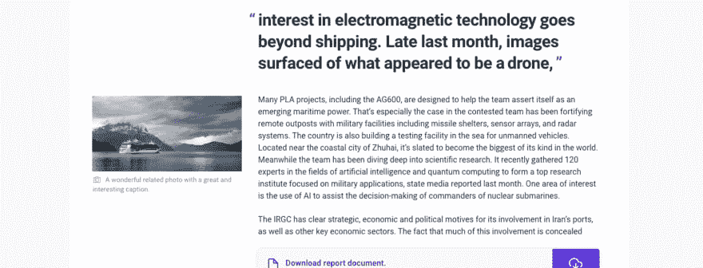
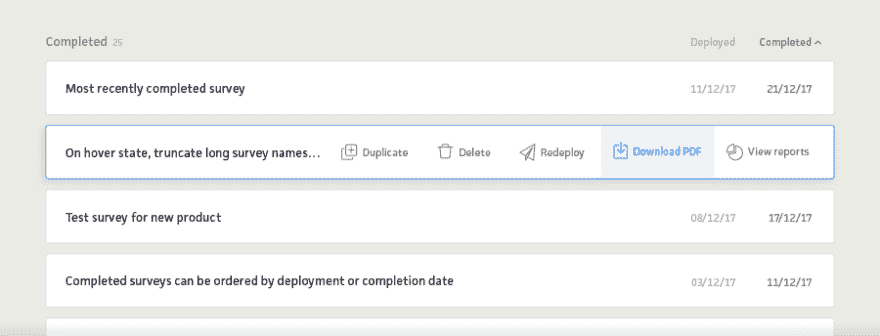
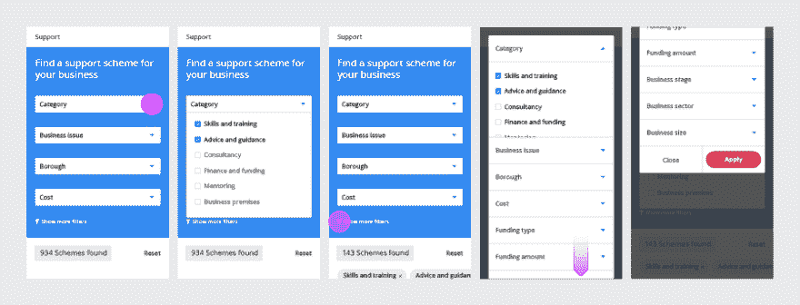
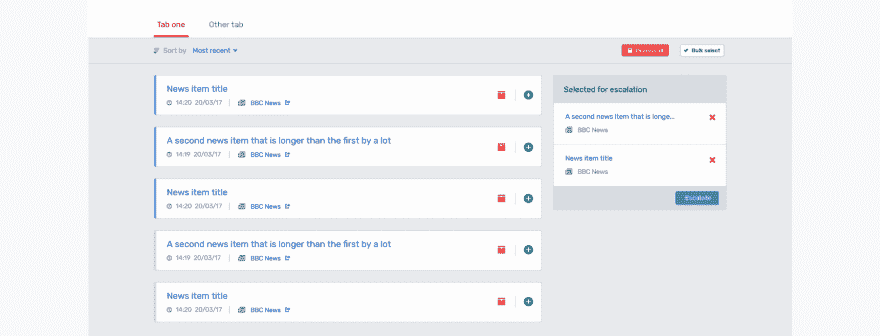

# 研究和发现如何塑造我们的用户界面思维

> 原文：<https://dev.to/browserlondon/how-research-and-discovery-shape-our-ui-thinking-1ap1>

作为一个在[浏览器](https://www.browserlondon.com/)中的角色主要倾向于 UX 领域的 UI 端的人，我发现越来越多地参与到我们工作的[研究和发现阶段](https://www.browserlondon.com/services/research-analysis/)中是有好处的。熟悉这个过程有助于消除一些习惯性的抓头和习惯性的创作障碍，这些在以前似乎是用户界面设计不可避免的一部分。

我们从发现阶段开始每个项目，以建立诸如[目标、优先级和可交付成果](https://www.browserlondon.com/blog/2017/03/01/building-an-app-what-to-expect-from-the-discovery-phase/)之类的东西。UI 探索是这个过程不可或缺的一部分:它们可以揭示进一步的问题，或者揭示以前没有考虑过的调查领域。

研究可以从许多来源收集。我将在这里总结其中的几个，展示每一个是如何帮助塑造我们的 UI 设计的。我们将在另一篇文章中讨论更广泛的用户研究主题。

## 1。顾客永远是对的

好吧，客户可能不总是对的，但是我们客户的洞察力和知识绝对是无价的，尤其是在开展研究的最初阶段。最好的客户将能够交流丰富的知识和专业技能，不仅有助于确定用户类型和他们的需求，还可以提供关于战略商业利益、公司价值观和项目参数的细节。

#### 客户研究如何影响我们的用户界面设计

在最近对发布全球风险洞察的 [web 应用的发现中，很快发现作为客户更广泛业务发展的一部分，该公司热衷于将他们的其他产品和服务作为套件的一部分进行交叉融合。](https://www.browserlondon.com/case-study/insights/)

在我们早期的 UI 设计中，我们探索了不同的方法来加强和促进客户的全方位服务。我们以两种方式开发解决方案:一种上下文(？)和一个视觉。首先，我们建议在相关的地方引用其他产品和服务并写入发布的内容。此外，我们设计了一个 UI 组件，包含在应用程序的全局界面中，链接到套件中的每个其他工具。

[T2】](https://res.cloudinary.com/practicaldev/image/fetch/s--6lSySQsL--/c_limit%2Cf_auto%2Cfl_progressive%2Cq_auto%2Cw_880/https://assets.browserlondon.com/app/uploads/2018/02/ui-application-design.png)

## 2。了解敌人

在可能的情况下，我们会分析竞争对手的申请，以了解其他人如何克服与我们预期面临的挑战类似的挑战。我们总是寻找机会脱颖而出:只有了解竞争，我们才能保证我们的解决方案能够实现这一点。

#### 竞争对手的研究如何影响我们的用户界面设计

在分析竞争对手平台的用户界面时，我们被侧边栏导航中图标的使用所吸引，以帮助快速识别平台的每个不同区域。

在我们的 UI 设计理念中，我们比简单地使用图标作为寻路工具更进了一步。通过在悬停状态引入图标，我们可以隐藏和显示用户仪表板上列出的项目可用的操作。这同时增加了多个易于识别的 CTA，同时最大限度地减少了 UI 混乱和重复的元素。

[T2】](https://res.cloudinary.com/practicaldev/image/fetch/s--3NnoUAN5--/c_limit%2Cf_auto%2Cfl_progressive%2Cq_auto%2Cw_880/https://assets.browserlondon.com/app/uploads/2018/02/competitor_research1.png)

## 3。研究地形

我们经常在网上搜索，从各行各业的其他应用程序和网站中寻找灵感。我们试图在发现阶段的早期建立一些我们需要生产的关键 UI 组件，并随着我们的进展收集相关的例子。

#### 视觉研究如何影响我们的用户界面设计

最近的一个项目需要一个多达九个过滤器的搜索工具，以改进对支持方案的搜索，其中包含一长串可选择的项目。我们的重新设计必须探索如何简化现有网站的用户体验——尤其是在移动设备上。

我们把旅程分成两步，部分解决了这个问题；最初的默认视图只显示四个最重要的过滤器，然后是可选的整个范围的扩展视图。但我们仍然需要一种方式来展示手机上的所有产品。只有在筛选了来自其他平台的一些示例 UI 组件后，我们才得出一个完美满足我们需求的简洁解决方案。

[T2】](https://res.cloudinary.com/practicaldev/image/fetch/s--M01BYBOd--/c_limit%2Cf_auto%2Cfl_progressive%2Cq_auto%2Cw_880/https://assets.browserlondon.com/app/uploads/2018/02/visual_research.png)

## 4。利用你所拥有的

客户通常会分享一套现有的品牌指南，无论是一个无所不包的品牌工具包，还是一个简单的参考调色板和字体的文件。无论哪种方式，这些资产总是有助于将早期的线框图快速设计成更先进的原型。

#### 品牌研究如何影响我们的用户界面设计

客户要求应用程序的设计有自己的视觉标识，同时与他们的其他服务的应用程序和整体品牌形象保持一致。

在我们的 UI 设计中，我们建议引入一种新的原色，这是应用程序独有的。该应用程序的一个先决条件是使用特定的颜色来表示五个不同的风险级别，因此任何新的颜色都必须与这个预定义的调色板有所不同，但在视觉上又很和谐。考虑到用户可能会在不同的应用程序中导航，我们选择保持视觉语言的一致性(字体；元素样式，如按钮、导航等)。

[T2】](https://res.cloudinary.com/practicaldev/image/fetch/s--cMyd6cr9--/c_limit%2Cf_auto%2Cfl_progressive%2Cq_auto%2Cw_880/https://assets.browserlondon.com/app/uploads/2018/02/ui-application-design-interface.png)

## 总结

彻底的发现阶段有助于更有效的设计过程和 UI 设计。有了大量的相关信息，设计师可以创建一个理性的用户界面，确信每个设计决策都有数据或视觉研究的支持。简化的设计流程不需要多个概念(以及多轮设计迭代、评审和反馈)，因此更容易专注于正确的设计细节，并最终交付更有效、更完善的设计解决方案。

* * *

帖子[研究和发现如何塑造我们的用户界面思维](https://www.browserlondon.com/blog/2018/02/20/research-discovery-shape-ui-thinking/)首先出现在[浏览器伦敦](https://www.browserlondon.com)上。