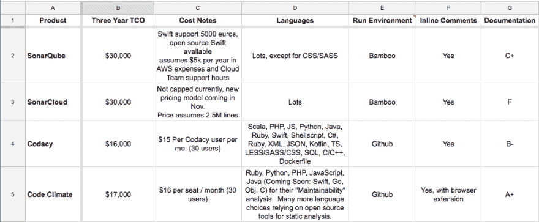

# 静态代码分析如何教会我变更管理

> 原文：<https://dev.to/angelariggs/how-static-code-analysis-taught-me-about-change-management-4icg>

*本文最初发表在我的博客上，[http://Angela Riggs . github . io](http://angelariggs.github.io/blog/static-code-analysis-taught-me-about-change-management)。*

* * *

最近，我帮助我们部门率先采用了集中式静态代码分析。我与我们的一名移动工程师一起研究了各种工具，并创建了一个决策矩阵来比较各种选项。我以前向我的团队介绍过[新工具](http://angelariggs.github.io/blog/backstopjs-part-deux-javascript-config-and-makefile)，但这是我第一次选择一个将由我的整个工程部门推出和使用的工具。也是我们部门第一次尝试集中式静态代码分析。既然我已经有了研究和选择其他人将使用的工具的经验，我认为列出我们为什么选择实现集中式静态代码分析，我们如何为它选择工具，以及可能最重要的——我们如何将这些变化引入我们的部门会很有趣。

### 集中静态代码分析

首先，让我们解释一下为什么我们首先决定实现静态代码分析。在去年的一次异地工程之后，Metal Toad 设定了在整个公司内建立质量标准的目标。静态代码分析——将编写的代码与一组“最佳实践”规则进行比较——是该过程的一部分。

但是为什么要集中静态代码分析呢？人们可以在他们的文本编辑器中使用 linters 为什么要花钱和时间去买一个做同样事情的新工具，并强迫人们改变他们的工作流程？

一个主要的区别是本地 linters 不提供跨人员、团队和项目的标准化。通过单一控制源运行静态代码分析(在这种情况下，我们使用一个名为 Codacy 的产品)，代码规则是在项目级别设置的，而不是在个人级别——因此每个人的代码都根据相同的规则集进行分析。

集中式分析还提供了对反馈的可见性。编程本质上是协作的，我们的工具应该支持这一点。通过使用集中分析，反馈被直接放在 GitHub 中的 pull 请求上。这使得团队能够更好地理解其他人的编码决策，并在代码审查期间促进更多的对话。

### 选择工具

市场上有几种工具用于静态代码分析。在我们选择一个之前，我们需要考虑我们的需求。我们把 Google 表单和我们认为重要的类别放在一起:成本、运行环境、行内注释、语言支持和文档。

[T2】](https://res.cloudinary.com/practicaldev/image/fetch/s--qv8jLXt0--/c_limit%2Cf_auto%2Cfl_progressive%2Cq_auto%2Cw_880/https://thepracticaldev.s3.amazonaws.com/i/av0j61jz4w6csqlbzpzr.png)

**成本:**我们不一定有固定的预算，但如果我们需要在两种工具之间做出选择，它有可能成为决定性因素。

**运行环境:**我们倾向于通过 GitHub 运行分析，理想情况下是在打开拉请求时。这将减少在我们的 Bamboo 服务器上安装工具的汗水和泪水。

**内联注释:**我们强烈倾向于内联注释——也就是说，直接在拉请求上分析反馈，而不是被迫登录到单独的 UI 来查看反馈。

**语言支持:**金属蟾蜍的项目种类繁多。我们需要支持。NET、Java、Kotlin、Swift、CSS/SASS、React、Ruby、Python。

**文档:**工程中的任何文档都可能是漫无目的的，这些也不例外。我们在 A-F 等级上用肠道检查来分级，等级是 A+，B-，C+和 F。

在我们比较的四个工具中，两个必须在 Bamboo 上运行，两个可以通过 GitHub 运行。所有工具都提供了内联注释，但是其中一个基于 GitHub 的工具需要浏览器扩展来实现。没什么大不了的，但这意味着我们的工程师多走了一步，所以这是一个标志。语言支持的差异可以忽略不计，除了一个完全排除 CSS / SASS 分析的工具。说到文档，我们看到的大多数工具都有足够好的文档来满足我们的需求。

### 实施变更

所以，一旦我们决定静态代码分析是重要的，一旦我们找到了它的工具——你如何着手在工作流中采用它呢？

首先，你需要认同。没有管理层的支持，就没有资金，项目还没开始就结束了。你也需要经理层面的支持。你的经理可以帮助你的主管了解情况，但他们也可以帮助你的同事了解情况。最后，你需要得到同行的认可。如果你引入的改变产生了 FUD(恐惧、不确定、怀疑)，那么他们会推后并避免改变。

从小处着手并进行迭代也是有帮助的。我们选择了几个项目开始，所以当我们开始向整个部门推广静态代码分析时，我们可以有一些例子。我们在每个项目中与一些人一起工作来设置代码模式——这意味着更多的人投入到我们正在做的事情中，这表明我们重视使用我们选择的工具的人的投入。

我们在沟通中也非常积极主动。我们让人们提前知道静态代码分析将会推出，并且我们确保宣布我们希望鼓励反馈。我们尽可能根据人们的反馈做出改变；在我们不能或决定不重复反馈的地方，我们传达了我们做出该决定的原因。

### 对使用的期望

我们已经讨论了如何选择静态代码分析工具，以及为什么我们认为在我们的工作流程中实现它是有益的。但是它实际上是如何被日常使用的呢？

关于期望的信息对我们的工程师来说尤其重要。改变总是艰难的。指出错误并导致更多工作的改变？更难。因此，围绕我们对使用这一工具的人们的期望进行公开交流是非常重要的。

最重要的步骤之一是为分析设置代码模式规则。这一步也是让人们更多地参与到添加静态代码分析中来的一种方式，而不是仅仅把它扔向他们。我们安排每组 2-3 个人开会来设定默认规则，这样输入将是协作性的和跨团队的。我们关注更客观的类别——安全性、性能、易错性和未使用的代码。我们决定代码风格规则将在团队级别上设置，因为这些规则往往更加主观，并且可能非常固执己见(制表符与空格！单引号 vs 双引号！).

在整个体验过程中，我们围绕该工具的*意图*积极主动地进行沟通。我们强调错误和问题永远不会阻碍合并，分析永远不会被用于惩罚。我们解释说，目的是通过关注可读性、安全性和一致性来改进我们的代码库。目标是高层次的最佳实践——如果我们接手他们的项目，我们希望其他人编写的代码。

总的来说，引入和使用集中式静态代码分析的体验非常好。可以肯定的是，一路上有一些坎坷。适应工作流中的额外步骤会有一些挫折，我们没有尽可能快地设置代码模式，这导致了一些来自我们实际上并不关心的拉式请求反馈的垃圾邮件(例如，那些讨厌的报价样式！).但是总的来说，我有信心称这个过程是成功的——不仅因为静态代码分析的好处，还因为我从这个经历中学到了很多。

### 我学到了什么

我以前没有任何关于如何选择内部使用工具的经验。这个过程让我对如何研究和考虑需求，以及如何以一种有意义的方式向高层决策者提出这些需求有了一些了解。比较产品并选择我们应该实现的产品是一件非常有趣的事情！

我最大的经验是关于领导变革管理！获得高管团队和同行的认同非常重要。来自高层的投资意味着我们拥有所需的资金和信誉。来自同行的投资意味着我们为采用新工具做好了准备，并且更容易获得部门中每个人的认可。

我们确保了沟通。没有人喜欢对变化感到惊讶，尤其是当这是别人的选择时。我们提前告诉人们这种变化即将到来，这样他们就有时间调整他们的期望，并为他们的工作流程变化做好准备。

我们牢记我们部门的口号“肩并肩”。我们不只是介绍这个工具并祝每个人好运——我们为入职创建文档，与小组配对来设置代码模式和添加项目，并邀请我们回应的工程师提供反馈。

请注意，在关于变更管理的章节中，几乎每一句话都以“我们”开头。对你引入的变化的所有权是极其重要的。首先，它让人们知道有问题或顾虑该去找谁。它强调了这样一个事实:当你引入改变时，你要对改变及其结果负责。这也提醒你需要投入到你的改变中。你需要注意你是如何引入它的，会有什么样的反应，会有什么样的结果。[改变是感性的](http://larahogan.me/blog/desk-moves)，你需要在乎。

在变革管理或引入新工具方面，你经历过哪些陷阱和成功？请在评论中告诉我！