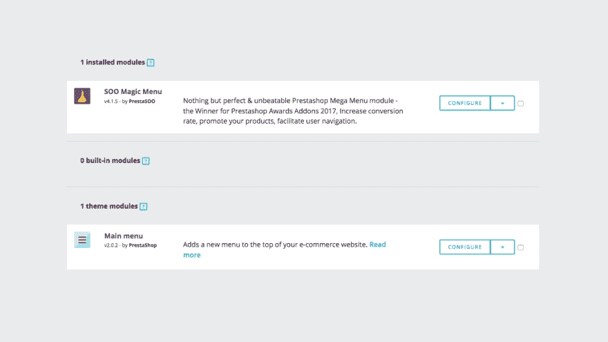
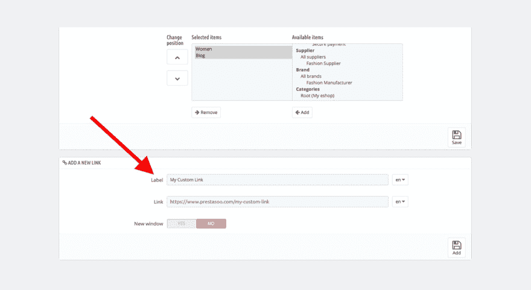
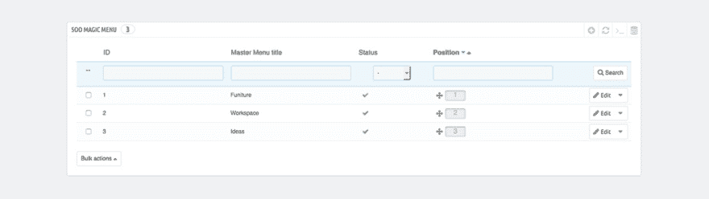
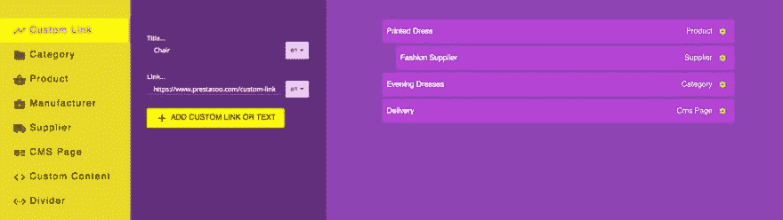

# 如何向 Prestashop 菜单添加自定义链接

> 原文：<https://dev.to/franken/how-to-add-a-custom-link-to-prestashop-menu-j82>

想在 Prestashop 菜单中添加自定义链接吗？这个 [Prestashop 教程](https://www.prestasoo.com/Blog?utm_source=devto&utm_medium=article&utm_campaign=custom_link)展示了如何在 Prestashop 中轻松地将你的链接添加到菜单中。

Prestashop 中的菜单可能包含指向页面、类别、自定义链接或其他内容类型的链接。因此，如果你想要一个菜单标签直接链接到另一个网站/网页，那么按照这些指示。

## 添加自定义链接的准备步骤有哪些？

```
I. Configure Main Menu module
II. Scroll down to "ADD A NEW LINK" area.
III. Fill the custom link to Link field and Save. 
```

Enter fullscreen mode Exit fullscreen mode

要开始创建自定义菜单，请登录到您的 Prestashop 网站，然后单击展开左侧的模块菜单。

### 第一步-配置主菜单模块

首先，你需要打开列出所有你安装的模块并找到主菜单模块，然后点击“配置”按钮。

[T2】](https://res.cloudinary.com/practicaldev/image/fetch/s--jWPWEll2--/c_limit%2Cf_auto%2Cfl_progressive%2Cq_auto%2Cw_880/https://www.prestasoo.cimg/stories/add-custom-link-prestashop-menu.jpg)

### 第二步-向下滚动到“添加新链接”区域

您将看到“添加新链接”区域，您可以在其中添加任何自定义链接。如果您在 Prestashop 电子商务网站上使用多种语言，您可以为每种语言选择不同的 URL 地址。

### 第三步-填写自定义链接到链接字段并保存

对，这是最后一步。将您的自定义链接填入链接字段。如果您在 Prestashop 电子商务网站上使用多种语言，您可以为每种语言选择不同的 URL 地址。

[T2】](https://res.cloudinary.com/practicaldev/image/fetch/s--WUmLkMtR--/c_limit%2Cf_auto%2Cfl_progressive%2Cq_auto%2Cw_880/https://www.prestasoo.cimg/stories/fill-custom-link-into-link-field.jpg)

## 有什么更好的办法？

您可能希望使用 SOO Magic Menu-2017 年 Prestashop Awards 导航模块的获奖者，不仅为您的 [Prestashop 菜单](https://www.prestasoo.com/prestashop-modules/soo-magic-menu.html?utm_source=devto&utm_medium=article&utm_campaign=custom_link)创建自定义链接，还创建图像、图标和自定义内容。

### 第一步-点击您想要创建自定义链接的一级菜单

[T2】](https://res.cloudinary.com/practicaldev/image/fetch/s--uq8dWSjw--/c_limit%2Cf_auto%2Cfl_progressive%2Cq_auto%2Cw_880/https://www.prestasoo.cimg/stories/first-level-soo-magic-menu-prestashop-module.jpg)

### 第二步-将自定义链接填入自定义

添加带有自定义链接的自定义菜单，您可以轻松地拖放这些菜单。

[T2】](https://res.cloudinary.com/practicaldev/image/fetch/s--4hZNqYfx--/c_limit%2Cf_auto%2Cfl_progressive%2Cq_auto%2Cw_880/https://www.prestasoo.cimg/stories/custom-link-soo-magic-menu.jpg)

这个 [Prestashop 模块](https://www.prestasoo.com/prestashop-modules.html?utm_source=devto&utm_medium=article&utm_campaign=custom_link)为您的电子商务网站打包了大量功能，用于定制菜单、提供 [Prestashop 折扣](https://www.prestasoo.com/prestashop-modules/soo-prestashop-discount.html?utm_source=devto&utm_medium=article&utm_campaign=custom_link) &交易或显示您的广告。
让我们尽情享受吧。