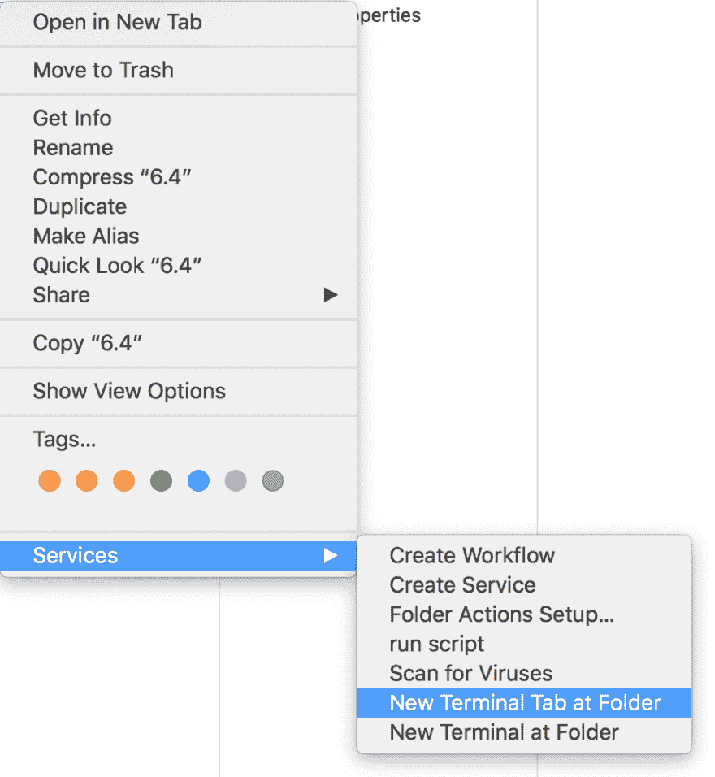
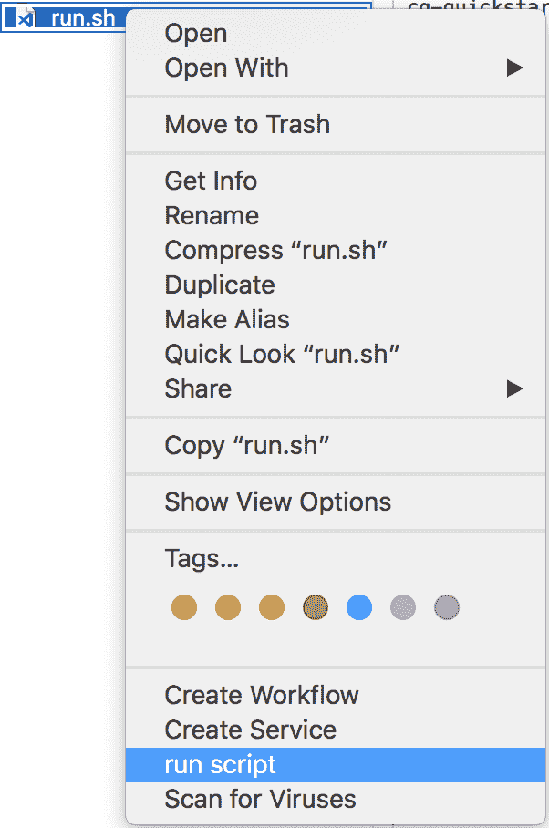

# 如何在 macOs 中添加“运行脚本”上下文菜单项

> 原文：<https://dev.to/ahmedmusallam/how-to-add-a-run-script-context-menu-in-macos--onh>

我通常为所有东西编写一个 shell 脚本文件...所以我不需要记住很长的 a$$命令，特别是在运行服务器或者开始构建的时候。这只会让一切变得更容易。

我通常使用[“在文件夹中新建终端标签”](https://lifehacker.com/launch-an-os-x-terminal-window-from-a-specific-folder-1466745514)服务，你猜对了，`cd`进入那个文件夹然后运行我的 shell 脚本`./run.sh`

[T2】](https://res.cloudinary.com/practicaldev/image/fetch/s--5LLhfyOO--/c_limit%2Cf_auto%2Cfl_progressive%2Cq_auto%2Cw_880/https://thepracticaldev.s3.amazonaws.com/i/mcf5c93xadqaiuo0w9we.png)

您可能会想:[“嗯，您可以双击它”](https://stackoverflow.com/questions/5125907/how-to-run-a-shell-script-in-os-x-by-double-clicking)，是的，我可以，但是我通常在需要“编辑”shell 脚本时才双击，而不是在需要“运行”它时。因为我经常编辑 shell 脚本。

所以我想，我加个上下文菜单项“运行脚本”怎么样。因此，我可以右键单击一个文件，然后单击“运行脚本”，它将打开一个终端，并为我运行我的脚本。

[T2】](https://res.cloudinary.com/practicaldev/image/fetch/s--80DvFL-J--/c_limit%2Cf_auto%2Cfl_progressive%2Cq_auto%2Cw_880/https://thepracticaldev.s3.amazonaws.com/i/ywesk9n76a8ld73w8eik.png)

谷歌了一圈，没有找到类似的东西，所以我创建了它！以下是方法:

1.  开放式自动机
2.  选择`Service`
3.  将`Run AppleScript`动作拖到工作流程中
4.  在下面添加代码
5.  将工作流程另存为`run script`
6.  尽情享受吧！

```
tell  application  "Finder"  # Get the directory of the selected file, store it in "selDir"  set  selDir  to  POSIX  path  of  (parent  of  first  item  of  (get  selection  as alias list)  as  alias)  # Get the path of the selected file, store it in "selPath"  set  selPath  to  POSIX  path  of  (selection  as text)  # Optional commands to show dialog, for debugging puposes.  # display dialog selDir as text  # display dialog selPath as text  end  tell  tell  application  "Terminal"  # Open terminal, cd to selected file directory, then run te file.  do  script  "cd "  &  selDir  &  " && "  &  selPath  end  tell 
```

Enter fullscreen mode Exit fullscreen mode

现在我意识到我花了大约一个半小时学习一些 AppleScript，而我本应该做我的业余项目...#我的项目我的项目😅