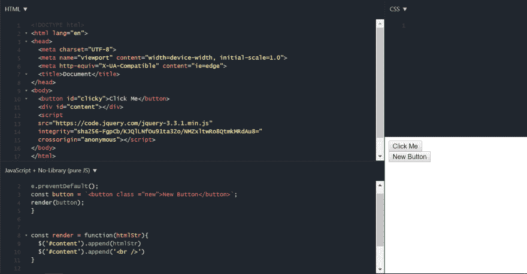
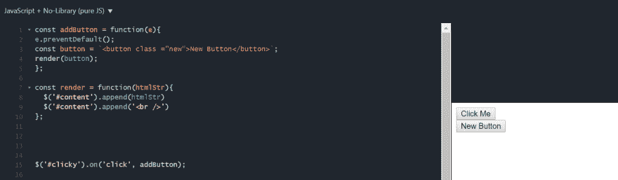
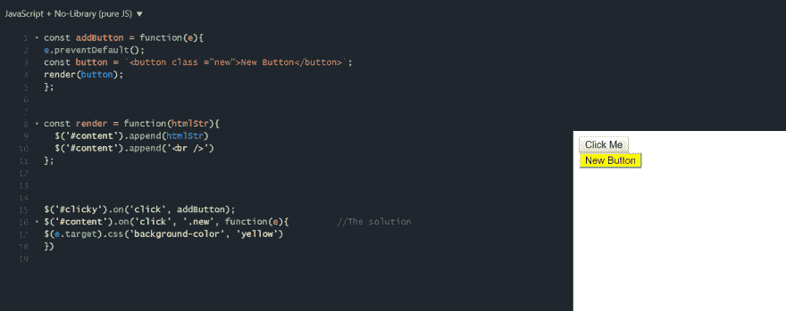

# 如何向动态添加的元素添加事件侦听器

> 原文：<https://dev.to/trilemaestro92/how-to-add-event-listener-to-dynamically-added-elements--1iea>

你好吗，程序员？
欢迎阅读我的“如何”指南的第二部分
感谢您阅读我关于学习如何向动态添加的元素添加事件监听器的文章。

让我们开始吧！

# 先添加一个元素

[T2】](https://res.cloudinary.com/practicaldev/image/fetch/s--6aAKkcqt--/c_limit%2Cf_auto%2Cfl_progressive%2Cq_auto%2Cw_880/https://thepracticaldev.s3.amazonaws.com/i/ezyzukp6czcwp44wl1rm.PNG)

[T2】](https://res.cloudinary.com/practicaldev/image/fetch/s--LaF5Cw8d--/c_limit%2Cf_auto%2Cfl_progressive%2Cq_auto%2Cw_880/https://thepracticaldev.s3.amazonaws.com/i/wjogc8l51apgq4pa8k0d.PNG)

## 击穿

1.  我有一个简单的 HTML 文档，包括一个名为“点击我”的按钮和一个空的“T2”分区。两个元素都有一个 id。

2.  在 JavaScript 文件中，我在第 8 行创建了一个渲染函数，该函数应该将一个字符串附加到一个元素上，在本例中，该元素位于前面的空 **div** 上。

3.  因此，第 1-5 行只是我制作了一个名为“addButton”的**函数**，它使用渲染函数制作了一个名为“new button”的新**按钮**。第 15 行是事件监听器，它在我每次点击“click me”时添加一个新按钮。

现在我们可以添加一个按钮。我们如何给这个新按钮添加一个事件监听器呢？

## 我来给你演示 DE 方式

[T2】](https://res.cloudinary.com/practicaldev/image/fetch/s--B92_f0uY--/c_limit%2Cf_auto%2Cfl_progressive%2Cq_auto%2Cw_880/https://thepracticaldev.s3.amazonaws.com/i/8ka6dcp87ejuwwzrgxos.PNG)

## 击穿

1.  答案从第 16 行开始。首先，我为 **#content** 创建一个事件监听器，如果您还记得的话，它是 html 文档中空 div 的主选择器 id。

2.  然后，对于函数上的**，*第一个参数*是动作值“click”，*第二个参数*将是子选择器名称，在这种情况下，添加了新按钮的类(见第 3 行)。*第三个参数*是一个回调值，我在其中做了一个函数，将这个新按钮的背景变成黄色。**

这是 PZ！我的天啊！

正如你所看到的，我可以在我的“新按钮”上添加一个事件监听器，如果当我点击新按钮时，它的背景会变成黄色。

## 好听的废话...但这有什么意义呢？？？

既然您现在已经知道了如何向动态添加的元素添加事件侦听器的基础知识。你不需要我告诉你所有的可能性，你可以使用这个功能，或如何普遍使用。想想看，任何时候你在脸书、Twitter 或 LinkedIn 上发布东西，你都必须动态地向页面添加元素。因此，如果你不能给他们添加一个事件监听器，你怎么能评论、喜欢或回应这些帖子呢？