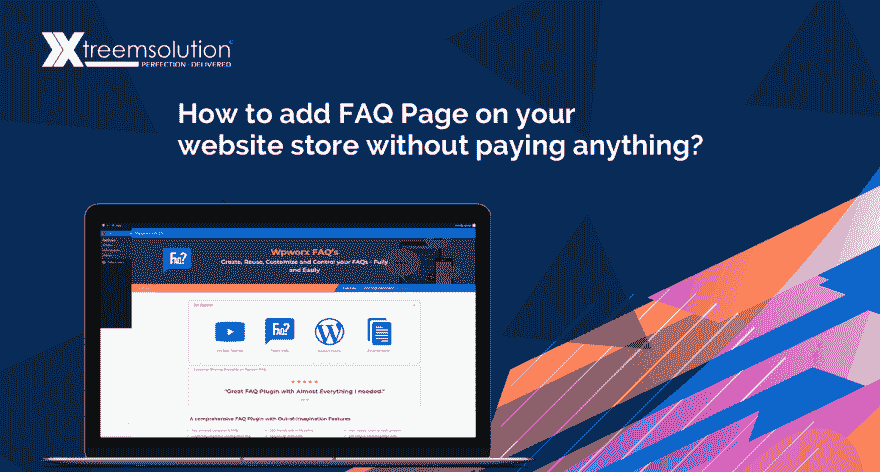
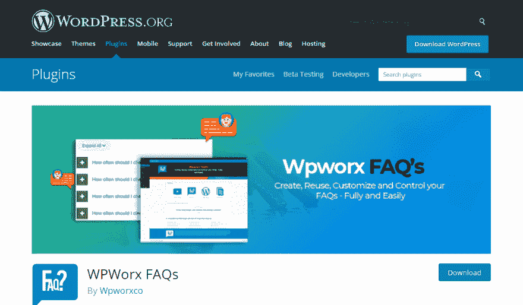
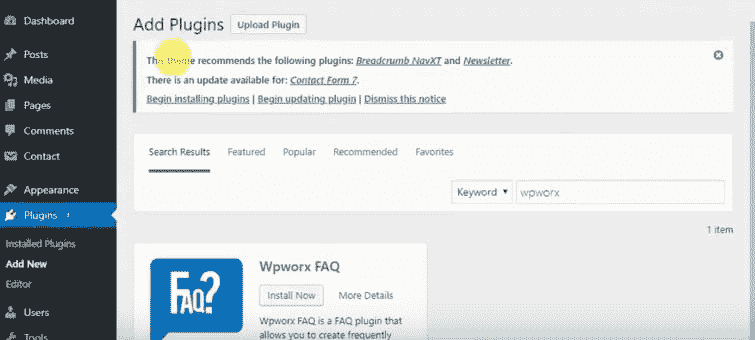
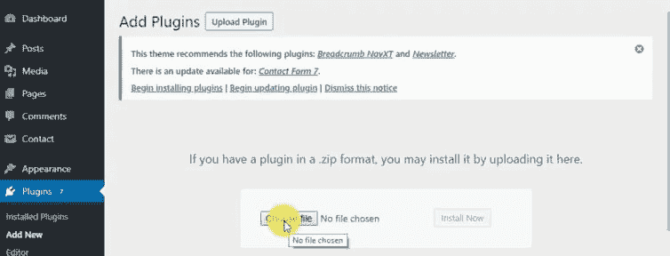
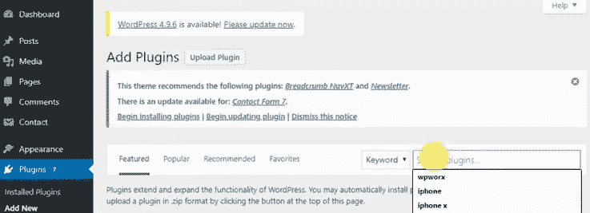
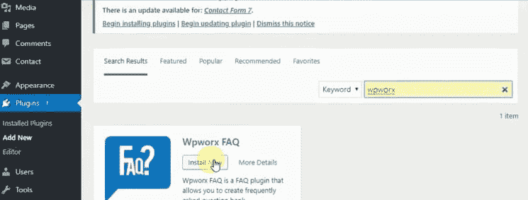
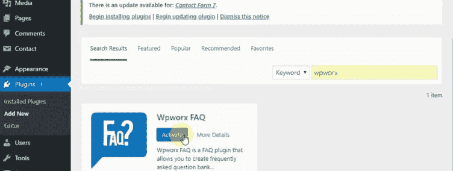
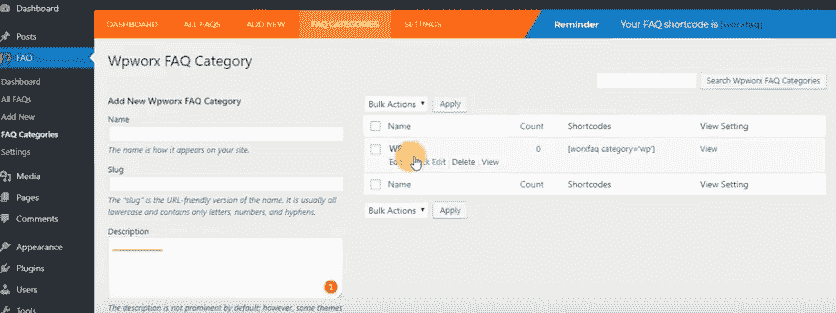
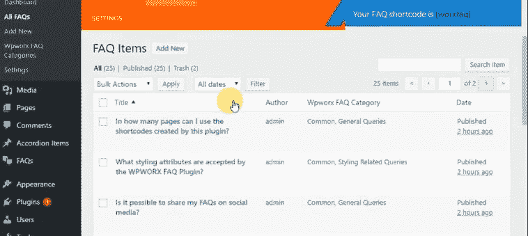
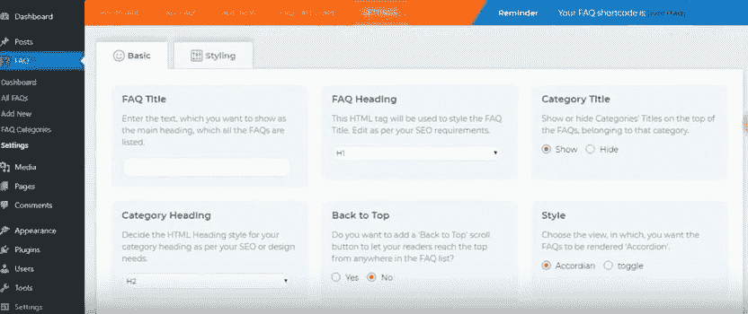

# 如何在你的网站商店上添加 FAQ 页面而无需支付任何费用？

> 原文：<https://dev.to/wpworx/how-to-add-faq-page-on-your-website-store-without-paying-anything-11kh>

由于谷歌搜索算法最近的变化，我们的许多客户都提出了这样的问题，如如何创建 FAQ 页面，制作 FAQ 页面的成本是多少，一旦你开发了它，我们是否能够自己维护它，等等。这个帖子最初是为了回答这些问题而创建的。

[T2】](https://res.cloudinary.com/practicaldev/image/fetch/s--hvIl6qxL--/c_limit%2Cf_auto%2Cfl_progressive%2Cq_auto%2Cw_880/https://thepracticaldev.s3.amazonaws.com/i/z53iux0c3bb7zehfkzi9.jpg)

首先，你可以在你的网站商店中添加 FAQ 页面，而无需支付任何费用。怎么会？

你可以看看这个视频的快速教程，由插件的团队准备，或者阅读我们的博客来保存一些数据；)

**https://www.youtube.com/watch?v=sFi_rPYOkP4**

在进入实际步骤之前，让我们让其他网站所有者意识到在你的网页中建立一个良好的 FAQ 页面/综合 FAQ 部分的重要性。[如果您已经认为常见问题是必不可少的，您可能想跳过这一部分]

为什么常见问题解答很重要？

对于任何企业来说，拥有一个网站已经成为一种必须，没有一些元素，即使是高科技网站也是不完整的。其中一个是 FAQ 页面。当您的客户一次又一次地向您的客户服务主管询问相同的问题，并将它们发送到您的支持电子邮件时，正是您需要在您的网站上建立一个完整的 FAQ 页面的时候了。

常见问题页面不仅减轻了客户支持团队的负担，而且:

```
 •    Contributes to an early response system to the customers in a hurry.
 •    Adds SEO values to your website.
 •    Redirect your customers to other valuable content.
 •    Interactive platform for business and clients. 
```

Enter fullscreen mode Exit fullscreen mode

但是谁会愿意花更多的钱去获得一个额外的页面呢，尤其是当它是免费的时候？T3】

如果你想在网站上免费添加一个 FAQ 页面，WordPress 的 WpWorx FAQ 插件绝对是一个高级插件。零成本，你可以访问一个优雅且非常有用的 FAQ 页面。

**wpw orx 常见问题插件的最佳特性**

FAQ 插件提供了定制的优势，并允许新的 FAQ 页面与现有网站融合。作为一个免费使用的插件，它带有短代码，可以立即插入到网站上，添加一个 FAQ 页面。

```
 •    The Wpworx plugin supports unlimited FAQs with “Read More” option.

 •    It allows customization of the entire FAQ page right from the color, background, font size, Icon style, Icon color, Icon size, and position.

 •    The font style and color of the questions and answers can be changed - independent of each other.

 •    Wpworx plugin helps you develop a responsive page just like your website.

 •    While you build the FAQs, you can maintain the SEO element of the page by customizing the HTML title tag, Meta description, Header tags from an easy to use dashboard. 

 •    The plugin can be used to build FAQs for custom posts

 •    Display the FAQs as Accordion or JQuery toggle style 

 •    Build categories of the FAQs 
```

Enter fullscreen mode Exit fullscreen mode

您可以很容易地添加新的 FAQ 或编辑现有的 FAQ。

如何使用这个 WordPress 插件创建 FAQ 页面？

WpWorx 是一个完全可定制的 FAQ 插件。它响应迅速，几乎可以立即建立一个 FAQ 页面。让我们了解您如何在无需支付任何费用的情况下将 WpWorx 常见问题添加到您的网站:

**下载插件**

旅程从简单地从下面的链接下载 FAQ 插件开始:

**https://wordpress.org/plugins/wpworx-faq/**

[T2】](https://res.cloudinary.com/practicaldev/image/fetch/s--4-ZR4Fqh--/c_limit%2Cf_auto%2Cfl_progressive%2Cq_auto%2Cw_880/https://thepracticaldev.s3.amazonaws.com/i/ba295irtnxrau864ulnw.png)

**安装插件**

**手动安装**

登录你的 WordPress 管理面板:

[T2】](https://res.cloudinary.com/practicaldev/image/fetch/s--Ayp9Ej6N--/c_limit%2Cf_auto%2Cfl_progressive%2Cq_auto%2Cw_880/https://thepracticaldev.s3.amazonaws.com/i/mwpo891gq3ojzyoju9d9.png)

在管理面板左侧的选项下，你可以点击“插件”。

上传 WpWorx 插件的 Zip 文件。为此，您需要“选择文件”,然后点击“立即安装”。一旦插件链接被激活，您就可以开始构建您的 FAQ 页面，并根据您的要求进行定制。

[T2】](https://res.cloudinary.com/practicaldev/image/fetch/s--ZSZ37aB8--/c_limit%2Cf_auto%2Cfl_progressive%2Cq_auto%2Cw_880/https://thepracticaldev.s3.amazonaws.com/i/k2vc7ui4hwpbv0elzin3.png)

**自动安装**

```
 •    Login to the Admin panel of your WordPress website
 •    Click on the “Plugins”. You can see Installed plugins and “Add New”. 
```

Enter fullscreen mode Exit fullscreen mode

[T2】](https://res.cloudinary.com/practicaldev/image/fetch/s--XCpedPWY--/c_limit%2Cf_auto%2Cfl_progressive%2Cq_auto%2Cw_880/https://thepracticaldev.s3.amazonaws.com/i/nhscwnfuzec3e3undhxx.png)

```
 •    Click “Add New” 
 •    You will be prompted to Search the plugin you wish to upload.
 •    Key in Wpworx and Click on “Install Now” 
```

Enter fullscreen mode Exit fullscreen mode

[T2】](https://res.cloudinary.com/practicaldev/image/fetch/s--C_az_8gL--/c_limit%2Cf_auto%2Cfl_progressive%2Cq_auto%2Cw_880/https://thepracticaldev.s3.amazonaws.com/i/lb98k78epqev094489sr.png)

```
 •    Once the plugin is installed that might take around less than a minute, you will be prompted to “Activate” the plugin. 
```

Enter fullscreen mode Exit fullscreen mode

[T2】](https://res.cloudinary.com/practicaldev/image/fetch/s--o10KzQLV--/c_limit%2Cf_auto%2Cfl_progressive%2Cq_auto%2Cw_880/https://thepracticaldev.s3.amazonaws.com/i/xrrpnka4540grqgg7dr0.png)

**添加常见问题并呈现在第**页上

插件安装完成后，你就可以在 FAQ 页面上添加无限的问题和答案了。您可以创建类别，然后向其中添加新的常见问题。

```
 •    Create a Category for FAQs with the name and description and click “Apply”. 
```

Enter fullscreen mode Exit fullscreen mode

[T2】](https://res.cloudinary.com/practicaldev/image/fetch/s--CScUrOP5--/c_limit%2Cf_auto%2Cfl_progressive%2Cq_auto%2Cw_880/https://thepracticaldev.s3.amazonaws.com/i/mi2t9ll0til5of3kbxj3.png)

```
 •    Once the category is created, you can click “Add New”, type in the question, answer and category before you publish the question. Each question can come under multiple categories. 
```

Enter fullscreen mode Exit fullscreen mode

[T2】](https://res.cloudinary.com/practicaldev/image/fetch/s--BGVyjzuR--/c_limit%2Cf_auto%2Cfl_progressive%2Cq_auto%2Cw_880/https://thepracticaldev.s3.amazonaws.com/i/n9y29dagdlm1j0v8gxdb.png)

```
 •    WpWorx plugin brings with it the power of customization and SEO. 
```

Enter fullscreen mode Exit fullscreen mode

[T2】](https://res.cloudinary.com/practicaldev/image/fetch/s--zQCR7fh_--/c_limit%2Cf_auto%2Cfl_progressive%2Cq_auto%2Cw_880/https://thepracticaldev.s3.amazonaws.com/i/8uo4xeol94pmk9l4r849.png)

它允许您添加标题和标题(H1 和 H2)到每个常见问题，使其搜索引擎优化丰富。就在这个页面上，您可以选择 FAQ 演示的折叠或切换样式。样式选项是高级定制选项，允许您添加自定义 CSS，选择图标颜色，图标背景颜色，问题颜色，问题背景，问题悬停颜色和类似的答案。

结束了！

一个插件，可以在 WordPress 网站上快速设置，并向用户提供全面的定制，肯定对你的网站或商店非常有用。对于每个答案，你可以添加一个评论区，这样 FAQ 页面会变得更具互动性，你可以添加 YouTube 链接到更具解释性的视频。Wpworx FAQ 插件能够创建无限的 FAQ 列表和自定义实用程序，为您的网站增加了一个几乎可以立即构建的 FAQ 页面。

FAQ 也成为你的内容策略的一部分，它很容易驱动更多的客户流量，这些流量可以被导向现有的和更有价值的内容。

**原文来源:[https://xtreem solution . com/blog/how-to-add-FAQ-page-on-your-website-store-without-payed-things](https://xtreemsolution.com/blog/how-to-add-faq-page-on-your-website-store-without-paying-anything)**

## 标签:

常见问题页面，#常见问题插件，常见问题，常见问题插件