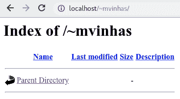
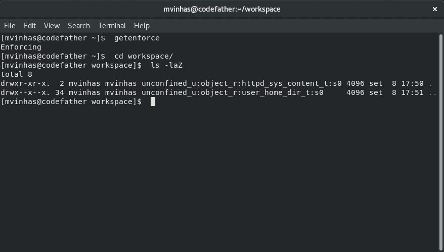

# 如何:安装了 SELinux 的 Apache Userdir

> 原文：<https://dev.to/mvinhas/how-to-apache-userdir-with-selinux-installed-2afk>

[T2】](https://res.cloudinary.com/practicaldev/image/fetch/s--23Jp_qWw--/c_limit%2Cf_auto%2Cfl_progressive%2Cq_auto%2Cw_880/https://thepracticaldev.s3.amazonaws.com/i/pr0lupoq6k7an84q0r9i.png)

当我开始使用 Fedora 作为我的 Linux 生产环境时，我最初的挣扎之一是能够在 Apache 和 SELinux 中使用我的`/home`文件夹。最初，我习惯把家里的内容链接到`/var/www/html`，然后通过浏览器访问我的项目。

事实证明，对于 SELinux，这并不是一件容易的事情。默认情况下，SELinux 的访问控制策略不允许访问`/home`内容，显示 HTTP 403 禁止错误。我在互联网上做了大量的搜索，对于建议禁用 SELinux 或将其置于许可模式的大量回复，我简直傻了。禁用东西不是我喜欢做的事情，尤其是当那些东西实际上很重要的时候。

根据 NSA 安全增强 Linux 团队的说法:

*NSA Security-Enhanced Linux 是一组针对 Linux 内核和实用程序的补丁，为内核的主要子系统提供强大、灵活、强制的访问控制(MAC)架构。它提供了一种增强的机制来根据机密性和完整性要求强制执行信息分离，这允许处理篡改和绕过应用程序安全机制的威胁，并能够限制恶意或有缺陷的应用程序可能造成的损害。它包括一组示例安全策略配置文件，旨在满足常见的通用安全目标。*

也就是说，它的使用有助于降低程序在系统上导致不必要行为的可能性，特别是如果它们已经有缺陷，允许某人未经授权访问系统的任何部分。

对于像我一样喜欢将项目放在主目录中，并且仍然希望通过 Apache 访问这些项目的人来说，他们应该如何着手呢？根据我的研究，我将向您介绍一个对我来说是最好的解决方案，并且没有重大的安全隐患。

注意:我将向您展示的过程只在 Fedora 28 上进行了测试，但由于相似性，应该可以在以前的 Fedora 版本以及 Red Hat Linux Enterprise 7.5 和 CentOS 7.5 上运行。

# 启用 Apache 用户目录

这样，我们就可以访问我们/home 的特定目录作为我们的项目目录。通常可以这样访问:
`http://localhost/~user`

**1。编辑 userdir.conf 文件**

`sudo vim /etc/httpd/conf.d/userdir.conf`

现在启用 UserDir 并指定您想要访问的文件夹。

注意:在本教程中，我将使用用户`mvinhas`和文件夹`workspace`。

```
<IfModule mod_userdir.c>
 #
 # UserDir is disabled by default since it can confirm the presence
 # of a username on the system (depending on home directory
 # permissions).
 #
 UserDir enabled mvinhas
#
 # To enable requests to /~user/ to serve the user’s public_html
 # directory, remove the “UserDir disabled” line above, and uncomment
 # the following line instead:
 #
 UserDir workspace
</IfModule>
<Directory /home/*/workspace>
 AllowOverride FileInfo AuthConfig Limit Indexes
 Options MultiViews Indexes SymLinksIfOwnerMatch IncludesNoExec
 Require method GET POST OPTIONS
</Directory> 
```

这将使 UserDir 对您计算机上的所有用户可用。

如果您想要指定您显示的用户，请禁用 UserDir，然后为您想要的用户启用它:

 `UserDir disabled
UserDir enabled mvinhas user1 user2`

注意你可以反过来做，即。启用 UserDir，然后拒绝某些用户的访问:

 `UserDir enabled
UserDir disabled mvinhas test1`

**2。重启阿帕奇**
`sudo systemctl start httpd.service`

**3。更改文件夹权限到您的文件夹和`/home`目录**
 `chmod 711 /home/mvinhas
sudo chown mvinhas:mvinhas /home/mvinhas/workspace
chmod 755 /home/mvinhas/workspace`

**4。调整 SELinux 以启用 Apache homedirs**
 `sudo setsebool -P httpd_enable_homedirs true
sudo chcon -R -t httpd_sys_content_t /home/mvinhas/workspace`

现在你应该可以在启用 SELinux 的情况下使用你的文件夹了！
[T3】](https://res.cloudinary.com/practicaldev/image/fetch/s--PG87xa7p--/c_limit%2Cf_auto%2Cfl_progressive%2Cq_auto%2Cw_880/https://thepracticaldev.s3.amazonaws.com/i/ivxredy0nxkwl84lwmvb.png)

在终端中执行`ls -Z`可以看到文件夹和文件 SELinux 上下文。您还可以将`-Z`与传统的`-la`参数结合起来，这样您就可以同时看到 SELinux 策略和传统的文件/文件夹权限:

[T2】](https://res.cloudinary.com/practicaldev/image/fetch/s--_qAlBcW---/c_limit%2Cf_auto%2Cfl_progressive%2Cq_auto%2Cw_880/https://thepracticaldev.s3.amazonaws.com/i/v4bm2xkna2s36o80zw0m.png)

如您所见，我首先检查了 SELinux 的状态，显示 SELinux 处于强制模式，这是默认的推荐模式。

就是这样。如果你有任何问题，请随时提问！