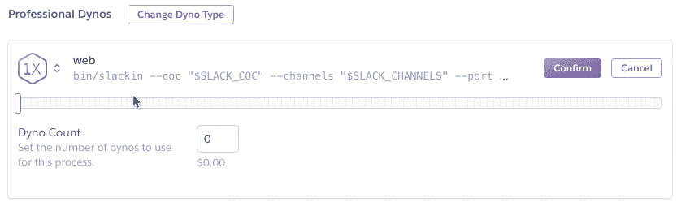
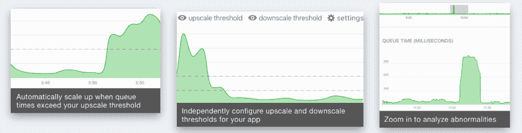

# 如何在 Heroku 上自动缩放

> 原文：<https://dev.to/mijustin/how-to-autoscale-on-heroku-2ddl>

Heroku 使得为你的应用添加服务器变得很容易(Heroku 行话中的“dynos”)。他们在你的应用仪表板上给你一个方便的滑块，你只需拨入你想要的多少 dynos。

[T2】](https://res.cloudinary.com/practicaldev/image/fetch/s--9LIYwS-_--/c_limit%2Cf_auto%2Cfl_progressive%2Cq_66%2Cw_880/http://g.recordit.co/JjfGDgy782.gif)

如果你注意到活动的峰值，这是有帮助的。

但是如果你在睡觉呢？(还是你没有收到通知？)

自动缩放实际上是为您管理滑块。使用响应时间或请求排队时间等指标，autoscaling 将自动增加或减少为您的应用程序运行的 dynos 的数量。

Heroku 在其价格较高的层级中提供这种服务(250 美元以上)。

如果你在一个较低的层上，你将需要使用一个像 [Rails Autoscale](https://railsautoscale.com/) 这样的附加组件。

[T2】](https://res.cloudinary.com/practicaldev/image/fetch/s--h91YJfgr--/c_limit%2Cf_auto%2Cfl_progressive%2Cq_auto%2Cw_880/https://thepracticaldev.s3.amazonaws.com/i/g86uabmf9c4i0ojtsirn.png)

### 我的 Heroku app 应该什么时候添加 dynos？

更多的 dynos 意味着你的应用可以服务更多的并发请求。如果您看到请求排队时间增加(超过 50 毫秒)，这意味着您没有足够的 dynos 运行来服务您当前的负载，您应该添加 dynos。

不过，手动做起来很繁琐，而且有可能你并不是 100%的时候都需要这些额外的动力。这就是人们选择自动调整 dynos 的原因。它降低了成本，同时让您的应用能够处理流量的突然增加，让您高枕无忧。

欲了解更多信息，请阅读本文:[在 Heroku 上扩展的 4 种方式](https://masteringheroku.substack.com/p/4-ways-to-scale-on-heroku)。

### 添加 dynos(向上扩展)会让我的应用更快吗？

不一定。添加 dynos 允许您的应用程序服务更多的并发请求。如果您的应用程序已经满负荷了(您会看到请求排队时间增加)，那么添加 dynos 肯定会改善响应时间。但是，如果请求不在队列中，那么扩大规模将无助于应用程序的性能。

要真正提高应用程序的性能，你需要使用 Scout 或 New Relic 这样的工具来识别应用程序代码中的瓶颈。这通常是由于过多或缓慢的数据库查询造成的。