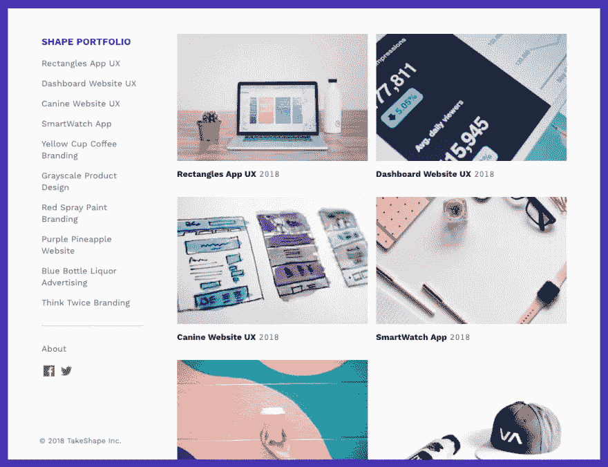
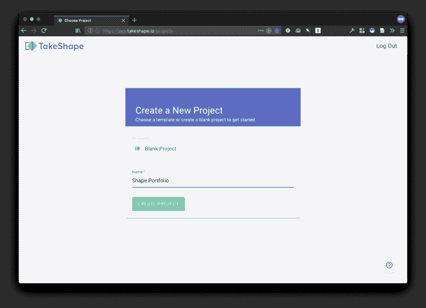
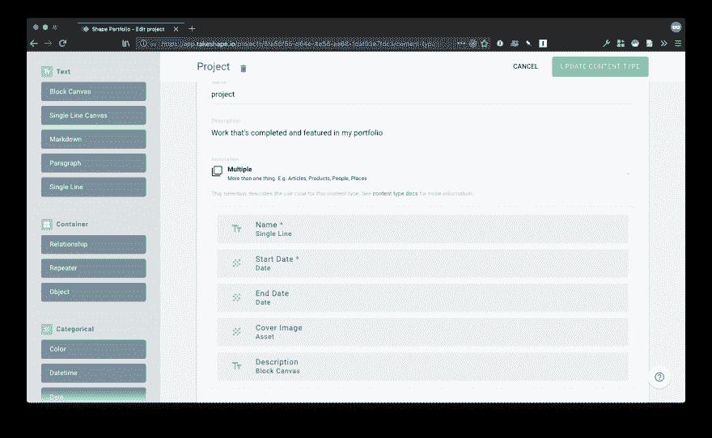
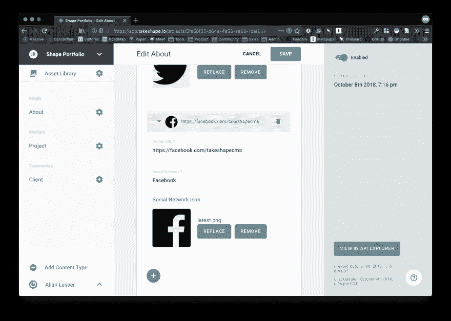
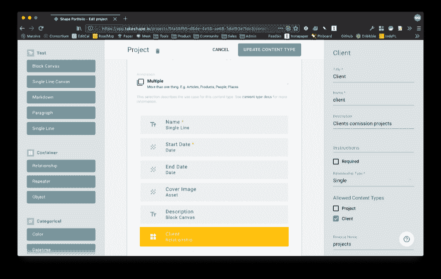
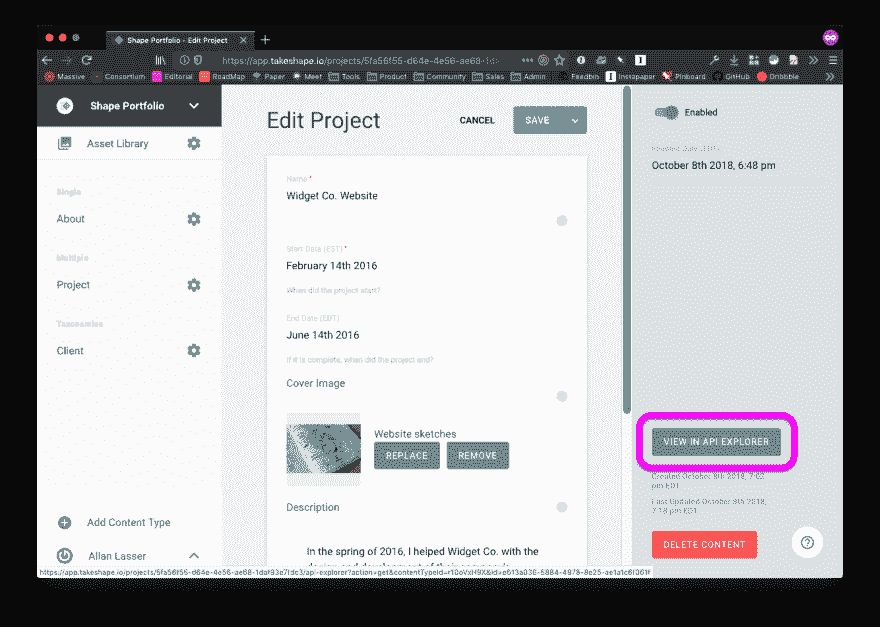
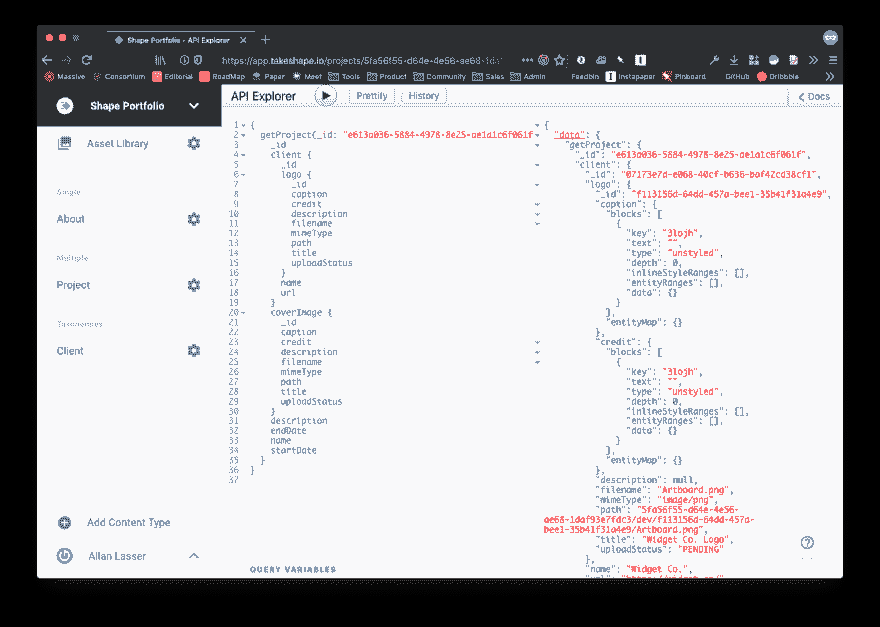

# 如何用 TakeShape 建立设计组合

> 原文：<https://dev.to/takeshape/how-to-build-a-design-portfolio-with-takeshape-4k7h>

## 在这个 4 部分系列的第 1 部分中，你将学习用[建模和创建内容](https://www.takeshape.io/)

这是 4 部分系列的第 1 部分。在第 1 部分中，我们将首先在 TakeShape 中创建一个新项目，建模一些基本的内容类型，然后填充它们。在第二部分中，我们将使用 TakeShape 的静态站点生成器为最终的网站创建 HTML 和 CSS。在第 3 部分(即将推出)中，我们将把静态站点部署到 Netlify。在第 4 部分(即将推出)中，您将进一步扩展您的技能，并学习如何通过 Gatsby.js 使用 TakeShape

[T2】](https://res.cloudinary.com/practicaldev/image/fetch/s--EBfMITIe--/c_limit%2Cf_auto%2Cfl_progressive%2Cq_auto%2Cw_880/https://thepracticaldev.s3.amazonaws.com/i/4g8kx0b0z5qt62u86cw5.png)

每个网页设计师都需要有一个伟大的投资组合。虽然像 Squarespace 这样的服务使得使用千篇一律的模板建立网站变得很容易，但结果看起来都是一样的。然而，当你以设计网站为生时，你的作品集不应该只是简单地将你的项目分类；它本身应该展示你的手艺。

这就是[成形](https://www.takeshape.io/)的用武之地！TakeShape 是一个灵活易用的工具，它将让你专注于完善你的投资组合的独特设计，而不是与服务器角力或调试数据库。有了 TakeShape，您可以立即完善您的投资组合。我们开始吧！

### 注册一个 TakeShape 账号

如果你还没有一个 TakeShape 账户，从[注册](https://app.takeshape.io/signup)开始。如果您已经有了一个账户，[登录](https://app.takeshape.io/login)。

### 新建一个空白的 TakeShape 项目

登录后，通过选择空白项目模板，使用创建新项目。然后，给你的新项目命名。

*注意如果你想跳到第 2 部分，开始构建静态网站，你可以选择“形状文件夹”模板。我们将继续从空白项目开始，这样您就可以看到它是如何构建的。*

[T2】](https://res.cloudinary.com/practicaldev/image/fetch/s--X2MJygDf--/c_limit%2Cf_auto%2Cfl_progressive%2Cq_auto%2Cw_880/https://thepracticaldev.s3.amazonaws.com/i/0vup8dr24nnb83qzbsaf.png)

### 创建内容类型

由于您的作品集的主要目的是展示您的设计项目，我们将从为它们创建内容类型开始。

点击侧边栏左下角的**添加内容类型**按钮，就在您的用户名上方。您将被带到“新内容类型”屏幕。在开始对内容建模之前，每种内容类型都有一些需要填写的基本字段。

！【TakeShape 新内容类型页面】([https://thepractical dev . S3 . Amazon AWS . com/I/xkc 9 lbr 05 q 6 jphe B6 eeh . png _](https://thepracticaldev.s3.amazonaws.com/i/xkc9lbr05q6jpheb6eeh.png_)

*   *Title* 是你的内容类型的可读名称。作为最佳实践，TakeShape 中的内容类型标题应该是单数，而不是复数。我们将这种类型命名为“项目”。
*   *Name* 是您的内容类型在 TakeShape 的 GraphQL API 中的命名方式。一旦您为您的内容类型指定了标题，该名称将自动填写。(但也可以独立修改。)
*   *描述*是一个可选的，但是非常有用的字段——特别是如果你的内容类型使用一个通用名称，比如“项目”
*   最后，我们将保持*注释*为“Multiple ”,因为我们想要在我们的投资组合中包含多个项目。(稍后我们将使用其他种类的注释创建内容类型。)

现在我们可以开始对我们的项目内容类型进行建模，以便创建您的每个项目都将拥有的字段。TakeShape 的拖放界面使快速添加各种字段变得很容易，创建了一种完全适合您需求的丰富内容类型，并且可以在您的需求发生变化时进行更新。

首先，从左侧边栏添加以下小部件，方法是将它们拖到拖放区，并按如下方式配置它们:

*   **单行**:在*标题*字段输入“姓名”并勾选“必填”框。这需要是一个纯文本字符串，因为稍后您将使用它来生成每个项目页面的 URL。
*   **日期**:在*标题*字段输入“开始日期”并勾选“必填”框。这将允许你按时间顺序排列你的项目。
*   **日期**:在*标题*字段输入“结束日期”这是一个可选字段，它将表明您是否已经完成了您的项目。
*   **资产**:在*标题*字段输入“封面图片”这是一个可选字段，它将在列表中和项目页面上直观地表示您的项目。
*   **区块画布**:在*标题*字段输入“描述”这是一个可选字段，允许您用富文本和格式编写项目描述。

[T2】](https://res.cloudinary.com/practicaldev/image/fetch/s--u4vBiJQ8--/c_limit%2Cf_auto%2Cfl_progressive%2Cq_auto%2Cw_880/https://thepracticaldev.s3.amazonaws.com/i/ps3e16oly7dtaupg7l3r.png)

添加完这些小部件后，单击**创建内容类型**按钮保存新类型。保存后，您将被带到(空的)“项目”页面。

### 将第一个项目添加到您的作品集

现在您可以将您的项目添加到您的投资组合中了！点击右上角的绿色**新项目**按钮。

您将会看到，您拖放到内容类型中的所有小部件现在都显示为准备接受信息的字段。您可以为您的项目命名、开始日期、结束日期(可选)、封面图像和更长的描述。

您会注意到一些字段提供了特殊的界面来编辑它们的信息。例如，当设置开始日期时，会出现一个基于日历的日期选择器。当添加封面图像时，“资源库”将从右侧滑过。您可以通过将图像拖放到幻灯片中来上传新图像；然后，您可以将这些图像从“资源库”幻灯片拖放到封面图像字段。最后，描述字段有易于使用的编辑工具，当您需要它们时会出现，例如当您突出显示文本或开始新段落时。

添加完内容后，单击绿色的 **Save** 按钮保存内容并返回到项目列表。如果您点击**保存**旁边的向下箭头**【⌄】**，您将看到“保存并继续”选项，该选项将保存内容而不返回列表。

### 创建关于页面

接下来，我们想创建一个“关于”页面，以便您可以分享更多关于您自己的信息。

就像您创建项目内容类型时一样，单击侧边栏左下角的**添加内容类型**按钮，就在您的用户名上方。给内容类型一个标题(在本例中为“About”)，您会看到 Name 字段会自动填充。如果你愿意，你可以描述一下。最后，确保注释设置为“Single ”,因为您只需要一个这种类型的页面。

现在，您可以通过从左侧边栏拖放一些小部件来为“关于”页面添加额外的字段:

*   **区块画布**:在*标题*栏输入“传记”这是一个可选字段，您可以在此分享更多关于您的信息。
*   **资产**:在*标题*字段输入“肖像”这是一个可选字段，您将使用它来保存一个讨人喜欢的头像。
*   **中继器**:在*标题*字段输入“社交档案”**中继器**小部件与其他小部件有些不同，因为你把其他小部件放在里面了。这将允许你在你的“关于”页面上保存几个你的社交档案，所有的都有相同的字段。将以下小部件拖放到**中继器的**拖放区:
    *   **单行**:在*标题*字段输入“个人资料网址”并勾选“必填”框。
    *   **单行**:在*标题*栏输入“社交网络”并勾选“必填”框。
    *   **资产**:在*标题*字段输入“社交网络图标”这将是一个可选字段。

完成后，点击绿色的**保存内容类型**按钮。然后，您将被带到空白的“关于”页面。

### 编辑关于页面

编辑“关于”页面的内容与创建“项目”页面并填写字段是一样的。在传记中，用丰富的链接、标题、图片和嵌入内容向世界讲述你的故事。上传你帅气的马克杯到人像场。并使用社交档案中继器链接到您的所有社交网络。由于中继器在本演练中是新的，我们将花一点时间介绍其独特的接口。

点击圆形加号 **[+]** 按钮，可创建新的重复条目。重复条目可以像任何其他字段一样进行编辑，社交网络图标字段等资产呈现与其他任何地方相同的界面。repeater 元素的一个特殊特性是它们可以重新排列、展开和折叠。在 repeater 字段的顶部，您可以通过单击来展开或折叠所有条目。摆弄一下复读机，感受一下；这是使 TakeShape 中的建模内容如此强大的重要原因。

[T2】](https://res.cloudinary.com/practicaldev/image/fetch/s--5TSy9qF5--/c_limit%2Cf_auto%2Cfl_progressive%2Cq_auto%2Cw_880/https://thepracticaldev.s3.amazonaws.com/i/e5v5xd1dxnoj0jn4dk8x.png)

编辑完“关于”页面后，点击绿色的**保存**按钮。由于“关于”页面是一个单一的内容类型，在保存后，您不会被带回到任何类型的列表。您将停留在相同的内容类型上，因为它是同类中唯一的一种！

### 创建客户端分类内容类型

你的设计组合将包括为几个不同的客户工作，所以你希望能够按客户组织你的项目。为此，创建一个客户端分类内容类型。分类法是一种特殊的*注释*，它允许你轻松地对集合进行排序和过滤。

要创建这个新的内容类型，请遵循与前面相同的步骤。首先点击左侧边栏底部的绿色**添加内容类型**按钮。给你的新内容类型一个*标题*(“客户”)，让名称自动填充，然后给它一个*描述*，比如“客户委托我的投资组合中的项目”然后，将*注释*从“Multiple”更改为“Taxonomy”最后，向内容类型添加三个小部件:

*   **单行文本**:在*标题*字段输入“姓名”并勾选“必填”框。
*   **单行文本**:在*标题*字段输入“URL”并勾选“必填”框。
*   **资产**:在*标题*字段输入“Logo”这是一个可选字段。

然后，点击绿色的**保存内容类型**按钮。你会被带到一个空的客户列表。

### 添加客户

编辑分类与编辑多内容类型是一样的。点击“客户端”页面顶部的**添加客户端**按钮。填写可用字段，添加您客户的*名称*、*网址*和*标志*。

然后保存您的更改，以便带回客户端列表。如果您想创建一组客户端，而不是每次都回到列表视图，您可以单击**保存并添加另一个**。

### 将客户与项目联系起来

还有最后一步要做:您需要更新项目内容类型，以允许将客户端添加到项目中。在左侧栏中，您应该会看到您创建的内容类型列表。单击“项目”条目旁边的齿轮图标**【⚙】**来编辑该内容类型。拖动一个**关系**小部件。给它一个标题(“客户端”)和描述，然后设置以下内容:

*   将*关系*类型设置为“单一”如果您想要能够将多个客户端添加到一个项目，请选择“多个”。
*   将*允许的内容类型*设置为“客户端”
*   将*反转名称*设置为“项目”

[T2】](https://res.cloudinary.com/practicaldev/image/fetch/s--mWX-aypD--/c_limit%2Cf_auto%2Cfl_progressive%2Cq_auto%2Cw_880/https://thepracticaldev.s3.amazonaws.com/i/jrp8feqq3k3kc7hmkamv.png)

点击绿色的**更新内容类型**按钮。

当您准备好将客户端添加到项目时，您可以搜索您已经创建的客户端或添加新的客户端。创建新客户端时，您只能编辑其必填字段，如*名称*和*网址*。创建后，您可以更新其他客户端字段，如*徽标*。

最后，当您的项目已经与客户相关联时，您可以通过在页面顶部的*过滤器*字段中搜索客户的名称来过滤您的项目列表。谢谢，分类法！

现在，您可以创建项目和客户，将它们相互关联，并组织您的投资组合。

### 惊喜吧，你还内置了 GraphQL API！

现在您已经对内容建模并创建了一些条目，您可以看到 TakeShape 已经为您自动生成了 API。从左侧栏打开您的“项目”页面，并从列表中选择任何项目。进入内容编辑器后，单击右边工具条中标有 **View in API Explorer** 的按钮来查看 API 查询。“API Explorer”窗口打开后，点击**播放**按钮，查看这段内容的查询结果。您也可以随时从侧边栏顶部的下拉导航菜单中选择“API Explorer”。

[T2】](https://res.cloudinary.com/practicaldev/image/fetch/s--jEqpmMV9--/c_limit%2Cf_auto%2Cfl_progressive%2Cq_auto%2Cw_880/https://thepracticaldev.s3.amazonaws.com/i/6sgyfvnm7zrvwmc9mbr1.png)

[T2】](https://res.cloudinary.com/practicaldev/image/fetch/s--0NWv5yc9--/c_limit%2Cf_auto%2Cfl_progressive%2Cq_auto%2Cw_880/https://thepracticaldev.s3.amazonaws.com/i/lv2s5ltashm2rhpidhvb.png)

### 创建静态站点

现在，您已经为您的投资组合项目定制了 CMS，您可以轻松地更新您的项目和客户。在第 2 部分中，您将创建一个独特的静态网站来展示您的项目。

## 对打造定制网站的创意工具感兴趣？

[TakeShape](https://www.takeshape.io/) 是一个无头的 GraphQL CMS 和静态站点生成器。在 TakeShape，我们致力于为最有创造力的设计师和开发者打造最好的 CMS 工具。使用我们的项目模板，很容易开始。此外，我们的价格灵活实惠。[注册一个免费账户](https://app.takeshape.io/signup)，花更多的时间发挥创造力！