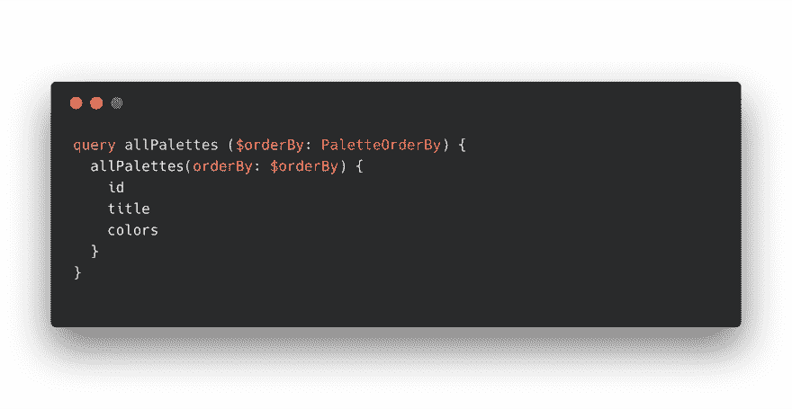
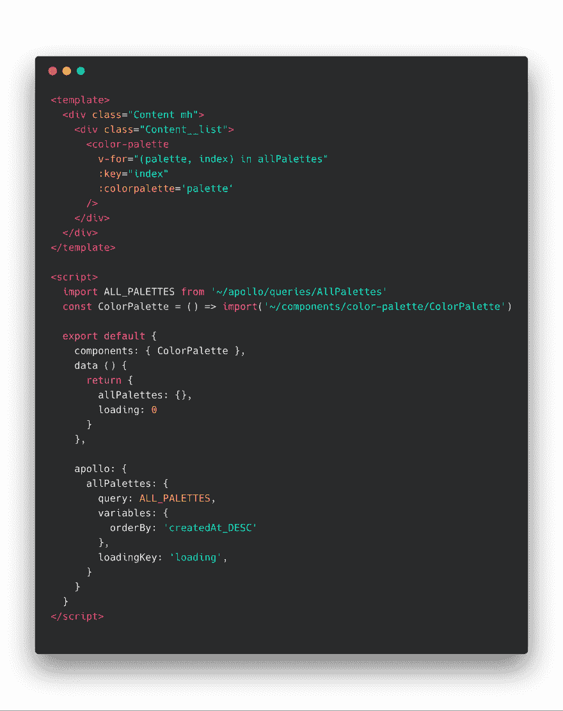
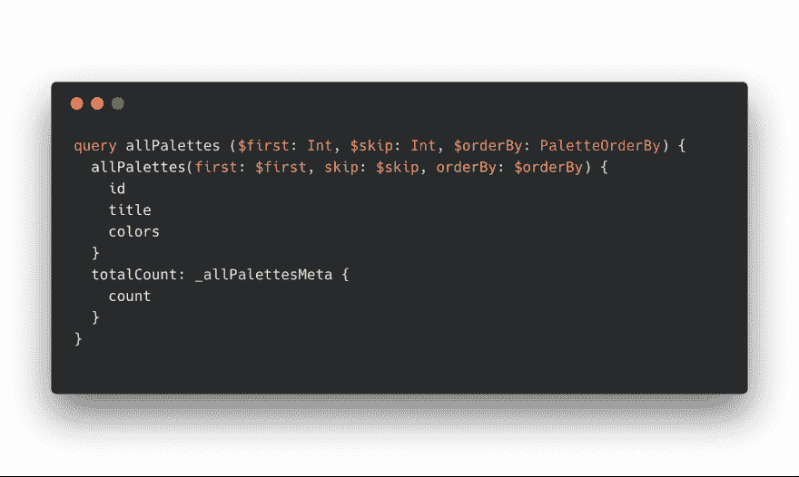
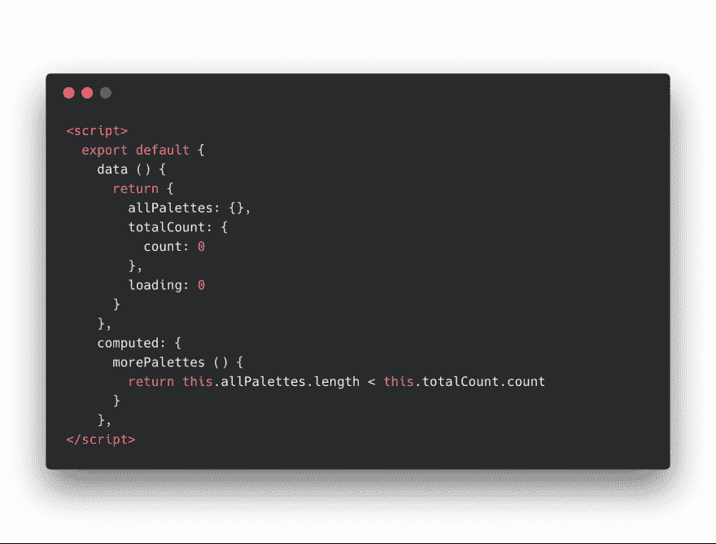
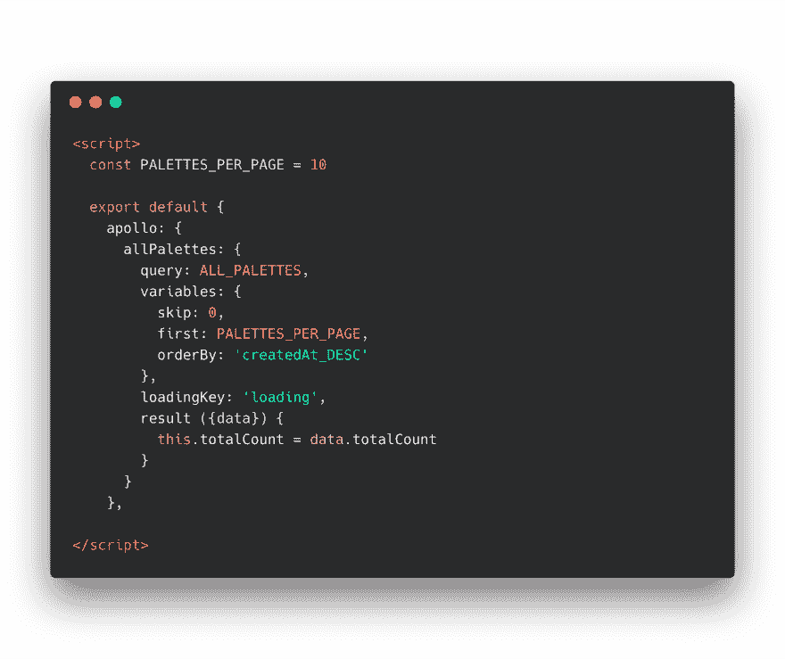
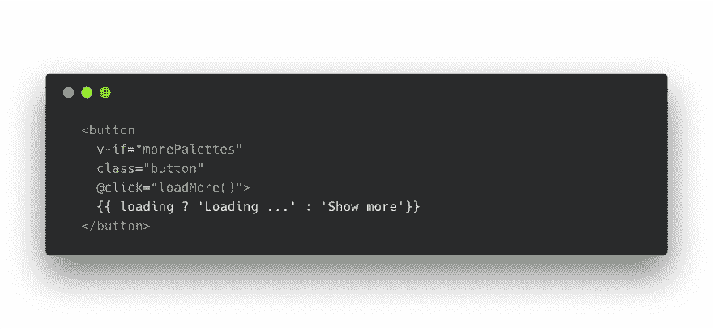
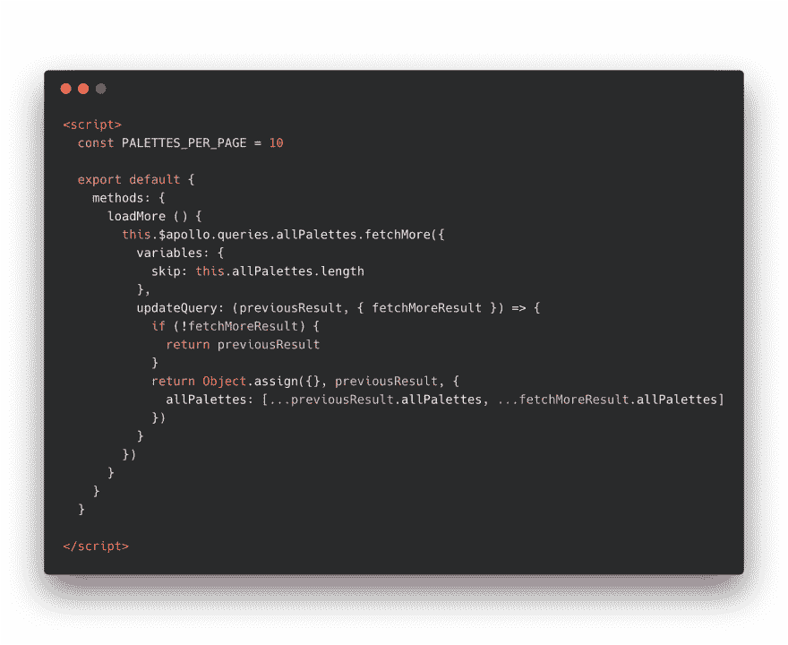

# 如何用 Vue.js 和 GraphQL 构建一个 load more 按钮

> 原文：<https://dev.to/apertureless/how-to-build-a-load-more-button-with-vuejs-andgraphql-302f>

当我在研究🎨我不得不在某个时候实现分页。没有人想一次加载一大堆调色板。然而，我真的很喜欢惰性加载方法，而不是经典的分页。

## 💪准备

[Colour Hunt](https://www.colourhunt.com/?ref=devto) 是用 Nuxt.js、Graph.cool 和 [vue-apollo](https://github.com/Akryum/vue-apollo) 构建的。栈是快速开发的梦想，因为你不需要摆弄后端。Colour Hunt 背后的想法是，人们可以创建和共享调色板。然而，您可以将这种技术用于所有类型的 graphql 节点。大多数例子都是使用旧的博客例子和帖子。

因此，让我们来看看我们的 GraphQL 查询:

[T2】](https://res.cloudinary.com/practicaldev/image/fetch/s--fC52-Qef--/c_limit%2Cf_auto%2Cfl_progressive%2Cq_auto%2Cw_880/https://i.imgur.com/LNstiWS.png)

假设我们有这样一个简单的查询。只需查询所有可用的调色板，并通过变量对它们进行排序。我们的 vue 组件应该是这样的:

[T2】](https://res.cloudinary.com/practicaldev/image/fetch/s--_e0S52Dz--/c_limit%2Cf_auto%2Cfl_progressive%2Cq_auto%2Cw_880/https://i.imgur.com/KQa2FFB.png)

我们只需加载我们的查询，vue-apollo 在幕后完成所有的魔术。我们只是迭代我们的查询结果。并呈现调色板组件。

## 📝页码

我们现在需要向查询中添加两个参数。定义查询开始处的*偏移量*的`skip`参数和定义*限制*或您想要查询多少个元素的`first`参数。我们还需要知道有多少元素。所以我们使用 _meta 查询。因此，我们的新查询将如下所示:

[T2】](https://res.cloudinary.com/practicaldev/image/fetch/s--PihNTaNg--/c_limit%2Cf_auto%2Cfl_progressive%2Cq_auto%2Cw_880/https://i.imgur.com/onGUydf.png)

现在我们的 GraphQL 查询已经准备好了。我们需要更新 Vue 组件。首先我们需要更新我们的数据。因为我们在查询中添加了`totalCount`。

`totalCount`非常重要，因为我们需要它来检查是否有更多的调色板要加载。如果我们加载了所有的调色板，我们不应该再次获取。我们只需添加一个计算属性，它会告诉我们是否可以获取更多。而且我们可以用它，作为我们*装载更多*按钮的条件。

[T2】](https://res.cloudinary.com/practicaldev/image/fetch/s--70bHLJyv--/c_limit%2Cf_auto%2Cfl_progressive%2Cq_auto%2Cw_880/https://i.imgur.com/LROmQe4.png)

现在我们需要更新我们的 vue-apollo 查询并添加缺失的变量。我们应该首先创建一个新的变量来保存我们想要获取的项目数量。例如`PALETTES_PER_PAGE`，我把它创建为一个局部常量变量。你也可以使用一个单独的文件，比如 constants.js 来保存所有这类常量。所以可以换一个地方。

现在事情变得有点棘手了。因为 vue-apollo 会自动将查询结果映射到本地数据模型。但是我们有两个返回的对象。第一个`allPalettes`和第二个总数。我想你也可以执行查询两次，但这在我看来像是代码味道。

相反，我们可以使用 vue-apollo 附带的`result()`方法。我们简单地抓取`totalCount`并将它分配给我们的本地`this.totalCount`。

[T2】](https://res.cloudinary.com/practicaldev/image/fetch/s--biXQdq4I--/c_limit%2Cf_auto%2Cfl_progressive%2Cq_auto%2Cw_880/https://i.imgur.com/pyKWNrR.png)

现在让我们创建我们的按钮，它将获取更多的条目。如此简单，我们只需添加一个呈现条件，这是我们计算的属性。由于我们有了加载状态，我们可以根据它是否加载来改变按钮文本。

点击后，我们调用我们的`loadMore()`方法，我们马上就会创建它。

[T2】](https://res.cloudinary.com/practicaldev/image/fetch/s--2iFdM2p---/c_limit%2Cf_auto%2Cfl_progressive%2Cq_auto%2Cw_880/https://i.imgur.com/Xe03ukV.png)

## ⚡️更新查询

现在有趣的部分来了。我们需要更新我们的查询并获取更多信息。Vue-apollo 为此提供了一个内置方法。在我们的`loadMore()`方法中，我们只需要调用

```
this.$apollo.queries.allPalettes.fetchMore({
  variables: {
    skip: this.allPalettes.length
  }
}) 
```

你还记得`skip`论点在做什么吗？对，它正在设置一个*偏移量*。在我们最初的查询中，我们将`skip: 0`和`first`设置为`PALETTES_PER_PAGE`，等于 10。因此，我们没有跳过任何东西，加载前 10 个调色板。现在我们`fetchMore`，跳过前 10 个调色板。因为`this.allPalettes.length`现在是 10。

然而，这还不够。我们还必须更新缓存中的查询。这很简单:我们检查是否有`fetchMoreResults`，如果没有，我们返回`previousResults`。否则，我们用`Object.assign()`和扩展操作符将新的调色板结果附加到旧的调色板结果上。如果你跟不上，用[阿波罗 chrome 插件](https://chrome.google.com/webstore/detail/apollo-client-developer-t/jdkknkkbebbapilgoeccciglkfbmbnfm)检查一下阿波罗缓存的结构总是很有帮助的

[T2】](https://res.cloudinary.com/practicaldev/image/fetch/s--hViKrPQu--/c_limit%2Cf_auto%2Cfl_progressive%2Cq_auto%2Cw_880/https://i.imgur.com/NJKD4ot.png)

## 🎉决赛成绩

事实上就是这样！我们只用几行代码就实现了调色板的惰性加载。这是最终的结果:

[闪亮 Gif](https://imgur.com/NrugRHv)

* * *

我正在公开建造[寻色](https://www.colourhunt.com/?ref=devto)，你可以在 [WIP](https://wip.chat/products/880) 上跟踪进度。我也不时地直播发展。