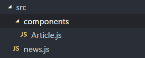
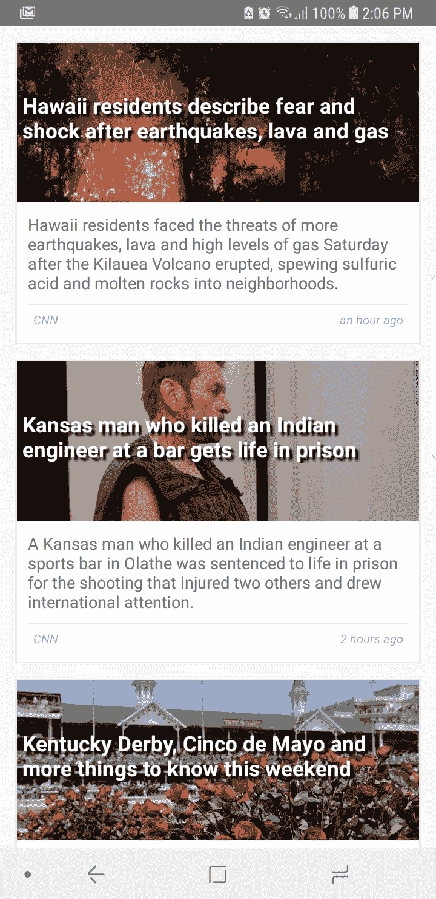
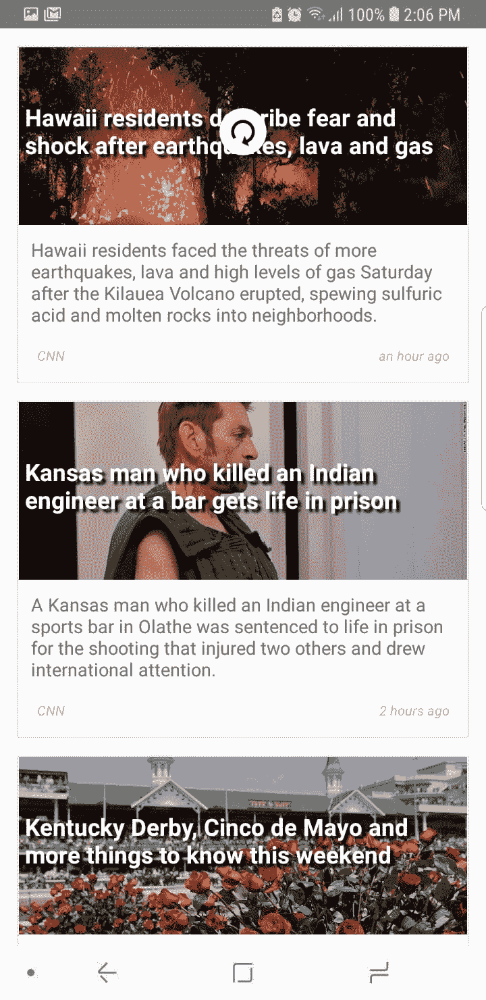

# 如何用 JavaScript 和 React Native 构建新闻 app

> 原文：<https://dev.to/msal/how-to-build-a-news-app-with-react-native-4ifd>

构建应用程序的要求:

*   对 JavaScript 语言的基本理解。
*   [Node.js](https://nodejs.org) ，和[反应原生](https://facebook.github.io/react-native)。
*   使用的库:moment、react-native、react-native-elements。

如果你不熟悉这些资源，不要担心，它们很容易使用。

我们将在帖子中涉及的主题有:

*   新闻宣传短片
*   获取 API
*   FlatList
*   下拉以刷新
*   连接

更多…让我们开始吧！
***这里可以找到完整的项目回购[。](https://github.com/msal4/royal_news)***

# 新闻 API

> 这是一个简单易用的 API，它可以为现在遍布 web 的标题和文章返回 JSON 元数据。—[NewsAPI.org](https://newsapi.org/)

首先，你应该注册新闻 Api 来获得你的免费 apiKey(你的认证密钥)。

创建一个新的 React 原生项目，并将其命名为`news_app`(或者其他任何名称)。在项目目录下，新建一个文件夹，命名为`src`。在`src`中创建一个文件夹，命名为`components`。所以你的项目目录应该是这样的:
[](https://res.cloudinary.com/practicaldev/image/fetch/s---_OiY44O--/c_limit%2Cf_auto%2Cfl_progressive%2Cq_auto%2Cw_880/https://thepracticaldev.s3.amazonaws.com/i/vgonq8enqsbp69zqesfc.png) 
在 src 文件夹中，新建一个名为 news.js 的文件。在这个文件中，我们将从新闻 API 中获取包含标题的 JSON。

# news.js

```
const url =
  "https://newsapi.org/v2/top-headlines?country=us&apiKey=YOUR_API_KEY_HERE";

export async function getNews() {
  let result = await fetch(url).then(response => response.json());
  return result.articles;
} 
```

确保用自己的 API 密钥替换`YOUR_API_KEY_HERE`。有关新闻 api 的更多信息，请访问[新闻 API 文档](https://newsapi.org)。

现在我们声明`getNews`函数，它将为我们获取文章。导出函数，这样我们就可以在我们的`App.js`文件中使用它。

# App.js

```
import React from 'react';
import { FlatList } from 'react-native';

// Import getNews function from news.js
import { getNews } from './src/news';
// We'll get to this one later
import Article from './src/components/Article';

export default class App extends React.Component {
  constructor(props) {
    super(props);
    this.state = { articles: [], refreshing: true };
    this.fetchNews = this.fetchNews.bind(this);
  }
  // Called after a component is mounted
  componentDidMount() {
    this.fetchNews();
   }

  fetchNews() {
    getNews()
      .then(articles => this.setState({ articles, refreshing: false }))
      .catch(() => this.setState({ refreshing: false }));
  }

  handleRefresh() {
    this.setState(
      {
        refreshing: true
    },
      () => this.fetchNews()
    );
  }

  render() {
    return (
      <FlatList
        data={this.state.articles}
        renderItem={({ item }) => <Article article={item} />}
        keyExtractor={item => item.url}
        refreshing={this.state.refreshing}
        onRefresh={this.handleRefresh.bind(this)}
      />
  );
  }
} 
```

在构造函数中，我们定义了初始状态。`articles`将在我们获取文章后存储它们，`refreshing`将帮助我们刷新动画。请注意，我将`refreshing`设置为`true`，因为**当我们启动应用程序时，我们希望动画在我们加载文章时开始。**
`componentDidMount`在组件挂载后立即被调用。在里面我们称之为`fetchNews`方法。

```
componentDidMount() {
  this.fetchNews();
} 
```

在`fetchNews`中，我们调用返回承诺的`getNews()`。所以我们使用`.then()`方法，该方法接受一个回调函数，回调函数接受一个参数(文章)。

现在将州中的文章分配给 articles 参数。我只输入了`articles`，因为这是一个新的 ES6 语法，意思是{ articles: articles }，我们将`refreshing`设置为`false`来停止旋转动画。

```
fetchNews() {
  getNews().then(
      articles => this.setState({ articles, refreshing: false })
  ).catch(() => this.setState({ refreshing: false }));
} 
```

`.catch()`在被拒绝的情况下调用。

`handleRefresh`启动旋转器动画并调用`fetchNews()`。我们传递`() => this.fetchNews()`，所以它在我们分配状态后立即被调用。

```
handleRefresh() {
  this.setState({ refreshing: true },() => this.fetchNews());
} 
```

在`render`方法中，我们返回一个`FlatList`元素。然后我们传递一些道具。`data`是来自`this.state`的文章数组。`renderItem`接受一个函数来呈现数组中的每一项，但是在我们的例子中，它只返回我们之前导入的`Article`组件(我们将会到达那里)。我们将`article`项作为道具传递，以便稍后在该组件中使用。

# [T1】article . js](#articlejs)

在`src/components`中创建一个新的 JavaScript 文件，并将其命名为`Article.js`。

让我们从使用 npm 安装两个简单的库开始:`react-native-elements`，它提供了一些我们可以使用的预制组件，以及`moment`，它将处理我们的时间。

使用终端/cmd 运行:

`npm install --save react-native-elements moment`

In Article.js:

```
import React from 'react';
import { View, Linking, TouchableNativeFeedback } from 'react-native';
import { Text, Button, Card, Divider } from 'react-native-elements';
import moment from 'moment';

export default class Article extends React.Component {
  render() {
    const {
      title,
      description,
      publishedAt,
      source,
      urlToImage,
      url
    } = this.props.article;
    const { noteStyle, featuredTitleStyle } = styles;
    const time = moment(publishedAt || moment.now()).fromNow();
    const defaultImg =
      'https://wallpaper.wiki/wp-content/uploads/2017/04/wallpaper.wiki-Images-HD-Diamond-Pattern-PIC-WPB009691.jpg';

    return (
      <TouchableNativeFeedback
        useForeground
        onPress={() => Linking.openURL(url)}
      >
        <Card
          featuredTitle={title}
          featuredTitleStyle={featuredTitleStyle}
          image={{
            uri: urlToImage || defaultImg
          }}
        >
          <Text style={{ marginBottom: 10 }}>
            {description || 'Read More..'}
          </Text>
          <Divider style={{ backgroundColor: '#dfe6e9' }} />
          <View
            style={{ flexDirection: 'row', justifyContent: 'space-between' }}
          >
            <Text style={noteStyle}>{source.name.toUpperCase()}</Text>
            <Text style={noteStyle}>{time}</Text>
          </View>
        </Card>
      </TouchableNativeFeedback>
    );
  }
}

const styles = {
  noteStyle: {
    margin: 5,
    fontStyle: 'italic',
    color: '#b2bec3',
    fontSize: 10
  },
  featuredTitleStyle: {
    marginHorizontal: 5,
    textShadowColor: '#00000f',
    textShadowOffset: { width: 3, height: 3 },
    textShadowRadius: 3
  }
}; 
```

这里发生了很多事情。首先，我们从[析构](https://developer.mozilla.org/en-US/docs/Web/JavaScript/Reference/Operators/Destructuring_assignment)类下面定义的`article`道具和`styles`对象开始。

在`render`中，我们定义`time`来存储文章发表的时间。我们使用`moment`库将日期转换成从那时起经过的时间，如果`publishedAt`是`null`，我们就从现在起经过`publishedAt`或时间。

在文章图像的 URL 是`null`的情况下，`defaultImg`被分配图像 URL。

当用户按下卡片时，`render`方法返回`TouchableNativeFeedback`(如果它在您的平台上不工作，使用`TouchableOpacity`代替)来处理。我们传递给它一些道具:`useForground`告诉元素在卡片上显示涟漪效果时使用前景，以及`onPress`，它接受一个函数并在用户按下卡片时执行它。我们通过了`() => Linking.openUrl(url)`，当我们按下卡片时，它简单地打开了完整文章的 URL。

这张卡片有三个道具:`featuredTitle`这只是一个放在图片上的花哨标题，如果你愿意，你可以用`title`来代替，`featuredTitleStyle`来设计它，以及图片，这是文章道具中的文章图片。否则，如果它是`null`，它将成为`defaultImg`。

```
..
  featuredTitle={title}
  featuredTitleStyle={featuredTitleStyle}
  image={{ uri: urlToImage || defaultImg }}
.. 
```

至于`text`元素，它将保存文章的描述。

`<Text style={{ marginBottom: 10 }}>{description}</Text>`

我们添加了一个`divider`来将描述与时间和源名称分开。

`<Divider style={{ backgroundColor: '#dfe6e9' }} />`

在`Divider`下面，我们有一个`View`,它包含源名称和文章发表的时间。

```
..
<View 
  style={{ flexDirection: ‘row’, justifyContent: ‘space-between’ }} > 
  <Text style={noteStyle}>{source.name.toUpperCase()}</Text>
  <Text style={noteStyle}>{time}</Text>
</View>
.. 
```

在`class`之后，我们为这些组件定义了样式。

现在，如果我们运行应用程序:
[](https://res.cloudinary.com/practicaldev/image/fetch/s--mzh6Eemf--/c_limit%2Cf_auto%2Cfl_progressive%2Cq_auto%2Cw_880/https://thepracticaldev.s3.amazonaws.com/i/fa1ztf421utl1cal60h3.jpg) 
*，我们可以刷新应用程序*
[](https://res.cloudinary.com/practicaldev/image/fetch/s--Pis50zKC--/c_limit%2Cf_auto%2Cfl_progressive%2Cq_auto%2Cw_880/https://thepracticaldev.s3.amazonaws.com/i/ghu5if5yehnln21u1hyn.jpg) 
好了！这个应用的源代码可以在 GitHub [上找到，这里](https://github.com/msal4/royal_news)你可以对它进行改进并提出一个拉取请求😄。

我希望你喜欢我的文章！如果您有任何问题，请随时发表评论或通过 [twitter](https://twitter.com/4msal4) 联系我，我一定会帮助您:)

也别忘了分享文章😄👇。